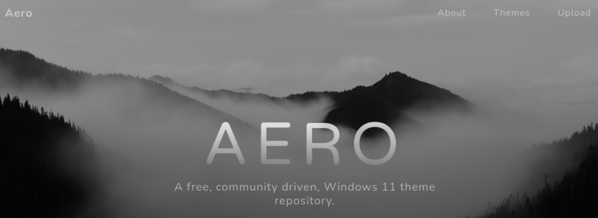
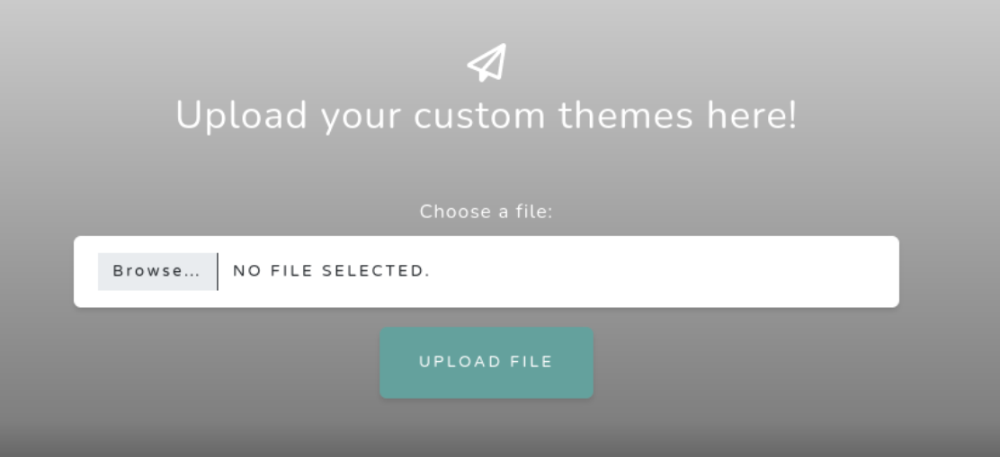
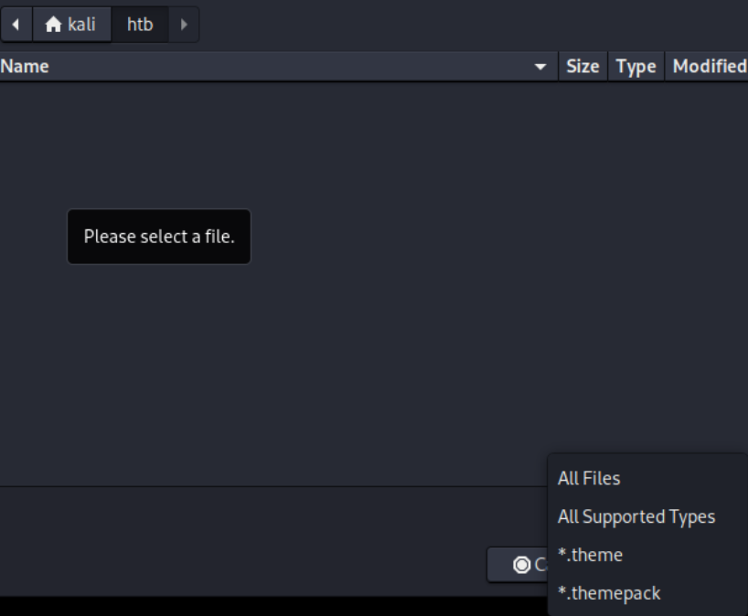
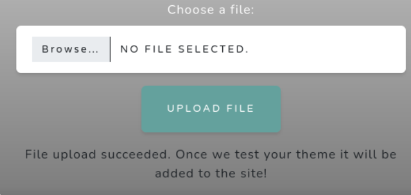

- Machine : https://app.hackthebox.com/machines/Aero
- Reference : https://0xdf.gitlab.io/2023/09/28/htb-aero.html
- Solved : 2024.00.00. (Thu) (Takes 0days)

## Summary
---


### Key Techniques:


---

# Reconnaissance

### Port Scanning

```bash
┌──(kali㉿kali)-[~/htb]
└─$ ./port-scan.sh 10.10.11.237
Performing quick port scan on 10.10.11.237...
Found open ports: 80
Performing detailed scan on 10.10.11.237...
Starting Nmap 7.94SVN ( https://nmap.org ) at 2024-12-24 02:25 EST
Nmap scan report for 10.10.11.237
Host is up (0.40s latency).

PORT   STATE SERVICE VERSION
80/tcp open  http    Microsoft HTTPAPI httpd 2.0 (SSDP/UPnP)
Service Info: OS: Windows; CPE: cpe:/o:microsoft:windows

Service detection performed. Please report any incorrect results at https://nmap.org/submit/ .
Nmap done: 1 IP address (1 host up) scanned in 132.15 seconds
```

Only a single port is open : http(80)

### http(80)



It's led to as simple web page. It seems that it has to do with Windows theme.
It has "Upload" tab. Let's click it.



It allows us to upload file which is interesting.
Let me upload just a simple text file.

```bash
┌──(kali㉿kali)-[~/htb]
└─$ cat test.txt 
This is a test text file
```



The file isn't show up due to extensions.
Let's try again after changing extension.

```bash
┌──(kali㉿kali)-[~/htb]
└─$ cp test.txt test.theme
```



It worked, but have no clue where to find it, and how to exploit it for now.
Let's search if there's any vulnerability related to `Windows 11 Theme`.

I found "ThemeBleed" vulnerability (CVE-2023-38146) which is exactly exploiting this.
Here I found a PoC:
https://github.com/exploits-forsale/themebleed

I downloaded release version to find executables.

```bash
┌──(kali㉿kali)-[~/htb]
└─$ wget https://github.com/exploits-forsale/themebleed/releases/download/v1/ThemeBleed.zip                                 
--2024-12-24 02:51:16--  https://github.com/exploits-forsale/themebleed/releases/download/v1/ThemeBleed.zip
Resolving github.com (github.com)... 20.200.245.247
Connecting to github.com (github.com)|20.200.245.247|:443... connected.
<SNIP>
Saving to: ‘ThemeBleed.zip’

ThemeBleed.zip     100%[===============>]   1.86M   812KB/s    in 2.3s    

2024-12-24 02:51:22 (812 KB/s) - ‘ThemeBleed.zip’ saved [1950126/1950126]


┌──(kali㉿kali)-[~/htb]
└─$ ls
ThemeBleed.zip  port-scan.sh  test.theme  test.txt
     
┌──(kali㉿kali)-[~/htb]
└─$ mkdir themebleed                                   

┌──(kali㉿kali)-[~/htb]
└─$ unzip ThemeBleed.zip -d themebleed                 
Archive:  ThemeBleed.zip
   creating: themebleed/ThemeBleed/data/
  inflating: themebleed/ThemeBleed/data/stage_1  
  inflating: themebleed/ThemeBleed/data/stage_2  
  inflating: themebleed/ThemeBleed/data/stage_3  
  inflating: themebleed/ThemeBleed/SMBLibrary.dll  
  inflating: themebleed/ThemeBleed/SMBLibrary.Win32.dll  
  inflating: themebleed/ThemeBleed/ThemeBleed.exe  
  inflating: themebleed/ThemeBleed/ThemeBleed.pdb  
```

The explanation of this PoC is as follows;

- The Theme tries to load the style file from a SMB share on my host.
- That triggers interaction with a file ending in `_vrf.dll`, first opening it with the `CreateFile` API to read it and verify it’s signature, and then opening it with the `LoadLibrary` API.
- The SMB server uses the differences in how it’s opened to return either the legit DLL or the malicious one.

Also video explanation is here:
https://youtu.be/CdzgD-eMOnY?si=dgbIknokzb2MaOPu

> Let's visit this later after setting up windows visual studio environment!