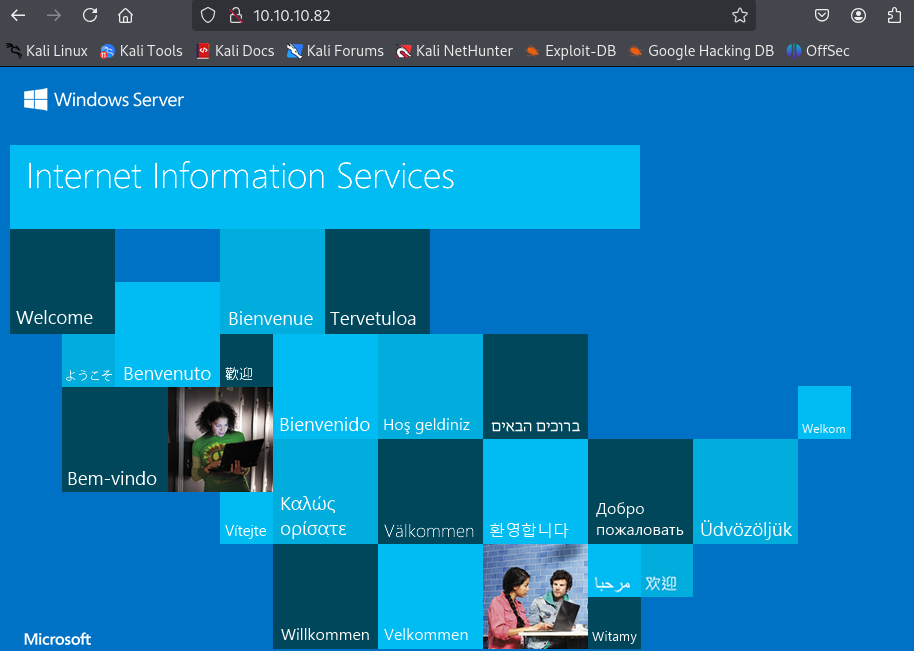

- Machine : https://app.hackthebox.com/machines/Silo
- Reference : https://0xdf.gitlab.io/2018/08/04/htb-silo.html
- Solved : 2025.3.5. (Wed) (Takes 0days)

## Summary
---


### Key Techniques:


---

# Reconnaissance

### Port Scanning

```yaml
┌──(kali㉿kali)-[~/htb/silo]
└─$ /opt/custom-scripts/port-scan.sh 10.10.10.82
Performing quick port scan on 10.10.10.82...
Found open ports: 80,135,139,445,1521,5985,47001,49152,49153,49154,49155,49159,49160,49161,49162
Performing detailed scan on 10.10.10.82...
Starting Nmap 7.94SVN ( https://nmap.org ) at 2025-03-05 00:45 MST
Nmap scan report for 10.10.10.82
Host is up (0.12s latency).

PORT      STATE SERVICE      VERSION
80/tcp    open  http         Microsoft IIS httpd 8.5
| http-methods: 
|_  Potentially risky methods: TRACE
|_http-server-header: Microsoft-IIS/8.5
|_http-title: IIS Windows Server
135/tcp   open  msrpc        Microsoft Windows RPC
139/tcp   open  netbios-ssn  Microsoft Windows netbios-ssn
445/tcp   open  microsoft-ds Microsoft Windows Server 2008 R2 - 2012 microsoft-ds
1521/tcp  open  oracle-tns   Oracle TNS listener 11.2.0.2.0 (unauthorized)
5985/tcp  open  http         Microsoft HTTPAPI httpd 2.0 (SSDP/UPnP)
|_http-server-header: Microsoft-HTTPAPI/2.0
|_http-title: Not Found
47001/tcp open  http         Microsoft HTTPAPI httpd 2.0 (SSDP/UPnP)
|_http-title: Not Found
|_http-server-header: Microsoft-HTTPAPI/2.0
49152/tcp open  msrpc        Microsoft Windows RPC
49153/tcp open  msrpc        Microsoft Windows RPC
49154/tcp open  msrpc        Microsoft Windows RPC
49155/tcp open  msrpc        Microsoft Windows RPC
49159/tcp open  oracle-tns   Oracle TNS listener (requires service name)
49160/tcp open  msrpc        Microsoft Windows RPC
49161/tcp open  msrpc        Microsoft Windows RPC
49162/tcp open  msrpc        Microsoft Windows RPC
Service Info: OSs: Windows, Windows Server 2008 R2 - 2012; CPE: cpe:/o:microsoft:windows

Host script results:
| smb2-security-mode: 
|   3:0:2: 
|_    Message signing enabled but not required
| smb2-time: 
|   date: 2025-03-05T07:47:14
|_  start_date: 2025-03-05T07:42:40
| smb-security-mode: 
|   account_used: guest
|   authentication_level: user
|   challenge_response: supported
|_  message_signing: supported

Service detection performed. Please report any incorrect results at https://nmap.org/submit/ .
Nmap done: 1 IP address (1 host up) scanned in 130.23 seconds
```

### http(80)



```bash
┌──(kali㉿kali)-[~/htb/silo]
└─$ gobuster dir -u http://10.10.10.82 -w /usr/share/wordlists/dirbuster/directory-list-2.3-medium.txt -x asp,aspx
===============================================================
Gobuster v3.6
by OJ Reeves (@TheColonial) & Christian Mehlmauer (@firefart)
===============================================================
[+] Url:                     http://10.10.10.82
[+] Method:                  GET
[+] Threads:                 10
[+] Wordlist:                /usr/share/wordlists/dirbuster/directory-list-2.3-medium.txt
[+] Negative Status codes:   404
[+] User Agent:              gobuster/3.6
[+] Extensions:              aspx,asp
[+] Timeout:                 10s
===============================================================
Starting gobuster in directory enumeration mode
===============================================================
```

### Oracle TNS(1521)

##### Version identification

```bash
┌──(kali㉿kali)-[~/htb/silo]
└─$ nmap --script "oracle-tns-version" -p 1521 -T4 -sV 10.10.10.82
Starting Nmap 7.94SVN ( https://nmap.org ) at 2025-03-05 01:06 MST
Nmap scan report for 10.10.10.82
Host is up (0.12s latency).

PORT     STATE SERVICE    VERSION
1521/tcp open  oracle-tns Oracle TNS listener 11.2.0.2.0 (unauthorized)

Service detection performed. Please report any incorrect results at https://nmap.org/submit/ .
Nmap done: 1 IP address (1 host up) scanned in 7.09 seconds
```

##### Identify SIDs

```bash
┌──(kali㉿kali)-[~/htb/silo]
└─$ hydra -L /usr/share/metasploit-framework/data/wordlists/sid.txt -s 1521 10.10.10.82 oracle-sid
Hydra v9.5 (c) 2023 by van Hauser/THC & David Maciejak - Please do not use in military or secret service organizations, or for illegal purposes (this is non-binding, these *** ignore laws and ethics anyway).

Hydra (https://github.com/vanhauser-thc/thc-hydra) starting at 2025-03-05 01:12:42
[WARNING] Restorefile (you have 10 seconds to abort... (use option -I to skip waiting)) from a previous session found, to prevent overwriting, ./hydra.restore
[DATA] max 16 tasks per 1 server, overall 16 tasks, 576 login tries (l:576/p:1), ~36 tries per task
[DATA] attacking oracle-sid://10.10.10.82:1521/
[1521][oracle-sid] host: 10.10.10.82   login: XE
[1521][oracle-sid] host: 10.10.10.82   login: PLSExtProc
[STATUS] 553.00 tries/min, 553 tries in 00:01h, 23 to do in 00:01h, 16 active
[1521][oracle-sid] host: 10.10.10.82   login: CLRExtProc
[1521][oracle-sid] host: 10.10.10.82
1 of 1 target successfully completed, 4 valid passwords found
Hydra (https://github.com/vanhauser-thc/thc-hydra) finished at 2025-03-05 01:13:56
```

##### id/pass brute-force

> Need to install odat tool...
> Do this later...


# Shell as `user`

### Whatever


# Shell as `user2`

### Whatever


# Shell as `admin`

### Whatever
